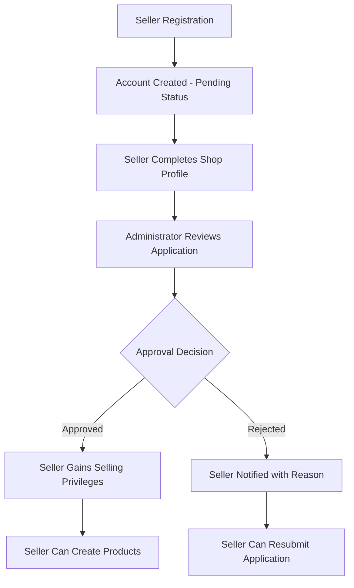
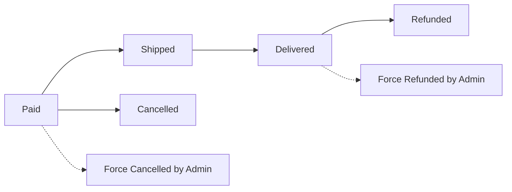

# E-Commerce Shopping Mall Platform Requirements Specification

## Platform Overview

The e-commerce shopping mall platform is a comprehensive online marketplace that facilitates secure transactions between customers and sellers. The platform operates on a strict authentication model where registration is required for all features, ensuring accountability and security throughout the transaction lifecycle. Built on a robust snapshot system, the platform preserves data integrity for all financial transactions and modifications.

## Core Platform Principles

### Mandatory Registration Policy
- WHEN a user attempts to access any platform feature, THE system SHALL require authentication
- THE platform SHALL NOT support guest browsing or anonymous access
- ALL users SHALL complete registration before accessing platform functionality

### Snapshot Data Integrity System
- WHENEVER editable data is modified, THE system SHALL create an immutable snapshot
- THE snapshot SHALL record: timestamp, user who made the change, values before and after
- SNAPSHOTS SHALL be preserved indefinitely for audit and dispute resolution
- RELEVANT parties SHALL be able to view snapshots for their data

## User Account Management

### Customer Account Requirements

**Registration Process**
- WHEN a customer registers, THE system SHALL validate email format and uniqueness
- THE customer SHALL provide: email address and password
- THE system SHALL require password confirmation
- AFTER registration, THE customer SHALL receive email verification
- UNTIL email verification, THE customer SHALL have limited platform access

**Account Management**
- CUSTOMERS SHALL be able to change their password with current password verification
- WHEN a customer changes password, THE system SHALL invalidate all existing sessions
- CUSTOMERS SHALL be able to delete their account
- WHEN account deletion is requested, THE system SHALL confirm irreversible action

**Account Deletion Protocol**
- WHEN a customer deletes their account:
  - PROFILE information SHALL be permanently deleted
  - ORDER history SHALL be preserved with anonymized customer reference
  - REVIEWS SHALL be preserved but displayed as "deleted user"
  - WISHLIST items SHALL be removed
  - SHIPPING addresses SHALL be deleted

### Customer Profile Management
- EACH customer SHALL have a profile containing: display name and phone number
- CUSTOMERS SHALL be able to edit their display name and phone number
- WHEN profile information is edited, THE system SHALL update immediately
- PROFILE changes SHALL NOT require administrator approval

### Address Management System
- CUSTOMERS SHALL be able to add multiple shipping addresses
- EACH address SHALL contain: recipient name, phone number, street address, city, state/province, postal code, country
- CUSTOMERS SHALL be able to edit existing addresses
- CUSTOMERS SHALL be able to delete addresses
- CUSTOMERS SHALL be able to set one address as default shipping address
- WHEN an address is set as default, THE system SHALL update customer preferences

## Seller Account Management

### Seller Registration Process
- WHEN a seller registers, THE system SHALL require the same validation as customer registration
- THE seller account SHALL be placed in "pending approval" status
- THE seller SHALL be able to set up shop profile while awaiting approval
- ONLY AFTER administrator approval SHALL the seller gain selling privileges

### Seller Approval Workflow

### Seller Account Management
- SELLERS SHALL be able to change their password with current password verification
- SELLERS SHALL be able to view their approval status (pending, approved, rejected)
- IF rejected, SELLERS SHALL be able to view the detailed rejection reason
- REJECTED sellers SHALL be able to submit a new registration request

### Seller Account Deletion Protocol
- SELLERS SHALL only be able to delete their account if:
  - NO pending orders exist (paid or shipped status)
  - NO pending cancellation or refund requests exist
- WHEN a seller deletes their account:
  - THEIR products SHALL be removed from active listings
  - ORDER history and snapshots SHALL be preserved
  - THEIR shop name in past orders SHALL be preserved
  - EXISTING orders SHALL continue processing with preserved seller information

### Seller Profile Management
- EACH seller SHALL have a profile containing: shop name, shop description, logo image
- SELLERS SHALL be able to edit their shop name, description, and logo
- WHENEVER seller profile is edited, THE system SHALL create a snapshot
- CUSTOMERS SHALL be able to view seller profiles
- SELLER profile changes SHALL be reflected immediately across the platform

## Category Management System

### Category Structure
- PRODUCTS SHALL be organized into categories and subcategories
- CATEGORIES SHALL support one level of nesting (parent-child relationship)
- EACH category SHALL have: name and description
- CATEGORIES SHALL be created and managed by administrators only

### Category Browsing
- CUSTOMERS SHALL be able to browse the complete list of categories
- WHEN viewing a category, CUSTOMERS SHALL see products within that category
- THE system SHALL display subcategories when available
- PRODUCTS SHALL be filterable within category views

## Snapshot System Implementation

### Snapshot Principle Requirements
- THIS platform involves financial transactions, SO all data modifications SHALL be recorded
- WHENEVER editable data is modified, THE system SHALL create an immutable snapshot
- SNAPSHOTS SHALL record: timestamp, user who made change, values before modification, values after modification
- SNAPSHOTS SHALL be preserved indefinitely and cannot be deleted
- RELEVANT parties SHALL be able to view snapshots for dispute resolution

### Snapshot Application Scope
- PRODUCTS: All fields including name, description, category, base price, images
- PRODUCT VARIANTS: SKU code, option values, price changes
- SELLER PROFILES: Shop name, description, logo modifications
- ORDER ITEMS: Product, variant, and seller profile at time of purchase
- REVIEWS: Rating and text content modifications
- CANCELLATION REQUESTS: Reason, status changes, seller responses
- REFUND REQUESTS: Reason, status changes, seller responses

### Product Snapshot Structure
- WHEN a product is edited, THE system SHALL create a comprehensive product snapshot
- THE product snapshot SHALL include all product fields: name, description, category, base price, images
- THE product snapshot SHALL include snapshots of all variants at that moment
- THIS preserves the complete state of a product and its variants at any point in time

## Product Management System

### Product Creation Requirements
- SELLERS SHALL be able to create products
- EACH product SHALL require: name, description, category selection, base price
- PRODUCTS SHALL belong to the seller who created them
- PRODUCTS SHALL be visible only after creation and variant setup

### Product Editing and Snapshots
- SELLERS SHALL be able to edit their own products
- WHENEVER a product is edited, THE system SHALL create a snapshot
- PRODUCT edits SHALL be reflected immediately across the platform
- SNAPSHOTS SHALL be viewable by the seller and administrators

### Product Deletion Protocol
- SELLERS SHALL only be able to delete products if:
  - NO pending order items exist (paid or shipped status) for any variant
  - NO pending cancellation or refund requests exist for any variant
- WHEN a product is deleted:
  - ALL variants and inventory records SHALL be deleted
  - THE product SHALL be removed from search and category listings
  - EXISTING snapshots SHALL be preserved
  - ORDER history referencing the product SHALL remain intact

### Product Image Management
- SELLERS SHALL be able to upload multiple images for each product
- IMAGES SHALL be reorderable with the first image serving as the main/thumbnail
- SELLERS SHALL be able to delete images from their products
- IMAGE changes SHALL be included in product snapshots
- IMAGE uploads SHALL support common formats (JPEG, PNG, WebP)

## Product Variant System (SKU Management)

### Variant Creation Requirements
- A product SHALL be able to have multiple variants
- EACH variant SHALL represent a specific combination of options (e.g., "Red / Large", "Blue / Small")
- EACH variant SHALL require: SKU code (unique identifier), option values, price (optional override), stock quantity
- A product MUST have at least one variant to be purchasable
- PRODUCTS with no variants SHALL be visible but marked as "unavailable"

### Variant Management
- SELLERS SHALL be able to add variants to their products
- SELLERS SHALL be able to edit variant properties: SKU code, option values, price
- WHENEVER a variant is edited, THE system SHALL create a snapshot
- SELLERS SHALL only be able to delete variants if:
  - NO pending order items exist (paid or shipped status)
  - NO pending cancellation or refund requests exist

## Inventory Management System

### Stock Tracking Methodology
- EACH variant SHALL have its own stock quantity
- STOCK quantity SHALL be managed through inventory history records
- EACH inventory record SHALL contain: quantity change, reason, timestamp
- CURRENT stock SHALL be calculated by summing all inventory records

### Inventory Operations
- SELLERS SHALL be able to add inventory (restock) with quantity and reason
- SELLERS SHALL be able to subtract inventory (adjustment/loss) with quantity and reason
- WHEN an order is placed, THE system SHALL automatically create negative inventory record
- WHEN order cancellation/refund occurs, THE system SHALL automatically create positive inventory record

### Stock Status Management
- SELLERS SHALL be able to view full inventory history for each variant
- WHEN stock reaches 0, THE variant SHALL be shown as "out of stock"
- OUT of stock variants SHALL NOT be addable to cart
- STOCK status SHALL update in real-time across the platform

## Product Discovery and Browsing

### Search Functionality
- CUSTOMERS SHALL be able to search products by name
- SEARCH results SHALL show products from all sellers
- SEARCH results SHALL be paginated for performance
- CUSTOMERS SHALL be able to filter search results by:
  - Category selection
  - Price range (minimum and maximum)
  - In-stock only toggle

### Search Result Sorting
- CUSTOMERS SHALL be able to sort search results by:
  - Newest first (default)
  - Price low to high
  - Price high to low
  - Customer rating (if available)

### Product Listing Display
- WHEN viewing product lists (search results, category pages), EACH product SHALL show:
  - Main image thumbnail
  - Product name
  - Base price or price range for variants
  - Seller shop name
  - Average rating and review count (if available)

### Product Detail Page
- CUSTOMERS SHALL be able to view full product details
- THE product detail page SHALL display:
  - All product images in gallery format
  - Complete product name and description
  - Category hierarchy
  - Seller shop name with profile link
  - All available variants with prices and stock status
  - Average rating and total review count
  - All customer reviews

## Wishlist Management

### Wishlist Functionality
- CUSTOMERS SHALL be able to add products to their wishlist
- CUSTOMERS SHALL be able to view their wishlist with pagination
- THE wishlist SHALL show products (not specific variants)
- CUSTOMERS SHALL be able to remove products from their wishlist

### Wishlist Maintenance
- IF a product is deleted by the seller, IT SHALL be automatically removed from all wishlists
- WISHLIST items SHALL persist across customer sessions
- CUSTOMERS SHALL be able to move wishlist items to cart

## Shopping Cart System

### Cart Management
- CUSTOMERS SHALL be able to add specific variants to their cart
- WHEN adding to cart, CUSTOMERS SHALL specify quantity
- IF the same variant is already in cart, quantities SHALL be combined
- CUSTOMERS SHALL be able to view their cart with item details

### Cart Display Requirements
- THE cart SHALL show each item with: product name, variant options, price, quantity, subtotal
- CUSTOMERS SHALL be able to change item quantities in cart
- CUSTOMERS SHALL be able to remove items from cart
- THE cart SHALL display total price of all items

### Cart Validation
- IF variant stock is less than cart quantity, A warning SHALL be shown
- IF variant is deleted or out of stock, IT SHALL be marked as unavailable
- UNAVAILABLE items SHALL prevent checkout completion

## Checkout Process

### Checkout Initiation
- CUSTOMERS SHALL be able to proceed to checkout from their cart
- UNAVAILABLE items SHALL be filtered out during checkout
- CUSTOMERS SHALL select a shipping address (or use default)

### Order Review
- BEFORE placing order, CUSTOMERS SHALL review:
  - Complete list of items with prices
  - Selected shipping address
  - Total order price
- ONCE order is placed, shipping address SHALL be locked

## Payment Processing

### Payment Integration
- AFTER order review, CUSTOMERS SHALL confirm and place order
- PAYMENT SHALL be processed through external payment gateway
- PAYMENT can succeed or fail
- IF payment fails, THE order SHALL not be created
- IF payment succeeds, THE order SHALL be created

## Order Creation and Management

### Order Creation Protocol
- WHEN order is placed successfully:
  - STOCK quantities SHALL be decreased for each purchased variant
  - ITEMS SHALL be removed from customer's cart
  - ORDER record SHALL be created
  - EACH purchased variant SHALL become order item with "paid" status
  - SNAPSHOTS of product, variant, and seller profile SHALL be saved

### Order Structure
- AN order SHALL contain one or more order items
- EACH order item SHALL represent a purchased product variant with quantity
- IF customer buys multiple same variants, IT SHALL become one order item
- ORDER items can be from different sellers
- EACH order item SHALL have independent status

### Order History
- CUSTOMERS SHALL be able to view paginated list of their orders
- ORDER list SHALL show: order number, date, total price, overall status
- CUSTOMERS SHALL be able to view full order details:
  - List of items with product name, variant, quantity, price, status
  - Shipping address used
  - Shipments with tracking information

## Order Status Management

### Order Item Status Flow

### Status Definitions
- **Paid**: Payment completed, waiting for seller shipment
- **Shipped**: Seller has shipped the item
- **Delivered**: Item has been delivered to customer
- **Cancelled**: Item was cancelled before shipment
- **Refunded**: Item was refunded after delivery

### Order Status Derivation
- IF all items are paid → Order status: "paid"
- IF any item is shipped (none delivered) → Order status: "shipped"
- IF all items are delivered → Order status: "delivered"
- IF all items are cancelled → Order status: "cancelled"
- IF all items are refunded → Order status: "refunded"
- IF mixed states exist → Order status: "partially completed"

## Shipping and Tracking System

### Shipment Concept
- A shipment SHALL represent a package sent by a seller
- A shipment SHALL contain one or more order items from same seller
- DIFFERENT sellers SHALL always ship separately
- SELLERS can choose individual or bundled shipments

### Shipping Process
- SELLERS SHALL be able to view order items needing shipment
- WHEN shipping, SELLERS SHALL select items for inclusion
- SELLERS SHALL enter tracking information: carrier name, tracking number
- ALL items in shipment SHALL share same tracking information
- WHEN shipment is created, ALL items SHALL change to "shipped" status

### Delivery Confirmation
- CUSTOMERS SHALL be able to view tracking information per shipment
- CUSTOMERS SHALL confirm delivery per shipment (not per item)
- WHEN delivery confirmed, ALL items in shipment SHALL change to "delivered"
- IF customer doesn't confirm, items SHALL auto-change after 14 days

## Order Cancellation System

### Cancellation Request Process
- CUSTOMERS SHALL be able to request cancellation per order item
- CANCELLATION SHALL only be available for "paid" status items
- REQUESTS SHALL include reason text
- SELLERS SHALL be able to approve or reject requests

### Cancellation Outcomes
- WHEN seller responds, snapshot SHALL be created
- IF approved, item SHALL be cancelled and refund processed
- CANCELLED items SHALL restore stock quantities
- REMAINING items SHALL continue normal processing
- IF all items cancelled, order status SHALL become "cancelled"

## Refund Request System

### Refund Eligibility
- CUSTOMERS SHALL be able to request refund per order item
- REFUND SHALL only be available for "delivered" status items
- REFUND requests SHALL be within 7 days of delivery
- REQUESTS SHALL include reason text

### Refund Processing
- SELLERS SHALL be able to approve or reject refund requests
- WHEN seller responds, snapshot SHALL be created
- IF approved, item SHALL be refunded
- REFUNDED items SHALL restore stock quantities
- REMAINING items SHALL be unaffected
- IF all items refunded, order status SHALL become "refunded"

## Review and Rating System

### Review Creation
- CUSTOMERS SHALL be able to write reviews for purchased products
- REVIEWS SHALL only be allowed after item status is "delivered"
- EACH review SHALL contain: rating (1-5 stars), optional text content
- CUSTOMERS SHALL write one review per product per order

### Review Management
- REVIEWS SHALL be displayed on product detail pages
- REVIEWS SHALL be sorted by newest first
- CUSTOMERS SHALL be able to edit their own reviews
- WHENEVER review is edited, snapshot SHALL be created
- CUSTOMERS SHALL be able to delete their reviews (snapshots preserved)
- PRODUCT average rating SHALL be calculated from non-deleted reviews

## Seller Dashboard

### Dashboard Overview
- SELLERS SHALL be able to view shop summary:
  - Total number of products
  - Total order items for their products
  - Pending cancellation requests count
  - Pending refund requests count

### Order Management
- SELLERS SHALL be able to view all order items for their products
- SELLERS SHALL be able to filter order items by status
- SELLERS SHALL be able to process shipments from dashboard
- SELLERS SHALL be able to respond to cancellation/refund requests

## Administrator System

### Administrator Promotion
- ANY user SHALL be able to request administrator status
- REQUESTS SHALL include reason text
- SUPER administrators SHALL review pending requests
- WHEN approved, user SHALL become regular administrator

### Administrator Hierarchy
- TWO grades: regular administrator and super administrator
- SUPER administrators SHALL promote regular to super
- SUPER administrators SHALL demote other super administrators
- SUPER administrators SHALL NOT demote themselves

### Seller Management
- ADMINISTRATORS SHALL view pending seller approvals
- ADMINISTRATORS SHALL approve or reject registrations
- WHEN rejecting, administrators SHALL provide reason
- ADMINISTRATORS SHALL suspend seller accounts

### Seller Suspension Protocol
- WHEN seller suspended:
  - PRODUCTS SHALL be hidden from search/listings
  - PRODUCTS SHALL not be purchasable
  - EXISTING orders SHALL continue processing
  - NEW products SHALL not be creatable
- ADMINISTRATORS SHALL be able to unsuspend accounts

### Category Management
- ADMINISTRATORS SHALL create categories and subcategories
- ADMINISTRATORS SHALL edit category names/descriptions
- ADMINISTRATORS SHALL delete categories
- PRODUCTS in deleted categories SHALL become uncategorized

### Product Oversight
- ADMINISTRATORS SHALL view all platform products
- ADMINISTRATORS SHALL view snapshots of any product
- ADMINISTRATORS SHALL delete products for policy violations

### Order Intervention
- ADMINISTRATORS SHALL view all platform orders
- ADMINISTRATORS SHALL force-cancel items/orders
- ADMINISTRATORS SHALL force-refund items/orders
- INTERVENTIONS SHALL refund customers and restore stock

### User Management
- ADMINISTRATORS SHALL view all customer accounts
- ADMINISTRATORS SHALL ban customers (login prevention)
- ADMINISTRATORS SHALL unban customers
- ADMINISTRATORS SHALL view all seller accounts
- ADMINISTRATORS SHALL ban sellers (existing orders preserved)

This comprehensive requirements specification provides the complete foundation for developing the e-commerce shopping mall platform. All business processes, user workflows, and system interactions are documented with precise EARS format requirements and clear implementation guidelines.

> *Developer Note: This document defines **business requirements only**. All technical implementations (architecture, APIs, database design, etc.) are at the discretion of the development team.*