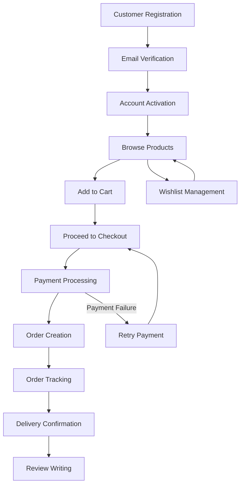
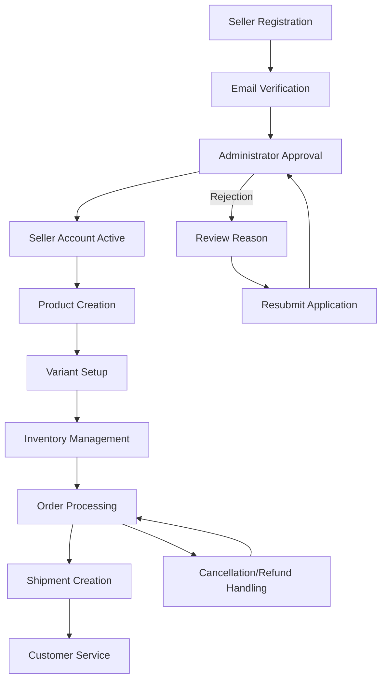
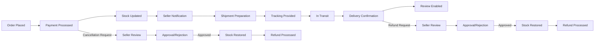

# E-Commerce Shopping Mall Platform - Comprehensive Requirements Specification

## Executive Summary

This document provides detailed business requirements for a full-featured e-commerce shopping mall platform that handles monetary transactions with comprehensive data integrity through snapshot-based auditing. The platform supports customer shopping experiences, seller store management, and administrative oversight with robust authentication and authorization systems.

## Platform Architecture Principles

### Snapshot-Based Data Integrity

**WHEN** any editable data is modified, **THE** system **SHALL** create an immutable snapshot preserving the previous state for audit and dispute resolution purposes.

**THE** snapshot system **SHALL** apply to:
- Product information (name, description, category, price, images)
- Product variants (SKU code, option values, price)
- Seller profiles (shop name, description, logo)
- Order items (product, variant, seller profile at purchase time)
- Reviews (rating, text content)
- Cancellation requests (reason, status changes)
- Refund requests (reason, status changes)

**WHERE** money is exchanged, **THE** system **SHALL** ensure complete transaction transparency through comprehensive snapshot recording.

### User Registration Requirement

**WHEN** a user attempts to access platform features, **THE** system **SHALL** require complete registration before granting any access privileges.

**THE** platform **SHALL NOT** support guest browsing or purchasing functionality.

## User Account Management

### Customer Account Requirements

**WHEN** a customer registers for an account, **THE** system **SHALL** require:
- Valid email address format verification
- Password meeting security requirements (minimum 8 characters with complexity)
- Email confirmation before account activation

**WHEN** a customer logs in, **THE** system **SHALL** authenticate using email and password credentials.

**WHEN** a customer requests password change, **THE** system **SHALL** require:
- Current password verification
- New password meeting security standards
- Password confirmation to prevent errors

**WHEN** a customer requests account deletion, **THE** system **SHALL**:
- Verify current password for security confirmation
- Preserve order history and records for legal compliance
- Mark reviews as "deleted user" while preserving content
- Remove profile information while maintaining transaction integrity

### Customer Profile Management

**EACH** customer **SHALL** have a profile containing:
- Display name for public identification
- Phone number for order communications

**WHEN** a customer edits their profile, **THE** system **SHALL** allow modification of display name and phone number fields.

### Address Management System

**WHEN** a customer manages shipping addresses, **THE** system **SHALL** support:
- Multiple address entries with complete contact information
- Address fields: recipient name, phone number, street address, city, state/province, postal code, country
- Address editing capabilities for existing entries
- Address deletion with confirmation
- Default address designation for checkout convenience

**WHERE** a customer sets a default address, **THE** system **SHALL** automatically select it during checkout processes.

## Seller Account Management

### Seller Registration and Approval

**WHEN** a user registers as a seller, **THE** system **SHALL** require:
- Valid email address and secure password
- Administrator approval before selling privileges are granted
- Business information collection during registration

**THE** seller approval process **SHALL** include:
- Administrator review of seller registration requests
- Approval status tracking (pending, approved, rejected)
- Rejection reason communication for transparency
- Resubmission capability for rejected applications

**WHEN** a seller account is approved, **THE** system **SHALL** grant product creation and store management privileges.

### Seller Account Deletion Constraints

**WHEN** a seller requests account deletion, **THE** system **SHALL** verify:
- No pending orders exist with paid or shipped status
- No pending cancellation or refund requests are active
- All order history and snapshots are preserved
- Product listings are removed from public visibility
- Shop name is preserved in historical order records

### Seller Profile Management

**EACH** seller **SHALL** maintain a shop profile containing:
- Shop name for brand identification
- Shop description for customer information
- Logo image for visual branding

**WHEN** a seller edits their profile, **THE** system **SHALL** create a snapshot preserving previous profile state.

## Product Catalog System

### Category Management

**WHEN** administrators manage product categories, **THE** system **SHALL** support:
- Category creation with name and description
- Subcategory creation with one-level nesting capability
- Category editing by authorized administrators
- Category deletion with product reclassification

**WHEN** customers browse the platform, **THE** system **SHALL** provide:
- Complete category listing for navigation
- Product filtering by category and subcategory
- Category-based product discovery

### Product Creation and Management

**WHEN** sellers create products, **THE** system **SHALL** require:
- Product name for identification
- Product description for customer information
- Category selection for organization
- Base price specification

**EACH** product **SHALL** belong exclusively to the creating seller.

**WHEN** sellers edit products, **THE** system **SHALL** create snapshots preserving previous product state.

### Product Deletion Constraints

**WHEN** a seller attempts to delete a product, **THE** system **SHALL** verify:
- No pending order items exist with paid or shipped status
- No pending cancellation or refund requests are active
- All product variants and inventory records are removed
- Product is excluded from search and category listings
- Historical snapshots are preserved for audit purposes

### Product Image Management

**WHEN** sellers manage product images, **THE** system **SHALL** support:
- Multiple image uploads per product
- Image reordering with first image as thumbnail
- Image deletion with confirmation
- Image changes included in product snapshots

### Product Variant System (SKU Management)

**WHEN** sellers create product variants, **THE** system **SHALL** require:
- Unique SKU code for inventory tracking
- Option values defining variant characteristics (color, size, etc.)
- Price specification (optional base price override)
- Stock quantity initialization

**EACH** product **MUST** have at least one variant to be purchasable.

**WHEN** products have no variants, **THE** system **SHALL** display them as "unavailable" in search results.

**WHEN** sellers edit variants, **THE** system **SHALL** create snapshots preserving previous variant state.

### Variant Deletion Constraints

**WHEN** sellers attempt to delete variants, **THE** system **SHALL** verify:
- No pending order items exist with paid or shipped status
- No pending cancellation or refund requests are active
- Inventory records are properly handled

## Inventory Management System

### Stock Tracking Mechanism

**EACH** variant **SHALL** maintain stock quantity through inventory history records.

**THE** inventory system **SHALL** track:
- Quantity changes (positive for restocking, negative for orders)
- Reason for inventory adjustments
- Timestamp of each inventory transaction

**WHEN** stock reaches zero, **THE** system **SHALL** mark variants as "out of stock" and prevent cart additions.

### Inventory Operations

**WHEN** sellers manage inventory, **THE** system **SHALL** support:
- Stock addition with quantity and reason specification
- Stock subtraction for adjustments or losses
- Full inventory history viewing per variant
- Automatic inventory updates during order processing

## Product Discovery and Shopping Experience

### Product Search Functionality

**WHEN** customers search for products, **THE** system **SHALL** provide:
- Name-based search across all seller products
- Paginated search results for performance
- Filtering options by category, price range, and stock availability
- Sorting by newest, price (low-high), and price (high-low)

### Product Listing Display

**WHEN** products are displayed in lists, **THE** system **SHALL** show:
- Main image thumbnail for visual identification
- Product name for quick recognition
- Base price or price range for variant products
- Seller shop name for brand awareness
- Average rating if reviews exist

### Product Detail Page Requirements

**WHEN** customers view product details, **THE** system **SHALL** display:
- Complete image gallery with main image emphasis
- Full product name and description
- Category information for navigation
- Seller profile link for store discovery
- Available variants with prices and stock status
- Average rating and review count
- Complete review listing

### Wishlist Management

**WHEN** customers use wishlist functionality, **THE** system **SHALL** support:
- Product addition to personal wishlist
- Paginated wishlist viewing
- Product removal from wishlist
- Automatic removal when products are deleted by sellers

## Shopping Cart and Checkout Process

### Cart Management

**WHEN** customers manage shopping carts, **THE** system **SHALL** support:
- Variant-specific additions with quantity specification
- Quantity combination for duplicate variant additions
- Cart viewing with item details and subtotals
- Quantity modification for existing cart items
- Item removal with confirmation
- Total price calculation
- Stock validation warnings for insufficient quantities

### Checkout Process Flow

**WHEN** customers proceed to checkout, **THE** system **SHALL**:
- Validate cart items for availability
- Require shipping address selection
- Provide order summary review
- Process payment through external gateway
- Handle payment success and failure scenarios

**WHERE** payment succeeds, **THE** system **SHALL** create orders with complete transaction records.

## Order Management System

### Order Creation Process

**WHEN** payment succeeds, **THE** system **SHALL**:
- Decrease stock quantities for purchased variants
- Remove items from customer's cart
- Create order record with complete details
- Set order item status to "paid"
- Save snapshots of products, variants, and seller profiles at purchase time

### Order Structure Requirements

**EACH** order **SHALL** contain one or more order items representing purchased variants.

**WHERE** multiple quantities of the same variant are purchased, **THE** system **SHALL** combine them into single order items.

**EACH** order item **SHALL** maintain individual status tracking for cancellation and refund processing.

### Order History and Tracking

**WHEN** customers view order history, **THE** system **SHALL** provide:
- Paginated order list sorted by newest first
- Order summary information (number, date, total price, status)
- Detailed order view with item listings and status
- Shipping address information
- Shipment tracking details

### Order Status Management

**ORDER** item status progression **SHALL** follow:
- Paid: Payment completed, awaiting seller shipment
- Shipped: Seller has shipped the item
- Delivered: Item has been delivered to customer
- Cancelled: Item was cancelled before shipment
- Refunded: Item was refunded after delivery

**OVERALL** order status **SHALL** be derived from individual item statuses with logic for mixed states.

## Shipping and Delivery System

### Shipment Management

**WHEN** sellers manage shipments, **THE** system **SHALL** support:
- Order item grouping into shipments by seller
- Tracking information entry (carrier, tracking number)
- Status updates from "paid" to "shipped"
- Separate shipments for different sellers

### Delivery Confirmation Process

**WHEN** customers receive shipments, **THE** system **SHALL** provide:
- Tracking information viewing per shipment
- Manual delivery confirmation by customers
- Automatic delivery confirmation after 14 days
- Status updates from "shipped" to "delivered"

## Cancellation and Refund System

### Order Cancellation Workflow

**WHEN** customers request cancellation, **THE** system **SHALL** support:
- Individual item cancellation for "paid" status items
- Reason specification for cancellation requests
- Seller approval/rejection process
- Snapshot creation for request state changes
- Stock restoration upon approval
- Partial order cancellation without affecting other items

### Refund Request Workflow

**WHEN** customers request refunds, **THE** system **SHALL** support:
- Individual item refunds for "delivered" status items
- 7-day refund window from delivery date
- Reason specification for refund requests
- Seller approval/rejection process
- Snapshot creation for request state changes
- Stock restoration upon approval
- Partial order refunds without affecting other items

## Review and Rating System

### Review Creation Requirements

**WHEN** customers write reviews, **THE** system **SHALL** require:
- Product purchase verification
- "Delivered" status confirmation
- Rating specification (1-5 stars)
- Optional text content
- One review per product per order limitation

### Review Management

**WHEN** customers manage reviews, **THE** system **SHALL** support:
- Review editing with snapshot creation
- Review deletion with content preservation
- Average rating calculation from active reviews
- Newest-first review sorting
- Product page review display

## Seller Dashboard Functionality

### Seller Overview

**WHEN** sellers access their dashboard, **THE** system **SHALL** provide:
- Shop summary statistics (product count, order items, pending requests)
- Order item listing with status filtering
- Inventory management interface
- Sales analytics and performance metrics

### Order Management Interface

**WHEN** sellers manage orders, **THE** system **SHALL** support:
- Order item viewing and status tracking
- Shipment creation and tracking management
- Cancellation request response
- Refund request processing

## Administrative System

### Administrator Promotion Process

**WHEN** users request administrator privileges, **THE** system **SHALL** support:
- Promotion request submission by any authenticated user
- Reason specification for promotion justification
- Super administrator review and approval
- Regular administrator role assignment

### Administrator Hierarchy

**THE** system **SHALL** maintain two administrator grades:
- Regular administrator with standard privileges
- Super administrator with promotion/demotion capabilities

### Seller Management Functions

**WHEN** administrators manage sellers, **THE** system **SHALL** support:
- Seller registration approval/rejection
- Account suspension with business constraints
- Account unsuspension with full privilege restoration
- Rejection reason communication

### Category Administration

**WHEN** administrators manage categories, **THE** system **SHALL** support:
- Category and subcategory creation
- Category information editing
- Category deletion with product reclassification

### Platform Oversight

**WHEN** administrators perform oversight, **THE** system **SHALL** provide:
- Complete product viewing and snapshot access
- Order viewing and intervention capabilities
- User account management (banning/unbanning)
- Policy violation handling

## Business Process Flows

### Customer Registration and Shopping Flow

### Seller Registration and Store Management Flow

### Order Lifecycle Management

## Permission Matrix by User Role

| Feature | Customer | Seller | Administrator | Super Administrator |
|---------|----------|--------|--------------|---------------------|
| Account Registration | ✅ | ✅ | ❌ | ❌ |
| Product Browsing | ✅ | ✅ | ✅ | ✅ |
| Shopping Cart | ✅ | ❌ | ❌ | ❌ |
| Order Placement | ✅ | ❌ | ❌ | ❌ |
| Product Creation | ❌ | ✅ | ❌ | ❌ |
| Inventory Management | ❌ | ✅ | ❌ | ❌ |
| Order Fulfillment | ❌ | ✅ | ❌ | ❌ |
| Seller Approval | ❌ | ❌ | ✅ | ✅ |
| Category Management | ❌ | ❌ | ✅ | ✅ |
| User Management | ❌ | ❌ | ✅ | ✅ |
| Administrator Promotion | ❌ | ❌ | ❌ | ✅ |

## Data Integrity and Audit Requirements

### Snapshot Creation Triggers

**WHEN** any of the following events occur, **THE** system **SHALL** create immutable snapshots:
- Product information modifications
- Product variant changes
- Seller profile updates
- Review edits or deletions
- Cancellation request status changes
- Refund request status changes

### Audit Trail Requirements

**THE** system **SHALL** maintain comprehensive audit trails for:
- All financial transactions
- User account changes
- Product modifications
- Order status transitions
- Administrative actions
- Security events

## Performance and Scalability Requirements

**THE** platform **SHALL** support:
- Concurrent user sessions without performance degradation
- High-volume product search and filtering
- Real-time inventory updates
- Scalable order processing
- Efficient snapshot storage and retrieval
- 99.9% system availability

## Security and Compliance Requirements

**THE** system **SHALL** implement:
- Secure authentication and authorization
- Data encryption for sensitive information
- GDPR compliance for user data protection
- Financial transaction security
- Regular security audits and penetration testing
- Privacy-by-design principles

## Error Handling and Recovery

**WHEN** system errors occur, **THE** system **SHALL** provide:
- Clear error messages without exposing system details
- Graceful degradation of non-critical features
- Transaction rollback capabilities for financial operations
- Comprehensive logging for troubleshooting
- User-friendly recovery processes

## Future Enhancement Considerations

**WHERE** platform evolution occurs, **THE** system **SHALL** support:
- Multi-language and multi-currency support
- Advanced analytics and reporting
- Mobile application integration
- Social media login options
- Advanced payment gateway integrations
- Enterprise-level features
- International shipping capabilities

> *This document defines comprehensive business requirements for the e-commerce shopping mall platform. All technical implementations remain at the discretion of the development team based on these business specifications.*