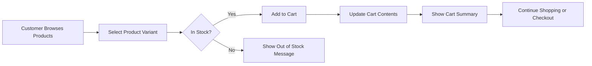
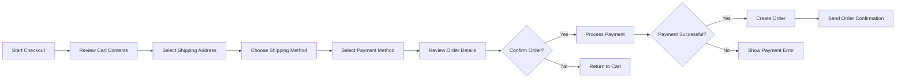

# Shopping Cart and Order Flow Requirements Specification

## Executive Summary and Business Context

This document defines the complete business requirements for shopping cart management, wishlist functionality, order placement processes, and payment processing workflows for the ecommerceMall platform. The shopping cart system serves as the critical bridge between product discovery and purchase completion, directly impacting conversion rates and customer satisfaction.

### Business Impact
- **Conversion Optimization**: Streamlined cart-to-order flow increases purchase completion rates
- **Customer Retention**: Efficient cart management reduces frustration and cart abandonment
- **Revenue Generation**: Direct impact on sales volume through optimized checkout processes
- **User Experience**: Smooth shopping experience encourages repeat business

## Shopping Cart Management Requirements

### Cart Creation and Session Management
WHEN a customer adds their first product to the cart, THE system SHALL create a new shopping cart session.
WHILE a customer is browsing the site, THE system SHALL maintain their cart contents across page navigation.
WHERE customers are logged in, THE system SHALL persist cart contents across devices and sessions.

### Product Addition Requirements
WHEN a customer adds a product to cart, THE system SHALL validate product availability and SKU selection.
IF a product variant is out of stock, THEN THE system SHALL prevent addition to cart and notify the customer.
WHEN adding products with configurable options, THE system SHALL require complete variant selection before cart addition.

### Cart Modification Functions
THE customer SHALL be able to modify product quantities in the cart.
THE customer SHALL be able to remove individual items from the cart.
THE customer SHALL be able to save cart contents for later retrieval.
THE customer SHALL be able to clear the entire cart contents.

### Cart Validation Rules
WHILE products remain in the cart, THE system SHALL continuously validate availability and pricing.
IF product prices change after cart addition, THEN THE system SHALL notify the customer before checkout.
IF products become unavailable after cart addition, THEN THE system SHALL remove them from the cart with notification.

## Wishlist Functionality Requirements

### Wishlist Creation and Management
WHEN a customer adds a product to their wishlist, THE system SHALL create or update their personal wishlist.
THE customer SHALL be able to create multiple wishlists with custom names.
THE customer SHALL be able to move items between wishlists.
THE customer SHALL be able to share wishlists with other users via generated links.

### Wishlist-to-Cart Conversion
WHEN a customer moves items from wishlist to cart, THE system SHALL validate current availability and pricing.
IF wishlist items are no longer available, THEN THE system SHALL notify the customer and prevent cart addition.
THE customer SHALL be able to add multiple wishlist items to cart in a single action.

### Wishlist Notifications
WHERE customers have opted in, THE system SHALL notify them when wishlist items go on sale.
WHERE products in wishlists become low in stock, THE system SHALL send restock notifications.

## Order Placement Process Flow

### Multi-Step Checkout Process
THE order placement process SHALL follow a structured multi-step workflow:

1. **Cart Review**: Customer reviews cart contents, quantities, and pricing
2. **Shipping Information**: Customer provides or selects shipping address
3. **Payment Method**: Customer selects and provides payment details
4. **Order Review**: Customer reviews final order details before submission
5. **Order Confirmation**: System processes payment and confirms order

### Step 1: Cart Review Requirements
WHEN a customer proceeds to checkout, THE system SHALL display a comprehensive cart summary.
THE cart summary SHALL include product images, descriptions, quantities, unit prices, and subtotals.
THE system SHALL calculate and display applicable taxes, shipping costs, and order total.

### Step 2: Shipping Information Requirements
THE customer SHALL be able to select from saved addresses or enter new shipping information.
THE system SHALL validate shipping addresses using address verification services.
WHERE multiple shipping options are available, THE customer SHALL be able to compare costs and delivery times.

### Step 3: Payment Method Requirements
THE customer SHALL be able to select from saved payment methods or add new payment information.
THE system SHALL support multiple payment gateways (credit cards, digital wallets, bank transfers).
WHILE processing payment, THE system SHALL encrypt all sensitive payment information.

### Step 4: Order Review Requirements
BEFORE order submission, THE system SHALL display a final review page with all order details.
THE customer SHALL be able to make final modifications to shipping or payment methods.
THE system SHALL require explicit customer confirmation before processing payment.

## Payment Processing Integration

### Payment Gateway Requirements
THE system SHALL integrate with at least two major payment gateways for redundancy.
WHEN processing payments, THE system SHALL handle gateway timeouts and retry logic.
IF a payment gateway is unavailable, THEN THE system SHALL automatically switch to backup gateways.

### Payment Validation and Security
WHILE capturing payment information, THE system SHALL validate card details and expiration dates.
THE system SHALL never store complete payment card numbers in the database.
ALL payment transactions SHALL be logged with unique transaction identifiers.

### Payment Error Handling
IF payment authorization fails, THEN THE system SHALL provide specific error messages to the customer.
WHERE payment failures occur due to insufficient funds, THE system SHALL suggest alternative payment methods.
THE customer SHALL be able to retry failed payments with corrected information.

## Order Confirmation and Error Handling

### Order Creation Process
WHEN payment is successfully processed, THE system SHALL create a permanent order record.
THE order record SHALL include all product details, pricing, customer information, and payment transaction ID.
THE system SHALL assign a unique order number to each successful order.

### Order Confirmation Requirements
AFTER successful order creation, THE system SHALL send immediate order confirmation to the customer.
THE order confirmation SHALL include order number, items purchased, total amount, and estimated delivery date.
THE customer SHALL receive email and/or SMS confirmation based on their preferences.

### Order Failure Scenarios
IF order creation fails after payment processing, THEN THE system SHALL initiate automatic refund.
WHERE technical errors prevent order completion, THE system SHALL notify administrators immediately.
THE customer SHALL receive clear communication about order status and next steps for resolution.

## Cart Abandonment Recovery Strategies

### Abandonment Tracking
THE system SHALL track cart abandonment events with timestamps and cart contents.
WHERE customers abandon carts with items, THE system SHALL log the abandonment reason if available.

### Recovery Campaigns
WHERE customers abandon carts, THE system SHALL trigger automated recovery emails after 1 hour and 24 hours.
THE recovery emails SHALL include cart contents, special offers if applicable, and direct links to resume checkout.

### Abandonment Analytics
THE system SHALL provide analytics on cart abandonment rates by product category, customer segment, and checkout step.
WHERE abandonment patterns are identified, THE system SHALL flag potential UX improvements.

## Actor-Specific Workflows

### Customer Workflows
THE customer SHALL be able to view their complete order history with status tracking.
THE customer SHALL be able to reorder previous purchases with one click.
THE customer SHALL be able to track current orders with real-time status updates.

### Seller Order Management
WHEN orders contain seller products, THE system SHALL notify the seller of new orders.
THE seller SHALL be able to view and manage orders for their products only.
THE seller SHALL be able to update order status and provide tracking information.

### Admin Order Oversight
THE admin SHALL have visibility into all orders across the platform.
THE admin SHALL be able to manually process orders in case of system errors.
THE admin SHALL be able to generate order reports by date range, customer, or product.

## Business Rules and Validation Requirements

### Inventory Validation
DURING checkout, THE system SHALL revalidate inventory levels for all cart items.
IF inventory becomes insufficient during checkout, THEN THE system SHALL notify the customer and adjust quantities.

### Pricing Consistency
THE system SHALL lock product prices at the time they are added to the cart.
WHERE promotional pricing expires during checkout, THE system SHALL honor the original cart price.

### Tax Calculation
THE system SHALL calculate applicable taxes based on shipping address and product categories.
WHERE tax-exempt customers are identified, THE system SHALL apply appropriate tax exemptions.

### Shipping Rules
THE system SHALL validate shipping method availability based on product dimensions and destination.
WHERE restricted items are in the cart, THE system SHALL apply appropriate shipping constraints.

## Performance and Scalability Requirements

### Response Time Requirements
WHEN customers add items to cart, THE system SHALL respond within 500 milliseconds.
DURING checkout process, each step transition SHALL complete within 1 second.
ORDER confirmation after payment SHALL be delivered within 3 seconds.

### Concurrent User Capacity
THE system SHALL support at least 10,000 concurrent customers browsing and managing carts.
THE checkout system SHALL handle at least 1,000 simultaneous order placements.

### Data Integrity Requirements
ALL cart modifications SHALL be atomic operations to prevent race conditions.
THE system SHALL maintain cart data consistency across multiple server instances.
ORDER creation SHALL be transactional with rollback capabilities for failed operations.

### Error Rate Tolerance
THE cart system SHALL maintain 99.9% availability during peak shopping hours.
PAYMENT processing failures SHALL not exceed 0.1% of total transactions.
ORDER creation errors SHALL be below 0.01% of attempted orders.

## Implementation Considerations

### Technology Agnostic Requirements
These requirements focus on business logic and user experience, not technical implementation details. The development team has full autonomy over:
- Database schema design and optimization
- API architecture and endpoint design
- Caching strategies for cart performance
- Payment gateway integration technical details
- Session management implementation approach

### Success Metrics
- Cart-to-order conversion rate > 65%
- Average checkout completion time < 3 minutes
- Cart abandonment rate < 35%
- Payment success rate > 98.5%
- Order creation success rate > 99.9%

This document provides the complete business requirements for shopping cart and order flow functionality. Development teams should use this as the foundation for technical implementation while maintaining flexibility to choose the most appropriate architectural solutions.

> *Developer Note: This document defines **business requirements only**. All technical implementations (architecture, APIs, database design, etc.) are at the discretion of the development team.*