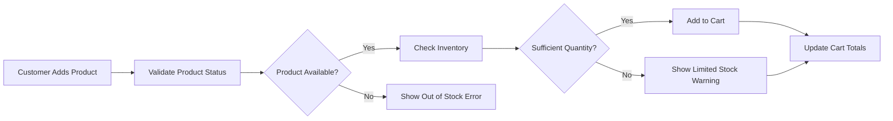
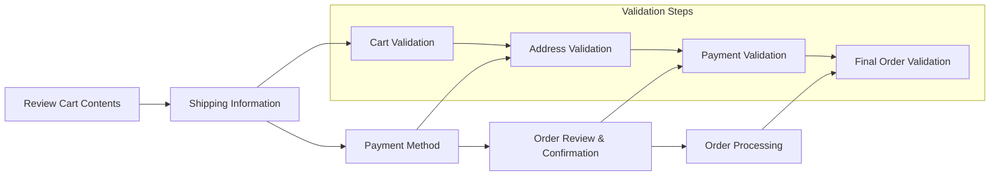
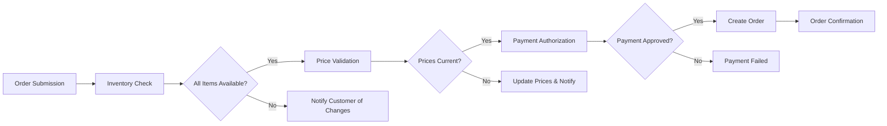

# Shopping Cart and Order Processing Requirements

## Executive Summary

This document defines the complete shopping cart management and order processing workflows for the shoppingMall e-commerce platform. The shopping cart serves as the central hub where customers collect products, manage quantities, and initiate purchases, while the order processing system handles the complete lifecycle from cart creation to order fulfillment.

### Business Context
The shopping cart and order processing system represents the core revenue-generating functionality of the platform. It must provide a seamless, secure, and reliable experience that builds customer trust and encourages repeat business. The system must handle complex scenarios including multi-seller orders, inventory synchronization, and real-time pricing updates.

## Shopping Cart Management Requirements

### Cart Creation and Session Management

**THE system SHALL create a shopping cart session WHEN a customer adds their first product.**

**WHEN a customer adds a product to their cart, THE system SHALL:**
- Validate product availability and current pricing
- Add the product with selected quantity and attributes
- Calculate subtotal including applicable taxes
- Update cart total in real-time
- Preserve cart state across browser sessions for authenticated users

**WHILE a customer is browsing products, THE system SHALL maintain cart contents with the following specifications:**
- Cart items persist for 30 days for authenticated users
- Guest carts persist for 24 hours
- Real-time inventory validation prevents overselling
- Price changes reflect immediately in cart calculations

### Cart Item Management

**WHEN a customer modifies item quantity, THE system SHALL:**
- Validate maximum available inventory
- Recalculate line item total
- Update cart subtotal and grand total
- Display stock warnings for low inventory items

**IF a customer attempts to add an out-of-stock product to cart, THEN THE system SHALL display appropriate error message and prevent addition.**

**WHERE a product has configurable attributes (size, color, etc.), THE cart SHALL store the selected configuration with each item.**

### Cart Validation Rules

## Checkout Process Flow

### Multi-Step Checkout Workflow

The checkout process follows a structured 4-step workflow:

### Step 1: Cart Review and Validation

**WHEN a customer initiates checkout, THE system SHALL:**
- Display all cart items with current prices and availability
- Show applicable promotions and discounts
- Calculate shipping costs based on selected address
- Display estimated delivery dates
- Validate that all items are still available

**IF any cart item becomes unavailable during checkout, THEN THE system SHALL notify the customer and remove the item automatically.**

### Step 2: Shipping Information

**WHEN a customer enters shipping information, THE system SHALL:**
- Validate address format and deliverability
- Calculate shipping options and costs
- Display estimated delivery timelines
- Allow selection of shipping method
- Save shipping preferences for future orders

**WHERE a customer has saved addresses, THE system SHALL provide quick selection options.**

### Step 3: Payment Method Selection

**WHEN a customer selects payment method, THE system SHALL:**
- Display available payment options (credit card, PayPal, etc.)
- Validate payment method compatibility with order amount
- Securely collect payment information
- Provide payment security assurances
- Save payment preferences for future orders (with consent)

### Step 4: Order Review and Confirmation

**WHEN a customer reviews the final order, THE system SHALL display:**
- Complete order summary with itemized costs
- Final shipping address and method
- Selected payment method
- Order total including all taxes and fees
- Estimated delivery date
- Return policy information

## Order Creation and Validation

### Order Creation Process

**WHEN a customer confirms their order, THE system SHALL:**
- Reserve inventory for all ordered items
- Generate unique order number
- Create order record with complete details
- Initiate payment processing
- Send order confirmation email
- Update seller inventory systems

**THE order creation process SHALL include the following validation checks:**
- All items must be available in requested quantities
- Pricing must match current product prices
- Shipping address must be valid and deliverable
- Payment method must be authorized for the transaction amount
- Customer account must be in good standing

### Order Validation Rules

### Multi-Seller Order Handling

**WHERE an order contains products from multiple sellers, THE system SHALL:**
- Create separate order records for each seller
- Calculate individual seller totals
- Handle split payments appropriately
- Provide consolidated customer view
- Enable individual seller fulfillment

## Payment Processing Requirements

### Payment Authorization

**WHEN processing payment for an order, THE system SHALL:**
- Authorize the full order amount with the payment gateway
- Hold authorization until order fulfillment begins
- Capture payment upon shipment confirmation
- Handle partial captures for split shipments
- Provide clear payment status tracking

**IF payment authorization fails, THEN THE system SHALL:**
- Notify the customer immediately
- Provide specific error information
- Suggest alternative payment methods
- Preserve the cart for retry

### Payment Security Requirements

**THE payment processing system SHALL comply with PCI DSS standards for all credit card transactions.**

**WHILE handling payment information, THE system SHALL:**
- Never store raw credit card numbers
- Use tokenization for payment method storage
- Encrypt all payment-related communications
- Maintain audit trails for all transactions

## Order Status Tracking and Management

### Order Status Lifecycle

**THE order status system SHALL track orders through the following states:**
- **Pending**: Order created, payment processing
- **Confirmed**: Payment authorized, order accepted
- **Processing**: Order being prepared for shipment
- **Shipped**: Order dispatched with tracking
- **Delivered**: Order received by customer
- **Completed**: Order finalized, return window active
- **Cancelled**: Order cancelled before shipment
- **Refunded**: Order refund processed

### Real-Time Status Updates

**WHEN an order status changes, THE system SHALL:**
- Update the order record immediately
- Notify the customer via email/SMS
- Provide tracking information when available
- Update seller dashboards
- Trigger fulfillment workflows

**WHERE shipping carriers provide tracking APIs, THE system SHALL integrate for real-time tracking updates.**

### Customer Order Management

**WHILE an order is in progress, THE customer SHALL be able to:**
- View current order status
- Access tracking information
- Contact seller support
- Request order modifications (pre-shipment)
- Cancel order (if within cancellation window)

## Error Handling and Edge Cases

### Inventory Conflicts

**IF inventory becomes insufficient between cart addition and checkout, THEN THE system SHALL:**
- Notify the customer of the conflict
- Adjust quantities to available maximum
- Provide option to wait for restock or remove items
- Maintain cart integrity throughout the process

### Price Changes During Checkout

**WHILE a customer is in checkout, THE system SHALL lock prices to prevent mid-process changes.**

**IF a price change occurs during an active checkout session, THEN THE system SHALL honor the original price for that session.**

### Payment Failures and Retries

**THE system SHALL provide a graceful payment failure recovery process that includes:**
- Clear error messages with resolution suggestions
- Automatic retry mechanisms for temporary failures
- Alternative payment method options
- Cart preservation across payment attempts

## Performance and Security Requirements

### Performance Expectations

**THE shopping cart system SHALL provide the following performance standards:**
- Cart operations respond within 500ms
- Checkout page loads within 2 seconds
- Order processing completes within 5 seconds
- Real-time inventory updates within 1 second
- Payment authorization within 3 seconds

### Security Requirements

**THE system SHALL implement the following security measures:**
- SSL encryption for all cart and checkout pages
- CSRF protection for all form submissions
- Rate limiting on cart operations to prevent abuse
- Session timeout after 30 minutes of inactivity
- Secure handling of payment information

### Data Integrity Requirements

**THE system SHALL maintain data consistency through:**
- Atomic transactions for inventory updates
- Database-level constraints for quantity validation
- Audit trails for all cart and order modifications
- Regular data consistency checks

## Business Rules and Validation Logic

### Cart Expiration Rules

**THE shopping cart SHALL expire under the following conditions:**
- Guest carts: 24 hours of inactivity
- Authenticated user carts: 30 days of inactivity
- Abandoned checkout sessions: 1 hour without activity

### Order Modification Rules

**WHILE an order is in pending status, THE customer SHALL be able to:**
- Modify shipping address
- Change payment method
- Cancel the order entirely
- Add/remove items (subject to availability)

**ONCE an order moves to processing status, modifications SHALL require customer support intervention.**

### Return and Refund Policies

**THE system SHALL enforce the following return policies:**
- 30-day return window from delivery date
- Original shipping costs non-refundable
- Restocking fees for certain product categories
- Automated refund processing for approved returns

## Integration Requirements

### External System Integration

**THE shopping cart and order processing system SHALL integrate with:**
- Inventory management systems for real-time stock updates
- Payment gateways for secure transaction processing
- Shipping carriers for rate calculations and tracking
- Email/SMS systems for customer notifications
- Analytics platforms for business intelligence

### API Requirements

**WHERE external systems need cart/order data, THE system SHALL provide RESTful APIs with:**
- Standardized error handling
- Rate limiting and authentication
- Comprehensive documentation
- Version management

## Success Metrics and Monitoring

### Key Performance Indicators

**THE system SHALL track the following KPIs for cart and order performance:**
- Cart abandonment rate
- Average order value
- Checkout conversion rate
- Order processing time
- Payment success rate
- Customer satisfaction scores

### Monitoring and Alerting

**THE system SHALL provide real-time monitoring for:**
- Cart operation failures
- Payment processing errors
- Inventory synchronization issues
- Order status update delays
- System performance degradation

> *Developer Note: This document defines **business requirements only**. All technical implementations (architecture, APIs, database design, etc.) are at the discretion of the development team.*