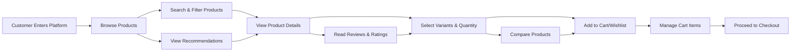

# Shopping Experience Requirements Specification

## 1. Shopping Journey Overview

### Business Context
The shopping experience represents the core customer journey from initial product discovery through cart management and preparation for checkout. This document defines all user-facing shopping functionality that enables customers to browse, select, and manage products before purchase.

### Customer Journey Flow

## 2. Product Browsing and Discovery Flow

### Product Discovery Mechanisms
THE system SHALL provide multiple product discovery methods to accommodate different shopping behaviors.

WHEN a customer visits the platform homepage, THE system SHALL display featured products, new arrivals, and personalized recommendations based on browsing history.

### Category Navigation
WHEN a customer selects a product category, THE system SHALL display all available products within that category organized by relevance and popularity.

WHERE category browsing is available, THE system SHALL support hierarchical category navigation with breadcrumb navigation showing the complete category path.

### Search Functionality
WHEN a customer enters search terms, THE system SHALL return relevant products matching the search query with instant search suggestions.

THE search system SHALL support:
- Keyword matching in product titles, descriptions, and attributes
- Fuzzy matching for spelling variations
- Synonym recognition for common product terms
- Search result ranking by relevance and popularity

### Filtering and Sorting
WHEN viewing product listings, THE system SHALL provide comprehensive filtering options including:
- Price range filtering
- Brand selection
- Product attributes (size, color, material)
- Availability status
- Customer rating thresholds
- Seller selection

THE system SHALL support multiple sorting options:
- Relevance (default)
- Price (low to high, high to low)
- Customer rating
- Newest arrivals
- Best sellers
- Product name (A-Z, Z-A)

## 3. Shopping Cart Management System

### Cart Creation and Persistence
WHEN an unauthenticated customer adds a product to cart, THE system SHALL create a temporary cart session that persists for 30 days or until the customer logs in.

WHEN a customer logs in with an existing temporary cart, THE system SHALL merge the temporary cart items with the customer's permanent cart.

### Adding Products to Cart
WHEN a customer adds a product to cart, THE system SHALL:
1. Validate product availability for the selected SKU
2. Check inventory levels for the requested quantity
3. Add the item with selected variants and quantity
4. Calculate subtotal including any applicable discounts
5. Update cart total and item count
6. Display confirmation message with cart summary

IF the requested quantity exceeds available inventory, THEN THE system SHALL display the maximum available quantity and offer to add that amount instead.

### Cart Item Management
WHEN a customer views their shopping cart, THE system SHALL display:
- Product image, title, and selected variants
- Unit price and quantity
- Item subtotal
- Stock availability status
- Options to update quantity or remove items

THE system SHALL support the following cart operations:
- Quantity adjustment with real-time price updates
- Item removal with confirmation
- "Save for later" functionality to move items to wishlist
- Bulk operations for multiple items

### Cart Validation Rules
WHILE items remain in the cart, THE system SHALL continuously validate:
- Product availability and stock levels
- Price consistency with current catalog
- Seller availability and shipping eligibility
- Any time-limited promotions or discounts

IF any cart item becomes unavailable or experiences price changes, THEN THE system SHALL notify the customer and provide options to update or remove the affected items.

## 4. Wishlist Functionality Requirements

### Wishlist Creation and Management
WHEN a customer adds a product to their wishlist, THE system SHALL create a persistent wishlist associated with their account.

THE system SHALL support multiple wishlists with custom names and descriptions, allowing customers to organize products by occasion, category, or priority.

### Wishlist Operations
WHEN managing wishlists, customers SHALL be able to:
- Add products from any product page
- Remove items from wishlists
- Move items between different wishlists
- Share wishlists via generated links
- Set wishlist privacy (public, private, shared)

### Wishlist Notifications
WHERE a customer has items in their wishlist, THE system SHALL provide notifications for:
- Price drops on wishlisted items
- Items coming back in stock
- Low inventory alerts for popular items
- Special promotions on wishlisted products

## 5. Product Comparison Features

### Comparison Tool
WHEN a customer selects products for comparison, THE system SHALL display a side-by-side comparison view showing:
- Product images and basic information
- Key specifications and attributes
- Pricing and availability
- Customer ratings and review summaries
- Shipping options and delivery times

### Comparison Limitations
THE system SHALL allow comparison of up to 4 products simultaneously to maintain usability and performance.

IF a customer attempts to compare more than 4 products, THEN THE system SHALL prompt them to remove some items before proceeding.

## 6. Customer Reviews and Ratings System

### Review Submission Process
WHEN a customer who has purchased a product attempts to submit a review, THE system SHALL:
1. Verify the customer has actually purchased the product
2. Allow rating submission (1-5 stars)
3. Provide optional text review with character limits
4. Support image uploads for product reviews
5. Apply moderation rules for content appropriateness

### Review Display and Sorting
THE system SHALL display reviews with:
- Reviewer name (with privacy options)
- Purchase verification badge
- Star rating and review date
- Helpfulness voting system
- Response capability from sellers

Reviews SHALL be sortable by:
- Most recent
- Highest rating
- Lowest rating
- Most helpful
- With images only

### Rating Aggregation
THE system SHALL calculate and display aggregate ratings for each product based on all verified reviews, including:
- Average star rating
- Rating distribution (number of reviews per star)
- Total review count
- Recent rating trends

## 7. Product Recommendation Engine

### Recommendation Types
THE system SHALL provide personalized product recommendations based on:
- Browsing history and viewed products
- Purchase history and cart contents
- Similar products bought by other customers
- Products frequently bought together
- Trending products in relevant categories

### Recommendation Placement
Recommendations SHALL appear in the following contexts:
- Product detail pages ("Customers also bought")
- Shopping cart page ("Complete your purchase")
- Wishlist pages ("Similar items you might like")
- Category pages ("Popular in this category")
- Homepage personalized recommendations

### Recommendation Freshness
WHILE displaying recommendations, THE system SHALL ensure they are current and relevant by:
- Updating recommendations based on recent activity
- Removing out-of-stock or discontinued products
- Prioritizing products with positive customer feedback
- Considering seasonal and trending factors

## 8. User Interaction Scenarios

### Guest Shopping Experience
WHILE shopping as a guest, THE system SHALL allow full product browsing and cart management with the following limitations:
- Cart persistence limited to browser session or 30 days
- No wishlist functionality available
- No personalized recommendations
- Required to create account before checkout

### Registered Customer Benefits
WHERE a customer is authenticated, THE system SHALL provide enhanced shopping features including:
- Persistent cart across devices
- Multiple wishlist management
- Purchase history access
- Personalized recommendations
- Faster checkout with saved addresses

### Mobile Shopping Experience
THE system SHALL provide a responsive shopping experience optimized for mobile devices with:
- Touch-friendly interface elements
- Simplified navigation for smaller screens
- Optimized image loading for mobile bandwidth
- Mobile-specific features like camera product search

## 9. Error Handling and Edge Cases

### Inventory Management Errors
IF a product becomes unavailable after being added to cart, THEN THE system SHALL:
- Clearly mark the item as unavailable
- Prevent proceeding to checkout with unavailable items
- Provide option to remove unavailable items
- Suggest similar available alternatives

### Price Change Handling
IF product prices change while items are in cart, THEN THE system SHALL:
- Display both original and current prices
- Require customer confirmation before checkout
- Explain the reason for price changes
- Honor the original price if within price protection period

### Technical Error Scenarios
WHEN technical errors occur during shopping interactions, THE system SHALL:
- Provide clear error messages explaining the issue
- Offer retry options for failed operations
- Preserve customer data to prevent loss
- Log errors for technical investigation

### Performance Requirements
THE shopping experience SHALL meet the following performance standards:
- Product search results displayed within 2 seconds
- Cart updates processed within 1 second
- Product pages load within 3 seconds
- Recommendation engine responds within 500ms
- System available 99.9% of operating time

## 10. Business Rules and Validation

### Cart Validation Rules
THE system SHALL enforce the following business rules for cart management:
- Maximum 50 unique items per cart
- Maximum quantity of 10 per SKU (configurable per product)
- Products from different sellers require separate shipping calculations
- Digital products cannot be combined with physical products in same order
- Age-restricted products require verification before addition to cart

### Review Moderation Rules
Customer reviews SHALL be moderated according to:
- Prohibition of offensive language or personal attacks
- Requirement for authentic purchase verification
- Prevention of duplicate reviews from same customer
- Compliance with platform content guidelines
- Automatic flagging of suspicious review patterns

### Recommendation Quality Standards
Product recommendations SHALL maintain quality through:
- Exclusion of out-of-stock products
- Prioritization of highly-rated products
- Consideration of customer preferences and history
- Regular algorithm updates based on performance metrics
- A/B testing for recommendation effectiveness

## 11. Authentication Integration Requirements

### Customer Authentication Flow
WHEN a customer interacts with shopping features, THE system SHALL properly authenticate and authorize access based on user roles.

**Guest User Permissions:**
- Browse products and view product details
- Add items to temporary shopping cart
- Search and filter products
- View product reviews and ratings

**Registered Customer Permissions:**
- All guest permissions plus:
- Create and manage persistent shopping carts
- Add products to multiple wishlists
- Receive personalized recommendations
- Access purchase history and order tracking
- Write reviews for purchased products

### Seller Authentication Integration
WHERE sellers interact with customer shopping data, THE system SHALL enforce:
- Sellers can only view their own product performance data
- Sellers can respond to customer reviews for their products
- Seller access to customer data limited to order fulfillment requirements

### Admin Authentication Requirements
WHEN administrators monitor shopping activities, THE system SHALL provide:
- Comprehensive analytics on shopping behavior patterns
- Ability to moderate reviews and product content
- Oversight of recommendation algorithm performance
- Monitoring of cart abandonment rates and conversion metrics

## 12. Shopping Analytics and Business Intelligence

### Customer Behavior Tracking
THE system SHALL track key shopping metrics including:
- Product view counts and time spent on product pages
- Search query analysis and conversion rates
- Cart addition rates and abandonment patterns
- Wishlist creation and conversion from wishlist to purchase
- Comparison tool usage and effectiveness

### Performance Monitoring
WHILE customers shop, THE system SHALL monitor:
- Page load times and performance bottlenecks
- Search result relevance and accuracy
- Recommendation engine effectiveness
- Cart management functionality reliability
- Mobile shopping experience quality

### Business Intelligence Reporting
THE system SHALL generate comprehensive reports on:
- Most popular products and categories
- Customer search patterns and trends
- Shopping cart conversion rates
- Wishlist to purchase conversion metrics
- Customer satisfaction with shopping experience

## 13. Accessibility and Inclusivity Requirements

### Accessibility Standards
THE shopping experience SHALL comply with WCAG 2.1 Level AA accessibility standards including:
- Screen reader compatibility for all shopping features
- Keyboard navigation support throughout the shopping journey
- Color contrast requirements for visual elements
- Alternative text for product images and interface elements

### Inclusive Design Considerations
THE system SHALL provide inclusive shopping experiences for:
- Customers with visual impairments through proper contrast and text alternatives
- Customers with motor disabilities through keyboard navigation and large click targets
- Customers with cognitive disabilities through clear language and consistent navigation
- International customers through multi-language support and cultural considerations

## 14. Internationalization and Localization

### Multi-language Support
WHERE the platform serves international markets, THE system SHALL support:
- Product descriptions in multiple languages
- Interface text localization
- Currency conversion and display
- Regional shopping preferences and patterns

### Cultural Adaptation
THE shopping experience SHALL adapt to regional preferences including:
- Product categorization based on local market trends
- Payment method preferences by region
- Shipping options suitable for local logistics
- Customer service expectations based on cultural norms

## 15. Security and Privacy Considerations

### Data Privacy Protection
WHILE customers shop, THE system SHALL protect:
- Personal information collected during shopping
- Browsing history and shopping preferences
- Payment information security
- Compliance with data protection regulations (GDPR, CCPA, etc.)

### Security Measures
THE shopping system SHALL implement security measures including:
- Secure transmission of all shopping data
- Protection against shopping cart hijacking
- Prevention of price manipulation attacks
- Security for wishlist and comparison data

## 16. Integration with Other Platform Components

### Product Catalog Integration
THE shopping experience SHALL seamlessly integrate with the product catalog system to ensure:
- Real-time product availability information
- Accurate pricing and discount calculations
- Proper category navigation and product relationships
- Consistent product information across all shopping interfaces

### Order Processing Integration
WHEN customers proceed from shopping to checkout, THE system SHALL provide:
- Smooth transition from cart to order processing
- Accurate transfer of product selections and quantities
- Proper calculation of totals including taxes and shipping
- Clear communication of order confirmation process

### User Management Integration
THE shopping system SHALL integrate with user management to provide:
- Personalized shopping experiences based on user profiles
- Secure authentication for shopping features
- Proper authorization for customer-specific functionality
- Consistent user preferences across shopping sessions

> *Developer Note: This document defines business requirements only. All technical implementations (architecture, APIs, database design, etc.) are at the discretion of the development team.*