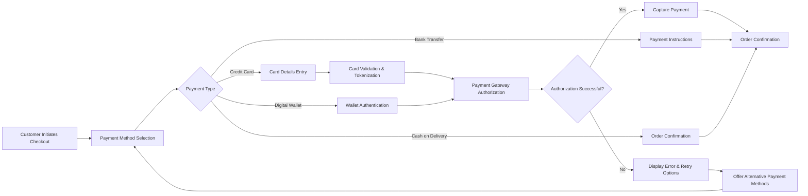

# Order Processing and Payment System Requirements

## Executive Summary

This document defines the complete order processing and payment system requirements for the shoppingMall e-commerce platform. The system handles the entire order lifecycle from cart checkout through payment processing, order confirmation, status tracking, and post-purchase support. The platform must provide a seamless, secure, and reliable transaction experience for customers while enabling robust management capabilities for sellers and administrators.

## Business Context

The order processing system serves as the financial backbone of the e-commerce platform, managing the critical transition from customer intent to completed transaction. This system must handle high-volume transactions during peak periods while maintaining data integrity, security compliance, and customer satisfaction.

## Order Placement Process Requirements

### Cart to Order Conversion Workflow

WHEN a customer proceeds to checkout from their shopping cart, THE system SHALL validate all cart contents and convert items to a pending order with the following validations:

**Cart Validation Rules:**
- THE system SHALL verify real-time product availability for each SKU in the cart
- THE system SHALL check inventory levels against requested quantities with automatic adjustment for overselling prevention
- THE system SHALL validate product pricing consistency and apply any time-sensitive promotions
- THE system SHALL calculate accurate subtotal, shipping costs, and tax amounts based on customer location

**Order Creation Specifications:**
- THE system SHALL generate a unique 12-digit order number following format: ORD-YYYYMMDD-NNNN
- THE system SHALL create immutable order line items capturing product details, variants, and prices at transaction time
- THE system SHALL associate the order with customer account and selected shipping address
- THE system SHALL set initial order status to "Pending Payment" and reserve inventory for 30 minutes

### Address Management and Validation System

**Customer Address Management:**
- WHEN customers manage shipping addresses, THE system SHALL support saving up to 10 addresses per account
- THE system SHALL validate address completeness including street, city, state, postal code, and country
- WHERE address validation services are available, THE system SHALL verify address deliverability through postal service APIs
- THE system SHALL provide address suggestions and auto-completion during entry

**Address Validation Business Rules:**
- IF an address cannot be verified, THEN THE system SHALL prompt the customer to review and correct the information
- WHERE international shipping is required, THE system SHALL validate country-specific address formatting
- THE system SHALL prevent order submission with incomplete or invalid address information

## Payment Processing System Requirements

### Supported Payment Methods

THE system SHALL support multiple payment methods with the following specifications:

**Primary Payment Methods:**
- Credit/Debit Cards (Visa, MasterCard, American Express, Discover) with PCI DSS compliance
- Digital Wallets (PayPal, Apple Pay, Google Pay) with secure tokenization
- Bank Transfers for B2B transactions with extended processing timelines
- Cash on Delivery with regional availability restrictions

**Payment Method Configuration:**
- THE system SHALL allow administrators to configure payment method availability by region
- WHERE payment methods have minimum/maximum amount limits, THE system SHALL enforce these constraints
- THE system SHALL calculate and display payment method-specific fees during checkout

### Payment Processing Flow

**Credit Card Processing Specifications:**
- WHEN processing credit card payments, THE system SHALL securely capture and tokenize card information
- THE system SHALL validate card details including number format, expiration date, and CVV code
- THE system SHALL process authorization through integrated payment gateways within 5-second timeout
- WHERE 3D Secure authentication is required, THE system SHALL redirect customers to issuer verification

**Payment Security Requirements:**
- ALL payment data SHALL be transmitted over TLS 1.2+ encrypted connections
- THE system SHALL never store full card numbers or CVV codes in any database
- Payment tokenization SHALL use industry-standard encryption algorithms
- THE system SHALL undergo regular PCI DSS compliance audits

## Shipping and Tax Calculation Engine

### Real-time Shipping Calculations

THE system SHALL calculate shipping costs based on multiple dynamic factors:

**Shipping Calculation Parameters:**
- Package weight and dimensions from product specifications
- Shipping destination distance and carrier zones
- Selected delivery speed (standard 3-7 days, express 1-2 days, overnight)
- Seller location and carrier availability
- Real-time carrier rate updates via API integration

**Shipping Method Configuration:**
- THE system SHALL integrate with major carriers including FedEx, UPS, DHL, and national postal services
- WHERE flat rate shipping is configured, THE system SHALL apply consistent pricing
- THE system SHALL support free shipping thresholds configurable by product category or order value
- THE system SHALL display delivery time estimates during checkout

### Tax Calculation Compliance

THE system SHALL accurately calculate sales tax based on jurisdictional requirements:

**Tax Configuration Specifications:**
- THE system SHALL integrate with tax calculation services (Avalara, TaxJar) for real-time rate updates
- WHERE manual tax configuration is required, THE system SHALL support region-specific tax rules
- THE system SHALL handle tax-exempt customers with proper documentation validation
- THE system SHALL comply with digital product tax regulations in applicable regions

**Tax Calculation Business Rules:**
- WHEN calculating tax, THE system SHALL use the shipping address jurisdiction for rate determination
- THE system SHALL apply appropriate tax rates based on product category classifications
- WHERE tax-inclusive pricing is required, THE system SHALL display clear tax breakdowns
- THE system SHALL maintain tax calculation audit trails for compliance reporting

## Order Confirmation and Notification System

### Order Confirmation Process

WHEN payment is successfully processed, THE system SHALL confirm the order through the following workflow:

**Confirmation Actions:**
- THE system SHALL update order status from "Pending Payment" to "Confirmed"
- THE system SHALL generate and send order confirmation email within 2 minutes of payment success
- THE system SHALL provide comprehensive order summary including items, pricing, and estimated delivery
- THE system SHALL permanently reserve inventory for the confirmed order
- THE system SHALL notify assigned sellers of new orders requiring fulfillment

### Multi-channel Notification System

THE system SHALL keep customers informed throughout the order lifecycle via multiple channels:

**Notification Types and Timing:**
- Order confirmation: Immediate email with order details and estimated delivery timeline
- Payment confirmation: Email receipt within 5 minutes of successful transaction
- Shipping confirmation: Email with tracking number within 2 hours of seller shipment
- Delivery status updates: Real-time notifications via email and SMS for status changes
- Delivery exception notifications: Immediate alerts for delays or issues

**Notification Content Requirements:**
- ALL notifications SHALL include order number, customer name, and contact information
- Shipping notifications SHALL provide carrier tracking numbers and direct tracking links
- Delivery notifications SHALL include proof of delivery when available from carriers
- THE system SHALL use branded email templates consistent with platform design

## Payment Gateway Integration Specifications

### Gateway Selection and Configuration

THE system SHALL support integration with multiple payment gateways for redundancy and flexibility:

**Supported Gateway Integrations:**
- Stripe: Primary gateway for card processing and subscription management
- PayPal: Digital wallet integration for international payments
- Authorize.Net: Enterprise payment processing with advanced fraud detection
- Regional payment processors: Location-specific gateways based on customer base

**Integration Technical Requirements:**
- ALL gateway integrations SHALL use standardized REST API interfaces
- THE system SHALL implement webhook handlers for real-time payment status updates
- Payment gateway errors SHALL be logged with detailed context for troubleshooting
- THE system SHALL support graceful fallback to secondary gateways during outages

### Payment Status Synchronization

THE system SHALL maintain accurate payment status synchronization with the following specifications:

**Status Management Workflow:**
- THE system SHALL process real-time payment status updates via webhook notifications
- WHERE payment authorization expires, THE system SHALL automatically retry within defined limits
- THE system SHALL handle partial payments and refunds through gateway integration
- Payment dispute and chargeback management SHALL be integrated with gateway reporting

## Order Status Tracking and Lifecycle Management

### Comprehensive Order Status System

THE system SHALL maintain a detailed order status lifecycle with the following defined states:

**Order Status Definitions and Transitions:**
- **Pending Payment**: Order created, awaiting payment completion (30-minute timeout)
- **Confirmed**: Payment successful, order being processed by seller
- **Processing**: Seller preparing order for shipment (24-hour maximum)
- **Shipped**: Order dispatched with tracking information provided
- **In Transit**: Package en route to destination with carrier updates
- **Out for Delivery**: Local carrier handling final delivery
- **Delivered**: Order successfully received by customer
- **Cancelled**: Order cancelled before shipment with refund processing
- **Refunded**: Payment returned to customer after cancellation or return

### Real-time Tracking Integration

THE system SHALL provide comprehensive order tracking capabilities:

**Tracking Implementation:**
- THE system SHALL integrate with carrier tracking APIs for real-time status updates
- WHERE map-based tracking is available, THE system SHALL display delivery progress visually
- THE system SHALL calculate and update estimated delivery dates based on carrier information
- Delivery exception handling SHALL provide clear instructions for resolution

**Customer Tracking Interface Requirements:**
- THE system SHALL provide order status dashboard in customer accounts
- Tracking numbers SHALL be clickable with direct links to carrier tracking pages
- THE system SHALL display delivery progress with milestone notifications
- WHERE delivery instructions are available, THE system SHALL allow customer customization

## Error Handling and Business Rules

### Payment Failure Handling Scenarios

IF payment processing fails, THEN THE system SHALL implement comprehensive error handling:

**Payment Failure Recovery:**
- WHEN payment authorization fails, THE system SHALL provide specific error messages indicating the reason
- THE system SHALL offer retry options with the same payment method with modified parameters
- WHERE alternative payment methods are available, THE system SHALL suggest switching options
- THE system SHALL preserve the order and cart contents during payment retry attempts

**Common Failure Scenarios and Resolutions:**
- Insufficient funds: Suggest alternative payment method or order modification
- Expired card: Prompt for updated card information
- Network connectivity issues: Automatic retry with exponential backoff
- Fraud detection blocks: Escalate to manual review with customer notification

### Order Modification Restrictions

THE system SHALL enforce order modification rules based on order status:

**Modification Business Rules:**
- Orders in "Pending Payment" status can be modified or cancelled without restriction
- Orders in "Confirmed" status require seller approval for significant changes
- Orders in "Shipped" status cannot be modified, only cancelled with return process
- Address changes are only permitted before order reaches "Processing" status
- Quantity reductions may affect applicable discounts and require re-calculation

### Inventory Reservation Management

THE system SHALL implement robust inventory reservation to prevent overselling:

**Inventory Reservation Rules:**
- Inventory SHALL be reserved upon order confirmation for 30 minutes to allow payment processing
- Reservations SHALL be automatically released after payment failure or order cancellation
- THE system SHALL maintain real-time inventory synchronization across all system components
- Backorder handling SHALL allow customers to order out-of-stock items with delayed fulfillment

## Performance and Scalability Requirements

### Transaction Processing Performance

THE system SHALL meet the following performance benchmarks:

**Response Time Requirements:**
- Payment transaction processing: 5 seconds maximum under normal load
- Order confirmation generation: 2 seconds after payment success
- Inventory reservation: 1 second for real-time stock updates
- Order status queries: 500 milliseconds response time

**Throughput Capacity:**
- THE system SHALL process 100+ concurrent checkout processes
- Payment gateway integration SHALL handle 50+ simultaneous authorizations
- Order confirmation SHALL scale to 1,000+ orders per hour during peak periods
- Inventory updates SHALL support 500+ concurrent modifications

### Data Consistency and Integrity

THE system SHALL ensure data consistency across all order-related operations:

**Consistency Measures:**
- ACID compliance for all financial transactions and inventory updates
- Real-time synchronization between order management and inventory systems
- Audit trails for all order modifications and status changes
- Data backup procedures ensuring no order data loss

## Security and Compliance Requirements

### Payment Security Standards

THE system SHALL implement comprehensive security measures for payment processing:

**Security Implementation Requirements:**
- PCI DSS compliance for all payment card handling processes
- Encryption of sensitive data both in transit (TLS 1.2+) and at rest (AES-256)
- Regular security audits and vulnerability assessments
- Fraud detection mechanisms with machine learning algorithms

### Data Privacy Compliance

THE system SHALL comply with data protection regulations including:

**Privacy Compliance Specifications:**
- GDPR compliance for European customer data protection
- CCPA compliance for California consumer privacy rights
- Data minimization principles collecting only necessary information
- Clear data retention policies with automated deletion procedures

### Audit and Reporting Requirements

THE system SHALL maintain comprehensive records for compliance and business intelligence:

**Reporting Capabilities:**
- Complete transaction history with timestamps and user actions
- Payment gateway interaction logs for dispute resolution
- System error logging with detailed context for troubleshooting
- Compliance reporting for financial and regulatory requirements

## Integration Requirements

### External System Integration

THE system SHALL integrate with various external services to support comprehensive functionality:

**Required External Integrations:**
- Payment gateway APIs for transaction processing and status updates
- Shipping carrier APIs for rate calculation, label generation, and tracking
- Tax calculation services for accurate jurisdictional tax compliance
- Email and SMS service providers for customer notifications
- Address validation services for delivery address verification

### Internal System Dependencies

THE system SHALL maintain proper integration with other platform components:

**Key Internal Dependencies:**
- User management system for customer authentication and profile information
- Product catalog for inventory management and pricing validation
- Shopping cart system for order creation and item management
- Seller management for order assignment and fulfillment coordination
- Admin dashboard for oversight and reporting capabilities

## Business Rules and Validation Framework

### Order Validation Rules

THE system SHALL enforce the following business rules during order processing:

**Validation Requirements:**
- All products in cart must be currently available and in stock
- Shipping address must be complete, valid, and deliverable
- Payment method must be supported for the customer's region and order value
- Order total must match calculated sum of products, shipping, and taxes exactly
- Customer must accept terms of service and privacy policy

### Financial Validation Rules

THE system SHALL implement strict financial controls:

**Financial Controls:**
- Currency calculations rounded to 2 decimal places using standard rounding rules
- Tax calculations based on current jurisdictional rates and product categories
- Shipping costs calculated according to carrier rates and package specifications
- Discount applications validated against promotion terms and conditions

### Error Handling Business Rules

THE system SHALL provide comprehensive error handling with the following specifications:

**Error Handling Framework:**
- User-friendly error messages without exposing technical details
- Clear guidance for resolving common issues
- Maintenance of form data to prevent customer re-entry
- Escalation procedures for unresolved or critical errors
- Logging of all errors with sufficient context for technical analysis

> *Developer Note: This document defines **business requirements only**. All technical implementations (architecture, APIs, database design, etc.) are at the discretion of the development team.*