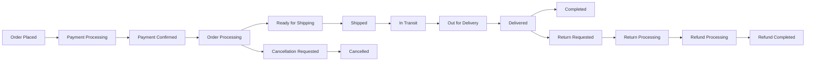
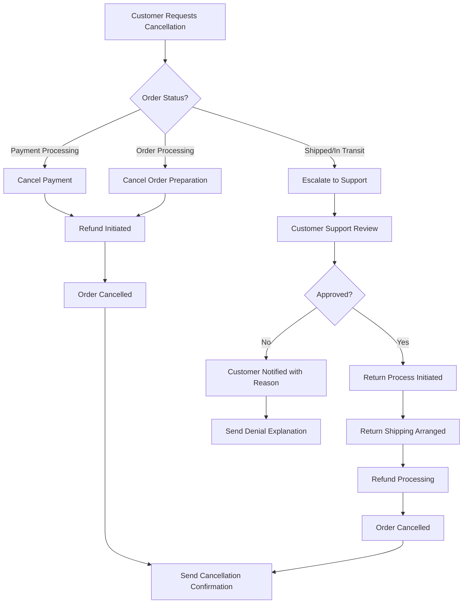

# Order Tracking, Shipping, and Customer Service Workflows

## Executive Summary

This document defines the comprehensive order tracking, shipping management, and customer service workflows for the e-commerce shopping mall platform. The system provides customers with real-time visibility into their order status, enables efficient shipping management for sellers, and supports comprehensive customer service operations including cancellations, refunds, and returns.

### Business Context

The order tracking and shipping system serves as the critical bridge between order placement and customer satisfaction. It ensures transparency throughout the delivery process, manages exceptions effectively, and provides customers with the confidence that their purchases are being handled professionally.

### Strategic Importance
WHEN customers place orders, THE system SHALL provide comprehensive tracking capabilities that build trust and reduce customer anxiety.
WHERE delivery exceptions occur, THE system SHALL implement proactive notification and resolution processes.
THE order tracking system SHALL serve as the primary customer touchpoint post-purchase, directly impacting customer satisfaction and retention rates.

## Order Status Management System

### Order Status Lifecycle

The system shall manage orders through a comprehensive status lifecycle:

### Order Status Definitions

**WHEN an order is placed**, THE system SHALL assign it the status "Order Placed" and initiate payment processing.

**WHEN payment is successfully processed**, THE system SHALL update the order status to "Payment Confirmed" and notify the seller.

**WHILE an order is in "Order Processing" status**, THE system SHALL allow the seller to prepare the order for shipping.

**WHEN the seller marks an order as ready for shipping**, THE system SHALL update the status to "Ready for Shipping" and generate shipping labels.

**WHEN shipping labels are generated and carrier pickup is scheduled**, THE system SHALL update the status to "Shipped" and provide tracking information.

**WHILE an order is "In Transit"**, THE system SHALL periodically update tracking information from the shipping carrier.

**WHEN an order reaches the local delivery facility**, THE system SHALL update the status to "Out for Delivery" and provide estimated delivery time.

**WHEN delivery is confirmed**, THE system SHALL update the status to "Delivered" and initiate the order completion process.

**AFTER a 14-day return period expires**, THE system SHALL automatically mark the order as "Completed".

### Actor Permissions for Order Status Management

**CUSTOMER permissions**:
- View order status and tracking information
- Request order cancellation (within eligible timeframe)
- Initiate return requests
- Receive status update notifications

**SELLER permissions**:
- Update order status from "Order Processing" to "Ready for Shipping"
- Mark orders as "Shipped" and provide tracking information
- Process cancellation requests from customers
- Update return status and process refunds

**ADMIN permissions**:
- View all orders across the platform
- Modify order status in case of system errors
- Override seller decisions on cancellations and returns
- Generate order status reports

## Shipping and Delivery Tracking

### Real-time Tracking Integration

**THE system SHALL integrate with major shipping carriers** including FedEx, UPS, DHL, and national postal services.

**WHEN an order is shipped**, THE system SHALL retrieve and store tracking numbers from the shipping carrier.

**WHILE tracking information is available**, THE system SHALL update order status based on carrier tracking events.

### Tracking Event Mapping

| Carrier Event | System Status | Customer Notification | Required Action |
|---------------|---------------|----------------------|-----------------|
| Label Created | Ready for Shipping | Order is being prepared for shipment | None |
| Picked Up | Shipped | Your order has shipped | Customer can track |
| In Transit | In Transit | Order is on the way | Monitor progress |
| Out for Delivery | Out for Delivery | Delivery expected today | Prepare for receipt |
| Delivered | Delivered | Your order has been delivered | Confirm receipt |
| Exception | Delivery Exception | Delivery issue - contact support | Customer support intervention |
| Failed Delivery | Delivery Failed | Delivery attempt unsuccessful | Reschedule required |

### Estimated Delivery Dates

**THE system SHALL calculate estimated delivery dates** based on:
- Shipping method selected
- Seller processing time
- Carrier transit time
- Destination location
- Current weather conditions affecting transit

**WHEN delivery estimates change**, THE system SHALL notify customers of the updated timeline within 1 hour of receiving new information.

**WHERE delivery delays exceed 24 hours**, THE system SHALL automatically escalate to customer support for proactive customer communication.

### Delivery Exception Handling

**IF a package cannot be delivered**, THEN THE system SHALL:
- Update order status to "Delivery Exception"
- Notify customer and seller immediately
- Provide specific instructions for resolution
- Initiate support ticket for tracking and follow-up
- Attempt redelivery according to carrier policies

**WHERE packages are lost in transit**, THE system SHALL:
- File claim with shipping carrier within 24 hours
- Provide customer with replacement or refund options
- Process resolution within 5 business days
- Update order status to "Lost in Transit"

## Customer Notification System

### Notification Triggers

**WHEN order status changes**, THE system SHALL send notifications to customers via email and mobile push notifications.

**WHERE customers have enabled SMS notifications**, THE system SHALL send SMS updates for major status changes.

**WHEN delivery exceptions occur**, THE system SHALL send immediate notifications with clear resolution steps.

### Notification Content Requirements

**THE notification system SHALL include**:
- Order number and summary
- Current status and next steps
- Tracking number (when available)
- Estimated delivery date
- Contact information for support
- Specific instructions for action required
- Links to track order or contact support

### Notification Timing and Priority

| Status Change | Notification Delay | Priority | Delivery Method |
|---------------|-------------------|----------|-----------------|
| Order Confirmed | Immediate | High | Email + Push |
| Shipped | Within 1 hour | High | Email + Push + SMS |
| Delivery Exception | Immediate | Critical | Email + Push + SMS |
| Delivered | Within 30 minutes | High | Email + Push + SMS |
| Cancellation Confirmed | Immediate | Medium | Email + Push |
| Return Approved | Within 2 hours | Medium | Email + Push |
| Refund Processed | Immediate | High | Email + Push |

### Notification Preference Management

**CUSTOMERS SHALL be able to customize** their notification preferences for:
- Order status updates
- Shipping notifications
- Delivery alerts
- Promotional communications
- Security alerts

**THE system SHALL respect** customer preferences while ensuring critical notifications are delivered for order-related events.

## Cancellation and Refund Processes

### Order Cancellation Workflow

### Cancellation Eligibility Rules

**IF an order is in "Payment Processing" status**, THEN THE customer SHALL be able to cancel immediately with full refund.

**IF an order is in "Order Processing" status**, THEN THE customer SHALL be able to cancel, but a restocking fee of 10% may apply if packaging has begun.

**IF an order is in "Shipped" or later status**, THEN THE customer SHALL NOT be able to cancel and must initiate a return process after delivery.

### Refund Processing

**WHEN a cancellation is approved**, THE system SHALL initiate refund processing within 24 hours.

**THE refund system SHALL support** multiple refund methods:
- Original payment method (3-10 business days processing)
- Store credit (immediate)
- Gift card balance (immediate)

**WHERE refunds are processed to original payment method**, THE system SHALL provide estimated processing times and track refund status.

**WHEN refunds exceed $500**, THE system SHALL require manager approval and additional verification.

## Return Management Workflow

### Return Request Process

**CUSTOMERS SHALL be able to request returns** within 30 days of delivery for most products.

**WHEN a return is requested**, THE system SHALL:
1. Validate return eligibility based on product type and condition
2. Generate return shipping label
3. Provide return instructions with packaging requirements
4. Update order status to "Return Requested"
5. Notify seller of pending return

### Return Approval and Processing

**SELLERS SHALL review return requests** within 48 hours of submission.

**WHEN a return is approved**, THE system SHALL:
- Provide prepaid return shipping label
- Update order status to "Return Processing"
- Set refund amount based on product condition
- Provide return tracking to customer

**WHEN returned items are received**, THE system SHALL:
- Verify item condition against return reason
- Process refund within 48 hours of receipt
- Update order status to "Refund Processing"
- Notify customer of refund completion

### Return Exceptions and Disputes

**IF returned items are damaged or not as described**, THEN THE seller SHALL be able to:
- Reject the return with photographic evidence
- Offer partial refund based on condition assessment
- Initiate dispute resolution process

**WHERE return rejection occurs**, THE system SHALL provide a dispute resolution process involving:
- Customer support mediation
- Evidence submission from both parties
- Final decision by platform administrators
- Appeal process for disputed decisions

### Return Shipping Management

**THE system SHALL manage return shipping** through:
- Prepaid return labels for customer convenience
- Multiple carrier options based on cost and speed
- Tracking integration for return shipment monitoring
- Insurance coverage for high-value returns
- International return logistics support

## Customer Support Integration

### Support Ticket System

**THE system SHALL integrate with customer support software** to create support tickets for order issues.

**WHEN delivery exceptions occur**, THE system SHALL automatically create support tickets with relevant order details.

**WHERE order status requires manual intervention**, THE system SHALL route to appropriate support queues.

### Escalation Procedures

**WHERE order issues cannot be resolved automatically**, THE system SHALL escalate to human customer support.

**THE escalation system SHALL prioritize** issues based on:
- Order value and customer history
- Issue severity and impact on customer experience
- Time sensitivity and delivery deadlines
- Previous escalation history for the same order

### Support Access Requirements

**CUSTOMER SUPPORT AGENTS SHALL have access to**:
- Complete order history and status timeline
- Shipping carrier tracking details and contacts
- Customer communication history
- Payment and refund records
- Seller contact information
- Previous support ticket history

### Support Response Time SLAs

**THE system SHALL enforce support response time** service level agreements:
- Critical issues (delivery exceptions): 1-hour response
- High priority (cancellation/refund): 4-hour response
- Medium priority (general inquiries): 8-hour response
- Low priority (information requests): 24-hour response

## Shipping Carrier Integration

### Supported Carriers

**THE system SHALL integrate with** at least the following shipping carriers:
- FedEx (Express, Ground, Home Delivery)
- UPS (Next Day Air, Ground, Worldwide)
- DHL (Express, Ecommerce)
- USPS (Priority, First Class, Parcel Select)
- National postal services for international shipments

### API Integration Requirements

**WHEN integrating with carrier APIs**, THE system SHALL:
- Handle authentication and rate limiting properly
- Manage API failures gracefully with retry logic
- Cache frequently used rate information
- Provide fallback mechanisms for API outages
- Monitor API health and performance metrics

### Shipping Rate Calculation

**THE system SHALL calculate shipping rates** based on:
- Package dimensions and weight
- Origin and destination addresses
- Shipping speed requirements
- Carrier availability and service levels
- Real-time carrier rate updates

**WHERE real-time rates are unavailable**, THE system SHALL use cached rates with clear disclosure of potential inaccuracies.

### Carrier Performance Monitoring

**THE system SHALL monitor carrier performance** against established SLAs:
- Label generation success rate: > 99.5%
- Tracking update frequency: every 4 hours
- API response time: < 2 seconds
- Delivery accuracy: > 98%
- Customer satisfaction with carrier: > 4.0/5.0

## Error Handling and Exception Management

### System Failure Scenarios

**IF tracking updates fail**, THEN THE system SHALL:
- Retry failed API calls with exponential backoff
- Use cached tracking information as fallback
- Notify administrators of persistent failures
- Provide manual tracking update interface

**WHEN carrier systems are unavailable**, THE system SHALL:
- Display last known status with timestamp
- Provide carrier contact information
- Estimate status based on typical transit times
- Escalate to customer support for manual follow-up

### Data Integrity Protection

**THE system SHALL maintain data integrity** through:
- Transaction rollback capabilities for failed operations
- Data validation checks before status updates
- Conflict resolution for concurrent modifications
- Audit trail maintenance for all status changes

### Recovery Procedures

**WHEN system components fail**, THE system SHALL:
- Provide graceful degradation of non-critical features
- Maintain core tracking functions during partial outages
- Offer manual override capabilities for automated processes
- Support disaster recovery procedures with documented runbooks

## Performance Requirements

### Response Time Requirements

**THE order status API SHALL respond** within 200ms for 95% of requests during peak load.

**THE tracking update system SHALL process** carrier webhooks within 30 seconds of receipt.

**THE notification system SHALL deliver** status updates within 1 minute of status change.

### Scalability Targets

**THE system SHALL support** up to 10,000 concurrent order status checks.

**THE notification system SHALL handle** up to 1,000 notifications per minute.

**THE tracking system SHALL process** up to 5,000 tracking updates per hour.

### Data Retention Policies

**ORDER TRACKING DATA SHALL be retained** for 7 years for compliance and customer service purposes.

**SHIPPING CARRIER DATA SHALL be cached** for 24 hours to reduce API calls while maintaining accuracy.

**NOTIFICATION HISTORY SHALL be stored** for 2 years for customer service reference.

## Security and Compliance Requirements

### Data Privacy

**THE system SHALL comply with** GDPR, CCPA, and other privacy regulations for customer data handling.

**PERSONAL INFORMATION SHALL be encrypted** both in transit and at rest using industry-standard encryption.

**CUSTOMERS SHALL have control** over their data visibility and notification preferences.

### Payment Security

**REFUND PROCESSING SHALL follow** PCI DSS compliance requirements for payment data handling.

**WHERE payment information is stored**, THE system SHALL use tokenization for security.

**FINANCIAL TRANSACTIONS SHALL be logged** with complete audit trails for compliance purposes.

### Access Control

**CUSTOMER access SHALL be restricted** to their own orders and tracking information.

**SELLER access SHALL be limited** to orders containing their products only.

**ADMIN access SHALL require** multi-factor authentication and role-based permissions.

## Success Metrics and Monitoring

### Key Performance Indicators

- Order status update accuracy: >99.9%
- Notification delivery rate: >98%
- Average time to refund: <48 hours
- Customer satisfaction with tracking: >4.5/5.0
- Carrier API availability: >99.5%
- Support ticket resolution time: <4 hours

### Monitoring and Alerting

**THE system SHALL monitor**:
- Carrier API availability and response times
- Order status update failures
- Notification delivery failures
- Refund processing delays
- Support ticket response times

**WHERE critical thresholds are exceeded**, THE system SHALL alert administrators immediately via multiple channels.

### Performance Dashboards

**THE system SHALL provide** real-time dashboards showing:
- Current order status distribution
- Delivery performance metrics
- Customer satisfaction scores
- System health indicators
- Support workload statistics

## Integration Requirements

### Authentication System Integration

**THE order tracking system SHALL integrate** with the platform authentication system to ensure proper access control and session management.

### Payment System Integration

**THE system SHALL integrate securely** with payment processing systems for refund operations and transaction status updates.

### Customer Support System Integration

**THE system SHALL provide seamless integration** with customer support platforms for ticket creation and status updates.

### Analytics System Integration

**THE system SHALL feed data** to analytics platforms for performance monitoring and business intelligence.

## Future Enhancement Considerations

### Advanced Tracking Features

**FUTURE ENHANCEMENTS MAY INCLUDE**:
- Real-time package location mapping
- Delivery time predictions using machine learning
- Photo proof of delivery integration
- Signature capture and verification
- Predictive delivery exception alerts

### International Expansion

**THE SYSTEM ARCHITECTURE SHALL SUPPORT** international shipping requirements including:
- Customs documentation generation
- International carrier integration
- Multi-currency refund processing
- Localized notification content
- Cross-border compliance requirements

### Mobile Experience Enhancement

**FUTURE MOBILE CAPABILITIES** could include:
- Push notifications with rich content
- Offline tracking information access
- Mobile-optimized tracking interfaces
- Integration with mobile carrier apps

> *Developer Note: This document defines **business requirements only**. All technical implementations (architecture, APIs, database design, etc.) are at the discretion of the development team.*