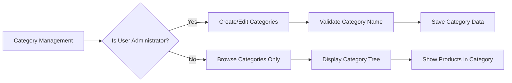
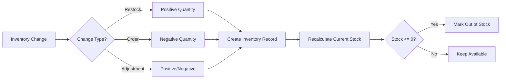

# Product Catalog Management System

## Introduction

The Product Catalog Management System is the core component of the e-commerce platform that enables sellers to create, manage, and organize products while providing customers with comprehensive browsing and search capabilities. This system implements a robust snapshot mechanism to ensure data integrity for all financial transactions.

## Category Management System

### Category Structure
THE platform SHALL organize products into a hierarchical category system with one level of nesting.

**Category Properties:**
- Name (required)
- Description (required)
- Parent category (optional, for subcategories)

**Category Management Rules:**
- WHEN an administrator creates a category, THE system SHALL validate that the name is unique within the same parent category
- WHERE categories have subcategories, THE system SHALL prevent circular references
- THE system SHALL allow administrators to edit category names and descriptions
- WHEN a category is deleted, THE system SHALL move all products in that category to an "uncategorized" state
- THE system SHALL preserve category structure for product organization

**Category Access:**
- Customers SHALL be able to browse the complete list of categories
- Customers SHALL be able to view products within any category or subcategory
- THE category list SHALL be accessible without authentication

## Product Creation and Lifecycle

### Product Properties
Each product SHALL contain the following required information:
- Product name
- Product description  
- Category assignment
- Base price

**Product Creation Workflow:**
WHEN a seller creates a product, THE system SHALL:
1. Validate that all required fields are provided
2. Verify the seller has an approved account
3. Assign the product to the seller
4. Set initial status as "draft" until variants are added
5. Create the initial product snapshot

**Product Editing Rules:**
- Sellers SHALL be able to edit their own products
- WHEN any product field is modified, THE system SHALL create a snapshot preserving the previous state
- Product edits SHALL include changes to images and variant structures
- THE system SHALL track who made each edit and when

**Product Deletion Constraints:**
A product SHALL only be deletable IF:
- There are no pending order items (paid or shipped status) for any variant
- There are no pending cancellation or refund requests for any variant
- The seller owns the product

WHEN a product is deleted, THE system SHALL:
- Remove the product from search and category listings
- Delete all variants and inventory records
- Preserve all product snapshots for historical reference
- Update any wishlists containing the deleted product

## Product Variants (SKU) System

### Variant Structure
Each product variant SHALL represent a specific combination of options with:
- SKU code (unique identifier, required)
- Option values (e.g., color: "Red", size: "Large")
- Price (optional override of base price)
- Stock quantity (required, starts at 0)

**Variant Management Rules:**
- A product MUST have at least one variant to be purchasable
- Products with no variants SHALL be visible but marked as "unavailable"
- Sellers SHALL be able to add, edit, and delete variants from their products
- WHEN a variant is edited, THE system SHALL create a snapshot

**Variant Deletion Constraints:**
A variant SHALL only be deletable IF:
- There are no pending order items (paid or shipped status) for that variant
- There are no pending cancellation or refund requests for that variant

**Variant Display:**
- Customers SHALL see all available variants on product detail pages
- Variants SHALL display current stock status
- Out-of-stock variants SHALL not be addable to cart
- Price ranges SHALL be shown when variants have different prices

## Image Management

### Image Upload and Organization
- Sellers SHALL be able to upload multiple images per product
- Images SHALL be reorderable with the first image serving as the thumbnail
- Sellers SHALL be able to delete images from their products
- Image changes SHALL be included in product snapshots

**Image Requirements:**
- THE system SHALL validate image file types and sizes
- Images SHALL be optimized for web display
- Thumbnail generation SHALL be automatic
- Image storage SHALL be scalable and reliable

## Inventory Tracking and Management

### Inventory Record System
Each variant SHALL maintain inventory through history records rather than simple quantity fields.

**Inventory Record Properties:**
- Quantity change (positive for restocking, negative for orders/adjustments)
- Reason for change
- Timestamp
- User who made the change

**Current Stock Calculation:**
THE current stock quantity SHALL be calculated by summing all inventory records for the variant.

**Inventory Management Actions:**
- Sellers SHALL be able to add inventory (restock) with quantity and reason
- Sellers SHALL be able to subtract inventory (adjustment/loss) with quantity and reason
- Order placement SHALL automatically create negative inventory records
- Order cancellation/refund SHALL automatically create positive inventory records

**Stock Status Rules:**
- WHEN stock reaches 0, THE variant SHALL be shown as "out of stock"
- Out-of-stock variants SHALL not be addable to cart
- Sellers SHALL be able to view complete inventory history for each variant

## Search and Filtering Capabilities

### Product Search Functionality
Customers SHALL be able to search products by name across all sellers.

**Search Results:**
- Results SHALL be paginated for performance
- Each result SHALL show: thumbnail, name, base price, seller shop name, average rating
- Search SHALL include products from all approved sellers

**Filtering Options:**
Customers SHALL be able to filter search results by:
- Category (including subcategories)
- Price range (minimum and maximum)
- In-stock only filter

**Sorting Options:**
Customers SHALL be able to sort search results by:
- Newest first (default)
- Price (low to high)
- Price (high to low)

**Search Performance:**
- THE search system SHALL be optimized for fast response times
- Search indexes SHALL be updated in real-time as products are added/modified
- Filtering and sorting SHALL work efficiently on large result sets

## Snapshot Implementation for Data Integrity

### Snapshot Principle
THE platform SHALL implement a comprehensive snapshot system to preserve data integrity for all financial transactions.

**Snapshot Triggers:**
Snapshots SHALL be created WHENEVER editable data is modified, including:
- Product edits (all fields including images)
- Product variant edits (SKU code, option values, price)
- Seller profile changes (shop name, description, logo)
- Order item creation (product, variant, and seller profile at purchase time)
- Review edits (rating, text content)
- Cancellation/refund request status changes

**Snapshot Content:**
Each snapshot SHALL record:
- When the change was made
- What was changed
- Values before and after the change
- User who made the change

**Product Snapshot Structure:**
WHEN a product is edited, THE product snapshot SHALL include:
- All product fields (name, description, category, base price, images)
- Snapshots of all variants at that moment
- Complete state preservation of product and variants

**Snapshot Access:**
- Sellers SHALL be able to view snapshots of their own products
- Administrators SHALL be able to view snapshots of any product
- Snapshots SHALL be immutable and cannot be deleted
- Snapshots SHALL be available for dispute resolution

## Business Rules and Constraints

### Product Availability Rules
- Products SHALL only be purchasable when they have at least one variant with positive stock
- Products without variants SHALL be visible but marked as unavailable
- Sellers SHALL not be able to delete products with active orders

### Category Assignment Rules
- Products SHALL be assigned to exactly one category or subcategory
- WHEN a category is deleted, affected products SHALL become uncategorized
- Category changes SHALL not affect existing order snapshots

### Inventory Integrity Rules
- Stock quantities SHALL always reflect the sum of inventory records
- Inventory changes SHALL always include a reason for audit purposes
- Negative stock SHALL be prevented through validation

### Search Integrity Rules
- Deleted products SHALL not appear in search results
- Products from suspended sellers SHALL not appear in search results
- Search results SHALL respect customer filtering preferences

## Integration Points

### Order Management Integration
- Product variants SHALL be linked to order items
- Inventory SHALL be automatically updated during order processing
- Product snapshots SHALL be preserved with each order

### Seller Dashboard Integration
- Sellers SHALL see their product catalog in the dashboard
- Inventory levels SHALL be visible in real-time
- Sales analytics SHALL be based on product and variant data

### Administrative Oversight
- Administrators SHALL have full visibility into all products
- Product deletion by administrators SHALL follow the same constraints
- Category management SHALL be exclusive to administrators

## Performance Requirements

**Search Performance:**
- Search results SHALL load within 2 seconds for common queries
- Filtering and sorting operations SHALL be near-instantaneous
- Pagination SHALL work efficiently with large product catalogs

**Product Display:**
- Product detail pages SHALL load within 3 seconds
- Image loading SHALL be optimized for various connection speeds
- Variant selection SHALL provide immediate feedback

**Inventory Updates:**
- Stock quantity calculations SHALL be real-time
- Inventory history queries SHALL be performant even with large datasets
- Concurrent inventory updates SHALL be handled without data corruption

## Error Handling

**Product Creation Errors:**
IF required fields are missing during product creation, THEN THE system SHALL return specific error messages indicating which fields need attention.

**Inventory Update Errors:**
IF an inventory update would result in negative stock, THEN THE system SHALL prevent the update and notify the seller.

**Category Assignment Errors:**
IF a category assignment would create circular references, THEN THE system SHALL reject the assignment and explain the constraint.

**Search Errors:**
IF search queries timeout or encounter errors, THEN THE system SHALL provide helpful error messages and suggest simplified searches.

## Data Retention

**Product Data:**
- Active products SHALL be maintained indefinitely
- Deleted products SHALL have their snapshots preserved for legal compliance
- Product images SHALL be stored with appropriate compression and backup

**Inventory History:**
- Inventory records SHALL be preserved for audit purposes
- Historical stock levels SHALL be available for reporting
- Inventory change reasons SHALL be stored for accountability

**Category History:**
- Category changes SHALL be logged for administrative review
- Deleted categories SHALL be preserved in product snapshots
- Category structure history SHALL be available for analysis

This comprehensive product catalog management system ensures that sellers can effectively manage their product offerings while maintaining data integrity through the snapshot system. The integration with order management, inventory tracking, and search functionality provides a complete e-commerce product experience for both sellers and customers.