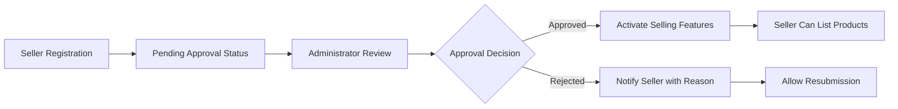
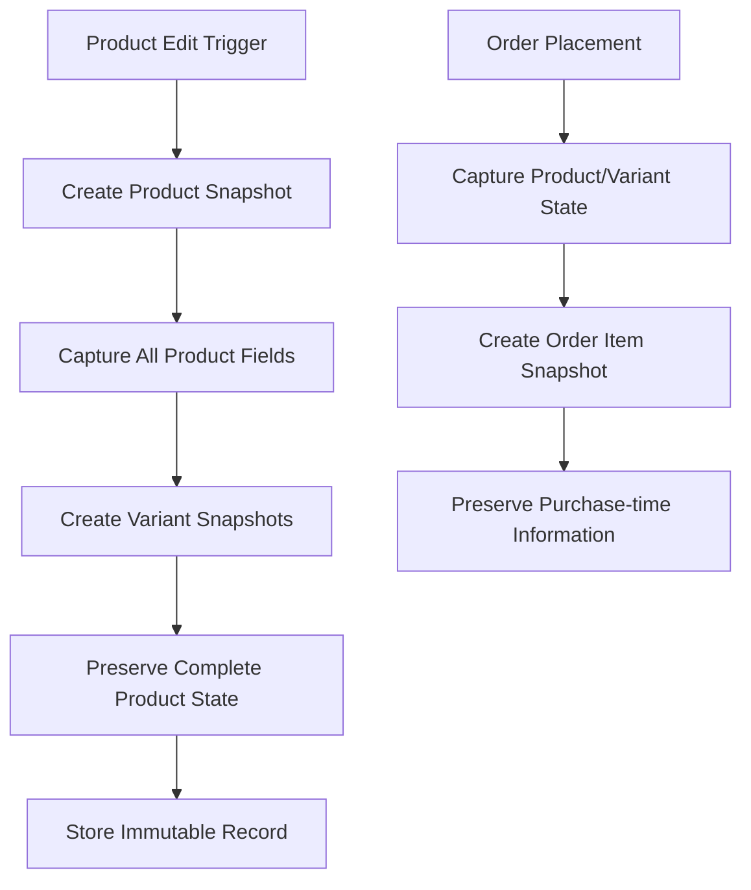

# E-Commerce Platform Requirements Specification

## Executive Summary

The e-commerce shopping mall platform is a comprehensive multi-seller marketplace that enables secure transactions between customers and sellers. This platform requires user registration for all features, implements robust snapshot-based data integrity for financial transactions, and provides comprehensive order management, inventory tracking, and administrative oversight. The system supports complex product variants, multi-seller order processing, and comprehensive dispute resolution mechanisms.

## User Actors and Authentication System

### Customer Account Management

WHEN a customer registers for the platform, THE system SHALL require email and password authentication with no guest browsing capabilities.

**Customer Registration Process:**
- Customers sign up with valid email address and secure password
- Email verification required before account activation
- Password strength validation enforced (minimum 8 characters with complexity)
- Registration confirmation email sent upon successful account creation

**Customer Authentication Operations:**
- Customers log in with email and password credentials
- Session management with secure token-based authentication
- Password change functionality with current password verification
- Account deletion with comprehensive data preservation rules

**Account Deletion Rules:**
WHEN a customer deletes their account, THE system SHALL:
- Remove profile information (display name, phone number)
- Preserve all order history and order records for seller documentation
- Maintain reviews but display them as "deleted user"
- Remove customer from all active wishlists and shopping carts
- Preserve address history for legal compliance

### Seller Account Management

WHEN a seller registers for the platform, THE system SHALL require administrator approval before selling capabilities are activated.

**Seller Registration Process:**
- Sellers sign up with email and password credentials
- Registration enters "pending approval" status
- Administrators review and approve/reject seller applications
- Rejection includes mandatory reason specification
- Approved sellers gain full product management capabilities

**Seller Account Constraints:**
- Seller account deletion only permitted when:
  - No pending orders exist (paid or shipped status)
  - No pending cancellation or refund requests active
- Account deletion removes products from active listings
- Order history and snapshots preserved for legal compliance
- Shop name maintained in historical order records

**Seller Approval Workflow:**

## Profile Management System

### Customer Profile Requirements

EACH customer profile SHALL contain display name and phone number information that can be edited by the customer.

**Profile Operations:**
- Customers can edit their display name and phone number
- Profile changes take effect immediately
- Display name must be unique across the platform
- Phone number format validation enforced

### Seller Profile Requirements

EACH seller profile SHALL contain shop name, shop description, and logo image that can be edited by the seller.

**Profile Operations:**
- Sellers can edit shop name, description, and logo
- Every profile edit creates a snapshot preserving previous state
- Customers can view seller profiles with complete shop information
- Shop name changes do not affect historical order records

## Address Management System

### Customer Address Management

WHEN a customer manages shipping addresses, THE system SHALL support multiple address storage with default selection capability.

**Address Structure:**
- Recipient name (required)
- Phone number (required)
- Street address (required)
- City (required)
- State/province (required)
- Postal code (required)
- Country (required)

**Address Operations:**
- Customers can add multiple shipping addresses
- Address editing with full validation
- Address deletion with order history preservation
- Default address selection for checkout convenience
- Address format validation per country standards

**Address Validation Rules:**
- Postal code format validation based on country
- Phone number international format support
- Address completeness verification
- Duplicate address prevention

## Category Management System

### Category Hierarchy and Operations

THE platform SHALL organize products into categories with single-level nesting capability managed exclusively by administrators.

**Category Structure:**
- Parent categories containing multiple subcategories
- Subcategories cannot have further nesting
- Each category has name and description fields
- Category browsing available to all customers

**Administrative Category Operations:**
- Category creation with unique name validation
- Category editing with immediate update propagation
- Category deletion with product re-categorization
- Subcategory management within parent categories

**Customer Category Access:**
- Customers can browse complete category hierarchy
- Product filtering by category and subcategory
- Category-based product discovery
- Breadcrumb navigation for category hierarchy

## Snapshot Principle Implementation

### Data Integrity Framework

THE platform SHALL implement comprehensive snapshot-based data preservation for all financial transaction-related data modifications.

**Snapshot Triggers:**
- Product creation and all subsequent edits
- Product variant modifications
- Seller profile changes
- Order item creation and status changes
- Review creation and edits
- Cancellation and refund request processing

**Snapshot Structure Requirements:**
- Timestamp of change creation
- User identifier who made the change
- Complete before and after state preservation
- Immutable record storage
- Dispute resolution accessibility

**Product Snapshot Specifics:**

**Snapshot Coverage:**
- Products: name, description, category, base price, images
- Product variants: SKU code, option values, price, stock status
- Seller profiles: shop name, description, logo at time of transaction
- Order items: product, variant, and seller information at purchase
- Reviews: rating, text content, and edit history
- Cancellation/refund requests: reason, status changes, resolution

## Product Management System

### Product Creation and Lifecycle

WHEN a seller creates a product, THE system SHALL require name, description, category selection, and base price with comprehensive variant support.

**Product Requirements:**
- Name: Required field with length validation
- Description: Required field with content guidelines
- Category: Required selection from available categories
- Base Price: Required numeric field with range validation

**Product Ownership Rules:**
- Products belong exclusively to creating seller
- Sellers can only manage their own products
- Product visibility requires approved seller status
- Product deletion constrained by order dependencies

**Product Deletion Constraints:**
IF a seller attempts product deletion, THEN THE system SHALL validate:
- No pending order items for any product variant
- No active cancellation or refund requests
- Successful validation enables product removal from listings

### Product Variant System

EACH product SHALL support multiple variants representing specific option combinations with individual pricing and inventory.

**Variant Requirements:**
- SKU Code: Unique identifier required per variant
- Option Values: Specific combination (e.g., "Red/Large")
- Price: Optional override of base product price
- Stock Quantity: Required starting quantity

**Variant Operations:**
- Variant addition to products
- Variant editing with snapshot creation
- Variant deletion with order dependency checks
- Inventory management per variant

**Variant Constraints:**
- Products require at least one variant for purchasability
- SKU codes must be unique platform-wide
- Option combinations unique within each product
- Price overrides must be reasonable

### Product Images Management

THE system SHALL support multiple image uploads per product with ordering and management capabilities.

**Image Operations:**
- Multiple image uploads per product (maximum 10)
- Image reordering for primary thumbnail selection
- Image deletion with snapshot preservation
- Format and size validation

**Image Requirements:**
- Supported formats: JPEG, PNG, WebP
- Maximum file size: 5MB per image
- Dimension constraints: 300x300 minimum, 4000x4000 maximum
- Optimization for web display

## Inventory Management System

### Stock Tracking Mechanism

THE system SHALL track inventory through comprehensive history records rather than simple quantity fields.

**Inventory Record Structure:**
- Quantity change (positive/negative)
- Reason for change
- Timestamp of transaction
- User reference

**Inventory Operations:**
- Restocking creates positive inventory records
- Order placement creates negative inventory records
- Cancellations/refunds create positive restoration records
- Manual adjustments with reason documentation

**Stock Status Management:**
- Stock calculation from record summation
- Out-of-stock designation when quantity reaches zero
- Stock warning thresholds for seller notification
- Real-time availability updates

### Inventory History Example
| Date | Change | Reason | New Stock |
|------|--------|--------|-----------|
| 2024-01-15 | +100 | Initial stock | 100 |
| 2024-01-20 | -5 | Order #12345 | 95 |
| 2024-01-25 | -3 | Order #12346 | 92 |
| 2024-02-01 | +50 | Restock | 142 |

## Product Discovery System

### Search Functionality

WHEN customers search for products, THE system SHALL return comprehensive results from all sellers with advanced filtering.

**Search Capabilities:**
- Product name search with partial matching
- Paginated results (20 items per page)
- Multi-seller product inclusion
- Performance optimization for large datasets

**Search Filters:**
- Category filtering by selection
- Price range filtering (min/max)
- In-stock availability filter
- Seller-specific filtering

**Search Sorting Options:**
- Newest products first
- Price low to high
- Price high to low
- Relevance scoring

### Product Display Requirements

**Product Listing Pages:**
- Thumbnail image display
- Product name and pricing
- Seller shop name
- Average rating display
- Stock status indication

**Product Detail Pages:**
- Comprehensive image gallery
- Full product description
- Category navigation
- Seller profile linkage
- Complete variant information
- Review display and aggregation

## Wishlist Management System

### Wishlist Operations

THE system SHALL provide customers with personal wishlist functionality for product saving and future purchase planning.

**Wishlist Features:**
- Product addition to personal wishlist
- Paginated wishlist viewing
- Product removal capability
- Automatic cleanup for deleted products

**Wishlist Constraints:**
- Login requirement for wishlist access
- Maximum 500 items per wishlist
- Private wishlist visibility
- Cross-session persistence

**Wishlist Integration:**
- Product deletion triggers wishlist removal
- Price and availability updates
- Direct cart addition from wishlist
- Wishlist sharing capabilities

## Shopping Cart System

### Cart Management

WHEN customers add products to cart, THE system SHALL require specific variant selection with quantity specification.

**Cart Operations:**
- Variant-specific addition to cart
- Quantity specification at addition
- Quantity combination for duplicate variants
- Cart viewing with item details
- Quantity modification capability
- Item removal functionality

**Cart Display Information:**
- Product name and variant details
- Individual item pricing
- Quantity and subtotal calculation
- Total cart price aggregation
- Stock availability warnings

**Cart Constraints:**
- Out-of-stock items marked unavailable
- Deleted variants handled gracefully
- Session-based cart persistence
- Login requirement for cart preservation

## Checkout and Payment System

### Checkout Process

WHEN customers proceed to checkout, THE system SHALL validate cart contents and require shipping address selection.

**Checkout Validation:**
- Unavailable items prevented from checkout
- Shipping address selection or default usage
- Order summary review before payment
- Address locking after order placement

**Order Summary Display:**
- Comprehensive item list with pricing
- Selected shipping address
- Total price calculation
- Payment method selection

### Payment Processing

AFTER order confirmation, THE system SHALL process payment through external gateway integration.

**Payment Outcomes:**
- Successful payment creates order record
- Failed payment allows retry capability
- Stock reservation during payment processing
- Cart clearance upon successful payment

## Order Management System

### Order Creation

WHEN payment succeeds, THE system SHALL create comprehensive order records with snapshot preservation.

**Order Creation Process:**
- Stock quantity reduction for purchased variants
- Cart clearance for ordered items
- Order record creation with unique identifier
- Order item creation with "paid" status
- Product/variant snapshot preservation
- Seller profile snapshot capture

### Order Structure

EACH order SHALL contain one or more order items representing purchased variants with individual status tracking.

**Order Item Characteristics:**
- Variant-specific purchase records
- Quantity tracking per item
- Individual status management
- Multi-seller order support
- Shipment grouping capability

**Order Status Hierarchy:**
- **Order Item Statuses:** Paid, Shipped, Delivered, Cancelled, Refunded
- **Overall Order Status:** Derived from item statuses
- **Mixed Status Handling:** "Partially completed" designation

### Order History

THE system SHALL provide customers with comprehensive order history access.

**Order History Features:**
- Paginated order list viewing
- Newest-first sorting
- Order detail access
- Shipment tracking integration
- Status progression tracking

**Order Detail Display:**
- Complete item list with status
- Shipping address information
- Shipment tracking details
- Payment information
- Timeline of order events

## Shipping and Tracking System

### Shipment Concept

THE platform SHALL support shipment-based order fulfillment with multi-seller shipping coordination.

**Shipment Definition:**
- Package containing one or more order items
- Same-seller item grouping
- Separate shipments for different sellers
- Seller choice of individual or bundled shipping

### Shipping Process

WHEN sellers ship order items, THE system SHALL require tracking information entry.

**Shipping Operations:**
- Seller selection of items to ship
- Tracking information entry (carrier, number)
- Status update to "shipped" for included items
- Shipment record creation

### Delivery Confirmation

THE system SHALL support both manual and automatic delivery confirmation.

**Delivery Confirmation Methods:**
- Customer manual confirmation per shipment
- Automatic confirmation after 14-day period
- Status update to "delivered" for shipment items
- Notification to sellers upon delivery

## Cancellation and Refund System

### Order Cancellation

WHEN customers request cancellation, THE system SHALL support per-item cancellation with seller approval.

**Cancellation Eligibility:**
- Items with "paid" status only
- Pre-shipment cancellation capability
- Reason specification requirement
- Seller approval/rejection process

**Cancellation Process:**
- Customer cancellation request with reason
- Seller review and response
- Approval triggers refund and stock restoration
- Snapshot creation for dispute resolution

### Refund Requests

WHEN customers request refunds, THE system SHALL support per-item refunds with time constraints.

**Refund Eligibility:**
- Items with "delivered" status only
- 7-day post-delivery request window
- Reason specification requirement
- Seller approval/rejection process

**Refund Process:**
- Customer refund request with reason
- Seller review and response
- Approval triggers refund processing
- Stock restoration via inventory records

## Review and Rating System

### Review Creation

WHEN customers review products, THE system SHALL enforce purchase-based review eligibility.

**Review Eligibility:**
- Product purchase requirement
- "Delivered" status prerequisite
- One review per product per order
- Rating and optional text content

**Review Operations:**
- Review creation with 1-5 star rating
- Review editing capability
- Review deletion with snapshot preservation
- Average rating calculation

### Review Display

THE system SHALL display reviews on product detail pages with sorting and aggregation.

**Review Presentation:**
- Product page review display
- Newest-first sorting
- Average rating calculation
- Review count display
- Deleted user handling

## Seller Dashboard System

### Dashboard Overview

THE system SHALL provide sellers with comprehensive shop management dashboard.

**Dashboard Components:**
- Product count summary
- Order item statistics
- Pending request counts
- Performance metrics

### Order Management

Sellers SHALL have access to complete order item management capabilities.

**Order Management Features:**
- Complete order item listing
- Status-based filtering
- Shipping preparation
- Cancellation/refund response

## Administrator System

### Administrator Hierarchy

THE platform SHALL support two-tier administrator system with promotion/demotion capabilities.

**Administrator Grades:**
- Regular Administrator: Basic management capabilities
- Super Administrator: Full system control including promotion

**Administrator Promotion:**
- User requests administrator status
- Super administrator approval required
- Reason specification for requests
- Demotion capability for super administrators

### Management Capabilities

**Seller Management:**
- Seller approval/rejection
- Account suspension/unsuspension
- Registration reason review
- Performance monitoring

**Category Management:**
- Category creation and editing
- Subcategory management
- Category deletion with product handling

**Product Oversight:**
- Complete product visibility
- Snapshot access for dispute resolution
- Policy violation product deletion

**Order Intervention:**
- Full order visibility
- Force cancellation capability
- Force refund authorization
- Dispute resolution support

**User Management:**
- Customer account banning/unbanning
- Seller account management
- Administrator oversight
- Security compliance enforcement

## Performance and Scalability Requirements

### System Performance

THE platform SHALL maintain responsive performance under normal load conditions.

**Performance Targets:**
- Search results within 2 seconds
- Product listings within 1 second
- Detail pages within 1.5 seconds
- Order processing within 3 seconds

### Scalability Architecture

THE system SHALL support horizontal scaling for high-traffic scenarios.

**Scalability Measures:**
- Database query optimization
- Caching strategy implementation
- Load balancing support
- Resource monitoring

## Security and Compliance Requirements

### Data Security

THE platform SHALL implement comprehensive security measures for financial transactions.

**Security Implementation:**
- Secure authentication protocols
- Data encryption for sensitive information
- Regular security audits
- Vulnerability patching procedures

### Legal Compliance

THE system SHALL maintain compliance with e-commerce regulations.

**Compliance Requirements:**
- Data preservation for legal disputes
- Consumer protection compliance
- Tax calculation support
- Regional regulation adherence

## Error Handling and User Experience

### Error Scenarios

THE system SHALL provide clear error messages and graceful failure handling.

**Common Error Handling:**
- Payment failure recovery
- Stock conflict resolution
- Network outage handling
- Data inconsistency recovery

### User Experience

THE platform SHALL maintain intuitive user interfaces across all functionalities.

**UX Requirements:**
- Consistent navigation patterns
- Clear status indicators
- Helpful error messages
- Accessible design principles

## Implementation Roadmap

### Phase 1: Core Platform
- User authentication system
- Basic product management
- Shopping cart functionality
- Order processing foundation

### Phase 2: Seller Features
- Advanced product variants
- Inventory management
- Seller dashboard
- Multi-seller order processing

### Phase 3: Advanced Features
- Snapshot system implementation
- Review and rating system
- Administrative oversight
- Advanced search capabilities

### Phase 4: Optimization
- Performance enhancements
- Security hardening
- Scalability improvements
- User experience refinements

This comprehensive requirements specification provides the foundation for developing a robust, secure, and scalable e-commerce platform that meets all business objectives while ensuring data integrity and user satisfaction.