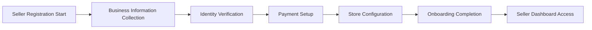

# Seller Management Requirements Specification

## Executive Summary

This document defines the comprehensive seller management capabilities required for the shopping mall e-commerce platform. The seller management system enables product sellers to register, onboard, manage their product catalog, control inventory, fulfill orders, and analyze sales performance through a dedicated seller dashboard.

## Seller Registration and Onboarding

### Seller Account Creation
WHEN a potential seller initiates registration, THE system SHALL provide a multi-step onboarding process.

**Registration Flow Requirements:**

**Business Information Requirements:**
- THE seller SHALL provide company name, business registration number, and contact information
- WHEN collecting business information, THE system SHALL validate business registration numbers against official databases
- THE seller SHALL provide tax identification numbers for financial reporting
- WHERE required by jurisdiction, THE system SHALL collect VAT registration numbers

**Identity Verification Process:**
WHEN a seller completes business information submission, THE system SHALL initiate identity verification.
- THE system SHALL require government-issued ID upload for primary account holders
- WHERE business entities are involved, THE system SHALL verify authorized representatives
- THE verification process SHALL complete within 48 hours of document submission
- IF verification fails, THEN THE system SHALL provide specific rejection reasons and allow resubmission

**Payment Setup Requirements:**
WHILE setting up payment accounts, THE system SHALL:
- Collect bank account information for payout processing
- Verify bank account ownership through micro-deposit validation
- Configure payout schedules (weekly, bi-weekly, or monthly)
- Set minimum payout thresholds to prevent small transactions

### Onboarding Status Tracking
THE system SHALL maintain comprehensive onboarding status tracking:
- WHEN a seller begins registration, THE system SHALL create an onboarding status record
- THE system SHALL track completion percentage for each onboarding step
- WHERE steps require external verification, THE system SHALL provide estimated completion times
- THE seller SHALL receive email notifications for required actions and completion milestones

## Product Listing Management

### Product Creation Workflow
WHEN a seller creates a new product listing, THE system SHALL provide a structured creation process.

**Product Information Requirements:**
- THE seller SHALL provide product title, description, and category
- THE system SHALL require at least one product image
- WHERE applicable, THE seller SHALL specify product variants (size, color, etc.)
- THE seller SHALL set pricing information including base price, sale price, and currency

**Category and Attribute Management:**
- THE system SHALL provide predefined product categories with specific attribute requirements
- WHEN selecting a category, THE system SHALL display required and optional attributes
- THE seller SHALL be able to create custom attributes for unique product characteristics
- WHERE attributes affect search and filtering, THE system SHALL enforce attribute completion

**Media Management:**
- THE seller SHALL be able to upload multiple product images
- THE system SHALL support image formats: JPEG, PNG, WebP with maximum file size of 10MB
- WHERE video content is supported, THE system SHALL allow MP4 uploads up to 100MB
- THE seller SHALL be able to set primary images and reorder gallery images

### Product Approval and Publishing
WHEN a seller submits a product for publication, THE system SHALL implement approval workflows.

**Approval Process:**
- THE system SHALL automatically check products for policy compliance
- WHERE manual review is required, THE product SHALL enter moderation queue
- THE approval process SHALL complete within 24 hours for standard products
- IF a product is rejected, THEN THE system SHALL provide specific rejection reasons

**Product Status Management:**
- THE seller SHALL be able to set products as draft, published, or archived
- WHEN inventory reaches zero, THE system SHALL automatically mark products as out of stock
- THE seller SHALL receive notifications for products requiring attention
- WHERE products violate policies, THE system SHALL suspend listings pending review

## Inventory Control Systems

### Stock Level Management
THE system SHALL provide comprehensive inventory tracking and management.

**Inventory Tracking Requirements:**
- THE system SHALL maintain real-time stock levels for each product variant
- WHEN an order is placed, THE system SHALL immediately deduct inventory
- THE seller SHALL be able to set minimum stock thresholds for alerts
- WHERE products have multiple variants, THE system SHALL track inventory per variant

**Low Stock Alerts:**
- WHEN inventory falls below minimum threshold, THE system SHALL send alert notifications
- THE seller SHALL be able to configure alert thresholds by product category
- WHERE products are frequently out of stock, THE system SHALL suggest inventory increases
- THE alerts SHALL include recommended reorder quantities based on sales history

**Bulk Inventory Operations:**
- THE seller SHALL be able to update inventory levels in bulk via CSV import
- THE system SHALL provide inventory update templates with validation rules
- WHEN performing bulk updates, THE system SHALL preview changes before application
- WHERE inventory adjustments affect active orders, THE system SHALL prevent conflicting changes

### Inventory Synchronization
THE system SHALL support inventory synchronization with external systems.

**API Integration Requirements:**
- WHERE sellers use external inventory management systems, THE platform SHALL provide API integration
- THE inventory synchronization SHALL occur in near real-time with configurable intervals
- THE system SHALL handle synchronization conflicts with clear resolution rules
- WHEN synchronization fails, THE system SHALL retry with exponential backoff

## Order Fulfillment Workflows

### Order Processing
WHEN a customer places an order, THE system SHALL notify the seller and provide fulfillment tools.

**Order Notification Requirements:**
- THE seller SHALL receive immediate notification of new orders
- THE system SHALL provide order details including shipping address and customer contact
- WHERE orders contain multiple items, THE system SHALL group by shipping requirements
- THE seller SHALL be able to filter orders by status, date, and fulfillment requirements

**Order Status Management:**
- THE seller SHALL be able to update order status through the fulfillment process
- Status transitions SHALL include: received, processing, shipped, delivered, cancelled
- WHEN updating status, THE system SHALL require appropriate supporting information
- WHERE shipping carriers provide tracking, THE system SHALL automatically update status

### Shipping Integration
THE system SHALL provide integrated shipping solutions for sellers.

**Shipping Label Generation:**
- THE seller SHALL be able to generate shipping labels directly from the platform
- THE system SHALL integrate with major shipping carriers (USPS, FedEx, UPS, DHL)
- WHEN generating labels, THE system SHALL calculate shipping costs automatically
- THE seller SHALL be able to compare shipping options by cost and delivery time

**Shipping Configuration:**
- THE seller SHALL be able to configure shipping methods and rates
- Shipping options SHALL include: free shipping, flat rate, weight-based, and real-time carrier rates
- WHERE products have specific shipping requirements, THE system SHALL enforce compatibility
- THE seller SHALL be able to set shipping restrictions by location and product type

### Return and Refund Management
THE system SHALL provide comprehensive return and refund processing capabilities.

**Return Authorization:**
- WHEN a customer requests a return, THE system SHALL route the request to the seller
- THE seller SHALL be able to approve or deny return requests with specific reasons
- WHERE returns are approved, THE system SHALL generate return shipping labels
- THE return process SHALL include condition assessment and refund calculation

**Refund Processing:**
- THE seller SHALL be able to process partial or full refunds
- WHEN issuing refunds, THE system SHALL update order status and inventory
- Refund amounts SHALL be calculated based on return condition and original transaction
- THE system SHALL provide refund history and reconciliation reports

## Sales Analytics and Reporting

### Performance Dashboards
THE system SHALL provide real-time sales analytics dashboards for sellers.

**Key Performance Indicators:**
- THE dashboard SHALL display daily, weekly, and monthly sales metrics
- Key metrics SHALL include: total sales, number of orders, average order value, conversion rate
- THE system SHALL provide comparative analysis against previous periods
- WHERE applicable, THE dashboard SHALL highlight trends and anomalies

**Sales Performance Reporting:**
- THE seller SHALL be able to generate custom sales reports by date range
- Report parameters SHALL include: product category, customer demographics, geographic location
- THE system SHALL export reports in CSV, PDF, and Excel formats
- WHERE advanced analytics are required, THE system SHALL provide data visualization tools

### Customer Analytics
THE system SHALL provide insights into customer behavior and preferences.

**Customer Segmentation:**
- THE system SHALL segment customers by purchase history, frequency, and value
- THE seller SHALL be able to identify top customers and their purchasing patterns
- WHERE customer data is available, THE system SHALL provide demographic insights
- THE analytics SHALL help sellers optimize product offerings and marketing strategies

**Product Performance Analysis:**
- THE system SHALL track individual product performance metrics
- Key metrics SHALL include: views, add-to-cart rate, conversion rate, revenue
- THE seller SHALL be able to identify best-selling products and underperformers
- WHERE products have variants, THE system SHALL provide variant-level performance data

## Seller Communication and Support

### Customer Communication
THE system SHALL facilitate professional communication between sellers and customers.

**Order Communication:**
- THE seller SHALL be able to send order status updates to customers
- Communication templates SHALL be provided for common scenarios
- WHERE delays occur, THE system SHALL suggest proactive communication strategies
- THE communication history SHALL be preserved for customer service purposes

**Customer Service Tools:**
- THE system SHALL provide ticketing system for customer inquiries
- THE seller SHALL be able to categorize and prioritize customer messages
- Response time metrics SHALL be tracked and displayed to sellers
- WHERE escalations are required, THE system SHALL provide escalation pathways

### Platform Support and Resources
THE system SHALL provide comprehensive support resources for sellers.

**Knowledge Base and Documentation:**
- THE platform SHALL maintain up-to-date seller documentation
- Video tutorials and best practice guides SHALL be readily accessible
- WHERE new features are released, THE system SHALL provide feature announcements
- THE seller SHALL have access to community forums for peer support

**Technical Support:**
- THE seller SHALL have access to technical support for platform issues
- Support channels SHALL include: email, chat, and scheduled consultations
- Response time SLAs SHALL be clearly communicated and measured
- WHERE critical issues affect business operations, THE system SHALL provide priority support

## Performance and Scalability Requirements

### System Performance
THE seller management system SHALL meet specific performance standards.

**Response Time Requirements:**
- Dashboard loading SHALL complete within 2 seconds under normal load
- Product search and filtering operations SHALL return results within 1 second
- Bulk operations SHALL provide progress indicators for long-running tasks
- WHERE real-time data is displayed, THE system SHALL update within 5 seconds

**Availability Requirements:**
- THE seller dashboard SHALL maintain 99.9% uptime during business hours
- Scheduled maintenance SHALL be communicated 48 hours in advance
- WHERE outages occur, THE system SHALL provide status updates and estimated resolution times
- Critical functions SHALL have redundant systems to ensure continuous operation

### Data Management and Security
THE system SHALL implement robust data management and security measures.

**Data Protection:**
- Seller business information SHALL be encrypted at rest and in transit
- Access to seller data SHALL be restricted based on role-based permissions
- WHERE financial data is stored, THE system SHALL comply with PCI DSS requirements
- Data backup and recovery procedures SHALL be tested regularly

**Audit and Compliance:**
- THE system SHALL maintain comprehensive audit logs of seller actions
- Financial transactions SHALL be traceable for accounting and tax purposes
- WHERE regulatory requirements apply, THE system SHALL generate compliance reports
- The audit trail SHALL be tamper-evident and preserved for legal requirements

## Integration with Platform Ecosystem

### Shopping Cart Integration
THE seller management system SHALL integrate seamlessly with shopping cart functionality.

**Inventory Synchronization:**
- WHEN inventory levels change, THE shopping cart SHALL reflect updated availability
- THE system SHALL prevent overselling through real-time inventory checks
- WHERE products become unavailable during checkout, THE system SHALL provide clear messaging
- Inventory updates SHALL propagate to all platform components within 30 seconds

### Order Processing Integration
THE seller system SHALL work cohesively with order processing workflows.

**Order Flow Coordination:**
- WHEN orders are placed, THE system SHALL immediately route to appropriate sellers
- Order status updates from sellers SHALL synchronize with customer-facing order tracking
- WHERE multiple sellers are involved in an order, THE system SHALL coordinate fulfillment
- Payment settlement SHALL occur according to configured payout schedules

## Future Enhancement Considerations

### Advanced Analytics
THE platform SHALL provide roadmap for advanced seller analytics features.

**Predictive Analytics:**
- Future versions SHALL include demand forecasting based on historical data
- THE system SHALL provide inventory optimization recommendations
- WHERE market trends are detectable, THE system SHALL alert sellers to opportunities
- Sales prediction algorithms SHALL help sellers plan promotions and inventory

### Automation Features
THE platform SHALL evolve toward increased automation for seller operations.

**Workflow Automation:**
- Future enhancements SHALL include automated inventory replenishment
- THE system SHALL provide AI-assisted product description generation
- WHERE patterns are detected, THE system SHALL suggest pricing optimizations
- Automated customer service responses SHALL handle common inquiries

> *Developer Note: This document defines **business requirements only**. All technical implementations (architecture, APIs, database design, etc.) are at the discretion of the development team.*