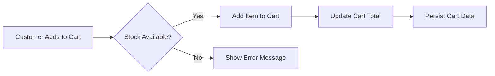
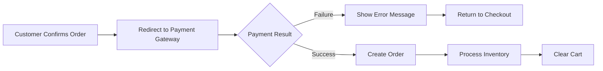
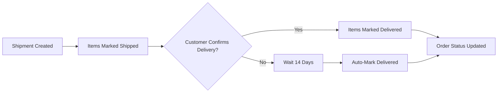

# Order Management System

## Introduction

This document specifies the complete order management system for the e-commerce shopping mall platform, covering the entire lifecycle from shopping cart creation through order placement, payment processing, shipment management, and delivery confirmation.

## Shopping Cart System

### Cart Creation and Management

**Cart Structure Requirements:**
- THE shopping cart SHALL store items as individual line items
- Each cart item SHALL contain: product ID, variant ID, quantity, price at time of addition
- THE cart SHALL automatically combine quantities when the same variant is added multiple times
- THE cart SHALL validate stock availability before allowing additions

**Cart Operations:**
- WHEN a customer adds a product variant to cart, THE system SHALL validate stock availability
- IF stock is insufficient for the requested quantity, THEN THE system SHALL display an error message
- WHEN a customer updates cart item quantity, THE system SHALL revalidate stock availability
- WHEN a customer removes an item from cart, THE system SHALL immediately update the cart total
- THE cart SHALL persist between browser sessions for logged-in customers

**Cart Validation Rules:**
- WHERE a variant becomes out of stock, THE cart SHALL mark that item as unavailable
- WHERE a variant is deleted by the seller, THE cart SHALL remove that item automatically
- WHILE items are in cart, THE system SHALL periodically validate stock availability

### Cart Display Requirements

**Cart Interface Specifications:**
- THE cart SHALL display each item with: product name, variant options, unit price, quantity, and line total
- THE cart SHALL show a running subtotal of all items
- THE cart SHALL highlight items with insufficient stock
- THE cart SHALL allow quantity adjustments with immediate recalculation
- THE cart SHALL provide one-click removal for individual items

## Checkout Process

### Pre-Checkout Validation

**Checkout Eligibility Requirements:**
- WHEN a customer initiates checkout, THE system SHALL validate cart contents
- IF any cart item is unavailable (out of stock or deleted), THEN THE system SHALL prevent checkout
- THE customer SHALL be required to have at least one valid shipping address
- THE customer SHALL be logged in with a verified account

**Address Selection Process:**
- WHERE multiple addresses exist, THE customer SHALL select one shipping address
- THE system SHALL highlight the default address but allow selection of any valid address
- THE selected address SHALL be locked for the duration of the order

### Order Review and Confirmation

**Order Summary Requirements:**
- THE checkout page SHALL display:
  - Complete list of items with prices and quantities
  - Selected shipping address
  - Subtotal calculation
  - Shipping costs (if applicable)
  - Tax calculations (if applicable)
  - Final total amount
- THE customer SHALL have the opportunity to review all information before payment
- THE customer SHALL explicitly confirm the order before payment processing

## Payment Integration

### Payment Processing Flow

**Payment Initiation:**
- WHEN the customer confirms the order, THE system SHALL initiate payment processing
- THE system SHALL redirect to the external payment gateway
- THE payment gateway SHALL handle all sensitive payment information

**Payment Outcome Handling:**
- IF payment succeeds, THEN THE system SHALL create the order and process inventory
- IF payment fails, THEN THE system SHALL return the customer to the checkout page with an error message
- WHERE payment fails, THE cart SHALL remain unchanged
- THE customer SHALL be allowed to retry payment with the same cart contents

## Order Creation

### Order Structure

**Order Composition Requirements:**
- AN order SHALL consist of one or more order items
- EACH order item SHALL represent a purchased product variant with quantity
- ORDER items from different sellers SHALL be grouped within the same order
- THE order SHALL preserve the complete state at time of purchase through snapshots

**Snapshot Preservation:**
- WHEN an order is created, THE system SHALL create snapshots of:
  - Product information (name, description, images)
  - Variant information (options, price)
  - Seller profile (shop name, logo)
  - These snapshots SHALL be immutable and preserved indefinitely

**Inventory Processing:**
- WHEN payment succeeds, THE system SHALL decrease stock quantities for each purchased variant
- EACH inventory reduction SHALL create an inventory history record
- THE cart SHALL be cleared of purchased items

### Order Numbering and Identification

**Order Identification Requirements:**
- EACH order SHALL receive a unique order number
- THE order number SHALL be sequential and human-readable
- CUSTOMERS SHALL be able to reference orders by this number
- SELLERS SHALL see order numbers for all items they need to fulfill

## Order Status Tracking

### Order Item Status Lifecycle

**Status Transitions:**
- WHEN an order is created, ALL items SHALL have status "paid"
- WHEN a seller ships items, THE shipped items SHALL transition to "shipped"
- WHEN delivery is confirmed, THE delivered items SHALL transition to "delivered"
- WHEN cancellation is approved, THE cancelled items SHALL transition to "cancelled"
- WHEN refund is approved, THE refunded items SHALL transition to "refunded"

**Status Validation Rules:**
- ITEMS SHALL only transition forward in the status lifecycle (no reversals)
- EACH status transition SHALL create an audit trail
- CUSTOMERS SHALL be notified of significant status changes

### Overall Order Status Calculation

**Order Status Derivation:**
- IF all items are paid → order status SHALL be "paid"
- IF any item is shipped (and none delivered) → order status SHALL be "shipped"
- IF all items are delivered → order status SHALL be "delivered"
- IF all items are cancelled → order status SHALL be "cancelled"
- IF all items are refunded → order status SHALL be "refunded"
- IF items have mixed statuses → order status SHALL be "partially completed"

## Shipment Management

### Shipment Creation

**Seller Shipping Interface:**
- SELLERS SHALL see a list of order items requiring shipment
- SELLERS SHALL be able to select multiple items from the same order for a single shipment
- ITEMS from different sellers SHALL always ship separately
- WHEN creating a shipment, SELLERS SHALL provide:
  - Carrier name
  - Tracking number
  - Optional shipping notes

**Shipment Processing:**
- WHEN a shipment is created, ALL included items SHALL transition to "shipped" status
- THE shipment SHALL be associated with the tracking information
- CUSTOMERS SHALL receive notification of shipment creation

### Tracking Information Management

**Tracking Display Requirements:**
- CUSTOMERS SHALL see tracking information for each shipment
- THE tracking display SHALL show carrier, tracking number, and shipment date
- WHERE available, THE system SHALL integrate with carrier APIs for real-time tracking
- CUSTOMERS SHALL be able to view tracking status for each shipment

## Delivery Confirmation

### Customer Delivery Confirmation

**Delivery Confirmation Process:**
- CUSTOMERS SHALL confirm delivery per shipment, not per individual item
- WHEN a customer confirms delivery, ALL items in that shipment SHALL transition to "delivered"
- THE confirmation SHALL include a timestamp and optional feedback

**Automatic Delivery Confirmation:**
- WHERE customers do not confirm delivery, THE system SHALL automatically mark items as "delivered" after 14 days from shipping date
- THIS automatic confirmation SHALL create an audit record
- CUSTOMERS SHALL be notified when automatic confirmation occurs

## Integration Points

### Authentication System Integration

**User Verification Requirements:**
- ALL order operations SHALL require authenticated customer sessions
- THE system SHALL validate customer permissions before order creation
- ORDER history SHALL only be accessible to the ordering customer

### Product Catalog Integration

**Product Validation:**
- DURING checkout, THE system SHALL validate that products and variants still exist
- PRICE validation SHALL use snapshot-preserved prices, not current prices
- STOCK validation SHALL occur at multiple points in the process

### Cancellation and Refund System Integration

**Order Modification Handling:**
- WHEN cancellations occur, THE system SHALL restore stock quantities
- REFUND processing SHALL integrate with the payment gateway for reversal
- STATUS transitions SHALL properly reflect cancellation/refund actions

## Error Handling and Edge Cases

### Payment Failures

**Payment Recovery Process:**
- WHEN payment fails, THE cart SHALL remain intact
- CUSTOMERS SHALL receive clear error messages explaining the failure
- THE system SHALL allow unlimited retry attempts with the same cart
- AFTER multiple failures, THE system MAY suggest alternative payment methods

### Inventory Conflicts

**Stock Reservation System:**
- DURING the checkout process, THE system SHALL temporarily reserve stock
- THIS reservation SHALL prevent other customers from purchasing the same items
- RESERVATIONS SHALL expire after a configurable timeout (e.g., 15 minutes)
- EXPIRED reservations SHALL return stock to available inventory

### System Failures

**Order Integrity Protection:**
- THE order creation process SHALL be atomic and transactional
- IF any part of order creation fails, THE entire transaction SHALL roll back
- CUSTOMERS SHALL not be charged for orders that fail to create properly
- THE system SHALL maintain audit trails for all failed order attempts

## Performance Requirements

**Response Time Expectations:**
- CART operations SHALL respond within 2 seconds
- CHECKOUT page loading SHALL complete within 3 seconds
- ORDER creation SHALL process within 5 seconds
- ORDER history pagination SHALL load within 2 seconds

**Scalability Requirements:**
- THE system SHALL handle peak shopping periods (e.g., holiday sales)
- ORDER processing SHALL scale horizontally to accommodate traffic spikes
- CART data SHALL be efficiently stored and retrieved

## Security Requirements

**Data Protection:**
- ORDER data SHALL only be accessible to authorized parties
- CUSTOMERS SHALL only see their own orders
- SELLERS SHALL only see orders containing their products
- ADMINISTRATORS SHALL have oversight access to all orders

**Payment Security:**
- ALL payment processing SHALL occur through secure, PCI-compliant gateways
- THE platform SHALL never store sensitive payment information
- TRANSACTION data SHALL be encrypted in transit and at rest

## Business Rules Summary

### Core Order Management Principles

1. **Data Integrity**: All order data is preserved through snapshots at time of purchase
2. **Inventory Accuracy**: Stock quantities are accurately tracked and updated in real-time
3. **Customer Transparency**: Customers receive clear status updates throughout the order lifecycle
4. **Seller Flexibility**: Sellers have control over how they package and ship items
5. **System Reliability**: The order process is robust and handles failures gracefully

### Key Constraints

- Orders cannot be modified after creation (only through cancellation/refund)
- Shipping addresses are locked at time of order placement
- Prices are fixed at time of purchase through snapshots
- Stock is reserved during checkout to prevent overselling
- All status transitions create immutable audit records

This document provides the complete business requirements for the order management system. Backend developers should use this specification to implement the shopping cart, checkout process, payment integration, order creation, status tracking, shipment management, and delivery confirmation features.

> *Developer Note: This document defines **business requirements only**. All technical implementations (architecture, APIs, database design, etc.) are at the discretion of the development team.*