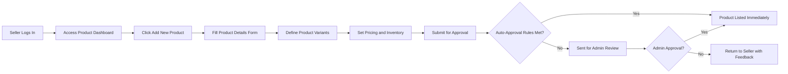
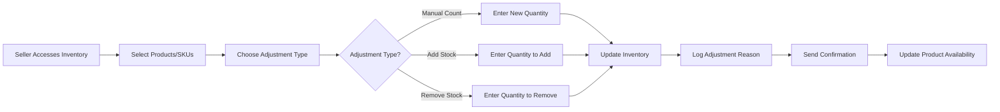
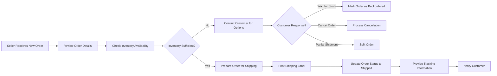

# Seller Management Requirements Specification

## Executive Summary

This document defines the complete seller management system for the e-commerce platform, outlining how sellers can register, manage their product catalog, handle inventory, fulfill orders, and analyze their business performance. The system supports multi-seller marketplace functionality where individual businesses can operate their storefronts within the platform.

## Seller Account Management

### Seller Registration Process

**Seller Account Creation Requirements:**
WHEN a business applies to become a seller, THE system SHALL collect company information including business name, tax ID, contact details, and business address
THE system SHALL verify seller eligibility through business registration validation
WHERE seller requires approval, THE system SHALL implement a manual review process by administrators
IF seller application is rejected, THEN THE system SHALL provide clear rejection reasons and appeal process

**Seller Authentication Requirements:**
THE seller SHALL authenticate using email and password credentials
THE system SHALL implement two-factor authentication for seller accounts
WHILE seller is logged in, THE system SHALL maintain session security with automatic logout after 30 minutes of inactivity

**Seller Account Status Management:**
THE system SHALL support seller account statuses: "pending approval", "active", "suspended", "terminated"
WHEN seller account is suspended, THE system SHALL prevent new product listings while allowing order fulfillment
WHERE seller violates platform policies, THE system SHALL enable administrative account suspension

## Product Management Interface

### Product Listing Creation

**Product Creation Workflow:**

**Product Information Requirements:**
THE seller SHALL provide product title, description, category, brand, and specifications
THE system SHALL require product images with minimum resolution of 800x600 pixels
WHERE product has variants, THE seller SHALL define SKU-specific attributes (color, size, etc.)
THE seller SHALL set base price, sale price, and inventory quantity per SKU

**Product Variant Management:**
WHEN seller creates product variants, THE system SHALL generate unique SKU codes automatically
THE seller SHALL manage inventory levels independently for each product variant
WHERE variant combinations exist, THE system SHALL prevent duplicate variant creation
IF variant inventory reaches zero, THEN THE system SHALL automatically mark as out of stock

### Product Editing and Updates

**Product Modification Requirements:**
THE seller SHALL edit product details including description, images, and pricing
WHEN seller updates product price, THE system SHALL maintain price history for audit purposes
WHERE product has active orders, THE system SHALL prevent certain modifications that affect fulfillment
THE seller SHALL bulk update multiple products simultaneously

**Product Status Management:**
THE seller SHALL activate/deactivate products individually or in bulk
WHEN product is deactivated, THE system SHALL remove from search results but maintain order history
THE system SHALL automatically deactivate products with zero inventory for more than 30 days

## Inventory Control System

### Real-time Inventory Tracking

**Inventory Management Requirements:**
THE system SHALL track inventory quantities per SKU in real-time
WHEN order is placed, THE system SHALL immediately reserve inventory for that order
WHERE inventory levels fall below threshold, THE system SHALL alert seller to restock
THE seller SHALL set low inventory alerts at customizable quantity levels

**Inventory Adjustment Workflow:**

**Inventory Adjustment Requirements:**
THE seller SHALL manually adjust inventory counts with reason documentation
WHEN inventory is adjusted, THE system SHALL maintain audit trail with timestamps and reasons
WHERE bulk adjustments are needed, THE system SHALL support CSV import/export functionality
THE system SHALL prevent negative inventory through validation checks

### Inventory Synchronization

**Multi-channel Inventory Requirements:**
WHERE seller uses external inventory systems, THE system SHALL support API-based synchronization
THE system SHALL handle inventory conflicts with last-write-wins or manual resolution
WHEN inventory sync fails, THE system SHALL retry with exponential backoff and notify seller

## Order Fulfillment Workflows

### Order Processing

**Order Management Requirements:**
THE seller SHALL view all orders for their products in chronological order
WHEN new order is received, THE system SHALL notify seller through dashboard and email
THE seller SHALL filter orders by status: "pending", "processing", "shipped", "delivered", "cancelled"
WHERE orders require special handling, THE system SHALL allow seller notes and flags

**Order Fulfillment Process:**

**Shipping and Tracking Requirements:**
THE seller SHALL generate shipping labels through integrated carrier services
WHEN order is shipped, THE seller SHALL update status and provide tracking number
THE system SHALL automatically notify customer when order status changes
WHERE multiple items in order, THE seller SHALL ship partial orders with status tracking

### Cancellation and Refund Processing

**Order Cancellation Requirements:**
THE seller SHALL cancel orders before shipment with reason documentation
WHEN seller cancels order, THE system SHALL automatically process refund through payment gateway
THE seller SHALL view cancellation request history and reasons
WHERE cancellation is initiated by customer, THE system SHALL require seller approval

**Refund Management Requirements:**
THE seller SHALL process refunds for returned items with amount validation
WHEN refund is processed, THE system SHALL update order status and notify customer
THE seller SHALL track refund reason codes for analytics and dispute resolution

## Sales Analytics and Reporting

### Performance Metrics

**Sales Analytics Requirements:**
THE seller SHALL view daily, weekly, monthly, and yearly sales reports
THE system SHALL display key metrics: total sales, units sold, average order value, conversion rate
WHEN analyzing performance, THE system SHALL provide comparative data (previous period, year-over-year)
THE seller SHALL filter reports by product category, specific products, or date ranges

**Product Performance Reporting:**
THE seller SHALL view best-selling products by revenue and quantity
THE system SHALL identify slow-moving inventory with aging analysis
WHERE products have seasonal trends, THE system SHALL provide seasonal performance insights
THE seller SHALL export sales data to CSV for external analysis

### Customer Insights

**Customer Analytics Requirements:**
THE seller SHALL view customer demographics and purchase patterns
THE system SHALL identify repeat customers and customer lifetime value
WHEN analyzing customer behavior, THE system SHALL provide shopping cart abandonment rates
THE seller SHALL track customer reviews and ratings impact on sales

## Seller Dashboard Specifications

### Dashboard Overview

**Dashboard Layout Requirements:**
THE seller dashboard SHALL display overview metrics: today's orders, pending orders, low stock alerts
WHEN seller logs in, THE system SHALL show recent activity and important notifications
THE dashboard SHALL provide quick access to: new orders, inventory management, product listing
WHERE performance issues exist, THE system SHALL highlight areas needing attention

**Navigation and Accessibility:**
THE seller SHALL navigate between different sections: orders, products, analytics, settings
THE system SHALL maintain consistent navigation structure across all seller pages
WHEN using mobile devices, THE dashboard SHALL provide responsive design for optimal experience

### Real-time Notifications

**Notification System Requirements:**
THE system SHALL notify seller of: new orders, low inventory, customer messages, system alerts
WHEN important events occur, THE system SHALL use multiple notification channels (dashboard, email, SMS)
THE seller SHALL customize notification preferences by event type and urgency
WHERE notifications require action, THE system SHALL provide direct links to relevant pages

## Business Profile Management

### Storefront Configuration

**Business Profile Requirements:**
THE seller SHALL configure storefront appearance: logo, banner, color scheme, store description
WHEN setting up store, THE seller SHALL define shipping policies, return policies, and contact information
THE system SHALL validate business information for completeness and accuracy
WHERE legal requirements exist, THE system SHALL ensure compliance through profile validation

**Business Hours and Availability:**
THE seller SHALL set business hours for customer service and order processing
WHEN outside business hours, THE system SHALL display expected response times
THE seller SHALL configure holiday schedules and special availability periods

### Payment and Payout Management

**Financial Management Requirements:**
THE seller SHALL configure payout preferences: bank account, payment schedule, minimum payout amount
THE system SHALL provide detailed payout reports with transaction breakdown
WHEN payments are processed, THE system SHALL show pending and completed payouts
THE seller SHALL view sales commission and fee calculations for each transaction

## Integration Requirements

### External System Integration

**Shipping Carrier Integration:**
THE system SHALL integrate with major shipping carriers: UPS, FedEx, DHL, USPS
WHEN generating shipping labels, THE system SHALL calculate shipping costs automatically
THE seller SHALL compare carrier rates and service levels for optimal shipping selection

**Accounting System Integration:**
WHERE seller uses accounting software, THE system SHALL support export of sales data
THE system SHALL provide standardized export formats compatible with major accounting systems

## Error Handling and Edge Cases

### System Failure Scenarios

**Error Handling Requirements:**
WHEN inventory update fails, THE system SHALL retry operation and notify seller of issue
IF order processing encounters errors, THEN THE system SHALL preserve order data and provide recovery options
WHERE external API integrations fail, THE system SHALL provide fallback mechanisms and manual override

**Data Integrity Requirements:**
THE system SHALL prevent data corruption through transaction rollback capabilities
WHEN concurrent updates occur, THE system SHALL implement optimistic locking to prevent conflicts
THE system SHALL maintain audit trails for all critical seller operations

### Performance and Scalability

**System Performance Requirements:**
THE seller dashboard SHALL load within 3 seconds under normal load conditions
WHEN processing bulk operations, THE system SHALL provide progress indicators and estimated completion times
THE system SHALL support 100+ concurrent sellers with responsive performance
WHERE large product catalogs exist, THE system SHALL implement efficient pagination and search

## Business Rules and Validation

### Product Listing Rules

**Content Validation Requirements:**
THE system SHALL validate product titles for length (minimum 10 characters, maximum 200 characters)
WHEN seller submits product, THE system SHALL check for duplicate products using fuzzy matching
WHERE prohibited categories exist, THE system SHALL prevent listing of restricted items
THE system SHALL validate product images for appropriate content and quality

### Pricing and Commission Rules

**Pricing Validation Requirements:**
THE seller SHALL set prices within platform-defined minimum and maximum ranges
WHEN setting sale prices, THE system SHALL require sale end dates and validate against regular prices
THE system SHALL calculate commission based on product category and sale amount
WHERE tiered commission structures exist, THE system SHALL apply appropriate commission rates

## Success Metrics and KPIs

### Seller Performance Indicators

**Key Performance Indicators:**
Order fulfillment rate (target: 99%+)
Average order processing time (target: <24 hours)
Customer satisfaction rating (target: 4.5/5 stars)
Inventory turnover rate (target: optimized per product category)
Sales growth rate (month-over-month comparison)

### Platform Health Metrics

**System Performance Indicators:**
Seller onboarding completion rate
Average time from registration to first sale
Seller retention rate after 6 months
Platform commission revenue per seller
Seller support ticket resolution time

This document provides comprehensive business requirements for the seller management system. All technical implementation decisions, including database design, API specifications, and architecture choices, are at the discretion of the development team based on these business requirements.

> *Developer Note: This document defines **business requirements only**. All technical implementations (architecture, APIs, database design, etc.) are at the discretion of the development team.*