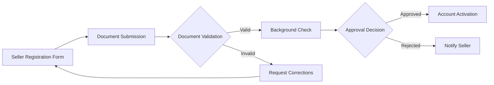
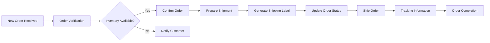

# Seller Management System Requirements Specification

## Document Overview
This document defines the complete seller management system for the e-commerce shopping mall platform. It specifies requirements for seller account registration, product management, inventory control, order fulfillment, and seller analytics.

## 1. Seller Management Overview

The seller management system enables businesses and individuals to sell products on the platform. Sellers have specialized tools for managing their product catalog, inventory, orders, and customer interactions.

### Business Context
- **Platform Role**: Sellers are independent merchants who use the platform to reach customers
- **Revenue Model**: Platform earns commission on sales, sellers earn revenue from product sales
- **Value Proposition**: Sellers gain access to customer base, payment processing, and platform infrastructure

## 2. Seller Account Registration

### Seller Registration Process
WHEN a user applies to become a seller, THE system SHALL collect the following information:
- Business name and legal entity information
- Contact person details and verification documents
- Bank account information for payment processing
- Tax identification numbers and compliance documents
- Store description and branding information

### Account Verification Requirements
WHILE processing seller registration, THE system SHALL verify:
- Business registration authenticity
- Bank account ownership verification
- Tax compliance status
- Identity verification of contact person

### Registration Approval Workflow

## 3. Seller Dashboard

### Dashboard Overview
THE seller dashboard SHALL provide a centralized interface for managing all seller activities including:
- Product catalog management
- Inventory tracking and updates
- Order processing and fulfillment
- Sales analytics and reporting
- Customer communication management

### Dashboard Navigation Requirements
WHEN a seller logs into the dashboard, THE system SHALL display:
- Today's sales summary and pending orders
- Low stock alerts and inventory warnings
- Recent customer inquiries and messages
- Performance metrics and key indicators

## 4. Product Management System

### Product Creation Workflow
WHEN a seller creates a new product, THE system SHALL support:
- Product title, description, and specifications
- Multiple product images and media upload
- Category assignment and tagging
- Product variant creation with SKU management
- Pricing configuration with discount options
- Shipping weight and dimensions specification

### Product Variant Management
WHERE products have variants, THE system SHALL support:
- Color, size, and option-based variants
- Individual SKU management per variant
- Variant-specific pricing and inventory
- Bulk variant creation and editing
- Variant image association

### Product Listing Requirements
THE system SHALL enforce product listing standards including:
- Minimum product image quality requirements
- Required product information fields
- Category-specific attribute requirements
- Content moderation and approval process

## 5. Inventory Management

### Real-time Inventory Tracking
THE system SHALL provide real-time inventory tracking with:
- SKU-level stock quantity monitoring
- Automated low stock alerts and notifications
- Inventory history and movement tracking
- Stock reservation during checkout process

### Inventory Update Requirements
WHEN inventory levels change, THE system SHALL:
- Update available quantities immediately
- Prevent overselling through stock reservations
- Sync inventory across all sales channels
- Provide inventory adjustment history

### Bulk Inventory Operations
WHERE sellers need to manage multiple products, THE system SHALL support:
- Bulk inventory updates via CSV import/export
- Inventory synchronization with external systems
- Batch stock adjustments and corrections
- Inventory forecasting and demand planning

## 6. Order Fulfillment Process

### Order Processing Workflow

### Order Status Management
WHEN processing orders, THE system SHALL provide status tracking:
- Order received and confirmed
- Payment processed and verified
- Inventory allocated and reserved
- Order prepared for shipping
- Shipment dispatched with tracking
- Delivery confirmed and completed

### Shipping Integration
WHERE sellers use shipping carriers, THE system SHALL support:
- Multiple carrier integration options
- Automated shipping label generation
- Real-time shipping rate calculations
- Tracking number assignment and updates

## 7. Sales Analytics & Reporting

### Sales Performance Dashboard
THE seller dashboard SHALL provide comprehensive analytics including:
- Daily, weekly, monthly sales trends
- Product performance and best sellers
- Customer acquisition and retention metrics
- Revenue and profit calculations
- Conversion rate analysis

### Reporting Capabilities
WHEN sellers need detailed reports, THE system SHALL generate:
- Sales reports by product, category, or time period
- Customer behavior and purchase patterns
- Inventory turnover and stock performance
- Financial reports for accounting purposes

### Performance Metrics
THE system SHALL track key performance indicators:
- Order fulfillment rate and speed
- Customer satisfaction scores
- Return and refund rates
- Inventory accuracy and stockout frequency

## 8. Seller Performance Management

### Quality Standards Enforcement
THE platform SHALL monitor seller performance against quality standards:
- Order fulfillment timeliness
- Customer service response times
- Product quality and accuracy
- Shipping and delivery reliability

### Performance Rating System
WHEN customers complete orders, THE system SHALL collect:
- Product quality ratings
- Seller communication ratings
- Shipping speed ratings
- Overall satisfaction scores

### Performance Improvement Tools
WHERE sellers need to improve performance, THE system SHALL provide:
- Performance benchmarking against peers
- Actionable improvement recommendations
- Training resources and best practices
- Performance trend analysis

## 9. Customer Communication

### Customer Inquiry Management
THE system SHALL provide communication channels for:
- Pre-sale product inquiries
- Order status questions
- Post-purchase support requests
- Return and refund communications

### Response Time Requirements
WHEN customers contact sellers, THE system SHALL enforce:
- Maximum response time standards
- Automated response acknowledgments
- Escalation procedures for urgent issues
- Communication history tracking

### Automated Notifications
THE system SHALL send automated notifications for:
- Order status updates
- Shipping confirmations
- Delivery expectations
- Customer feedback requests

## 10. Business Rules & Validation

### Seller Account Requirements
THE platform SHALL enforce business rules including:
- Minimum sales volume maintenance
- Customer satisfaction threshold compliance
- Platform fee payment schedules
- Policy compliance and legal requirements

### Product Listing Validation
WHEN sellers list products, THE system SHALL validate:
- Product information completeness
- Image quality and appropriateness
- Pricing accuracy and competitiveness
- Category assignment correctness

### Order Processing Rules
THE system SHALL enforce order processing standards:
- Maximum order processing time limits
- Inventory accuracy requirements
- Shipping carrier selection options
- Customer communication protocols

## Implementation Considerations

### Scalability Requirements
THE seller management system SHALL support:
- Thousands of concurrent sellers
- Millions of product listings
- High-volume order processing
- Real-time inventory updates

### Security Requirements
THE system SHALL implement security measures for:
- Seller account protection
- Payment information security
- Customer data privacy
- Platform integrity maintenance

### Integration Requirements
THE seller management system SHALL integrate with:
- Payment processing systems
- Shipping carrier APIs
- Inventory management systems
- Customer relationship management

> *Developer Note: This document defines **business requirements only**. All technical implementations (architecture, APIs, database design, etc.) are at the discretion of the development team.*