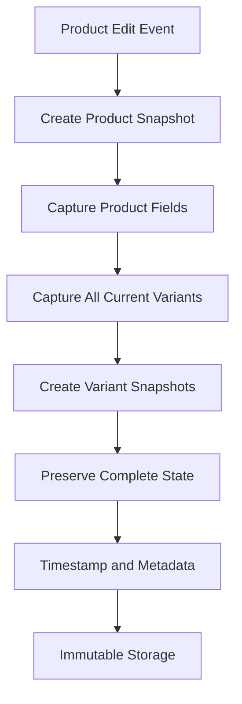
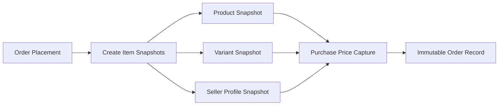
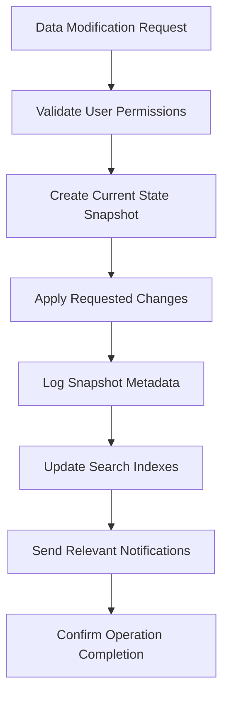

# E-Commerce Platform Snapshot System

## Snapshot Principle and Business Justification

THE e-commerce platform SHALL implement a comprehensive snapshot system to preserve data integrity across all critical business operations involving financial transactions. WHEN money is exchanged, THE system SHALL ensure all data modifications create immutable snapshots to maintain audit trails and support dispute resolution.

### Core Business Principles

- **Financial Transaction Integrity**: All monetary exchanges require complete audit trails
- **Customer Protection**: Product information at purchase time must be preserved for customer verification
- **Seller Accountability**: Seller profile changes tracked for business continuity
- **Legal Compliance**: Transaction records maintained for regulatory requirements
- **Dispute Resolution**: Historical data accuracy essential for fair resolution processes

## Snapshot Trigger Events

### WHEN a seller edits their profile, THE system SHALL create a profile snapshot documenting:
- Shop name modifications
- Shop description updates  
- Logo image changes
- Business contact information
- Modification timestamp and user identification

### WHEN a product is edited, THE system SHALL create a complete product snapshot capturing:

### WHEN a product variant is edited, THE system SHALL create a variant snapshot including:
- SKU code changes
- Option value modifications (color, size, etc.)
- Price adjustments (including base price overrides)
- Stock quantity updates
- Modification context and editor information

### WHEN an order is placed, THE system SHALL create immutable order item snapshots preserving:

### WHEN a review is edited, THE system SHALL create a review snapshot documenting:
- Rating modifications (1-5 stars)
- Text content changes
- Edit timestamps
- Reviewer identification

### WHEN cancellation or refund requests are processed, THE system SHALL create request snapshots:
- Initial request state with customer-provided reason
- Seller response and status changes
- Final resolution details
- Supporting evidence and communication records

## Snapshot Structure Specifications

### Product Snapshot Structure

WHEN a product snapshot is created, THE system SHALL capture:
- Product ID with version identifier
- Complete product field values:
  - Product name and description
  - Category assignment
  - Base price configuration
  - Image URLs and display order
- Associated variant configurations at the moment of snapshot
- Timestamp with millisecond precision
- User ID of the editor

### Variant Snapshot Structure

WHEN a variant snapshot is created, THE system SHALL include:
- Variant ID and parent product reference
- Complete variant specification:
  - SKU code (unique identifier)
  - All option values and combinations
  - Individual pricing information
  - Current stock quantity
- Change context and modification reason
- Editor identification and IP address

### Order Item Snapshot Structure

WHEN an order is successfully placed, THE system SHALL create immutable snapshots for each purchased item documenting:
- Product information exactly as presented to the customer
- Variant details including options and purchase price
- Seller profile information (shop name, description, logo)
- Order context including quantity and total price
- Purchase timestamp and shipping address

### Profile Snapshot Structure

WHEN a seller profile is modified, THE system SHALL preserve:
- Complete shop profile before and after changes
- Business information including contact details
- Logo and branding elements
- Modification history with timestamps

## Data Preservation and Account Management

### Customer Account Deletion

WHEN a customer deletes their account, THE system SHALL preserve:
- All order history and shipping records
- Payment transaction logs
- Order snapshots for legal and accounting compliance
- Reviews displayed as "deleted user"
- Customer profile information anonymized

### Seller Account Deletion

WHEN a seller deletes their account, THE system SHALL implement:
- **Pre-deletion validation**: Seller must have no pending orders or requests
- **Data preservation**: Order history and snapshots maintained
- **Product cleanup**: Active listings removed from search and categories
- **Business continuity**: Shop name preserved in past order snapshots

### Legal Compliance Requirements

THE system SHALL retain all financial transaction snapshots for minimum 7 years to satisfy:
- Tax reporting and auditing requirements
- Consumer protection legislation
- Financial accountability standards
- Legal dispute resolution frameworks

## Dispute Resolution Mechanisms

### Evidence-Based Dispute Handling

WHEN disputes arise, THE system SHALL provide comprehensive snapshot access:
- Product and seller information exactly as presented at purchase
- Order specifications and pricing confirmation
- Shipping and delivery verification records
- Communication and request processing history

### Administrative Oversight Capabilities

WHERE administrators intervene in disputes, THE system SHALL provide:
- Complete modification history for any entity
- Timeline reconstruction of all transactions
- User interaction and communication logs
- Audit trails for all financial operations

### Customer Protection Verification

WHEN customers need transaction verification, THE system SHALL display:
- Exact purchase-time product specifications
- Seller business information as displayed
- Order confirmation and payment details
- Delivery tracking and confirmation records

## Business Logic and Modification Constraints

### Product Deletion Restrictions

IF a product has pending order items (paid or shipped status), THEN THE system SHALL prevent deletion to maintain order integrity and customer protection.

IF a variant has active cancellation or refund requests, THEN THE system SHALL prevent deletion to preserve request context and resolution capability.

### Seller Account Deletion Conditions

WHEN a seller requests account deletion, THE system SHALL validate:
- No pending orders with paid or shipped status
- No active cancellation or refund requests
- All financial settlements complete
- Account in good standing with no violations

### Snapshot Access Permissions

THE system SHALL enforce strict access controls:
- **Sellers**: Can view snapshots of their own products and profiles
- **Customers**: Can access snapshots related to their orders and reviews
- **Administrators**: Have oversight access to all snapshots
- **Super Administrators**: Full management capabilities across all snapshot data

## Implementation and Performance Requirements

### Snapshot Creation Flow

### Performance and Scalability

WHILE maintaining comprehensive snapshots, THE system SHALL ensure:
- Snapshot creation completes within 500ms for user-facing operations
- Historical queries return results within 2 seconds
- Storage requirements optimized through archival strategies
- Backup processes minimize system impact

### Error Handling and Data Consistency

IF snapshot creation fails, THE system SHALL:
- Roll back the attempted modification transaction
- Log detailed error information for debugging
- Alert system administrators immediately
- Prevent modification until snapshot capability restored

WHILE processing concurrent modifications, THE system SHALL maintain:
- Sequential processing for same-entity modifications
- Consistent version numbering across related entities
- Atomic transaction processing for dependent operations
- Conflict resolution for simultaneous change attempts

## Compliance and Regulatory Framework

### Data Protection Compliance

THE snapshot system SHALL comply with data protection regulations through:
- Role-based access controls for snapshot data
- Data minimization principles in retention policies
- User data access rights implementation
- Legal deletion requirements accommodation

### Financial Record Keeping Standards

THE system SHALL maintain financial records that support:
- Accurate tax calculation and reporting
- Proper revenue recognition practices
- Efficient refund and chargeback processing
- Complete merchant account reconciliation

### Audit Trail Requirements

WHENEVER a snapshot is created, THE system SHALL record:
- User identification with authentication context
- Precise timestamp with transaction sequencing
- Client information including IP address
- Modification reason and business context
- Complete before-and-after value documentation

## Integration with Other Systems

### Inventory Management Integration

WHEN inventory changes occur, THE system SHALL create inventory history records (not snapshots) documenting:
- Quantity changes with positive/negative values
- Reason codes for stock adjustments
- Timestamps for audit trail
- User identification for accountability

### Order Processing Integration

WHEN orders are processed, THE system SHALL coordinate snapshots with:
- Payment gateway transaction records
- Shipping carrier tracking information
- Inventory quantity updates
- Customer notification systems

### Administrative Oversight Integration

WHEN administrators perform oversight actions, THE system SHALL integrate with:
- User management systems for permission verification
- Reporting tools for compliance monitoring
- Notification systems for alert dissemination
- Analytics platforms for system performance tracking

> *Note: This document specifies business requirements only. Technical implementation details including architecture, database design, API specifications, and performance optimizations are the responsibility of the development team.*