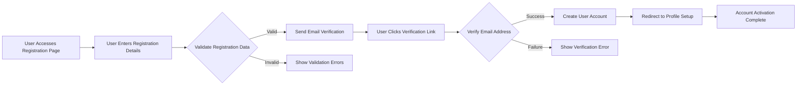

# User Account Management Requirements Document

## Executive Summary

This document defines the complete business requirements for user account management functionality in the shopping mall platform. The system provides comprehensive account management capabilities for customers, sellers, and administrators, enabling users to register, manage profiles, track orders, maintain wishlists, and manage addresses securely and efficiently.

## User Registration and Profile Creation

### Customer Registration Flow

### Registration Requirements

**WHEN a user initiates registration, THE system SHALL collect the following mandatory information:**
- Email address (must be unique and valid format)
- Password (minimum 8 characters with complexity requirements)
- Full name
- Agreement to terms of service and privacy policy

**WHEN a user submits registration, THE system SHALL validate all input data according to business rules:**
- Email format validation and uniqueness check
- Password strength validation (minimum 8 characters, including letters, numbers, and special characters)
- Terms of service acceptance verification

**WHEN registration validation passes, THE system SHALL send email verification:**
- Verification link valid for 24 hours
- Clear instructions for completing registration
- Option to resend verification email if needed

### Seller Registration Requirements

**WHEN a seller initiates registration, THE system SHALL collect additional business information:**
- Business name and legal entity information
- Tax identification number
- Business address and contact information
- Bank account details for payment processing
- Business license verification (if applicable)

**WHILE processing seller registration, THE system SHALL perform business verification:**
- Validate business information against external databases
- Require manual approval by administrators for business accounts
- Provide status tracking during approval process

## Account Settings Management

### Profile Information Management

**THE user SHALL be able to view and edit their profile information:**
- Personal details (name, contact information)
- Profile picture upload and management
- Communication preferences
- Notification settings

**WHEN a user updates profile information, THE system SHALL validate changes:**
- Email address changes require re-verification
- Critical information changes may require additional authentication
- Profile updates are logged for security purposes

### Security Settings

**THE user SHALL have access to comprehensive security controls:**
- Password change functionality with strength validation
- Two-factor authentication setup and management
- Session management (view active sessions, logout remotely)
- Login history and security alerts

**WHEN a security-related change is requested, THE system SHALL enforce additional verification:**
- Password changes require current password confirmation
- Critical security settings changes require re-authentication
- Suspicious activity triggers security alerts

### Communication Preferences

**THE user SHALL manage communication preferences:**
- Email notification types (order updates, promotions, newsletters)
- SMS notification preferences
- Push notification settings
- Frequency of marketing communications

## Order History and Tracking

### Order Display Requirements

**THE customer SHALL view their complete order history:**
- Chronological list of all orders
- Order status and tracking information
- Order details including items, quantities, and prices
- Shipping and delivery information

**WHEN viewing order history, THE system SHALL provide filtering and search capabilities:**
- Filter by date range (last 30 days, 90 days, custom range)
- Filter by order status (pending, processing, shipped, delivered)
- Search by order number or product name
- Sort by date, status, or total amount

### Order Details Requirements

**WHEN a customer views order details, THE system SHALL display comprehensive information:**
- Order summary (items, quantities, prices, totals)
- Shipping address and method
- Payment information
- Order timeline with status updates
- Tracking number and shipment progress

**THE customer SHALL be able to perform order-related actions:**
- Download invoice or receipt
- Track shipment in real-time
- Contact seller for order inquiries
- Request returns or exchanges (within policy limits)

### Order Status Notifications

**WHEN an order status changes, THE system SHALL notify the customer:**
- Order confirmation upon successful placement
- Shipping confirmation with tracking information
- Delivery confirmation and rating request
- Delay notifications with updated timelines

## Wishlist Management

### Wishlist Creation and Management

**THE customer SHALL be able to create and manage multiple wishlists:**
- Create named wishlists for different purposes (e.g., "Birthday Ideas", "Home Decor")
- Add products to wishlists from product pages
- Organize wishlists by categories or priorities
- Set wishlists as public or private

**WHEN managing wishlists, THE customer SHALL have these capabilities:**
- Add notes or reminders for specific items
- Reorder items within wishlists
- Move items between different wishlists
- Set quantity preferences for wishlist items

### Wishlist Sharing Features

**THE customer SHALL be able to share wishlists with others:**
- Generate shareable links for public wishlists
- Set expiration dates for shared links
- Control viewing permissions (view-only vs. collaborative)
- Receive notifications when shared wishlist items are purchased

**WHILE a wishlist is shared, THE system SHALL provide collaboration features:**
- Allow friends to add comments or suggestions
- Enable collaborative purchasing from shared lists
- Track which items have been purchased by collaborators

### Wishlist Integration Requirements

**THE system SHALL integrate wishlist functionality across the platform:**
- Display wishlist status on product pages
- Provide quick-add functionality from search results
- Show availability alerts for wishlist items
- Offer price drop notifications for wishlist items

## Address Book Management

### Address Management Requirements

**THE user SHALL maintain a comprehensive address book:**
- Store multiple shipping addresses
- Set default addresses for billing and shipping
- Edit, delete, or archive addresses
- Validate address information against postal databases

**WHEN adding a new address, THE system SHALL collect and validate:**
- Recipient name and contact information
- Complete address details (street, city, state, zip code, country)
- Address type (home, work, other) and special instructions
- Address validation through postal service APIs

### Address Validation Rules

**THE system SHALL enforce address validation rules:**
- Verify address format and completeness
- Check postal code validity for the specified city/state
- Validate international addresses according to country-specific formats
- Provide address suggestions for incomplete or incorrect entries

**WHILE managing addresses, THE user SHALL have these capabilities:**
- Mark addresses as primary for shipping or billing
- Add nicknames for easy identification
- Set address preferences for different order types
- Export address book for backup purposes

### Address Usage in Order Processing

**WHEN a user places an order, THE system SHALL use address book functionality:**
- Pre-fill address information from the address book
- Allow selection from saved addresses during checkout
- Validate selected addresses against current information
- Update address book with new addresses used in orders

## Privacy and Data Management Requirements

### Data Privacy Controls

**THE user SHALL have control over their personal data:**
- View what personal information is stored
- Request data export in standard formats
- Manage data retention preferences
- Control data sharing with third parties

**WHEN handling user data, THE system SHALL comply with privacy regulations:**
- Provide clear privacy policy information
- Obtain explicit consent for data processing
- Allow users to withdraw consent at any time
- Implement data minimization principles

### Account Deletion and Data Retention

**THE user SHALL be able to request account deletion:**
- Initiate account deletion process with confirmation
- Choose between temporary deactivation and permanent deletion
- Receive confirmation of deletion completion
- Understand data retention policies for deleted accounts

**WHILE processing account deletion, THE system SHALL:**
- Retain necessary transaction records for legal compliance
- Provide options for data portability before deletion
- Honor legal requirements for data retention periods
- Notify users of completed deletion process

## User Experience Requirements

### Performance Expectations

**THE system SHALL provide responsive account management:**
- Profile pages load within 2 seconds
- Order history displays immediately upon access
- Wishlist updates reflect changes in real-time
- Address validation occurs within 1 second

### Accessibility Requirements

**THE account management interface SHALL be accessible:**
- Support screen readers and keyboard navigation
- Provide text alternatives for visual elements
- Ensure color contrast meets accessibility standards
- Support multiple language preferences

### Mobile Experience

**THE account management functionality SHALL work seamlessly on mobile devices:**
- Responsive design adapts to different screen sizes
- Touch-friendly interface elements
- Optimized performance on mobile networks
- Mobile-specific features (camera for address verification, etc.)

## Error Handling Scenarios

### Registration Error Handling

**IF email verification fails, THEN THE system SHALL:**
- Provide clear error messages explaining the issue
- Offer options to resend verification email
- Suggest alternative email addresses if applicable
- Provide customer support contact information

**IF registration data validation fails, THEN THE system SHALL:**
- Highlight specific fields with validation errors
- Provide actionable suggestions for correction
- Preserve entered data to avoid re-entry
- Explain business rules causing validation failure

### Account Management Error Handling

**IF profile update fails, THEN THE system SHALL:**
- Identify the specific cause of the failure
- Preserve user input to minimize data loss
- Provide recovery options for failed updates
- Log errors for system improvement

**IF wishlist or address book operations fail, THEN THE system SHALL:**
- Maintain data integrity during failure scenarios
- Provide rollback mechanisms for partial failures
- Notify users of operation status
- Offer retry options for failed operations

## Future Considerations

### Enhanced Personalization
- AI-driven product recommendations based on wishlist and order history
- Predictive address suggestions based on ordering patterns
- Personalized communication based on user preferences

### Social Integration
- Wishlist sharing through social media platforms
- Collaborative shopping features with friends and family
- Social proof integration for product discovery

### Advanced Security Features
- Biometric authentication options
- Advanced fraud detection based on user behavior
- Enhanced privacy controls for sensitive information

### International Expansion
- Multi-currency and multi-language support
- International address validation and formatting
- Cross-border shipping and tax calculation integration

> *Developer Note: This document defines **business requirements only**. All technical implementations (architecture, APIs, database design, etc.) are at the discretion of the development team.*