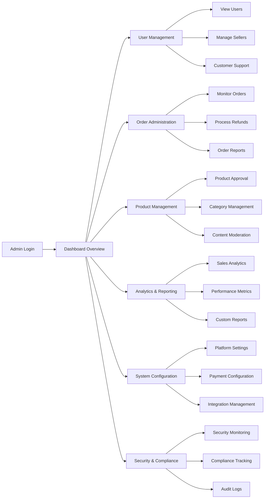

# E-Commerce Platform - Admin Dashboard Requirements

## Executive Summary
This document defines the comprehensive administrative dashboard requirements for the e-commerce shopping mall platform. The admin dashboard serves as the central control panel for platform management, providing oversight of all business operations, user management, order processing, and system configuration.

## 1. Admin Dashboard Overview

### 1.1 Dashboard Purpose and Scope
The admin dashboard provides centralized management capabilities for platform administrators to oversee and control all aspects of the e-commerce ecosystem.

**WHEN an administrator logs into the dashboard, THE system SHALL display an overview dashboard with key performance indicators and recent activity.**

### 1.2 Dashboard Layout Requirements
- **Main Navigation**: Sidebar with categorized administrative functions
- **Dashboard Home**: Summary view with real-time metrics and alerts
- **Quick Actions**: Frequently used administrative functions accessible from main dashboard
- **Notification Center**: System alerts and pending actions requiring attention

### 1.3 Access Control Requirements
**THE admin dashboard SHALL implement role-based access control with granular permission management.**

## 2. User Management System

### 2.1 User Account Administration
**WHEN managing user accounts, THE admin dashboard SHALL provide comprehensive user management capabilities.**

#### User Management Functions:
- View complete user directory with search and filtering
- Create, edit, and deactivate user accounts
- Reset user passwords and manage account status
- View user activity logs and login history
- Manage user roles and permissions

### 2.2 Seller Account Management
**THE admin dashboard SHALL provide specialized seller account administration features.**

#### Seller Management Requirements:
- Approve or reject seller registration requests
- Monitor seller performance metrics and ratings
- Manage seller commission rates and payment terms
- Suspend or terminate seller accounts for policy violations
- Review seller product listings for compliance

### 2.3 Customer Support Integration
**WHILE handling customer support escalations, THE admin dashboard SHALL provide access to customer communication history.**

## 3. Order Administration

### 3.1 Order Overview and Monitoring
**THE admin dashboard SHALL provide real-time order monitoring across the entire platform.**

#### Order Management Capabilities:
- View all platform orders with advanced filtering options
- Search orders by customer, seller, order ID, or date range
- Monitor order status transitions and processing times
- Identify delayed or problematic orders requiring intervention

### 3.2 Order Intervention and Support
**IF an order requires administrative intervention, THEN THE admin dashboard SHALL provide order modification capabilities.**

#### Order Intervention Functions:
- Cancel orders on behalf of customers or sellers
- Process refunds and manage payment reversals
- Update order status and shipping information
- Resolve order disputes between customers and sellers
- Generate order reports for business analysis

### 3.3 Financial Oversight
**THE admin dashboard SHALL provide comprehensive financial reporting and reconciliation.**

## 4. Product Catalog Management

### 4.1 Platform Product Oversight
**THE admin dashboard SHALL provide centralized product catalog management.**

#### Product Management Requirements:
- View all products across the platform with search and filtering
- Approve or reject new product listings
- Flag products for policy violations or quality issues
- Manage product categories and attribute definitions
- Monitor product pricing trends and competitive analysis

### 4.2 Category Management
**WHEN managing product categories, THE admin dashboard SHALL provide hierarchical category management.**

#### Category Management Functions:
- Create, edit, and reorganize product categories
- Define category-specific attributes and filters
- Set category-level commission rates and policies
- Monitor category performance and sales metrics

### 4.3 Content Moderation
**THE admin dashboard SHALL provide content moderation tools for product reviews and ratings.**

## 5. Platform Analytics

### 5.1 Business Intelligence Dashboard
**THE admin dashboard SHALL provide comprehensive analytics and reporting capabilities.**

#### Analytics Requirements:
- Sales performance metrics with trend analysis
- Customer acquisition and retention statistics
- Seller performance and revenue reports
- Product performance and inventory turnover
- Platform usage and traffic analytics

### 5.2 Real-time Monitoring
**THE admin dashboard SHALL display real-time platform health metrics.**

#### Monitoring Capabilities:
- System performance and uptime monitoring
- Transaction volume and processing times
- User activity and concurrent sessions
- Error rates and system alerts

### 5.3 Custom Reporting
**WHERE custom reporting is required, THE admin dashboard SHALL provide customizable report generation.**

## 6. System Configuration

### 6.1 Platform Settings Management
**THE admin dashboard SHALL provide comprehensive system configuration options.**

#### Configuration Areas:
- Payment gateway settings and integration management
- Tax calculation rules and regional configurations
- Shipping carrier integrations and rate management
- Email template customization and notification settings
- Platform-wide policies and terms of service

### 6.2 Operational Configuration
**WHILE configuring platform operations, THE admin dashboard SHALL provide operational parameter management.**

#### Operational Settings:
- Order processing workflows and automation rules
- Inventory management thresholds and alerts
- Commission structures and fee calculations
- Platform maintenance schedules and downtime management

### 6.3 Integration Management
**THE admin dashboard SHALL provide third-party integration configuration and monitoring.**

## 7. Security and Compliance

### 7.1 Security Management
**THE admin dashboard SHALL implement comprehensive security controls and monitoring.**

#### Security Requirements:
- Admin user authentication and session management
- Audit logging of all administrative actions
- Security incident monitoring and response
- Data privacy compliance management
- Regular security assessment reporting

### 7.2 Compliance Monitoring
**THE admin dashboard SHALL provide compliance monitoring and reporting capabilities.**

#### Compliance Functions:
- Regulatory compliance tracking and reporting
- Data retention policy management
- Privacy request handling (GDPR, CCPA, etc.)
- Security certification maintenance

### 7.3 Backup and Recovery
**THE admin dashboard SHALL provide system backup management and disaster recovery controls.**

## 8. Administrative Workflows

### 8.1 Approval Workflows
**THE admin dashboard SHALL implement configurable approval workflows for critical actions.**

#### Workflow Requirements:
- Multi-level approval for sensitive operations
- Escalation procedures for unresolved issues
- Audit trail for all approval decisions
- Notification system for pending approvals

### 8.2 Bulk Operations
**WHERE bulk administrative actions are required, THE admin dashboard SHALL provide bulk operation capabilities.**

#### Bulk Operation Examples:
- Bulk user account updates
- Mass product status changes
- Batch order processing
- Bulk email communications

## 9. Performance Requirements

### 9.1 Dashboard Performance
**THE admin dashboard SHALL load within 2 seconds for typical administrative tasks.**

### 9.2 Data Processing
**WHEN generating reports, THE system SHALL process up to 10,000 records within 30 seconds.**

### 9.3 Concurrent Access
**THE admin dashboard SHALL support up to 50 concurrent administrative users without performance degradation.**

## 10. Error Handling and User Experience

### 10.1 Error Prevention
**THE admin dashboard SHALL implement validation to prevent administrative errors.**

### 10.2 Recovery Procedures
**IF an administrative action fails, THEN THE system SHALL provide clear error messages and recovery options.**

### 10.3 Confirmation Requirements
**WHEN performing destructive actions, THE admin dashboard SHALL require confirmation before execution.**

## 11. Integration Requirements

### 11.1 External System Integration
**THE admin dashboard SHALL integrate with external analytics and monitoring tools.**

### 11.2 API Access
**WHERE programmatic access is required, THE admin dashboard SHALL provide RESTful API endpoints for administrative functions.**

## Business Process Flow

## Success Criteria

The admin dashboard implementation will be considered successful when:
- Administrators can efficiently manage all platform operations through a single interface
- Real-time monitoring provides immediate visibility into platform health
- Comprehensive reporting supports data-driven business decisions
- Security controls prevent unauthorized access to administrative functions
- The system scales to support growing administrative workload

> *Developer Note: This document defines **business requirements only**. All technical implementations (architecture, APIs, database design, etc.) are at the discretion of the development team.*