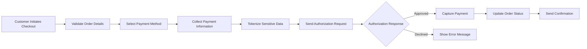

# Payment Processing Requirements Specification

## Executive Summary

This document defines the comprehensive payment processing requirements for the shoppingMall e-commerce platform. The system must support secure, reliable, and compliant financial transactions across multiple payment methods, currencies, and regions. Payment processing is a critical component that directly impacts user trust, conversion rates, and regulatory compliance.

## Payment Gateway Integration Requirements

### Supported Payment Methods
THE system SHALL support integration with multiple payment gateways to provide diverse payment options.

WHEN a customer initiates checkout, THE system SHALL present available payment methods based on:
- Customer's geographic location
- Seller's accepted payment methods
- Order amount and currency
- Customer's payment preferences

### Payment Gateway Selection Criteria
THE system SHALL support integration with at least three major payment gateways with the following characteristics:
- Global coverage and multi-currency support
- PCI DSS Level 1 certification
- Robust API documentation and developer support
- Competitive transaction fees
- Fraud detection capabilities

### Integration Specifications
WHEN integrating payment gateways, THE system SHALL:
- Use secure HTTPS connections for all API communications
- Implement proper error handling and retry mechanisms
- Support webhook notifications for transaction status updates
- Maintain transaction logs for auditing and reconciliation
- Implement timeout handling for slow gateway responses

## Transaction Security Specifications

### PCI DSS Compliance
THE system SHALL comply with Payment Card Industry Data Security Standard (PCI DSS) requirements, including:
- Never storing raw credit card numbers
- Using tokenization for payment data
- Implementing secure key management
- Regular security audits and vulnerability assessments

### Data Encryption Requirements
WHEN processing payment information, THE system SHALL:
- Encrypt all sensitive data in transit using TLS 1.2 or higher
- Use strong encryption algorithms for data at rest
- Implement proper key rotation and management
- Maintain audit trails for security events

### Fraud Prevention
THE system SHALL implement fraud detection mechanisms including:
- Address Verification System (AVS) checks
- Card Verification Value (CVV) validation
- IP address geolocation analysis
- Transaction pattern analysis
- Velocity checks for rapid transactions

## Payment Method Support Matrix

| Payment Method | Supported Currencies | Transaction Limits | Processing Time | Fees Responsibility |
|----------------|---------------------|-------------------|----------------|---------------------|
| Credit Cards | USD, EUR, GBP, JPY, KRW | $10 - $10,000 | Instant | Customer |
| Debit Cards | USD, EUR, GBP, JPY, KRW | $10 - $5,000 | Instant | Customer |
| PayPal | USD, EUR, GBP, 40+ currencies | $1 - $10,000 | Instant | Customer |
| Bank Transfer | USD, EUR, GBP, KRW | $50 - $50,000 | 1-3 business days | Customer |
| Digital Wallets | USD, EUR, GBP | $1 - $5,000 | Instant | Customer |

### Currency Support
THE system SHALL support multi-currency transactions with:
- Real-time currency conversion using reliable exchange rate APIs
- Support for major world currencies (USD, EUR, GBP, JPY, KRW, etc.)
- Automatic currency selection based on customer location
- Clear display of converted amounts during checkout

## Transaction Flow and Processing

### Authorization Flow

### Transaction States
THE system SHALL track transaction status through the following states:
- **Pending**: Initial state before authorization
- **Authorized**: Payment approved but not captured
- **Captured**: Funds successfully transferred
- **Declined**: Payment authorization failed
- **Refunded**: Full or partial refund processed
- **Disputed**: Transaction under investigation
- **Chargeback**: Customer initiated reversal

### Payment Capture Timing
WHILE processing orders, THE system SHALL:
- Authorize payments immediately upon checkout
- Capture payments when order is shipped or ready for fulfillment
- Support automatic capture for digital goods
- Allow manual capture for physical goods
- Implement authorization expiration (typically 7-30 days)

## Refund and Dispute Management

### Refund Processing
WHEN a refund is requested, THE system SHALL:
- Validate refund eligibility based on order status and policies
- Support full and partial refunds
- Process refunds within 3-5 business days
- Notify customer of refund status
- Update order and financial records

### Refund Eligibility Rules
IF an order meets the following conditions, THEN THE system SHALL allow refunds:
- Order is within 30 days of purchase
- Product is not used or damaged
- Refund request follows seller's return policy
- Customer provides valid reason for return

### Dispute Resolution Process
WHEN a payment dispute occurs, THE system SHALL:
- Freeze disputed funds during investigation
- Provide evidence collection tools for sellers
- Support communication between parties
- Follow payment gateway's dispute resolution procedures
- Update transaction status based on resolution

## Tax Calculation and Compliance

### Tax Calculation Requirements
THE system SHALL automatically calculate taxes based on:
- Customer's shipping address location
- Product category and taxability
- Local tax rates and regulations
- Tax exemption certificates when applicable

### Supported Tax Jurisdictions
THE system SHALL support tax calculation for:
- United States (state and local taxes)
- European Union (VAT)
- United Kingdom (VAT)
- Canada (GST/HST/PST)
- Australia (GST)
- Other major markets as required

### Tax Reporting
THE system SHALL generate tax reports including:
- Sales by jurisdiction
- Tax collected by type
- Tax-exempt transactions
- Quarterly and annual tax summaries

## Financial Reporting and Analytics

### Transaction Reporting
THE system SHALL provide comprehensive financial reports:
- Daily transaction summaries
- Payment method breakdown
- Currency conversion reports
- Refund and chargeback analysis
- Settlement reconciliation reports

### Seller Payout Management
WHEN processing seller payouts, THE system SHALL:
- Calculate net amounts after fees and commissions
- Support scheduled payouts (weekly, bi-weekly, monthly)
- Provide payout history and status tracking
- Handle payout failures and retries
- Generate payout reports for sellers

### Analytics Requirements
THE system SHALL provide payment analytics including:
- Conversion rates by payment method
- Abandoned cart analysis
- Payment success/failure rates
- Average transaction values
- Seasonal payment trends

## Error Handling and Recovery

### Payment Failure Scenarios
IF payment authorization fails, THEN THE system SHALL:
- Provide clear error messages to customers
- Suggest alternative payment methods
- Log detailed failure reasons for analysis
- Support retry mechanisms with cooldown periods
- Notify customer support of critical failures

### Transaction Recovery
WHILE handling payment timeouts or network issues, THE system SHALL:
- Implement retry logic with exponential backoff
- Maintain transaction state during recovery
- Prevent duplicate charges
- Provide status inquiry mechanisms
- Support manual intervention when automated recovery fails

### System Outage Handling
IF the payment gateway experiences outage, THEN THE system SHALL:
- Switch to backup payment gateways automatically
- Queue transactions for later processing
- Notify customers of temporary payment issues
- Maintain order integrity during outages
- Resume processing when connectivity is restored

## Integration with Shopping Cart and Order Processing

### Checkout Integration
THE payment system SHALL integrate seamlessly with the shopping cart:
- Pre-calculate totals including taxes and shipping
- Validate payment method compatibility
- Support guest checkout with payment
- Maintain cart contents during payment process
- Handle payment method changes gracefully

### Order Status Synchronization
THE system SHALL maintain synchronization between payment status and order status:
- Update order status based on payment authorization
- Trigger fulfillment processes upon successful payment
- Handle payment failures with order cancellation
- Support order modifications affecting payment amounts

### Customer Communication
WHEN payment events occur, THE system SHALL notify customers via:
- Order confirmation emails with payment details
- Payment failure notifications with resolution steps
- Refund confirmation messages
- Dispute status updates
- Payment method expiration warnings

## Performance and Scalability Requirements

### Transaction Processing Performance
THE system SHALL process payments with the following performance characteristics:
- Authorization response time: < 3 seconds
- Payment capture processing: < 2 seconds
- Refund processing: < 5 seconds
- Support concurrent transactions: 1,000+ per minute
- 99.9% uptime for payment processing services

### Data Retention and Archiving
THE system SHALL maintain payment records for:
- Active transactions: Real-time access for 90 days
- Completed transactions: Online access for 2 years
- Archived transactions: Offline storage for 7 years (legal compliance)
- Audit trails: Permanent storage for security events

## Security and Compliance

### Regulatory Compliance
THE system SHALL comply with relevant financial regulations including:
- Anti-Money Laundering (AML) requirements
- Know Your Customer (KYC) procedures
- Payment Services Directive (PSD2) for EU
- Local financial regulations in operating regions
- Data protection regulations (GDPR, CCPA, etc.)

### Security Monitoring
THE system SHALL implement continuous security monitoring:
- Real-time fraud detection alerts
- Suspicious transaction patterns
- Unusual payment activity monitoring
- Security incident response procedures
- Regular security penetration testing

## Testing Requirements

### Payment Gateway Testing
THE system SHALL support comprehensive testing including:
- Sandbox environments for all payment gateways
- Test credit card numbers for various scenarios
- Negative testing for failure conditions
- Load testing for high-volume transactions
- Security testing for vulnerability assessment

### User Acceptance Testing
WHEN deploying payment features, THE system SHALL undergo:
- End-to-end payment flow testing
- Multi-currency transaction testing
- Refund and dispute process testing
- Error handling and recovery testing
- Performance under load testing

## Business Process Scenarios

### Customer Payment Experience
WHEN a customer completes a purchase, THE system SHALL provide:
- Clear payment method selection interface
- Real-time validation of payment information
- Secure payment form with SSL encryption
- Immediate confirmation of successful payments
- Detailed receipt with payment breakdown

### Seller Payment Management
WHEN sellers manage their payment settings, THE system SHALL support:
- Configuration of accepted payment methods
- Setting of payout schedules and thresholds
- Viewing of payment history and pending payouts
- Management of tax settings and reporting
- Access to payment analytics and performance metrics

### Administrative Payment Oversight
WHEN administrators monitor payment operations, THE system SHALL provide:
- Dashboard view of payment system health
- Real-time transaction monitoring
- Fraud detection and alert management
- Settlement and reconciliation tools
- Compliance reporting and audit trails

## Risk Management Requirements

### Fraud Detection and Prevention
THE system SHALL implement multi-layered fraud prevention:
- Machine learning-based anomaly detection
- Real-time risk scoring for transactions
- Automated blocking of suspicious activities
- Manual review workflows for borderline cases
- Continuous improvement of fraud detection algorithms

### Chargeback Prevention
THE system SHALL reduce chargeback rates through:
- Clear product descriptions and images
- Transparent return and refund policies
- Prompt customer service response
- Order verification mechanisms
- Customer communication best practices

### Financial Risk Management
THE system SHALL manage financial risks including:
- Currency exchange rate fluctuations
- Payment gateway reliability
- Regulatory compliance risks
- Customer credit risk assessment
- Operational risk mitigation

## Implementation Considerations

### Integration Architecture
THE payment processing system SHALL be designed with:
- Modular architecture supporting multiple payment gateways
- API-first approach for external integrations
- Event-driven architecture for real-time processing
- Microservices design for scalability and resilience
- Comprehensive logging and monitoring capabilities

### Data Management
THE system SHALL implement robust data management:
- Secure storage of payment tokens and metadata
- Efficient querying of transaction histories
- Data encryption and access controls
- Backup and disaster recovery procedures
- Data retention and archival policies

### Operational Excellence
THE payment system SHALL maintain operational excellence through:
- 24/7 monitoring and alerting
- Automated health checks and failover
- Performance optimization and tuning
- Capacity planning and scaling
- Incident response and resolution procedures

> *Developer Note: This document defines **business requirements only**. All technical implementations (architecture, APIs, database design, etc.) are at the discretion of the development team.*