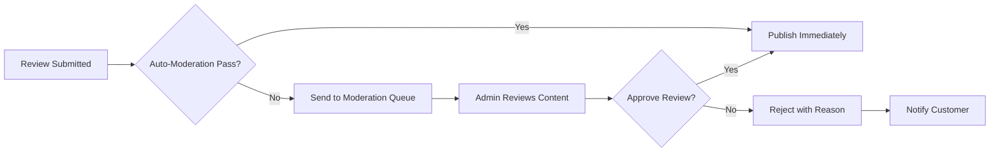
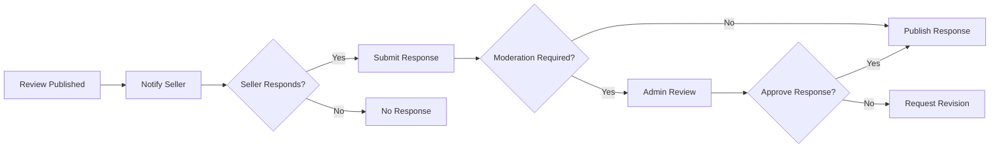

# Product Reviews and Ratings Management System

## Executive Summary

This document defines the complete requirements for implementing a comprehensive product review and rating system for the ecommerceMall platform. The system enables customers to share authentic feedback, helps sellers improve their products, and builds trust through verified reviews while preventing abuse and fraudulent content.

### Core Objectives
- Build customer trust through authentic user-generated content
- Provide valuable feedback to sellers for product improvement
- Enable informed purchasing decisions through peer reviews
- Prevent fraudulent and abusive content through verification mechanisms
- Support seller-customer interaction through response management

## Review Submission Requirements

### Eligibility Criteria
WHEN a customer attempts to submit a review, THE system SHALL verify the following eligibility criteria:
- Customer must have purchased the product being reviewed
- Order must be in "delivered" or "completed" status
- Review period must be within 30-365 days from order delivery
- Customer must not have previously reviewed the same product

### Review Submission Interface
THE system SHALL provide a structured review submission form containing:
- Overall rating (1-5 stars)
- Optional detailed review text (minimum 10 characters, maximum 2000 characters)
- Photo upload capability (maximum 5 images per review)
- Individual rating categories (optional)
- Review title (maximum 100 characters)

### Rating System Specifications

#### Overall Rating Scale
THE system SHALL use a 5-star rating scale with the following definitions:
- 1 Star: Poor - Significant issues, would not recommend
- 2 Stars: Fair - Below expectations, needs improvement
- 3 Stars: Average - Meets basic expectations
- 4 Stars: Good - Exceeds expectations, minor issues
- 5 Stars: Excellent - Outstanding quality, highly recommended

#### Category-Based Ratings (Optional)
WHERE customers choose to provide detailed ratings, THE system SHALL support the following categories:
- Product Quality
- Value for Money
- Shipping Speed
- Seller Communication
- Packaging Quality

### Review Content Validation
WHEN a review is submitted, THE system SHALL validate the content against the following rules:
- Text content must not contain profanity, hate speech, or personal attacks
- Photos must be appropriate product-related images
- Reviews must be original content (no copied reviews)
- No promotional content or external links allowed
- No personally identifiable information permitted

## Content Moderation and Verification

### Automated Moderation
THE system SHALL implement automated content moderation using:
- Profanity filter with customizable word lists
- Spam detection algorithms
- Duplicate content checking
- Image content analysis
- Sentiment analysis for extreme negative reviews

### Manual Moderation Workflow
WHEN a review requires manual moderation, THE system SHALL route it to the moderation queue with the following process:

### Review Verification Processes

#### Purchase Verification
THE system SHALL verify that reviewers have actually purchased the product by:
- Cross-referencing review submissions with order history
- Ensuring review timing aligns with order delivery dates
- Preventing multiple reviews for the same product purchase

#### Verified Purchase Badge
WHERE a review is submitted by a verified purchaser, THE system SHALL display a "Verified Purchase" badge prominently with the review.

## Review Display and Presentation

### Review Sorting Options
THE system SHALL provide multiple sorting options for product reviews:
- Most Recent (default)
- Highest Rated
- Lowest Rated
- Most Helpful (based on helpful votes)
- With Photos First

### Review Aggregation and Statistics
THE system SHALL calculate and display the following aggregate statistics:
- Average rating (to one decimal place)
- Rating distribution (number of reviews per star)
- Total review count
- Percentage of verified purchases
- Recent review trends

### Review Helpfulness Voting
THE system SHALL allow customers to vote on review helpfulness:
- Customers can mark reviews as "Helpful" or "Not Helpful"
- Helpfulness score influences review sorting
- Each customer can vote only once per review
- Votes from verified purchasers carry more weight

## Abuse Prevention Mechanisms

### Review Frequency Limits
THE system SHALL implement the following limits to prevent review spam:
- Maximum 10 reviews per customer per day
- Minimum 24-hour gap between reviews for the same seller
- No reviews allowed from newly created accounts (first 24 hours)

### Fraud Detection
THE system SHALL detect and prevent fraudulent review patterns:
- Multiple reviews from same IP address in short timeframe
- Reviews from accounts with similar patterns
- Suspicious rating patterns (all 5-star or 1-star reviews)
- Unusual review timing patterns

### Conflict of Interest Prevention
THE system SHALL prevent reviews that represent conflicts of interest:
- Sellers cannot review their own products
- Employees cannot review company products
- Related accounts cannot review each other's products

## Seller Response Management

### Seller Response Capability
WHERE a seller wants to respond to a customer review, THE system SHALL provide:
- Response submission interface
- Response moderation (if required)
- Notification to the original reviewer
- Public display of seller responses

### Response Guidelines
THE system SHALL enforce the following response guidelines:
- Professional and respectful tone required
- No personal attacks or defensive language
- Focus on addressing concerns and offering solutions
- Responses must be submitted within 30 days of review

### Response Workflow

## Analytics and Reporting

### Review Analytics Dashboard
THE system SHALL provide sellers with a review analytics dashboard containing:
- Average rating trends over time
- Review volume statistics
- Response rate metrics
- Customer sentiment analysis
- Helpfulness score trends

### Platform-wide Analytics
THE system SHALL provide administrators with platform-wide review analytics:
- Overall review quality metrics
- Moderation workload statistics
- Abuse pattern detection
- Customer engagement metrics
- Review impact on sales conversion

### Reporting Capabilities
THE system SHALL generate the following reports:
- Monthly review activity reports
- Abuse detection reports
- Seller response performance reports
- Review quality assessment reports

## Integration Requirements

### Product Catalog Integration
THE review system SHALL integrate with the product catalog to:
- Display reviews on product detail pages
- Update product ratings in real-time
- Support reviews for product variants
- Handle product discontinuation gracefully

### User Management Integration
THE review system SHALL integrate with user management to:
- Verify customer purchase history
- Track user review activity
- Manage user permissions for reviewing
- Handle account suspension scenarios

### Notification System Integration
THE review system SHALL integrate with the notification system to:
- Notify sellers of new reviews
- Alert customers when sellers respond
- Inform administrators of moderation needs
- Send review submission confirmations

## Performance Requirements

### Response Time
THE system SHALL meet the following performance requirements:
- Review submission: response within 2 seconds
- Review display: load within 1 second
- Rating calculations: update within 5 seconds
- Search and filtering: respond within 3 seconds

### Scalability Targets
THE system SHALL support:
- 10,000+ concurrent review submissions
- 100,000+ product reviews per day
- 1,000,000+ review displays per hour
- Real-time rating updates across all products

## Data Management

### Review Data Retention
THE system SHALL maintain review data according to the following retention policy:
- Active reviews: indefinite storage
- Rejected reviews: 90-day retention
- Deleted reviews: 30-day soft delete, then permanent deletion
- Review analytics: 3-year retention

### Data Export Capability
THE system SHALL provide data export functionality for:
- Seller review data export (CSV format)
- Administrative reporting exports
- Compliance and audit requirements
- Data migration support

## Success Metrics

### Key Performance Indicators
THE system SHALL track the following KPIs:
- Review submission rate (percentage of purchases reviewed)
- Average review response time
- Review helpfulness score
- Customer satisfaction with review system
- Review fraud detection rate

### Quality Metrics
THE system SHALL monitor review quality through:
- Review completeness (text length, photos, category ratings)
- Review authenticity scores
- Customer engagement with reviews
- Review impact on purchase decisions

## Authentication and Authorization Requirements

### Customer Authentication
WHEN a customer submits a review, THE system SHALL verify:
- Customer is logged in with valid session
- Customer has purchase history for the product
- Customer account is in good standing
- Review submission rate limits are not exceeded

### Seller Authorization
WHERE sellers respond to reviews, THE system SHALL ensure:
- Seller owns the product being reviewed
- Seller account is active and verified
- Response guidelines are followed
- Response timing constraints are respected

### Admin Permissions
WHEN administrators moderate content, THE system SHALL provide:
- Full access to all review content
- Ability to approve, reject, or edit reviews
- Audit trail for moderation actions
- Reporting on moderation workload

## Error Handling and Edge Cases

### Review Submission Errors
IF review submission fails, THEN THE system SHALL:
- Provide specific error messages indicating the failure reason
- Preserve draft review content for retry
- Log technical errors for debugging
- Offer customer support contact information

### Moderation Workflow Errors
WHEN moderation processes fail, THEN THE system SHALL:
- Queue reviews for retry processing
- Notify administrators of system issues
- Provide manual override capabilities
- Maintain data consistency during failures

### Integration Failures
IF external integrations fail, THEN THE system SHALL:
- Use cached data when available
- Provide graceful degradation of features
- Queue integration retries with backoff
- Notify technical support of persistent issues

## Business Rules and Validation

### Review Content Standards
THE system SHALL enforce content standards including:
- Minimum and maximum character counts for reviews
- Image file size and format restrictions
- Prohibited content categories
- Language and tone guidelines
- Legal compliance requirements

### Rating Validation
WHEN customers submit ratings, THE system SHALL:
- Validate rating values are within acceptable range
- Prevent rating manipulation through system checks
- Ensure rating consistency across similar products
- Monitor for unusual rating patterns

### Timing Constraints
THE system SHALL enforce timing constraints including:
- Minimum time between reviews from same customer
- Maximum age of purchase for review eligibility
- Response time limits for seller replies
- Review expiration for outdated content

## Customer Experience Requirements

### Review Submission Flow
WHEN customers submit reviews, THE system SHALL provide:
- Clear step-by-step guidance
- Immediate feedback on content validity
- Preview functionality before submission
- Confirmation of successful submission

### Review Discovery
WHERE customers browse reviews, THE system SHALL offer:
- Intuitive filtering and sorting options
- Search functionality within review content
- Related review suggestions
- Personalized review recommendations

### Mobile Experience
WHEN using mobile devices, THE review system SHALL:
- Provide responsive design for all screen sizes
- Optimize image display for mobile bandwidth
- Support touch-friendly interaction patterns
- Maintain performance on slower connections

## Compliance and Legal Requirements

### Data Privacy
THE review system SHALL comply with data privacy regulations:
- Obtain proper consent for data collection
- Provide data deletion capabilities
- Anonymize data where required
- Secure storage of personal information

### Content Liability
WHERE user-generated content exists, THE system SHALL:
- Implement proper content moderation
- Provide reporting mechanisms for inappropriate content
- Maintain records for legal compliance
- Follow industry standards for content management

### Accessibility
THE review interface SHALL meet accessibility standards:
- Support screen readers and assistive technologies
- Provide keyboard navigation alternatives
- Ensure color contrast meets WCAG guidelines
- Support text resizing without layout breakage

This document provides the complete business requirements for implementing a robust product review and rating system that enhances customer trust, provides valuable seller feedback, and maintains content quality through effective moderation and verification processes.

> *Developer Note: This document defines **business requirements only**. All technical implementations (architecture, APIs, database design, etc.) are at the discretion of the development team.*