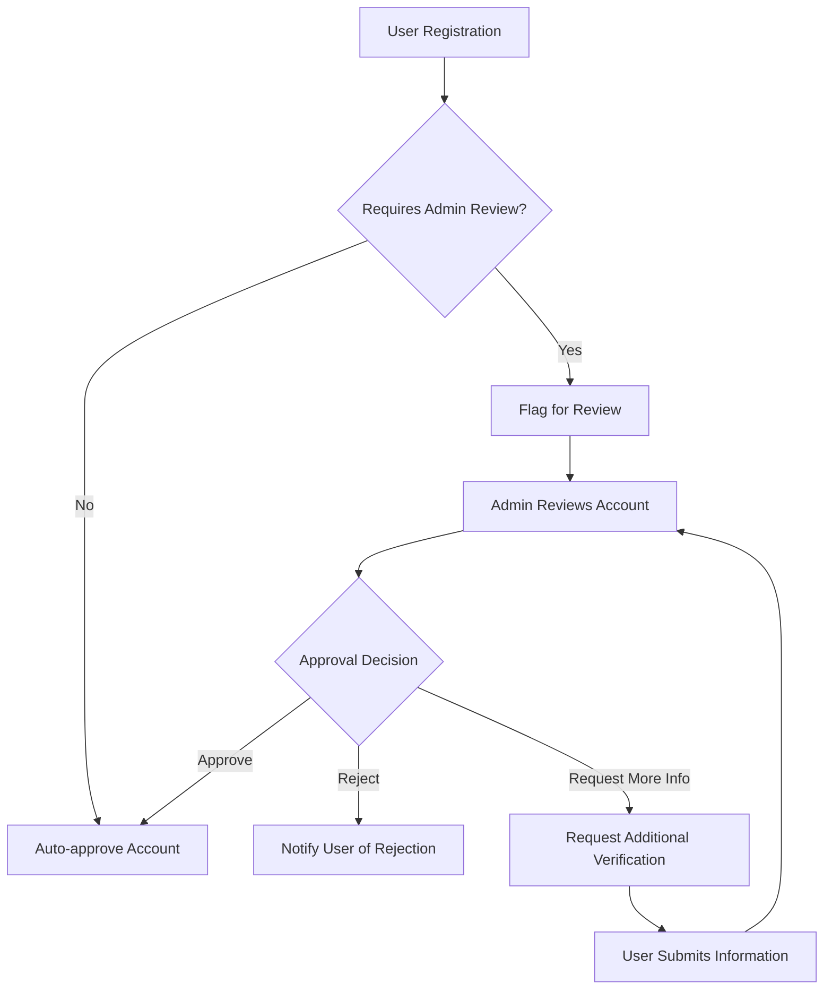
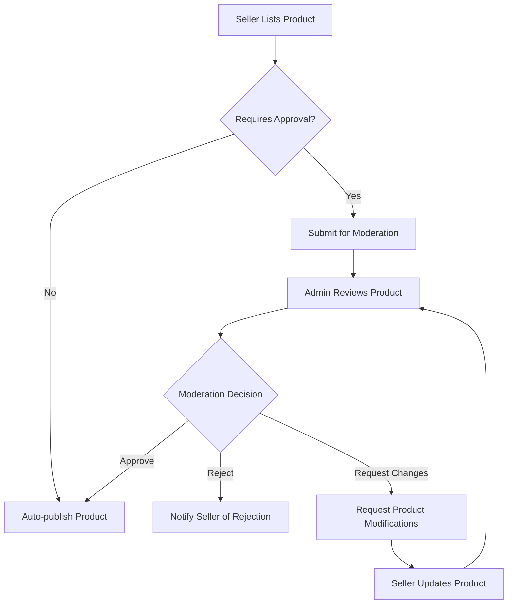
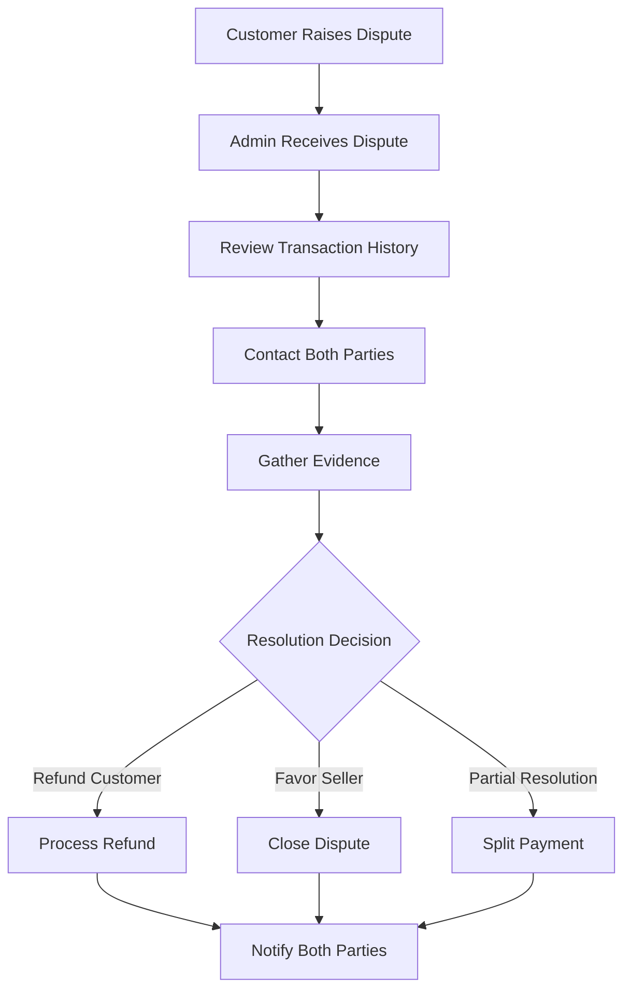

# Admin System Management Requirements Document

## Executive Summary and Administrative Scope

This document defines the comprehensive administrative functions required for the e-commerce shopping mall platform. The administrative system provides complete oversight and management capabilities for all platform operations, ensuring proper governance, security, and operational efficiency.

### Administrative Responsibilities
The administrative system SHALL provide centralized management capabilities for:
- User account lifecycle management and oversight
- Product catalog moderation and quality control
- Order processing monitoring and dispute resolution
- System configuration and performance optimization
- Security monitoring and compliance enforcement
- Comprehensive analytics and reporting

### Administrative Actor Definitions
**Platform Administrator**: Responsible for overall platform management, system configuration, and high-level oversight
**Support Administrator**: Handles user support, dispute resolution, and day-to-day operational management
**Security Administrator**: Manages security policies, access controls, and compliance monitoring

## User Management Administration

### User Account Lifecycle Management

**User Registration Oversight**
- WHEN a new user registers, THE system SHALL automatically flag accounts requiring administrative review based on risk assessment criteria
- THE admin SHALL have capability to review and approve/reject user registrations
- WHERE registration requires manual approval, THE system SHALL notify administrators of pending approvals

**User Verification and Validation**
- THE admin SHALL be able to manually verify user identities and documentation
- WHEN user verification is required, THE system SHALL provide workflow for document submission and review
- THE admin SHALL have capability to request additional verification information from users

**User Account Management**
- THE admin SHALL be able to suspend user accounts temporarily for policy violations
- THE admin SHALL be able to permanently ban users for severe violations
- WHEN suspending an account, THE system SHALL automatically cancel pending orders and notify the user
- THE admin SHALL be able to restore suspended accounts with full functionality

**Bulk User Operations**
- THE admin SHALL have capability to perform bulk operations on user accounts
- WHERE bulk operations are performed, THE system SHALL require confirmation and provide preview of changes
- THE admin SHALL be able to export user lists with filtering capabilities

### User Permission Management

**Role-Based Access Control**
- THE admin SHALL be able to assign and modify user roles (customer, seller, admin)
- WHEN changing user roles, THE system SHALL validate permissions and notify the user
- THE admin SHALL be able to create custom permission sets for specialized roles

**Seller Account Management**
- THE admin SHALL approve seller registrations before they can list products
- WHEN approving sellers, THE system SHALL verify business documentation
- THE admin SHALL be able to set commission rates and payment terms per seller
- THE admin SHALL monitor seller performance and compliance metrics

## Product Catalog Administration

### Product Moderation Workflow

**Product Approval Process**
- WHEN a seller lists a new product, THE system SHALL require administrative approval for high-value or restricted categories
- THE admin SHALL review product listings for compliance with platform policies
- WHERE product requires modification, THE system SHALL provide feedback mechanism to seller

**Product Quality Control**
- THE admin SHALL be able to flag products for quality issues or policy violations
- WHEN products are flagged, THE system SHALL automatically suspend listing until resolved
- THE admin SHALL have capability to remove products immediately for severe violations

**Category Management**
- THE admin SHALL create and manage product categories and subcategories
- WHEN creating categories, THE system SHALL validate uniqueness and hierarchy consistency
- THE admin SHALL be able to assign category-specific attributes and validation rules

**Inventory Oversight**
- THE admin SHALL monitor overall platform inventory levels and trends
- WHEN inventory levels fall below thresholds, THE system SHALL alert administrators
- THE admin SHALL be able to set global inventory policies and restrictions

### Product Pricing and Promotion Management

**Pricing Policy Enforcement**
- THE admin SHALL set minimum and maximum price limits for product categories
- WHEN sellers attempt to list products outside price ranges, THE system SHALL require approval
- THE admin SHALL monitor pricing patterns for anti-competitive behavior

**Promotion Management**
- THE admin SHALL create and manage platform-wide promotions and discounts
- WHEN promotions are active, THE system SHALL track performance metrics
- THE admin SHALL be able to schedule promotions with start/end dates

## Order Management and Oversight

### Order Monitoring and Intervention

**Order Status Tracking**
- THE admin SHALL view all orders with detailed status information
- WHEN orders encounter processing issues, THE system SHALL flag them for administrative review
- THE admin SHALL be able to manually update order status when necessary

**Dispute Resolution**
- THE admin SHALL mediate disputes between customers and sellers
- WHEN disputes are escalated, THE system SHALL provide complete transaction history
- THE admin SHALL have authority to issue refunds and resolve conflicts

**Fraud Detection and Prevention**
- THE system SHALL automatically flag suspicious order patterns for review
- WHEN fraud is detected, THE admin SHALL be able to cancel orders and block accounts
- THE admin SHALL monitor fraud metrics and adjust detection thresholds

### Payment Processing Oversight

**Transaction Monitoring**
- THE admin SHALL view all payment transactions with detailed information
- WHEN payment failures occur, THE system SHALL provide failure reasons and retry options
- THE admin SHALL be able to manually process payments in exceptional cases

**Refund and Chargeback Management**
- THE admin SHALL process refund requests according to platform policies
- WHEN chargebacks occur, THE system SHALL provide dispute evidence collection tools
- THE admin SHALL track refund rates and identify problematic sellers

## System Configuration Management

### Platform Settings and Configuration

**General Platform Configuration**
- THE admin SHALL configure platform-wide settings including:
  - Currency and tax settings
  - Shipping options and rates
  - Return policies and timeframes
  - Platform commission rates

**Business Hours and Availability**
- THE admin SHALL set platform operating hours and maintenance schedules
- WHEN maintenance is required, THE system SHALL provide notification mechanisms
- THE admin SHALL be able to put the platform in maintenance mode

### Email and Notification Management

**Communication Templates**
- THE admin SHALL create and manage email templates for system notifications
- WHEN templates are modified, THE system SHALL validate template syntax
- THE admin SHALL be able to preview templates before deployment

**Notification Settings**
- THE admin SHALL configure which events trigger notifications to users
- THE admin SHALL set notification frequency limits to prevent spam

## Analytics and Reporting Dashboard

### Performance Metrics and KPIs

**Sales and Revenue Analytics**
- THE admin SHALL view real-time sales dashboards with key metrics:
  - Total revenue and growth trends
  - Average order value
  - Conversion rates
  - Customer acquisition costs

**User Activity Reporting**
- THE admin SHALL monitor user engagement metrics:
  - Active users and session duration
  - Product view and purchase patterns
  - Cart abandonment rates
  - User retention metrics

**Seller Performance Monitoring**
- THE admin SHALL track seller performance indicators:
  - Sales volume and growth
  - Customer satisfaction ratings
  - Order fulfillment rates
  - Policy compliance metrics

### Custom Reporting Capabilities

**Report Generation**
- THE admin SHALL create custom reports with flexible date ranges and filters
- WHEN generating reports, THE system SHALL provide export options (CSV, PDF, Excel)
- THE admin SHALL be able to schedule automated report generation

**Data Visualization**
- THE system SHALL provide interactive charts and graphs for key metrics
- THE admin SHALL be able to customize dashboard layouts and widget placements

## Security and Compliance Administration

### Security Monitoring

**Access Log Monitoring**
- THE admin SHALL review system access logs for suspicious activity
- WHEN security events occur, THE system SHALL alert administrators immediately
- THE admin SHALL be able to investigate security incidents with detailed logs

**Data Protection Compliance**
- THE admin SHALL manage data retention policies according to regulations
- WHEN data deletion is required, THE system SHALL provide secure deletion workflows
- THE admin SHALL monitor compliance with privacy regulations (GDPR, CCPA, etc.)

### System Health Monitoring

**Performance Monitoring**
- THE admin SHALL monitor system performance metrics:
  - Response times and latency
  - Server resource utilization
  - Database performance
  - API endpoint health

**Error Tracking and Resolution**
- THE system SHALL aggregate and categorize application errors
- WHEN critical errors occur, THE admin SHALL receive immediate notifications
- THE admin SHALL track error resolution and recurrence patterns

## Integration and Monitoring Requirements

### Third-Party Integration Management

**Payment Gateway Configuration**
- THE admin SHALL configure and manage payment gateway integrations
- WHEN payment gateways require updates, THE system SHALL provide testing environments
- THE admin SHALL monitor gateway performance and transaction success rates

**Shipping Carrier Integration**
- THE admin SHALL manage shipping carrier integrations and rate calculations
- THE admin SHALL be able to add/remove carriers based on performance

### System Backup and Recovery

**Data Backup Management**
- THE admin SHALL configure automated backup schedules
- WHEN backups are performed, THE system SHALL verify backup integrity
- THE admin SHALL be able to initiate manual backups on demand

**Disaster Recovery**
- THE admin SHALL test disaster recovery procedures regularly
- WHEN recovery is needed, THE system SHALL provide step-by-step recovery workflows

## Administrative Workflow Requirements

### Approval Workflows

**Multi-Level Approval Processes**
- WHERE high-risk operations require multiple approvals, THE system SHALL provide workflow management
- THE admin SHALL be able to define approval chains and escalation rules
- WHEN approvals are pending, THE system SHALL notify responsible administrators

**Audit Trail Requirements**
- THE system SHALL maintain complete audit trails for all administrative actions
- WHEN changes are made, THE system SHALL record who made the change and when
- THE admin SHALL be able to review audit logs for compliance purposes

### Administrative Notifications

**Real-Time Alert System**
- THE system SHALL provide real-time notifications for critical events:
  - Security breaches
  - System outages
  - Payment processing failures
  - High-volume fraud attempts

**Escalation Procedures**
- WHEN issues require immediate attention, THE system SHALL escalate notifications
- THE admin SHALL be able to configure escalation rules and contact methods

## Performance and Scalability Requirements

### Administrative Interface Performance

**Response Time Requirements**
- THE administrative interface SHALL load within 2 seconds for standard operations
- WHEN performing complex queries, THE system SHALL provide progress indicators
- THE admin SHALL be able to cancel long-running operations

**Concurrent Administration**
- THE system SHALL support multiple administrators working simultaneously
- WHEN conflicts occur, THE system SHALL provide conflict resolution mechanisms

### Data Management Performance

**Large Dataset Handling**
- THE admin SHALL be able to work with large datasets without performance degradation
- WHEN exporting large reports, THE system SHALL provide background processing
- THE admin SHALL be able to filter and paginate large result sets efficiently

## User Experience Requirements

### Administrative Interface Design

**Intuitive Navigation**
- THE administrative interface SHALL provide clear navigation between different management areas
- THE admin SHALL be able to quickly access frequently used functions
- THE interface SHALL provide search functionality across all administrative features

**Contextual Help and Documentation**
- THE system SHALL provide contextual help for administrative functions
- WHEN performing complex operations, THE system SHALL provide guidance and best practices
- THE admin SHALL have access to complete administrative documentation

### Mobile Administration

**Responsive Design**
- THE administrative interface SHALL be usable on mobile devices for emergency management
- WHEN accessing from mobile, THE system SHALL prioritize critical functions
- THE admin SHALL be able to perform essential operations from mobile devices

## Compliance and Regulatory Requirements

### Data Privacy Compliance

**User Data Management**
- THE admin SHALL manage user data in compliance with privacy regulations
- WHEN handling user data, THE system SHALL enforce access controls and logging
- THE admin SHALL be able to process data deletion requests according to regulations

**Financial Compliance**
- THE system SHALL maintain financial records for audit purposes
- WHEN financial transactions occur, THE system SHALL record complete audit trails
- THE admin SHALL be able to generate compliance reports for regulatory bodies

### Security Compliance

**Access Control Enforcement**
- THE system SHALL enforce role-based access control for all administrative functions
- WHEN access attempts exceed limits, THE system SHALL implement security measures
- THE admin SHALL monitor access patterns for security compliance

**Security Certification Maintenance**
- THE admin SHALL manage security certifications and compliance documentation
- WHEN security standards change, THE system SHALL provide update guidance

## Administrative Workflow Diagrams

### User Account Management Workflow

### Product Moderation Workflow

### Order Dispute Resolution Workflow

## Administrative Permission Matrix

### Administrator Role Permissions
| Function Area | Platform Admin | Support Admin | Security Admin |
|---------------|----------------|---------------|----------------|
| User Management | Full Access | Limited Access | Read Only |
| Product Catalog | Full Access | Moderate Access | Read Only |
| Order Management | Full Access | Full Access | Read Only |
| System Configuration | Full Access | No Access | Limited Access |
| Security Settings | Full Access | No Access | Full Access |
| Analytics | Full Access | Limited Access | Read Only |

### Administrative Action Logging Requirements
- WHEN any administrative action is performed, THE system SHALL log the action with timestamp and user identifier
- WHERE sensitive operations occur, THE system SHALL require additional authentication
- THE admin SHALL be able to review action logs for compliance auditing

## Business Continuity Requirements

### System Availability Management
- THE admin SHALL monitor system availability metrics and uptime percentages
- WHEN system downtime occurs, THE system SHALL automatically notify affected users
- THE admin SHALL be able to implement failover procedures for critical systems

### Capacity Planning
- THE admin SHALL monitor system capacity and resource utilization trends
- WHEN capacity thresholds are approached, THE system SHALL alert administrators
- THE admin SHALL be able to scale system resources based on demand patterns

## Administrative Training Requirements

### Administrator Onboarding
- THE system SHALL provide comprehensive training materials for new administrators
- WHEN new features are deployed, THE system SHALL provide updated training documentation
- THE admin SHALL be able to access role-specific training modules

### Knowledge Base Management
- THE admin SHALL maintain a knowledge base of common administrative procedures
- WHEN new issues are resolved, THE system SHALL provide mechanisms to document solutions
- THE admin SHALL be able to search the knowledge base for troubleshooting guidance

> *Developer Note: This document defines **business requirements only**. All technical implementations (architecture, APIs, database design, etc.) are at the discretion of the development team.*