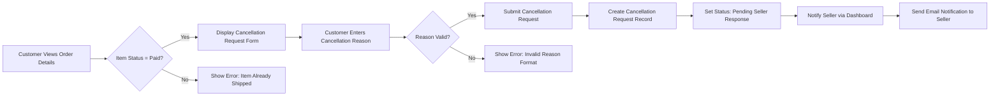
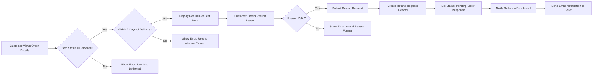
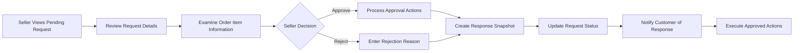

# E-Commerce Platform Cancellation and Refund Request Management System

## Executive Summary

The cancellation and refund management system is a critical component of the e-commerce platform that ensures fair and transparent handling of customer requests while maintaining business integrity through comprehensive snapshot preservation. This system operates on a per-item basis, allowing granular control over order modifications while preserving the complete audit trail required for financial transactions.

## Business Context and Importance

This system addresses the fundamental need for transaction integrity in an e-commerce environment where monetary exchanges occur. The snapshot principle ensures that all request states are preserved immutably, providing protection against disputes and maintaining legal compliance for financial operations. The system balances customer protection with seller accountability through structured workflows and clear escalation paths.

## Cancellation Request Management

### Eligibility Requirements and Validation

**WHEN** a customer attempts to request cancellation for an order item, **THE** system **SHALL** validate the following eligibility criteria:
- THE order item MUST have status "paid" (payment completed but not yet shipped)
- THE customer MUST be the original purchaser of the order item
- THE request MUST be submitted before any shipment creation for that item
- THE customer MUST provide a cancellation reason (minimum 10 characters, maximum 500 characters)

**IF** any eligibility criteria are not met, **THEN THE** system **SHALL**:
- Display specific error messages indicating which requirements are not satisfied
- Prevent submission of the cancellation request
- Provide guidance on eligibility requirements and alternative actions

### Request Submission Workflow

### Cancellation Request Data Structure

**THE** cancellation request record **SHALL** contain:
- Request ID (UUID format, globally unique)
- Order item reference (foreign key to order items table)
- Customer ID (reference to requesting customer)
- Seller ID (reference to product seller)
- Cancellation reason (text, 10-500 characters)
- Request timestamp (ISO 8601 format)
- Status enumeration: pending/approved/rejected
- Response timestamp (nullable, set when seller responds)
- Seller response reason (nullable, text 10-500 characters)
- Snapshot reference (link to immutable request state snapshot)

### Request Status Lifecycle

**WHEN** a cancellation request is created, **THE** system **SHALL**:
- Set initial status to "pending"
- Start a 7-day response timer for the seller
- IF seller does not respond within 7 days, automatically approve the request
- Maintain audit trail of all status transitions

## Refund Request Management

### Eligibility Requirements and Validation

**WHEN** a customer attempts to request refund for an order item, **THE** system **SHALL** validate:
- THE order item MUST have status "delivered" (confirmed delivery)
- THE request MUST be submitted within 7 calendar days of delivery confirmation
- THE customer MUST be the original purchaser
- THE customer MUST provide a refund reason (10-500 characters)
- THE item MUST not have an existing pending or approved refund request

**IF** eligibility criteria are not met, **THEN THE** system **SHALL**:
- Provide specific error messages with eligibility details
- Display the delivery date and remaining refund window
- Prevent request submission until requirements are satisfied

### Refund Request Submission Process

### Refund Request Data Structure

**THE** refund request record **SHALL** contain:
- Request ID (UUID format)
- Order item reference
- Customer ID
- Seller ID
- Refund reason (text, 10-500 characters)
- Request timestamp
- Delivery timestamp (for eligibility validation)
- Status: pending/approved/rejected
- Response timestamp
- Seller response reason (nullable)
- Snapshot reference
- Refund amount (preserved from order snapshot)

## Seller Response Process

### Notification System Requirements

**WHEN** a cancellation or refund request is submitted, **THE** system **SHALL**:
- Display pending requests prominently in seller dashboard
- Send immediate email notification to seller
- Include request details in seller dashboard summary
- Provide real-time notification badges for new requests

### Seller Response Interface

**THE** seller dashboard **SHALL** provide:
- Clear display of request details including customer reason
- Order item information with product and variant details
- Timestamp of request submission
- Response deadline information
- Approve and reject action buttons
- Mandatory reason field for rejections

### Response Processing Workflow

### Approval Actions Specification

**WHEN** a cancellation request is approved, **THE** system **SHALL**:
- Change order item status from "paid" to "cancelled"
- Initiate payment reversal through payment gateway
- Create positive inventory record to restore stock
- Update overall order status based on remaining items
- Send confirmation notification to customer
- Create immutable snapshot of completed transaction

**WHEN** a refund request is approved, **THE** system **SHALL**:
- Change order item status from "delivered" to "refunded"
- Process refund payment through payment gateway
- Create positive inventory record to restore stock
- Update overall order status accordingly
- Send confirmation notification to customer
- Create immutable snapshot of refund transaction

### Rejection Handling

**WHEN** a seller rejects a request, **THE** system **SHALL**:
- Require a detailed rejection reason (minimum 20 characters)
- Set request status to "rejected"
- Notify customer with seller's rejection reason
- Provide customer with escalation options to administrators
- Create snapshot of rejection decision and reasoning

## Stock Restoration Process

### Inventory Management During Request Processing

**THE** stock restoration process **SHALL** maintain complete inventory integrity through the following requirements:

**WHEN** a cancellation or refund is approved, **THE** system **SHALL** create an inventory record with:
- Positive quantity equal to the cancelled/refunded amount
- Reason type: "cancellation_restoration" or "refund_restoration"
- Reference to the cancellation/refund request
- Timestamp of restoration
- User reference (system automated action)

### Current Stock Calculation Integrity

**THE** system **SHALL** ensure that:
- Current stock is always calculated as sum of all inventory records
- Restoration records are immediately reflected in stock calculations
- Variants with restored stock become available for purchase
- Product listings update stock status in real-time

### Inventory History Preservation

**ALL** inventory changes **SHALL** be recorded in immutable inventory history with:
- Complete audit trail of all quantity changes
- Reasons for each inventory modification
- User references for manual changes
- System references for automated changes
- Timestamps for all operations

## Payment Reversal and Financial Handling

### Financial Transaction Integrity

**THE** payment reversal process **SHALL** ensure:
- Exact amount reversal matching the original transaction
- Proper financial record keeping for audit purposes
- Customer notification of successful reversal
- Integration with external payment gateway APIs

### Refund Processing Specifications

**WHEN** processing refunds, **THE** system **SHALL**:
- Use the preserved price from order item snapshot
- Process refund through the original payment method
- Maintain financial records for accounting compliance
- Provide customers with refund confirmation and timeline

### Partial Order Financial Adjustments

**WHEN** only some items in an order are cancelled/refunded, **THE** system **SHALL**:
- Adjust order total to reflect remaining items
- Maintain financial records for partial transactions
- Provide clear documentation of adjusted amounts
- Ensure tax calculations reflect the changes

## Snapshot Preservation System

### Comprehensive Audit Trail Requirements

**THE** snapshot system **SHALL** create immutable records for all critical request states:

**Request Submission Snapshots:**
- Complete request data at time of submission
- Customer information and reason
- Order item details from purchase snapshot
- Timestamp of submission

**Seller Response Snapshots:**
- Request state before seller response
- Seller decision and reasoning
- Response timestamp
- Complete audit trail of decision process

**Financial Transaction Snapshots:**
- Payment reversal or refund details
- Financial amounts and methods
- Gateway transaction references
- Completion timestamps

### Snapshot Access and Visibility

**RELEVANT** parties **SHALL** have access to appropriate snapshots:
- Customers can view snapshots of their own requests
- Sellers can view snapshots of requests for their products
- Administrators have full access to all snapshots
- Snapshots are preserved indefinitely for legal compliance

## Order Status Management

### Status Transition Rules and Validation

**THE** system **SHALL** enforce the following status transition rules:

**Cancellation Impact:**
- IF all items in order are cancelled → order status becomes "cancelled"
- IF some items cancelled but others remain → "partially completed"
- Status recalculation occurs after each cancellation
- Customers see updated order status immediately

**Refund Impact:**
- IF all items refunded → order status becomes "refunded"
- IF some items refunded but others delivered → "partially completed"
- Refund statuses take precedence over delivery statuses
- System maintains accurate order state representation

### Mixed Status Handling

**WHEN** orders contain items with different statuses, **THE** system **SHALL**:
- Calculate overall status based on most advanced item state
- Provide detailed breakdown of individual item statuses
- Maintain clear status hierarchy for consistent reporting
- Ensure status calculations are performant and accurate

## Error Handling and Dispute Resolution

### Comprehensive Error Management

**COMMON** error scenarios and handling:

**Eligibility Validation Errors:**
- IF customer attempts to cancel shipped item → display "Item already shipped" error
- IF refund request outside 7-day window → show delivery date and expiration
- IF payment reversal fails → notify administrators and maintain pending status

**System Failure Recovery:**
- IF snapshot creation fails → halt transaction and retry
- IF inventory update fails → rollback entire transaction
- IF notification delivery fails → queue for retry with exponential backoff

### Dispute Resolution Escalation

**WHEN** customers disagree with seller rejections, **THE** system **SHALL** provide:
- Clear escalation path to administrators
- Preservation of all request snapshots for review
- Administrative override capabilities
- Final and binding administrative decisions

**Administrative Intervention:**
- Administrators can force-approve rejected requests
- Force actions create administrative snapshots
- All interventions are logged with reasons and timestamps
- Customers and sellers receive notification of administrative actions

## Integration Requirements

### System Integration Specifications

**Order Management Integration:**
- Real-time status synchronization with order system
- Immediate notification of status changes to affected parties
- Consistent order state across all platform components

**Seller Dashboard Integration:**
- Seamless display of pending requests in seller interface
- Real-time request count updates
- Integrated notification system

**Payment Gateway Integration:**
- Secure API integration for payment reversals
- Proper error handling for gateway failures
- Transaction status synchronization

### Performance and Scalability

**Response Time Requirements:**
- Request submission processing within 2 seconds
- Seller response updates within 3 seconds
- Status recalculations within 1 second
- Inventory updates in real-time

**Concurrency Handling:**
- Support for multiple simultaneous requests
- Atomic inventory operations to prevent race conditions
- Proper transaction handling for financial operations

## Security and Compliance

### Data Protection Requirements

**Financial Data Security:**
- PCI DSS compliance for all payment operations
- Encryption of financial transaction data
- Restricted access to payment information

**Customer Data Protection:**
- Secure storage of cancellation/refund reasons
- Privacy-compliant data handling
- Appropriate data retention policies

### Audit and Compliance

**Regulatory Compliance:**
- Maintenance of financial records for legal requirements
- Proper tax handling for cancellations and refunds
- Compliance with consumer protection regulations

**Audit Trail Requirements:**
- Complete documentation of all request processing
- Immutable snapshots for dispute resolution
- Accessible audit logs for regulatory reviews

## Monitoring and Reporting

### System Performance Monitoring

**Key Performance Indicators:**
- Request volume trends and patterns
- Average response times for sellers
- Approval/rejection rates by category
- Customer satisfaction with resolution process

### Financial Reporting

**Reporting Requirements:**
- Cancellation and refund amounts by period
- Revenue impact analysis
- Seller performance metrics for request handling
- Customer behavior patterns

## Business Rules Summary

### Core Principles

1. **Customer Protection**: Transparent processes with clear eligibility requirements
2. **Seller Accountability**: Structured response requirements with documentation
3. **Financial Integrity**: Accurate payment handling with complete audit trails
4. **Data Immutability**: Comprehensive snapshot preservation for all critical states
5. **System Reliability**: Robust error handling and recovery mechanisms

### Key Constraints

- Requests are processed per item, not per entire order
- Eligibility criteria are strictly enforced
- All actions create immutable snapshots
- Financial transactions are secure and compliant
- Status transitions follow defined business rules

This comprehensive cancellation and refund management system provides a robust framework for handling customer requests while maintaining platform integrity, financial accuracy, and complete audit trails through the snapshot preservation system. The system balances customer protection with seller accountability through structured workflows and clear escalation paths.