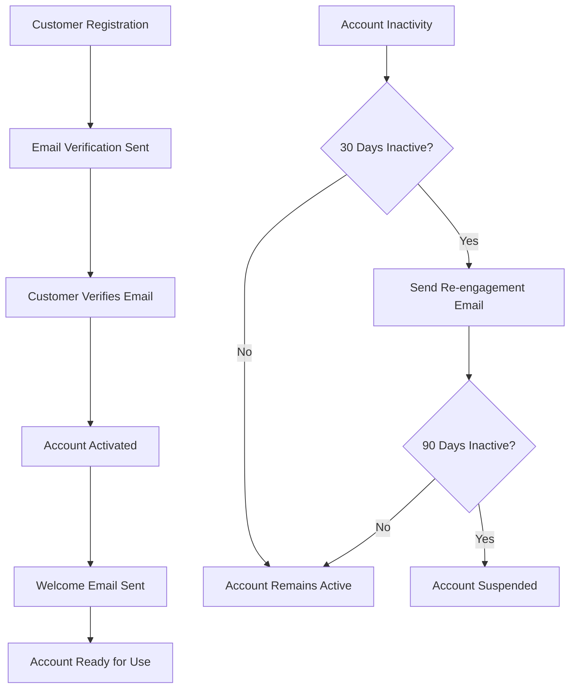

# Customer Account Management Requirements Specification

## Executive Summary

This document defines the comprehensive customer account management system for the e-commerce shopping mall platform. The system enables customers to register accounts, manage personal information, maintain address books, track order history, store payment methods, configure preferences, and maintain account security. This specification focuses on business requirements and user workflows that backend developers must implement to support seamless customer account management.

## Customer Registration Process

### Account Creation Requirements

**WHEN** a new customer initiates registration, **THE** system **SHALL** provide a registration form with the following fields:
- Email address (required)
- Password (required, minimum 8 characters)
- Confirm password (required)
- First name (required)
- Last name (required)
- Phone number (optional)
- Marketing preferences checkbox (optional)

**THE** system **SHALL** validate email format and check for existing accounts with the same email address.

**WHEN** registration form is submitted, **THE** system **SHALL**:
1. Validate all required fields
2. Verify password meets complexity requirements
3. Check email uniqueness
4. Create customer account with pending verification status
5. Send email verification link to the provided email address
6. Display confirmation message indicating verification email sent

### Email Verification Flow

**WHEN** a customer clicks the verification link, **THE** system **SHALL**:
1. Validate the verification token
2. Activate the customer account
3. Redirect to login page with success message
4. Log the verification event for security tracking

**IF** the verification token is invalid or expired, **THEN THE** system **SHALL** display an error message and provide option to resend verification email.

### Social Registration Integration

**WHERE** social registration is supported, **THE** system **SHALL** provide registration through supported social platforms with appropriate data mapping and consent collection.

## Profile Management System

### Personal Information Management

**WHEN** a logged-in customer accesses their profile, **THE** system **SHALL** display editable personal information including:
- First name
- Last name
- Email address (read-only for security)
- Phone number
- Date of birth (optional)
- Gender (optional)
- Profile photo upload capability

**THE** system **SHALL** allow customers to update their personal information with immediate validation.

### Email Change Process

**WHEN** a customer requests to change their email address, **THE** system **SHALL**:
1. Require password confirmation for security
2. Send verification email to the new address
3. Keep the account active with old email until verification completes
4. Update email only after successful verification
5. Notify both old and new email addresses of the change

### Account Preferences

**THE** system **SHALL** store and manage customer preferences including:
- Language preference
- Currency preference
- Timezone setting
- Communication preferences (email, SMS, push notifications)
- Marketing communication opt-in/opt-out settings
- Product recommendation preferences

## Address Book Management

### Address Storage Requirements

**THE** system **SHALL** support multiple addresses per customer with the following structure:
- Address nickname (e.g., "Home", "Work", "Summer House")
- Recipient name
- Street address line 1
- Street address line 2 (optional)
- City
- State/Province
- Postal/ZIP code
- Country
- Phone number
- Default shipping address flag
- Default billing address flag

### Address Management Functions

**WHEN** a customer adds a new address, **THE** system **SHALL** validate address format and completeness.

**THE** system **SHALL** allow customers to:
- Add new addresses with validation
- Edit existing addresses
- Delete addresses (with confirmation)
- Set default shipping address
- Set default billing address
- View address history for audit purposes

### Address Validation Integration

**WHERE** address validation services are available, **THE** system **SHALL** integrate with external address validation APIs to ensure address accuracy.

## Order History and Tracking

### Order Display Requirements

**WHEN** a customer views their order history, **THE** system **SHALL** display orders in reverse chronological order with the following information per order:
- Order number and date
- Order status (Pending, Processing, Shipped, Delivered, Cancelled)
- Total amount
- Number of items
- Shipping address
- Tracking number (if available)
- Estimated delivery date

### Order Detail View

**WHEN** a customer selects an order from history, **THE** system **SHALL** display comprehensive order details including:
- Order summary with line items
- Product details with images
- Pricing breakdown (subtotal, shipping, tax, total)
- Shipping information and tracking
- Payment method used
- Order timeline with status updates
- Customer service contact information

### Reordering Functionality

**WHEN** a customer chooses to reorder from order history, **THE** system **SHALL**:
1. Add all items from the previous order to the shopping cart
2. Apply current pricing and availability
3. Preserve customer's preferred shipping address
4. Display confirmation with any changes (out-of-stock items, price differences)

### Order Filtering and Search

**THE** system **SHALL** provide filtering capabilities for order history by:
- Date range (last 30 days, last 6 months, custom range)
- Order status
- Product category
- Order value range

**THE** system **SHALL** provide search functionality to find orders by:
- Order number
- Product name
- Shipping address

## Payment Methods Management

### Payment Method Storage

**THE** system **SHALL** allow customers to store multiple payment methods with the following information:
- Payment method nickname (e.g., "Primary Credit Card", "PayPal Account")
- Payment type (credit card, debit card, PayPal, etc.)
- Last four digits of card number (for cards)
- Expiration date (for cards)
- Default payment method flag

### Payment Security Requirements

**THE** system **SHALL** never store full credit card numbers or sensitive payment information.

**WHEN** adding a new payment method, **THE** system **SHALL**:
- Use secure payment tokenization
- Validate payment method through payment gateway
- Store only tokenized references
- Comply with PCI DSS security standards

### Payment Method Management

**THE** system **SHALL** allow customers to:
- Add new payment methods with validation
- Edit payment method details (where applicable)
- Delete payment methods
- Set default payment method
- View payment method usage history

## User Preferences and Settings

### Notification Preferences

**THE** system **SHALL** manage customer notification preferences for:
- Order status updates
- Shipping notifications
- Promotional offers
- Price drop alerts
- Product availability notifications
- Security alerts
- Newsletter subscriptions

### Display Preferences

**THE** system **SHALL** store customer display preferences including:
- Products per page setting
- Default sort order for product listings
- Theme preference (light/dark mode if supported)
- Recently viewed products history
- Wishlist visibility settings

### Shopping Preferences

**THE** system **SHALL** maintain shopping-related preferences:
- Preferred shipping method
- Gift wrapping preferences
- Special delivery instructions
- Tax exemption status (if applicable)
- Automatic cart saving frequency

## Account Security Features

### Password Management

**WHEN** a customer changes their password, **THE** system **SHALL**:
- Require current password for verification
- Validate new password meets complexity requirements
- Enforce password history to prevent reuse
- Send security notification email
- Log the password change event

### Account Recovery

**WHEN** a customer forgets their password, **THE** system **SHALL** provide password reset functionality:
1. Customer enters registered email address
2. System sends password reset link with expiration
3. Customer clicks link and sets new password
4. System validates reset token and updates password
5. Sends confirmation email and logs security event

### Security Notifications

**THE** system **SHALL** automatically notify customers of security-related events:
- Successful login from new device/location
- Password change events
- Email address changes
- Payment method additions/changes
- Suspicious activity detection

### Session Management

**THE** system **SHALL** manage customer sessions with:
- Configurable session timeout
- Multiple device support
- Session termination capability
- Login history tracking
- Remote logout functionality

## Privacy Controls and Data Management

### Data Visibility Controls

**THE** system **SHALL** provide customers with control over their data visibility:
- Profile information visibility settings
- Order history visibility
- Review and rating visibility
- Wishlist privacy settings
- Search history management

### Data Export and Deletion

**WHEN** requested by customer, **THE** system **SHALL** provide:
- Personal data export in standard format
- Account deletion with confirmation process
- Data retention period information
- Legal compliance with data protection regulations

### Consent Management

**THE** system **SHALL** track and manage customer consents for:
- Terms of service acceptance
- Privacy policy acceptance
- Marketing communications
- Data processing agreements
- Cookie preferences

## Error Handling and User Experience

### Registration Error Scenarios

**IF** email address is already registered, **THEN THE** system **SHALL** display appropriate error message with password recovery option.

**IF** password does not meet complexity requirements, **THEN THE** system **SHALL** provide specific feedback on requirements.

**IF** email verification fails, **THEN THE** system **SHALL** offer resend verification email option.

### Profile Update Errors

**IF** profile update validation fails, **THEN THE** system **SHALL** highlight specific fields with errors and provide correction guidance.

**IF** email change verification fails, **THEN THE** system **SHALL** maintain old email address and allow retry.

### Address Management Errors

**IF** address validation fails, **THEN THE** system **SHALL** provide specific error details and suggestions for correction.

**IF** address deletion would leave no default addresses, **THEN THE** system **SHALL** require setting new default before deletion.

## Integration Requirements

### Authentication System Integration

**THE** customer account management system **SHALL** integrate with the platform authentication system to ensure seamless login/logout functionality and session management.

### Order Management Integration

**THE** system **SHALL** integrate with order management to provide real-time order status updates and historical order data.

### Payment Gateway Integration

**THE** system **SHALL** integrate securely with payment gateways for payment method management and validation.

### Notification System Integration

**THE** system **SHALL** integrate with the platform notification system to deliver account-related messages and security alerts.

## Performance Requirements

### Response Time Expectations

**THE** system **SHALL** provide sub-second response times for:
- Profile page loading
- Order history display
- Address book management
- Preference updates

**THE** system **SHALL** handle concurrent customer sessions without performance degradation.

### Data Retrieval Performance

**WHEN** loading order history, **THE** system **SHALL** implement pagination to maintain performance with large datasets.

**THE** system **SHALL** cache frequently accessed customer data to improve response times.

## Business Rules and Validation

### Email Uniqueness Rule

**THE** system **SHALL** enforce that each email address can only be associated with one customer account.

### Address Validation Rules

**THE** system **SHALL** validate that required address fields are populated and formatted correctly before storage.

### Payment Method Limits

**THE** system **SHALL** limit the number of stored payment methods per customer account based on business policy.

### Data Retention Policies

**THE** system **SHALL** comply with data retention policies for customer account information and activity history.

## Customer Account Lifecycle Management

### Account Creation and Activation

**WHEN** a customer creates an account, **THE** system **SHALL** follow a comprehensive activation workflow:

### Account Suspension and Reactivation

**WHEN** suspicious activity is detected, **THE** system **SHALL** temporarily suspend the account and require identity verification.

**WHERE** accounts remain inactive for extended periods, **THE** system **SHALL** implement automated account suspension with clear reactivation procedures.

### Account Termination

**WHEN** a customer requests account deletion, **THE** system **SHALL**:
- Provide clear confirmation process
- Honor legal data retention requirements
- Preserve necessary transaction records
- Remove personal identifiable information

## Customer Support Integration

### Support Ticket Creation

**WHEN** customers encounter account issues, **THE** system **SHALL** provide integrated support ticket creation with pre-populated account information.

### Self-Service Account Recovery

**THE** system **SHALL** offer comprehensive self-service options for common account issues:
- Password reset without support intervention
- Email verification resend capabilities
- Account lockout self-recovery
- Payment method troubleshooting

## Advanced Security Features

### Multi-Factor Authentication

**WHERE** enhanced security is required, **THE** system **SHALL** support multi-factor authentication options:
- SMS-based verification codes
- Authenticator app integration
- Biometric authentication
- Hardware security keys

### Security Event Monitoring

**THE** system **SHALL** implement continuous security monitoring for:
- Unusual login patterns
- Multiple failed login attempts
- Account access from suspicious locations
- Unauthorized profile changes

### Data Breach Response

**IF** a security incident occurs, **THE** system **SHALL** have predefined response procedures including customer notification and account protection measures.

## Customer Experience Optimization

### Personalization Features

**THE** system **SHALL** leverage customer data to provide personalized experiences:
- Product recommendations based on purchase history
- Customized communication preferences
- Tailored shopping interfaces
- Personalized promotional offers

### Accessibility Compliance

**THE** customer account interface **SHALL** comply with WCAG 2.1 accessibility standards to ensure usability for customers with disabilities.

### Mobile Optimization

**THE** account management features **SHALL** be fully optimized for mobile devices with responsive design and touch-friendly interfaces.

## Compliance and Legal Requirements

### Data Protection Compliance

**THE** system **SHALL** comply with global data protection regulations including:
- GDPR for European customers
- CCPA for California residents
- Regional data privacy laws
- Industry-specific compliance requirements

### Age Verification

**WHERE** age-restricted products are sold, **THE** system **SHALL** implement age verification processes during account creation and purchase.

### Legal Document Management

**THE** system **SHALL** maintain records of customer consent for:
- Terms of service acceptance
- Privacy policy agreements
- Marketing communications
- Data processing consents

## Testing and Quality Assurance

### Account Management Testing

**THE** development team **SHALL** implement comprehensive testing for:
- Registration and verification workflows
- Profile management functionality
- Address book operations
- Payment method management
- Security feature validation

### Performance Testing

**THE** system **SHALL** undergo load testing to ensure it can handle:
- Peak registration periods
- Concurrent user sessions
- Large order history datasets
- Multiple payment method management

### Security Testing

**THE** account management system **SHALL** undergo regular security testing including:
- Penetration testing
- Vulnerability assessments
- Authentication bypass testing
- Data protection validation

---

> *Developer Note: This document defines **business requirements only**. All technical implementations (architecture, APIs, database design, etc.) are at the discretion of the development team.*