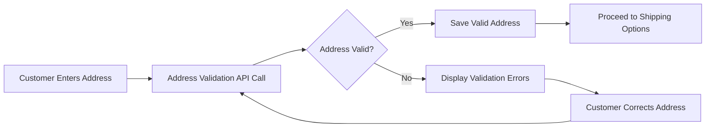
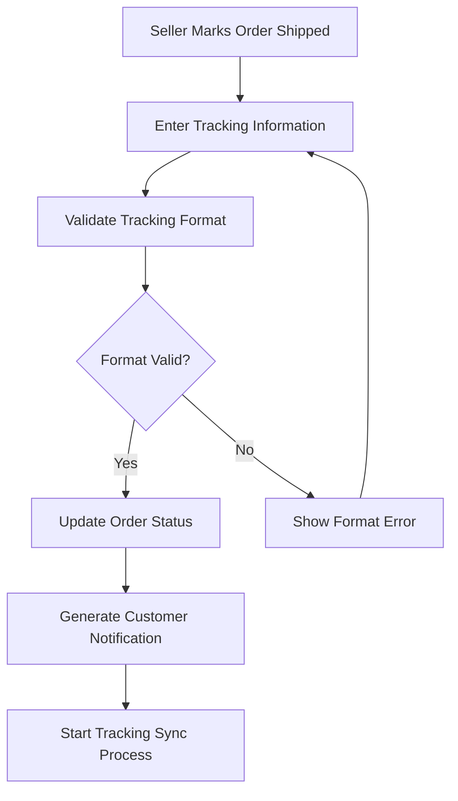
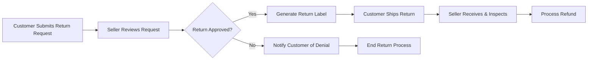

# Shipping, Tracking, and Customer Support Requirements Specification

## Executive Summary

This document defines the complete post-purchase experience for the shoppingMall e-commerce platform, covering shipping management, order tracking, cancellation/refund processes, and customer support workflows. The system must provide customers with transparent shipping information, real-time tracking capabilities, and efficient support mechanisms throughout the order fulfillment lifecycle.

## Shipping Management System Requirements

### Shipping Provider Integration
WHEN integrating with shipping carriers, THE system SHALL support multiple shipping providers including national postal services, courier companies, and regional delivery providers. THE system SHALL automatically generate shipping labels and tracking numbers based on seller-selected carriers.

### Shipping Cost Calculations
WHEN a customer adds products to their shopping cart, THE system SHALL calculate shipping costs based on:
- Package weight and dimensions
- Delivery destination
- Selected shipping method (standard, express, overnight)
- Seller location and carrier rates
- Special handling requirements (fragile, hazardous materials)

### Delivery Time Estimates
THE system SHALL provide accurate delivery time estimates for each shipping option:
- WHERE express shipping is selected, THE system SHALL guarantee delivery within 1-2 business days
- WHERE standard shipping is selected, THE system SHALL provide estimates of 3-7 business days
- WHERE economy shipping is selected, THE system SHALL indicate 7-14 business days
- THE system SHALL update delivery estimates based on carrier performance data

### Address Validation and Management
WHEN a customer enters shipping address information, THE system SHALL validate address format and completeness using postal service APIs. IF an address cannot be verified, THEN THE system SHALL prompt the customer to review and correct the information with specific error details.

## Order Tracking Implementation

### Real-time Tracking Updates
WHEN a seller marks an order as shipped, THE system SHALL provide real-time tracking updates by integrating with carrier tracking APIs. THE system SHALL automatically synchronize tracking information every 30 minutes for active shipments.

### Delivery Status Notifications
WHEN an order status changes, THE system SHALL notify customers via multiple channels:
- Shipping confirmation: Email with tracking number and carrier information
- Out for delivery: SMS notification with estimated delivery window
- Delivery completion: Email confirmation with proof of delivery if available
- Delivery exceptions: Immediate notification of delays or issues

### Tracking Number Management
WHEN a seller processes an order for shipment, THE system SHALL require entry of tracking number and carrier information. THE system SHALL validate tracking number format against carrier specifications before acceptance.

## Cancellation and Refund Processes

### Order Cancellation Workflows
WHEN a customer requests order cancellation, THE system SHALL process cancellations according to order status:
- WHERE order status is "pending payment" or "confirmed", THE system SHALL allow immediate cancellation with full refund
- WHERE order status is "processing", THE system SHALL require seller approval for cancellation
- WHERE order status is "shipped", THE system SHALL prevent cancellation and direct to return process

### Refund Processing Requirements
THE system SHALL support multiple refund scenarios with specific processing rules:
- Full refund for cancelled orders: Process within 24 hours of cancellation
- Partial refund for returned items: Calculate based on returned item value and condition
- Refund for damaged products: Require customer photos and seller verification
- Refund processing SHALL complete within 5-7 business days

### Return Management System
WHEN a customer initiates a return request, THE system SHALL provide a structured 5-step return process:

**Return Validation Rules:**
- Products must be returned within 30 days of delivery
- Items must be in original condition with tags attached
- Electronics must include all original accessories and packaging
- Final sale items are not eligible for return

## Customer Support Workflows

### Support Ticket Management
WHEN a customer submits a support request, THE system SHALL create a support ticket with the following attributes:
- Unique ticket ID and priority level assignment
- Customer information and order reference linkage
- Ticket category (shipping, payment, product, technical)
- Automatic assignment to appropriate support team

### Communication Channels
THE system SHALL support multiple communication channels with integrated history:
- In-app messaging with real-time notifications
- Email support with ticket number tracking
- Phone support during business hours (9 AM - 6 PM local time)
- Live chat with average response time under 2 minutes
- Self-service knowledge base with search functionality

### Escalation Procedures
WHEN support tickets require escalation, THE system SHALL implement tiered escalation rules:
- Level 1: Standard support response within 24 hours
- Level 2: Escalation to senior support after 48 hours without resolution
- Level 3: Management escalation for critical issues affecting multiple customers
- Level 4: Executive escalation for platform-wide service disruptions

### Support Response Time SLAs
THE system SHALL guarantee support response times based on issue priority:
- **Critical Priority** (payment failures, security issues): Response within 2 hours
- **High Priority** (order problems, delivery issues): Response within 4 hours  
- **Normal Priority** (product questions, general inquiries): Response within 24 hours
- **Low Priority** (feature requests, feedback): Response within 48 hours

## Delivery Status Updates and Exception Handling

### Automated Status Transitions
THE system SHALL automatically update order status based on carrier tracking information:
- Order confirmed → Processing → Shipped → Out for delivery → Delivered
- Each status transition SHALL trigger appropriate customer notifications
- Status updates SHALL occur within 15 minutes of carrier data changes

### Customer Notification Specifications
WHEN delivery status changes occur, THE system SHALL send comprehensive notifications including:
- Current order status and next expected milestone
- Estimated delivery date and time window
- Tracking number with direct carrier link
- Contact information for delivery questions
- Instructions for delivery exceptions

### Exception Handling Scenarios
THE system SHALL handle delivery exceptions with specific recovery procedures:

**Failed Delivery Attempts:**
- WHEN a delivery attempt fails, THE system SHALL notify customer and seller immediately
- THE system SHALL provide instructions for rescheduling delivery
- WHERE multiple attempts fail, THE system SHALL initiate return to sender process

**Lost Package Resolution:**
- WHEN a package is marked lost by carrier, THE system SHALL automatically file claim
- THE system SHALL provide customer with option for replacement or refund
- Claim resolution SHALL complete within 10 business days

**Delivery Damage Handling:**
- WHEN package arrives damaged, THE system SHALL require photo documentation
- THE system SHALL process replacement shipment within 24 hours of verification
- Damage claims SHALL be filed with carrier for reimbursement

## Customer Communication Requirements

### Notification Template Management
THE system SHALL provide customizable notification templates for all customer touchpoints:
- Order confirmation emails with product details and estimated delivery
- Shipping update notifications with tracking information
- Delivery confirmation messages with satisfaction survey
- Return status updates throughout the process
- Support ticket response templates

### Multi-channel Communication Integration
WHERE customer communication occurs across multiple channels, THE system SHALL maintain unified conversation history. WHEN a customer contacts support via different channels, THE system SHALL provide agents with complete interaction history.

### Proactive Communication Rules
THE system SHALL implement proactive communication for common scenarios:
- Delivery delay notifications sent 24 hours before original estimated delivery
- Low inventory alerts for wishlist items
- Price drop notifications for watched products
- Restock notifications for out-of-stock favorites

## Business Rules and Validation Requirements

### Shipping Address Validation Rules
WHEN a customer enters shipping information, THE system SHALL validate:
- Street address exists in postal service database
- City and postal code match according to regional standards
- Address is deliverable by selected shipping carriers
- Special characters and formatting meet carrier requirements

### Return Policy Enforcement Rules
THE system SHALL enforce return policies based on product categories:
- Clothing and apparel: 30-day return window
- Electronics: 14-day return window with original packaging
- Customized products: Non-returnable except for defects
- Final sale items: Clearly marked as non-returnable

### Refund Eligibility Validation
WHILE processing refunds, THE system SHALL validate eligibility criteria:
- Order must be within allowable return timeframe
- Product must be in resalable condition
- Original payment method must be active and valid
- Refund amount must not exceed original purchase price

## Performance and Service Level Requirements

### Tracking Update Performance
THE system SHALL maintain high-performance tracking operations:
- Tracking information updates every 30 minutes for active shipments
- Carrier API calls completed within 5-second timeout
- Tracking data synchronization across all systems within 1 minute
- Real-time status updates delivered to customers within 2 minutes

### Notification Delivery Standards
WHEN sending customer notifications, THE system SHALL meet delivery standards:
- Email notifications delivered within 5 minutes of triggering event
- SMS notifications delivered within 1 minute for critical updates
- In-app notifications displayed immediately for online users
- Push notifications delivered within 30 seconds for mobile app users

### Support System Availability
THE customer support system SHALL maintain high availability:
- Support ticket submission available 24/7
- Live support channels available during extended business hours (7 AM - 10 PM)
- System uptime of 99.9% for critical support functions
- Maximum 15-minute recovery time for support system outages

## Integration and Technical Requirements

### Carrier API Integration Specifications
THE system SHALL integrate with major shipping carrier APIs including:
- Real-time rate calculations with carrier-specific pricing
- Shipping label generation in standard formats (PDF, ZPL)
- Tracking information retrieval with webhook support
- Address validation against carrier delivery databases

### Payment Gateway Refund Integration
THE refund processing system SHALL integrate with payment gateways to:
- Process refunds to original payment methods automatically
- Handle partial refunds with precise amount calculations
- Maintain refund transaction records for reconciliation
- Support multiple currency conversions for international refunds

### Notification Service Integration
THE system SHALL integrate with reliable notification services:
- Email delivery through certified SMTP providers
- SMS delivery via tier-1 telecom partners
- Push notification services with high delivery rates
- Webhook integration for real-time external system updates

## Security and Compliance Requirements

### Data Protection Standards
THE system SHALL implement comprehensive data protection measures:
- All customer data encrypted at rest using AES-256 encryption
- Data transmission secured with TLS 1.2 or higher
- Payment information handled through PCI-compliant tokenization
- Regular security audits and vulnerability assessments

### Regulatory Compliance
THE system SHALL comply with relevant regulations:
- GDPR compliance for European customer data protection
- Regional consumer protection laws for return policies
- Shipping regulations for hazardous materials handling
- Tax compliance for international shipment valuations

### Audit and Reporting Requirements
THE system SHALL maintain comprehensive audit capabilities:
- Complete transaction history with timestamps and user identification
- Support interaction logs for quality assurance
- Shipping and delivery performance metrics
- Refund processing audit trails for financial reconciliation

## Error Handling and Recovery Procedures

### Payment Refund Failure Handling
IF a refund payment fails, THE system SHALL:
- Automatically retry the refund process 3 times with exponential backoff
- Notify the customer of the failure and alternative resolution options
- Escalate to manual processing if automatic retries fail
- Provide customer service with detailed error information

### Carrier Integration Failure Recovery
WHEN carrier API integration fails, THE system SHALL:
- Implement fallback to cached rate calculations
- Provide manual shipping label generation option
- Queue tracking updates for processing when API restored
- Notify operations team of integration issues immediately

### Support System Failure Procedures
IF the support ticket system becomes unavailable, THE system SHALL:
- Provide alternative contact methods (email, phone)
- Queue support requests for processing when system restored
- Maintain customer communication through backup channels
- Implement system redundancy for critical support functions

## Success Metrics and Quality Standards

### Customer Satisfaction Targets
THE system SHALL achieve the following customer satisfaction metrics:
- Customer support satisfaction rating: 90% or higher
- Order delivery accuracy: 98% on-time delivery rate
- Return processing satisfaction: 95% positive resolution rate
- Notification effectiveness: 90% customer read and action rate

### Operational Performance Standards
THE system SHALL maintain operational performance standards:
- Support ticket resolution within SLA timeframes: 95% compliance
- Refund processing within 5 business days: 98% achievement
- Tracking information accuracy: 99% data synchronization rate
- System availability for critical functions: 99.9% uptime

### Continuous Improvement Metrics
THE system SHALL track improvement metrics for ongoing optimization:
- Average response time reduction quarter-over-quarter
- First-contact resolution rate improvement
- Customer effort score reduction
- Support automation effectiveness measurements

> *Developer Note: This document defines **business requirements only**. All technical implementations (architecture, APIs, database design, etc.) are at the discretion of the development team.*