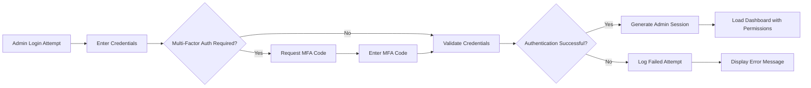
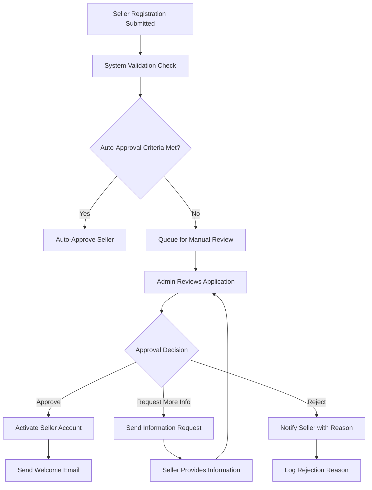

# Admin Dashboard Requirements Specification

## Executive Summary

The Admin Dashboard serves as the central control panel for platform administrators to manage the e-commerce shopping mall. This document defines the comprehensive administrative functions required to oversee user accounts, product catalogs, order processing, system performance, and business analytics.

## Admin Dashboard Core Functions

### Dashboard Overview and Navigation
THE admin dashboard SHALL provide a comprehensive overview of platform performance metrics and key business indicators.

WHEN an admin logs in, THE system SHALL display a customizable dashboard with:
- Real-time order statistics and revenue metrics
- User registration trends and active user counts
- Product catalog health and inventory alerts
- System performance indicators and uptime status
- Recent activity logs and security notifications

### Administrative User Roles
WHERE multiple admin levels exist, THE system SHALL support role-based access control with:
- Super Admin: Full system access and configuration privileges
- Content Admin: Product catalog and content management permissions
- Support Admin: User management and order processing capabilities
- Analytics Admin: Reporting and data analysis access

## User Management System

### User Account Administration
WHEN managing user accounts, THE admin dashboard SHALL provide:
- Complete user search and filtering capabilities
- Bulk user management operations
- User profile viewing and editing permissions
- Account suspension and reactivation functions
- Password reset and security management

### Customer Management
THE admin dashboard SHALL enable comprehensive customer oversight including:
- Customer registration analytics and trends
- Purchase history and behavioral patterns
- Address verification and validation tools
- Customer support ticket management
- Privacy and data management controls

### Seller Management
WHERE seller accounts require approval, THE admin dashboard SHALL provide:
- Seller registration review and approval workflows
- Business verification and documentation management
- Seller performance monitoring and rating systems
- Dispute resolution and mediation tools
- Commission and payment tracking

## Product Catalog Administration

### Product Lifecycle Management
WHEN managing product catalogs, THE admin dashboard SHALL support:
- Product approval workflows for new listings
- Bulk product import and export capabilities
- Category structure management and reorganization
- Product variant and SKU configuration tools
- Inventory level monitoring and low-stock alerts

### Content Moderation
THE admin dashboard SHALL include content moderation features:
- Product description and image approval processes
- Review and rating moderation tools
- Content flagging and takedown procedures
- Automated content quality checks
- Manual content review workflows

### Pricing and Promotion Management
WHILE managing product pricing, THE admin dashboard SHALL provide:
- Price comparison and competitive analysis tools
- Discount and promotion configuration
- Bulk price update capabilities
- Sales performance tracking by product category
- Margin calculation and profitability analysis

## Order Management System

### Order Processing Oversight
THE admin dashboard SHALL provide complete order lifecycle management:
- Real-time order status monitoring
- Order search and filtering by multiple criteria
- Bulk order processing operations
- Order modification and cancellation authority
- Refund and return management tools

### Payment Processing Administration
WHEN overseeing payment operations, THE admin dashboard SHALL include:
- Payment gateway integration monitoring
- Transaction failure analysis and resolution
- Fraud detection and prevention tools
- Payment reconciliation and reporting
- Chargeback management and dispute resolution

### Shipping and Fulfillment Management
THE admin dashboard SHALL support shipping administration:
- Shipping carrier integration management
- Delivery status tracking and updates
- Shipping cost calculation and optimization
- Package tracking and delivery confirmation
- International shipping compliance monitoring

## Analytics and Reporting

### Business Intelligence Dashboard
THE admin dashboard SHALL provide comprehensive analytics including:
- Sales performance reports by time period, category, and region
- Customer acquisition and retention metrics
- Product performance and inventory turnover analysis
- Revenue trends and forecasting tools
- Conversion rate optimization insights

### Custom Reporting Capabilities
WHERE advanced reporting is required, THE admin dashboard SHALL offer:
- Custom report builder with drag-and-drop functionality
- Scheduled report generation and distribution
- Data export in multiple formats (CSV, Excel, PDF)
- Real-time data visualization and charting
- Comparative analysis and benchmarking tools

### Performance Metrics
THE admin dashboard SHALL track key performance indicators:
- Platform uptime and response time metrics
- User engagement and activity levels
- Order processing efficiency measurements
- Customer satisfaction scores and feedback
- System resource utilization monitoring

## System Configuration

### Platform Settings Management
THE admin dashboard SHALL enable system-wide configuration:
- General platform settings and branding customization
- Payment gateway configuration and testing
- Email template management and customization
- Notification settings and delivery preferences
- Tax calculation and compliance settings

### Integration Management
WHEN managing external integrations, THE admin dashboard SHALL provide:
- API key management and security controls
- Third-party service configuration and testing
- Integration health monitoring and alerting
- Data synchronization status tracking
- Backup and recovery configuration

### Business Rules Configuration
THE admin dashboard SHALL support business rule management:
- Order fulfillment rules and workflows
- Inventory management policies
- Customer service level agreements
- Shipping and delivery timeframes
- Return and refund policies

## Platform Monitoring

### System Health Monitoring
THE admin dashboard SHALL provide real-time system monitoring:
- Server performance metrics and resource utilization
- Database performance and query optimization
- Application error tracking and logging
- Security incident detection and reporting
- Backup status and data integrity checks

### Alerting and Notification System
WHEN system issues occur, THE admin dashboard SHALL trigger:
- Real-time alerting for critical system failures
- Performance degradation notifications
- Security breach detection and response
- Capacity planning and scaling recommendations
- Maintenance scheduling and downtime notifications

### Log Management
THE admin dashboard SHALL maintain comprehensive logging:
- User activity logs for audit purposes
- System event logs for troubleshooting
- Security event monitoring and reporting
- API usage tracking and rate limiting
- Compliance and regulatory logging

## Security and Compliance

### Access Control and Authentication
THE admin dashboard SHALL implement robust security measures:
- Multi-factor authentication for admin accounts
- Session management and timeout controls
- IP address restriction and geolocation filtering
- Password policy enforcement and complexity requirements
- Login attempt monitoring and brute force protection

### Data Protection and Privacy
WHILE handling sensitive data, THE admin dashboard SHALL ensure:
- Data encryption for sensitive information
- Privacy compliance with relevant regulations
- Data retention and deletion policies
- User data access controls and permissions
- Audit trail maintenance for compliance

### Compliance Management
THE admin dashboard SHALL support regulatory compliance:
- PCI DSS compliance for payment processing
- GDPR compliance for European customers
- Tax compliance reporting and documentation
- Industry-specific regulatory requirements
- Certification and audit preparation tools

## Integration Requirements

### External System Integration
THE admin dashboard SHALL integrate with external systems:
- Payment gateway administration interfaces
- Shipping carrier management systems
- Analytics and tracking platform integrations
- Customer relationship management systems
- Inventory management system connections

### API Management
WHERE API integrations are required, THE admin dashboard SHALL provide:
- API key generation and management
- Rate limiting and usage monitoring
- API documentation and testing tools
- Integration health checks and status reporting
- Version control and migration support

## User Interface Requirements

### Dashboard Design Principles
THE admin dashboard interface SHALL follow usability principles:
- Intuitive navigation and information architecture
- Responsive design for various screen sizes
- Accessibility compliance for users with disabilities
- Customizable layout and widget placement
- Quick access to frequently used functions

### Mobile Administration
WHERE mobile access is required, THE admin dashboard SHALL provide:
- Mobile-responsive design for tablets and smartphones
- Touch-friendly interface elements
- Offline capability for critical functions
- Push notifications for important alerts
- Mobile-optimized reporting and analytics

## Performance Requirements

### Response Time Expectations
THE admin dashboard SHALL meet performance standards:
- Dashboard loading time under 3 seconds
- Search and filter operations under 2 seconds
- Report generation within 30 seconds for complex queries
- Real-time data updates with minimal latency
- Bulk operation processing with progress indicators

### Scalability Requirements
WHILE supporting platform growth, THE admin dashboard SHALL:
- Handle concurrent admin users without performance degradation
- Support large data sets for reporting and analytics
- Scale with increasing transaction volumes
- Maintain performance during peak usage periods
- Provide caching strategies for frequently accessed data

## Error Handling and Recovery

### System Failure Scenarios
IF system components fail, THE admin dashboard SHALL:
- Provide graceful degradation of non-critical features
- Maintain core administrative functions during partial outages
- Offer manual override capabilities for automated processes
- Provide backup administration methods for critical operations
- Support disaster recovery procedures

### Data Integrity Protection
THE admin dashboard SHALL implement data protection measures:
- Transaction rollback capabilities for failed operations
- Data validation and integrity checks
- Backup and restoration procedures
- Conflict resolution for concurrent modifications
- Data consistency monitoring and reporting

## Future Enhancement Considerations

### Feature Roadmap
THE admin dashboard architecture SHALL support future enhancements:
- Modular design for adding new functionality
- API-first approach for external integrations
- Scalable data architecture for analytics expansion
- Internationalization support for multi-language administration
- Custom plugin architecture for third-party extensions

### Technology Evolution
WHERE technology advancements occur, THE admin dashboard SHALL:
- Support integration with emerging payment technologies
- Adapt to new security standards and protocols
- Incorporate artificial intelligence for predictive analytics
- Support blockchain integration for enhanced security
- Enable IoT device management for warehouse operations

## Authentication and Authorization Workflows

### Admin Authentication Flow

### Permission-Based Access Control
THE admin dashboard SHALL implement granular permission controls:
- WHEN an admin attempts to access a feature, THE system SHALL verify role-based permissions
- WHERE permissions are insufficient, THE system SHALL display access denied message
- THE system SHALL log all permission verification attempts for security auditing

### Session Management
WHILE admin is active, THE system SHALL:
- Monitor session activity and enforce timeout after 30 minutes
- Support concurrent sessions from different devices
- Provide session termination capability for security
- Log all session events for audit purposes

## Business Process Flows

### Seller Approval Workflow

### Content Moderation Workflow
WHEN user-generated content requires moderation, THE system SHALL:
- Automatically flag content based on predefined rules
- Route flagged content to appropriate moderation queue
- Provide moderation tools with approve/reject/request changes options
- Track moderation decision history and response times
- Notify content creators of moderation decisions

## Data Management and Reporting

### Report Generation Process
WHEN generating administrative reports, THE system SHALL:
- Allow selection of report parameters and date ranges
- Process large datasets efficiently with progress indicators
- Generate reports in multiple formats (PDF, Excel, CSV)
- Provide report scheduling for recurring needs
- Maintain report history with version control

### Data Export Requirements
WHERE data export is required, THE system SHALL:
- Support export of user data for compliance requests
- Provide product catalog exports for backup purposes
- Enable order history exports for accounting
- Ensure data integrity during export operations
- Implement proper data formatting for external systems

## Security Incident Response

### Security Breach Detection
WHEN security incidents are detected, THE system SHALL:
- Immediately alert designated security administrators
- Preserve evidence and log all related activities
- Implement containment procedures to limit damage
- Begin incident documentation and analysis
- Coordinate with relevant stakeholders

### Incident Response Procedures
THE admin dashboard SHALL provide incident response tools:
- Emergency user account suspension capabilities
- System-wide security lockdown procedures
- Communication templates for stakeholder notifications
- Forensic data collection and preservation
- Post-incident analysis and improvement recommendations

## Compliance and Audit Requirements

### Regulatory Compliance Monitoring
THE admin dashboard SHALL facilitate compliance with:
- Regular compliance status reporting
- Audit trail maintenance for all administrative actions
- Data retention policy enforcement
- Privacy regulation compliance tracking
- Security standard compliance validation

### Audit Preparation Support
WHERE audits are required, THE system SHALL provide:
- Pre-configured audit reports
- User activity reconstruction capabilities
- System configuration change history
- Security event timeline reconstruction
- Compliance documentation generation

## Performance Optimization

### Dashboard Performance Tuning
THE admin dashboard SHALL implement performance optimization:
- Lazy loading for large datasets
- Intelligent caching for frequently accessed data
- Query optimization for complex reports
- Background processing for non-critical operations
- Progressive loading for improved user experience

### Scalability Architecture
WHILE designing for scalability, THE system SHALL:
- Support horizontal scaling of admin interface components
- Implement efficient database query patterns
- Use distributed caching for session management
- Support load balancing across multiple admin instances
- Monitor resource utilization for capacity planning

> *Developer Note: This document defines **business requirements only**. All technical implementations (architecture, APIs, database design, etc.) are at the discretion of the development team.*