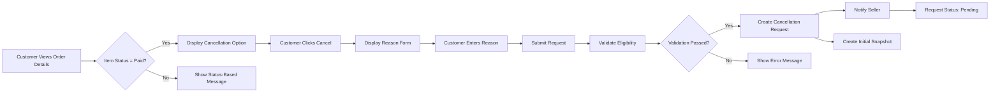
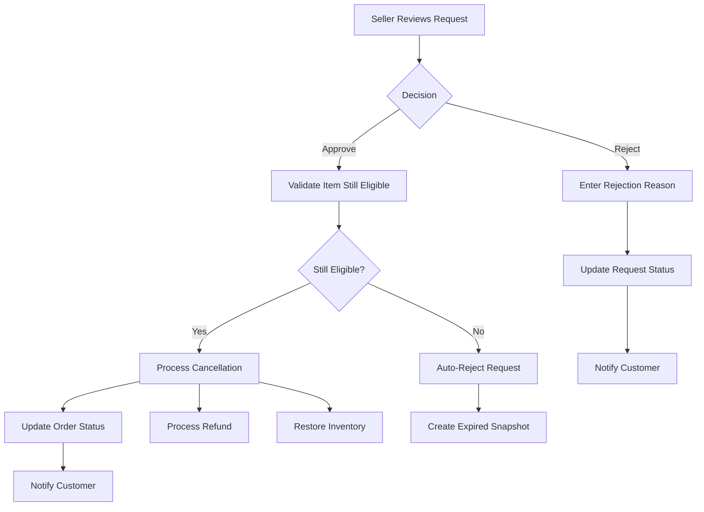
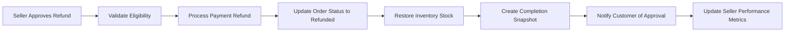
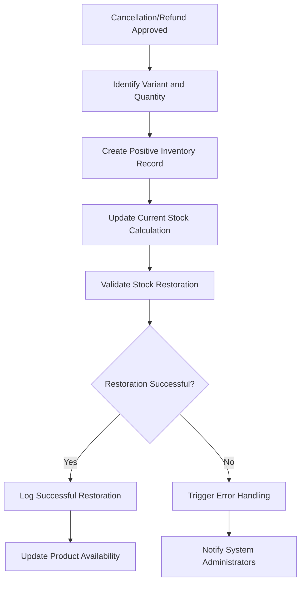

# E-Commerce Platform Cancellation and Refund Requirements

## Document Overview

This document defines the complete business requirements for cancellation and refund request workflows in the e-commerce platform. These workflows ensure proper handling of customer requests while maintaining data integrity and seller accountability through the platform's comprehensive snapshot system.

## Cancellation Request Workflow

### Cancellation Eligibility Requirements

**WHEN** a customer attempts to cancel an order item, **THE** system **SHALL** validate eligibility based on item status and timing.

**ELIGIBILITY RULES:**
- **WHEN** an order item has status "paid" and has not been shipped, **THE** customer **SHALL** be able to request cancellation
- **WHEN** an order item has status "shipped" or "delivered", **THE** system **SHALL** prevent cancellation requests and inform the customer to use the refund process instead
- **WHERE** a cancellation request is pending, **THE** system **SHALL** prevent the seller from shipping the item until the request is resolved

### Cancellation Request Creation Process

**WHEN** a customer initiates a cancellation request for an eligible item, **THE** system **SHALL** execute the following workflow:

**CANCELLATION REQUEST DATA STRUCTURE:**
- Customer identifier and contact information
- Order item identifier with product/variant details
- Cancellation reason (text field, minimum 10 characters, maximum 500 characters)
- Request timestamp with timezone information
- Current status (pending/approved/rejected/expired)
- Associated order and seller references

### Seller Response Handling Workflow

**WHEN** a seller receives a cancellation request notification, **THE** system **SHALL** provide comprehensive request management capabilities.

**SELLER DASHBOARD REQUIREMENTS:**
- **WHEN** a seller logs into their dashboard, **THE** system **SHALL** display pending cancellation requests count prominently
- **WHERE** cancellation requests exist, **THE** seller **SHALL** be able to view detailed request information including:
  - Customer-provided cancellation reason
  - Order item details with product snapshots
  - Request creation timestamp
  - Time elapsed since request submission

**SELLER RESPONSE OPTIONS:**
- **WHEN** reviewing a cancellation request, **THE** seller **SHALL** have option to approve or reject the request
- **IF** seller chooses to approve, **THE** system **SHALL** process immediate cancellation without additional confirmation
- **IF** seller chooses to reject, **THE** system **SHALL** require a rejection reason (minimum 10 characters)

**APPROVAL PROCESS FLOW:**

### Time Constraints and Expiration

**CANCELLATION REQUEST VALIDITY PERIOD:**
- **WHILE** an order item remains in "paid" status, **THE** cancellation request option **SHALL** remain available
- **WHEN** an order item changes to "shipped" status, **THE** system **SHALL** automatically close any pending cancellation requests
- **WHERE** cancellation requests expire due to shipping, **THE** system **SHALL** notify the customer of the status change

**SELLER RESPONSE TIMELINE EXPECTATIONS:**
- **THE** system **SHALL** encourage sellers to respond to cancellation requests within 24 hours
- **WHERE** sellers exceed 48 hours without response, **THE** system **SHALL** send reminder notifications
- **IF** no response after 72 hours, **THE** system **SHALL** escalate to administrative review

## Refund Request Workflow

### Refund Eligibility Requirements

**WHEN** a customer attempts to request a refund, **THE** system **SHALL** enforce strict eligibility criteria.

**REFUND ELIGIBILITY RULES:**
- **WHEN** an order item has status "delivered", **THE** customer **SHALL** be able to request a refund within 7 calendar days of delivery confirmation
- **WHEN** the 7-day refund period has expired, **THE** system **SHALL** prevent refund requests and inform the customer of the time constraint
- **WHERE** an item was automatically marked "delivered" after 14 days, **THE** refund period **SHALL** be calculated from the automatic delivery date

### Refund Request Creation Process

**WHEN** a customer initiates a refund request for an eligible item, **THE** system **SHALL** execute the following validation and creation workflow:

**REFUND REQUEST VALIDATION:**
- **THE** system **SHALL** verify the item was delivered within the last 7 days
- **THE** system **SHALL** confirm the customer has not previously requested a refund for the same item
- **THE** system **SHALL** validate that the item is not already part of an active refund process

**REFUND REQUEST DATA STRUCTURE:**
- Customer identifier and order history context
- Order item identifier with delivery timestamp
- Refund reason (text field with category selection: defective product, wrong item, not as described, changed mind, other)
- Supporting evidence options (image upload for defective/wrong item claims)
- Request timestamp and expected resolution timeframe

### Seller Refund Response Handling

**WHEN** processing refund requests, **THE** system **SHALL** provide sellers with comprehensive decision support tools.

**SELLER REFUND DECISION SUPPORT:**
- **THE** system **SHALL** display product snapshots from time of purchase
- **THE** system **SHALL** show delivery confirmation details and timestamps
- **THE** system **SHALL** provide seller with customer purchase history context
- **THE** system **SHALL** suggest common resolution patterns based on refund reason category

**REFUND APPROVAL CONSEQUENCES:**

**REFUND REJECTION PROCESS:**
- **WHEN** a seller rejects a refund request, **THE** system **SHALL** require a detailed rejection reason
- **THE** rejection reason **SHALL** address the customer's specific refund claim
- **WHERE** rejection reasons are inadequate, **THE** system **SHALL** prompt the seller for more specific information
- **THE** system **SHALL** provide customers with appeal mechanisms for rejected refund requests

## Partial Order Management

### Individual Item Processing Philosophy

**THE** platform **SHALL** operate on an item-level processing model where each order item maintains independent status and processing.

**ITEM-LEVEL PROCESSING BENEFITS:**
- **CUSTOMERS** can request cancellation/refund for specific items without affecting entire orders
- **SELLERS** can process requests independently for their specific products
- **SYSTEM** maintains granular control over inventory restoration and financial transactions
- **ADMINISTRATORS** can resolve disputes with precise item-level focus

### Order Status Derivation Logic

**WHEN** processing cancellation and refund requests, **THE** system **SHALL** dynamically calculate overall order status based on constituent items.

**ORDER STATUS CALCULATION MATRIX:**

| Item Status Combination | Overall Order Status | Description |
|-------------------------|---------------------|-------------|
| All items cancelled | Cancelled | Complete order cancellation |
| All items refunded | Refunded | Complete order refund |
| All items delivered | Delivered | Order fulfillment complete |
| Mixed statuses | Partially Completed | Some items processed, others pending |
| All items paid | Paid | Order payment complete, awaiting shipment |

**STATUS TRANSITION RULES:**
- **WHEN** the last remaining "paid" item is cancelled, **THE** system **SHALL** transition order status to "cancelled"
- **WHEN** the last remaining "delivered" item is refunded, **THE** system **SHALL** transition order status to "refunded"
- **WHERE** items have mixed statuses, **THE** system **SHALL** display "partially completed" with detailed item breakdown

### Mixed Status Order Display

**WHEN** customers view orders with mixed statuses, **THE** system **SHALL** provide clear visual differentiation.

**ORDER DISPLAY REQUIREMENTS:**
- Each order item **SHALL** display its individual status with color coding
- The order summary **SHALL** calculate totals based only on active (non-cancelled/refunded) items
- Cancelled/refunded items **SHALL** be visually distinguished but remain visible for record-keeping
- Order progress indicators **SHALL** reflect the completion percentage of active items

## Inventory Management During Processing

### Stock Restoration Mechanisms

**WHEN** cancellation or refund requests are approved, **THE** system **SHALL** execute precise inventory restoration processes.

**INVENTORY RESTORATION WORKFLOW:**

**INVENTORY RECORD SPECIFICATION:**
- **EACH** inventory restoration **SHALL** create a dedicated inventory history record
- **THE** record **SHALL** contain: variant identifier, positive quantity change, restoration reason, reference to cancellation/refund request, and precise timestamp
- **RESTORATION REASONS** shall be categorized as: "cancellation_approval" or "refund_approval"
- **QUANTITY CALCULATION** shall exactly match the original purchase quantity

### Inventory History Preservation

**THE** system **SHALL** maintain complete and immutable inventory history for all restoration actions.

**AUDIT TRAIL REQUIREMENTS:**
- **ALL** inventory changes **SHALL** be logged with complete contextual information
- **THE** history **SHALL** be queryable by date range, product, variant, or restoration reason
- **ADMINISTRATORS** **SHALL** have access to complete inventory change timelines for dispute resolution
- **THE** system **SHALL** prevent any modification or deletion of inventory history records

## Snapshot System Integration

### Comprehensive Snapshot Coverage

**THE** cancellation and refund system **SHALL** integrate deeply with the platform's snapshot infrastructure for maximum data integrity.

**SNAPSHOT TRIGGER POINTS:**
- **REQUEST CREATION**: Initial snapshot capturing request details and system state
- **SELLER RESPONSE**: Snapshot of decision-making process and rationale
- **PROCESSING COMPLETION**: Final snapshot documenting complete transaction history
- **STATUS TRANSITIONS**: Snapshots for all intermediate state changes

### Snapshot Data Structure

**EACH** cancellation/refund snapshot **SHALL** contain comprehensive contextual information:

**REQUEST CREATION SNAPSHOT:**
- Customer information and order context
- Product and variant details at time of request
- Shipping and delivery status information
- System configuration and business rules active at request time

**RESPONSE SNAPSHOT:**
- Seller identity and decision timestamp
- Approval/rejection decision with detailed reasoning
- System validation results and processing outcomes
- Inventory adjustment calculations and financial impacts

**COMPLETION SNAPSHOT:**
- Final order status configuration
- Financial transaction records and references
- Inventory restoration details and quantities
- Customer notification records and delivery confirmations

### Immutable Record Keeping for Dispute Resolution

**THE** snapshot system **SHALL** provide indisputable evidence for customer-seller disputes.

**DISPUTE RESOLUTION CAPABILITIES:**
- **ADMINISTRATORS** **SHALL** be able to reconstruct complete request timelines
- **CUSTOMERS** **SHALL** have access to their own request histories with full context
- **SELLERS** **SHALL** maintain records for business analysis and improvement
- **LEGAL COMPLIANCE** **SHALL** be supported through comprehensive, timestamped records

## User Interface and Experience Requirements

### Customer-Facing Interfaces

**WHEN** customers interact with cancellation and refund systems, **THE** interface **SHALL** provide clear guidance and status transparency.

**ORDER HISTORY ENHANCEMENTS:**
- **ELIGIBLE ITEMS** shall be prominently marked with action buttons
- **PENDING REQUESTS** shall show current status and expected resolution time
- **COMPLETED REQUESTS** shall display outcomes with relevant details
- **INELIGIBLE ITEMS** shall explain why cancellation/refund is not available

**REQUEST STATUS COMMUNICATION:**
- **PENDING** status shall show time elapsed and typical response times
- **APPROVED** status shall confirm processing and provide next steps
- **REJECTED** status shall clearly explain the reason and potential appeal options
- **EXPIRED** status shall explain why the request was automatically closed

### Seller Dashboard Requirements

**THE** seller interface **SHALL** optimize for efficient request processing while maintaining quality standards.

**DASHBOARD ORGANIZATION:**
- **PENDING REQUESTS** shall be grouped by type (cancellation vs refund) and sorted by urgency
- **REQUEST DETAILS** shall display all relevant information without requiring multiple clicks
- **BULK ACTIONS** shall be available for sellers with high request volumes
- **PERFORMANCE METRICS** shall help sellers optimize their response times and approval rates

**SELLER TOOLING:**
- **TEMPLATE RESPONSES** for common cancellation/refund scenarios
- **QUICK APPROVAL** workflows for straightforward requests
- **ESCALATION PATHS** for complex or disputed requests
- **ANALYTICS DASHBOARD** showing request patterns and resolution outcomes

## Administrative Oversight and Reporting

### Administrator Intervention Capabilities

**WHERE** dispute resolution requires administrative intervention, **THE** system **SHALL** provide comprehensive oversight tools.

**ADMINISTRATOR ACCESS LEVELS:**
- **VIEW-ONLY ACCESS** to all cancellation/refund requests and associated snapshots
- **FORCE ACTION CAPABILITY** to approve/reject requests when sellers are unresponsive
- **SYSTEM OVERRIDE** for exceptional circumstances requiring manual intervention
- **DATA EXPORT** functionality for compliance and reporting requirements

### Reporting and Analytics

**THE** system **SHALL** generate comprehensive reports for platform management and seller improvement.

**KEY PERFORMANCE INDICATORS:**
- Request volumes by time period, product category, and seller
- Average response times and resolution rates
- Common cancellation/refund reasons and patterns
- Customer satisfaction metrics related to request handling
- Financial impact of cancellations and refunds on seller revenue

**SELLER PERFORMANCE REPORTING:**
- Individual seller response time benchmarks
- Approval/rejection ratio analysis
- Customer feedback on request handling
- Comparison against platform averages and top performers

## Business Rules and Validation

### Request Validation Rules

**THE** system **SHALL** implement robust validation to prevent invalid or duplicate requests.

**VALIDATION CHECKS:**
- **ITEM STATUS VERIFICATION** before request creation
- **DUPLICATE REQUEST PREVENTION** across similar timeframes
- **CUSTOMER ELIGIBILITY CONFIRMATION** for order ownership
- **TIME WINDOW ENFORCEMENT** for refund eligibility periods

### Data Integrity Constraints

**THE** system **SHALL** maintain transactional integrity across all cancellation and refund operations.

**CONCURRENCY CONTROLS:**
- **REQUEST LOCKING** to prevent simultaneous modifications
- **STATUS TRANSITION VALIDATION** to ensure logical progression
- **INVENTORY ADJUSTMENT ATOMICITY** to prevent partial updates
- **FINANCIAL TRANSACTION CONSISTENCY** across payment processing

## Error Handling and Edge Cases

### Payment Gateway Integration Failures

**WHEN** refund processing encounters payment system failures, **THE** system **SHALL** implement graceful error handling.

**FAILURE RECOVERY WORKFLOW:**
- **AUTOMATIC RETRY** with exponential backoff for transient failures
- **MANUAL INTERVENTION** prompts for persistent payment issues
- **STATUS COMMUNICATION** to keep customers informed of processing delays
- **COMPENSATING TRANSACTIONS** to maintain system consistency during failures

### Seller Non-Response Scenarios

**WHERE** sellers fail to respond within reasonable timeframes, **THE** system **SHALL** implement escalation procedures.

**NON-RESPONSE HANDLING:**
- **REMINDER NOTIFICATIONS** at 24, 48, and 72-hour intervals
- **ADMINISTRATOR ESCALATION** for requests exceeding 72 hours without response
- **AUTOMATIC APPROVAL** consideration for straightforward cancellation requests
- **SELLER PERFORMANCE TRACKING** for response time compliance

### System Failures During Processing

**THE** system **SHALL** be resilient to failures during critical processing operations.

**FAILURE RECOVERY MECHANISMS:**
- **TRANSACTION ROLLBACK** capabilities for incomplete operations
- **REQUEST STATE PRESERVATION** during system outages
- **AUTOMATIC RECOVERY** upon system restoration
- **MANUAL RECOVERY TOOLS** for administrators to resolve stuck requests

## Performance and Scalability Requirements

### System Performance Benchmarks

**THE** cancellation and refund system **SHALL** meet stringent performance requirements.

**RESPONSE TIME TARGETS:**
- Request creation and validation: Under 1 second
- Seller dashboard loading: Under 2 seconds
- Bulk request processing: Under 5 seconds for 100 concurrent requests
- Status update propagation: Near real-time across all interfaces

### Scalability Considerations

**THE** system architecture **SHALL** support scaling to handle peak shopping periods.

**SCALABILITY FEATURES:**
- **HORIZONTAL SCALING** support for request processing workloads
- **DATABASE PARTITIONING** strategies for large request volumes
- **CACHING STRATEGIES** for frequently accessed request data
- **QUEUEING MECHANISMS** for processing high-volume financial transactions

## Security and Compliance Requirements

### Access Control and Authorization

**THE** system **SHALL** implement robust security measures to protect sensitive cancellation and refund data.

**SECURITY CONTROLS:**
- **ROLE-BASED ACCESS** ensuring customers can only access their own requests
- **SELLER SEGREGATION** preventing cross-seller data access
- **ADMINISTRATOR AUDITING** tracking all oversight actions
- **DATA ENCRYPTION** for sensitive financial and personal information

### Regulatory Compliance

**THE** system **SHALL** support compliance with relevant consumer protection regulations.

**COMPLIANCE FEATURES:**
- **DATA RETENTION** policies meeting legal requirements (typically 7+ years)
- **AUDIT TRAIL** capabilities for regulatory examinations
- **CONSUMER RIGHTS** support for refund and cancellation protections
- **FINANCIAL REPORTING** integration for tax and accounting purposes

## Success Metrics and Continuous Improvement

### Key Performance Indicators

**THE** system **SHALL** track and report on critical cancellation and refund metrics.

**PRIMARY KPIs:**
- Customer satisfaction with request handling process
- Average time from request to resolution
- Seller response rate and timeliness
- Financial accuracy of refund processing
- System availability and error rates

### Continuous Improvement Mechanisms

**THE** platform **SHALL** incorporate feedback loops for ongoing enhancement.

**IMPROVEMENT PROCESSES:**
- **CUSTOMER FEEDBACK** collection on request experience
- **SELLER FEEDBACK** on tools and interface effectiveness
- **SYSTEM ANALYTICS** identifying process bottlenecks
- **REGULAR REVIEW** of business rules and validation criteria

> *Developer Note: This document defines **business requirements only**. All technical implementations (architecture, APIs, database design, etc.) are at the discretion of the development team.*