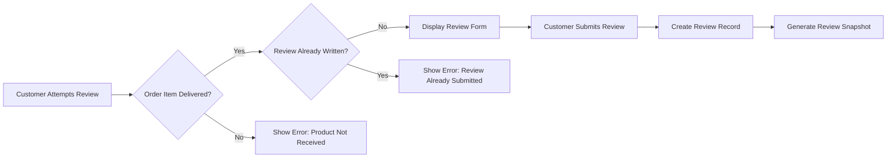
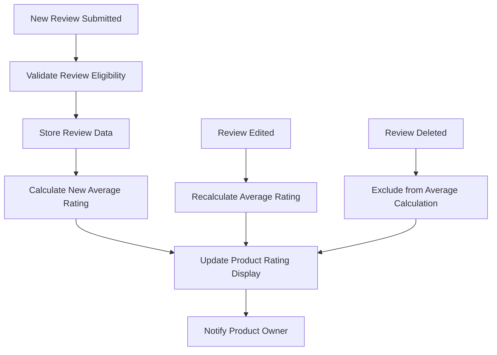
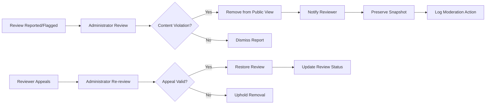

# E-Commerce Platform Review and Rating System

## Introduction

The rating and review system enables customers to provide feedback on products they have purchased, helping other customers make informed buying decisions while maintaining platform integrity through comprehensive snapshot preservation and moderation capabilities. This system ensures transparency and trust in the e-commerce platform by preserving all review modifications through immutable snapshots.

## Review Creation Requirements

### Eligible Reviewers

**WHEN** a customer has purchased a product and the order item status becomes "delivered", **THE** system **SHALL** enable review creation for that specific product.
**THE** customer **SHALL** be able to write one review per product per order.

**Review Eligibility Validation:**

### Review Content Specifications

**THE** review system **SHALL** require:
- A rating value between 1 and 5 stars (integer values only)
- Optional text content with maximum length of 2,000 characters
- Validation of content against platform guidelines

**Review Submission Process:**
**WHEN** a customer submits a review, **THE** system **SHALL**:
- Validate that the customer has purchased and received the product
- Prevent duplicate reviews for the same product within the same order
- Create an immutable snapshot of the review state at submission time
- Associate the review with the specific product variant purchased
- Display the review on the product detail page immediately

## Rating System

### Average Rating Calculation

**THE** system **SHALL** calculate product average ratings dynamically from all non-deleted reviews.
**WHERE** multiple reviews exist for a product, **THE** system **SHALL**:
- Calculate the average rating to one decimal place
- Update the average automatically when new reviews are added or existing reviews are modified
- Exclude deleted reviews from the calculation
- Maintain mathematical accuracy in all rating computations

### Rating Display

**WHEN** displaying product ratings, **THE** system **SHALL** show:
- The current average rating (e.g., 4.2 out of 5)
- The total number of reviews contributing to the average
- Individual reviews sorted by newest first
- Rating distribution breakdown (number of 1-star, 2-star, etc. reviews)

**Rating Calculation Workflow:**

## Review Management

### Review Visibility

**WHEN** a review is successfully submitted, **THE** system **SHALL**:
- Display the review on the product detail page immediately
- Show the reviewer's display name (not email address)
- Include the purchase date context where applicable
- Provide helpful voting system for review usefulness
- Allow other customers to report inappropriate reviews

### Review Editing

**WHEN** a customer wants to edit their existing review, **THE** system **SHALL**:
- Allow editing of both rating and text content
- Create a new snapshot preserving the previous review state
- Update the average rating calculation if the rating changes
- Maintain the original submission timestamp for display purposes
- Show "edited" indicator on the review display

### Review Deletion

**WHEN** a customer deletes their review, **THE** system **SHALL**:
- Remove the review from public display on the product page
- Preserve all review snapshots for audit and dispute resolution
- Update the average rating to exclude the deleted review
- Prevent the customer from writing a new review for the same product order
- Maintain the deletion record in the review history

## Account Deletion Impact

**WHEN** a customer deletes their account, **THE** system **SHALL**:
- Preserve all reviews written by that customer
- Display reviews from deleted accounts as "deleted user"
- Continue including these reviews in average rating calculations
- Maintain the integrity of all review snapshots
- Ensure no personal information is exposed from deleted accounts

## Integration with Product Catalog

### Product Page Integration

**THE** product detail page **SHALL** display:
- The current average rating prominently near the product title
- The total review count as clickable link to review section
- All reviews in paginated format (e.g., 10 reviews per page)
- Review filtering options (by rating, newest/oldest first, most helpful)
- Review sorting capabilities based on various criteria

### Search Result Integration

**THE** product search results **SHALL** include:
- The average rating for each product when available
- The review count to indicate popularity and social proof
- Rating-based filtering options in search filters
- Visual rating indicators (star ratings) for quick assessment
- Review count thresholds for filtering (e.g., products with 10+ reviews)

## Moderation and Administrative Oversight

### Administrator Review Access

**WHERE** administrators need to monitor review content, **THE** system **SHALL**:
- Provide administrators with access to all reviews and their snapshots
- Allow administrators to view review edit history through snapshots
- Enable administrators to remove inappropriate reviews if necessary
- Provide moderation tools for bulk review management
- Maintain audit trails of all moderation actions

### Review Integrity Maintenance

**IF** a review contains prohibited content, **THEN** administrators **SHALL** be able to:
- Remove the review from public view
- Preserve the review and all snapshots for audit purposes
- Notify the reviewer of the action taken with appropriate reason
- Provide appeal process for disputed moderation actions
- Track moderation statistics for platform quality assessment

**Review Moderation Workflow:**

## Snapshot Preservation System

### Review Snapshot Creation

**THE** system **SHALL** create immutable snapshots whenever:
- A new review is submitted
- An existing review is edited
- A review's visibility status changes
- A review is moderated by administrators

### Snapshot Content

**EACH** review snapshot **SHALL** contain:
- The complete review content (rating and text)
- The timestamp of the change
- The user who made the change
- The state before and after the change (for edits)
- The reason for moderation actions (if applicable)

### Snapshot Access

**WHEN** review disputes or audits occur, **THE** system **SHALL** provide:
- Administrators with full access to all review snapshots
- Sellers with access to snapshots of reviews on their products
- Customers with access to snapshots of their own reviews
- Legal authorities with appropriate access for compliance requirements

## Performance and User Experience Requirements

### Response Time

**WHEN** customers view product reviews, **THE** system **SHALL**:
- Load review sections within 2 seconds for typical product pages
- Paginate reviews to maintain fast loading times
- Cache average ratings to reduce database load
- Implement efficient database queries for review retrieval
- Support concurrent review submissions without performance degradation

### Mobile Experience

**WHERE** customers access the platform via mobile devices, **THE** review interface **SHALL**:
- Provide touch-friendly rating selection
- Offer optimized text input for mobile keyboards
- Maintain readability on smaller screens
- Support gesture-based navigation through reviews
- Optimize image loading for mobile bandwidth

## Error Handling and Edge Cases

### Review Submission Errors

**IF** a customer attempts to review a product they haven't purchased, **THE** system **SHALL**:
- Display a clear error message explaining the eligibility requirement
- Prevent the review from being submitted
- Guide the customer to their order history for eligible products
- Provide helpful suggestions for similar products they have purchased

### Concurrent Editing Prevention

**WHILE** a customer is editing their review, **THE** system **SHALL**:
- Prevent other users from viewing intermediate edit states
- Handle concurrent edit attempts with appropriate conflict resolution
- Maintain data consistency through proper transaction handling
- Provide version control for complex edit scenarios

### Data Integrity

**THE** review system **SHALL** ensure that:
- All rating calculations are mathematically accurate
- Review counts remain consistent with actual published reviews
- Snapshot data is never lost or corrupted
- Deleted reviews are properly excluded from public displays but preserved for audits
- Average ratings update correctly across all product displays

## Business Rules and Validation

### Review Content Guidelines

**THE** system **SHALL** enforce content guidelines including:
- Prohibition of offensive, abusive, or spam content
- Prevention of personal information sharing in reviews
- Appropriate language and tone requirements
- Prohibition of fake or incentivized reviews
- Compliance with legal requirements for review content

### Rating Validation

**WHEN** processing ratings, **THE** system **SHALL**:
- Validate that ratings are integers between 1 and 5
- Reject invalid rating values with clear error messages
- Ensure rating calculations handle edge cases (no reviews, single review)
- Prevent rating manipulation through systematic validation
- Maintain rating integrity across all platform operations

## Integration Points

### Order Management Integration

**THE** review system **SHALL** integrate with order management to:
- Verify purchase eligibility based on order item status
- Link reviews to specific product variants purchased
- Provide context about the purchase experience
- Synchronize review availability with order delivery status
- Maintain consistency between order history and review capabilities

### Product Catalog Integration

**THE** system **SHALL** maintain consistency with product catalog by:
- Automatically removing reviews when products are deleted
- Preserving review snapshots even after product deletion
- Updating product ratings when product information changes
- Synchronizing product availability with review display
- Maintaining category-based review aggregation

### User Account Integration

**THE** review system **SHALL** work with user accounts to:
- Display appropriate reviewer information
- Handle account deletion scenarios gracefully
- Maintain review ownership and permissions
- Support user profile integration with review history
- Provide personalized review recommendations

### Seller Dashboard Integration

**THE** review system **SHALL** integrate with seller dashboard to:
- Provide sellers with review notifications
- Enable sellers to respond to reviews
- Display review analytics in seller performance metrics
- Support seller reputation management
- Facilitate seller-customer communication through reviews

## Security and Compliance Requirements

### Data Protection

**THE** review system **SHALL** implement:
- Secure storage of review content and user data
- Privacy protection for reviewer information
- Compliance with data protection regulations (GDPR, CCPA)
- Appropriate access controls for review data
- Secure transmission of review information

### Audit and Compliance

**THE** system **SHALL** maintain:
- Comprehensive audit trails for all review operations
- Compliance with consumer protection regulations
- Legal compliance for review content moderation
- Transparency in rating calculations and display
- Accountability for all review-related actions

## Success Metrics and Monitoring

### Performance Indicators

**THE** system **SHALL** track:
- Review submission success rates
- Average rating accuracy metrics
- Review moderation effectiveness
- User satisfaction with review system
- Platform trust indicators based on review quality

### Quality Assurance

**THE** platform **SHALL** implement:
- Regular review quality assessments
- Automated detection of suspicious review patterns
- Continuous improvement of review guidelines
- User feedback mechanisms for review system enhancements
- Performance monitoring for review-related operations

This comprehensive review and rating system ensures that customers can provide meaningful feedback on their purchases while maintaining platform integrity through robust snapshot preservation, moderation capabilities, and seamless integration with other platform components.