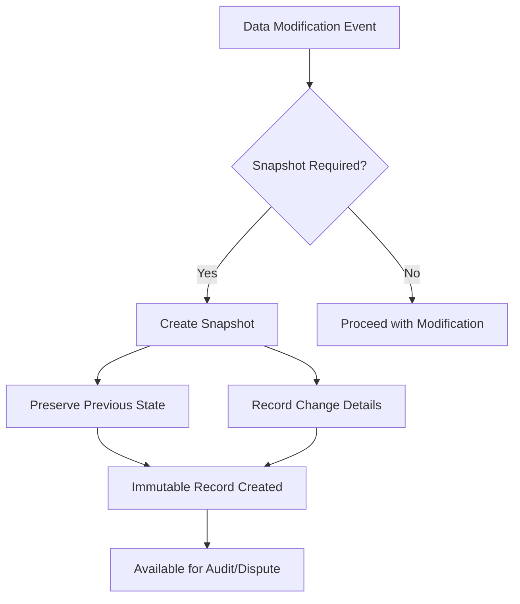

# E-Commerce Shopping Mall Platform Requirements Specification

## Executive Summary

This document specifies the comprehensive requirements for a secure e-commerce shopping mall platform that facilitates transactions between customers and sellers while maintaining data integrity through a robust snapshot system. The platform enforces mandatory registration, supports multi-vendor operations, and provides comprehensive administrative oversight.

## Platform Architecture Principles

### Core Design Philosophy

The platform operates on three fundamental principles:
1. **Data Integrity**: All financial transactions and data modifications are preserved through immutable snapshots
2. **Role-Based Access**: Strict separation between customer, seller, and administrator privileges
3. **Transaction Security**: Comprehensive audit trail for all money-related operations

### Snapshot System Overview

## User Authentication System

### Customer Account Management

**Registration Requirements**
- WHEN a user attempts to access any platform feature, THE system SHALL require authentication
- WHEN a customer registers, THE system SHALL require valid email and password
- THE system SHALL validate email format and password strength during registration
- WHERE registration succeeds, THE system SHALL create a customer account with "active" status

**Login and Session Management**
- WHEN a customer logs in with valid credentials, THE system SHALL create an authenticated session
- THE system SHALL maintain session security through JWT tokens with appropriate expiration
- WHERE login fails due to invalid credentials, THE system SHALL return specific error message

**Account Management Operations**
- WHEN a customer changes their password, THE system SHALL require current password verification
- WHERE password change succeeds, THE system SHALL invalidate all existing sessions
- WHEN a customer deletes their account, THE system SHALL:
  - Remove profile information (display name, phone number)
  - Preserve all order history and financial records
  - Maintain reviews with "deleted user" attribution
  - Prevent future login attempts

### Customer Profile Management

**Profile Structure**
- Each customer profile SHALL contain: display name and phone number
- WHEN a customer edits their profile, THE system SHALL validate input formats
- Profile updates SHALL take effect immediately across the platform

**Address Management System**
- Customers SHALL be able to add multiple shipping addresses
- Each address SHALL contain: recipient name, phone number, street address, city, state/province, postal code, country
- WHEN adding a new address, THE system SHALL validate address completeness
- Customers SHALL be able to edit existing addresses with validation
- Address deletion SHALL be permitted only if not used in active orders
- Customers SHALL be able to set one address as default shipping address

### Seller Account Management

**Seller Registration Process**
- WHEN a user registers as a seller, THE system SHALL require email and password authentication
- New seller accounts SHALL be placed in "pending approval" status
- Pending sellers SHALL have limited platform access until administrator approval

**Seller Approval Workflow**
- Administrators SHALL review pending seller registrations
- WHEN a seller is approved, THE system SHALL grant full seller privileges
- WHERE a seller is rejected, THE system SHALL provide specific rejection reason
- Rejected sellers SHALL be able to submit new registration requests

**Seller Account Deletion Constraints**
- WHEN a seller attempts to delete their account, THE system SHALL verify:
  - No pending orders exist (paid or shipped status)
  - No pending cancellation or refund requests exist
- WHERE deletion constraints are satisfied, THE system SHALL:
  - Remove all seller products from active listings
  - Preserve order history and product snapshots
  - Maintain shop name in past orders for customer reference

**Seller Profile Management**
- Each seller profile SHALL contain: shop name, shop description, and logo image
- WHEN a seller edits their profile, THE system SHALL create a snapshot
- Customers SHALL be able to view seller profiles with current information

## Product Catalog System

### Category Management

**Category Structure**
- Products SHALL be organized into categories with one level of subcategory nesting
- Each category SHALL have: name and description
- Administrators SHALL be responsible for category creation and management
- Customers SHALL be able to browse all categories and view products within categories

**Category Operations**
- WHEN an administrator creates a category, THE system SHALL validate uniqueness
- Category editing SHALL be restricted to administrators only
- WHERE a category is deleted, products in that category SHALL become uncategorized

### Product Creation and Management

**Product Requirements**
- Sellers SHALL be able to create products with: name (required), description (required), category (required), base price (required)
- Each product SHALL belong to the seller who created it
- Products SHALL require at least one variant to be purchasable

**Product Editing and Snapshots**
- WHEN a seller edits a product, THE system SHALL create a product snapshot
- Product snapshots SHALL include: all product fields, images, and variant snapshots
- Sellers SHALL be able to view snapshots of their own products
- Administrators SHALL be able to view snapshots of any product

**Product Deletion Constraints**
- A product SHALL only be deletable if:
  - No pending order items exist (paid or shipped status) for any variant
  - No pending cancellation or refund requests exist for any variant
- WHERE deletion occurs, THE system SHALL remove the product from all listings

### Product Image Management

**Image Operations**
- Sellers SHALL be able to upload multiple images per product
- Image ordering SHALL be customizable with the first image serving as thumbnail
- Image deletion SHALL be permitted with snapshot preservation
- All image changes SHALL be included in product snapshots

### Product Variant System

**Variant Requirements**
- Each variant SHALL have: SKU code (unique, required), option values, price (optional override), stock quantity (required, starts at 0)
- Products without variants SHALL be visible but marked as "unavailable"

**Variant Management**
- Sellers SHALL be able to add, edit, and delete variants
- Each variant edit SHALL create a snapshot
- Variant deletion SHALL require:
  - No pending order items for that variant
  - No pending cancellation/refund requests for that variant

### Inventory Management System

**Stock Tracking**
- Each variant SHALL maintain stock quantity through inventory history records
- Inventory records SHALL track: quantity change, reason, and timestamp
- Current stock SHALL be calculated by summing all inventory records

**Inventory Operations**
- Sellers SHALL be able to add inventory (restock) with quantity and reason
- Sellers SHALL be able to subtract inventory (adjustment) with quantity and reason
- Order placement SHALL automatically create negative inventory records
- Order cancellation/refund SHALL automatically create positive inventory records
- Sellers SHALL have access to complete inventory history for each variant

## Product Discovery and Browsing

### Search Functionality

**Search Requirements**
- Customers SHALL be able to search products by name across all sellers
- Search results SHALL support pagination for large result sets

**Search Filters**
- Customers SHALL be able to filter search results by:
  - Category selection
  - Price range (minimum and maximum)
  - In-stock availability
- Filter combinations SHALL be supported for refined searching

**Search Sorting**
- Customers SHALL be able to sort search results by:
  - Newest products first
  - Price low to high
  - Price high to low

### Product Display

**Listing View**
- Product listings SHALL display: thumbnail image, name, price (or range), seller shop name, average rating
- Out-of-stock products SHALL be clearly marked

**Detail View**
- Product detail pages SHALL show: all images, name, description, category, seller info, available variants, ratings, reviews
- Variant selection SHALL display current stock status and pricing

## Shopping Experience

### Wishlist Management

**Wishlist Operations**
- Customers SHALL be able to add products to their wishlist
- Wishlist SHALL display products (not specific variants)
- Customers SHALL be able to remove products from wishlist
- WHERE a product is deleted, THE system SHALL automatically remove it from all wishlists
- Wishlist SHALL support pagination for large collections

### Shopping Cart System

**Cart Operations**
- Customers SHALL add specific variants to cart with quantity selection
- Duplicate variants SHALL combine quantities rather than create separate lines
- Cart SHALL display: product name, variant options, price, quantity, subtotal
- Customers SHALL be able to modify quantities and remove items

**Cart Validation**
- THE system SHALL validate cart contents against current stock levels
- WHERE stock is insufficient, THE system SHALL display warnings
- Unavailable items SHALL be clearly marked in the cart

### Checkout Process

**Checkout Requirements**
- Customers SHALL proceed to checkout from their cart
- Unavailable items SHALL be excluded from checkout
- Customers SHALL select a shipping address (default or custom)

**Order Review**
- Before placement, customers SHALL review: item list with prices, shipping address, total price
- Once placed, shipping address SHALL become immutable

## Order Management System

### Payment Processing

**Payment Integration**
- THE system SHALL integrate with external payment gateway
- Payment attempts SHALL have success/failure outcomes
- WHERE payment fails, order creation SHALL be prevented with retry option

### Order Creation

**Order Creation Process**
- WHEN payment succeeds, THE system SHALL:
  - Decrease stock quantities for purchased variants
  - Clear items from customer's cart
  - Create order record with "paid" status
  - Save snapshots of products, variants, and seller profiles

**Order Structure**
- Orders SHALL contain one or more order items
- Each order item represents a purchased variant with quantity
- Items from different sellers SHALL be grouped in the same order
- Each order item SHALL have independent status tracking

### Order Status Management

**Order Item Statuses**
- Paid: Payment completed, awaiting seller shipment
- Shipped: Seller has shipped the item
- Delivered: Item has been delivered to customer
- Cancelled: Item was cancelled with refund
- Refunded: Item was refunded after delivery

**Overall Order Status**
- All items paid → Order status: "paid"
- Any item shipped (none delivered) → Order status: "shipped"
- All items delivered → Order status: "delivered"
- All items cancelled → Order status: "cancelled"
- All items refunded → Order status: "refunded"
- Mixed statuses → Order status: "partially completed"

### Order History

**Customer Order Access**
- Customers SHALL be able to view paginated order history
- Order list SHALL show: order number, date, total price, overall status
- Order details SHALL include: items with status, shipping address, shipment tracking

## Shipping and Delivery

### Shipment Management

**Shipment Concept**
- Shipments represent packages sent by sellers
- Each shipment SHALL contain one or more order items from the same seller
- Sellers SHALL choose shipment composition (individual or bundled)

**Shipping Process**
- Sellers SHALL view items requiring shipment
- WHEN creating shipment, sellers SHALL provide: carrier name, tracking number
- All items in shipment SHALL share tracking information
- Shipment creation SHALL update item status to "shipped"

**Delivery Confirmation**
- Customers SHALL view tracking information per shipment
- Customers SHALL confirm delivery per shipment
- WHERE delivery not confirmed, system SHALL auto-mark "delivered" after 14 days

## Cancellation and Refund System

### Cancellation Process

**Cancellation Eligibility**
- Customers SHALL be able to request cancellation for "paid" status items
- Cancellation requests SHALL include reason text
- Sellers SHALL approve or reject cancellation requests

**Cancellation Outcomes**
- WHEN approved, THE system SHALL:
  - Cancel the item with refund processing
  - Restore stock quantities
  - Create cancellation snapshot
- Remaining order items SHALL continue normal processing

### Refund Process

**Refund Eligibility**
- Customers SHALL request refunds for "delivered" status items
- Refund requests SHALL be submitted within 7 days of delivery
- Refund requests SHALL include reason text

**Refund Outcomes**
- WHEN approved, THE system SHALL:
  - Process refund for the item
  - Restore stock quantities
  - Create refund snapshot
- Unaffected items SHALL maintain their status

## Review System

### Review Creation

**Review Eligibility**
- Customers SHALL write reviews only for delivered products
- Each product per order SHALL allow one review
- Reviews SHALL contain: rating (1-5 stars, required), text content (optional)

### Review Management

**Review Operations**
- Customers SHALL edit their own reviews with snapshot creation
- Customers SHALL delete their reviews (snapshots preserved)
- Product average rating SHALL calculate from non-deleted reviews
- Reviews SHALL display newest first on product pages

## Seller Dashboard

### Dashboard Overview

**Seller Summary**
- Sellers SHALL view: total products, total order items, pending cancellations, pending refunds
- Dashboard SHALL provide quick access to critical business metrics

### Order Management Interface

**Order Viewing**
- Sellers SHALL view all order items for their products
- Filtering SHALL be available by order item status
- Sellers SHALL have access to shipment creation tools

## Administrative System

### Administrator Hierarchy

**Administrator Grades**
- Regular Administrator: Seller management, category administration, product oversight
- Super Administrator: All regular privileges plus administrator management

**Administrator Promotion**
- Users SHALL submit requests to become administrators
- Super administrators SHALL review and approve/reject requests
- Promotion/demotion SHALL follow strict privilege rules

### Platform Management

**Seller Oversight**
- Administrators SHALL manage seller approvals and suspensions
- Suspended sellers SHALL have limited platform access
- Seller banning SHALL preserve historical data

**Category Administration**
- Administrators SHALL create, edit, and delete categories
- Category changes SHALL maintain product integrity

**Product Oversight**
- Administrators SHALL view all products and their snapshots
- Administrative product deletion SHALL bypass normal constraints

**Order Intervention**
- Administrators SHALL force-cancel or force-refund orders
- All interventions SHALL create administrative snapshots

**User Management**
- Administrators SHALL manage customer and seller accounts
- Banning operations SHALL preserve financial records

## Data Integrity and Compliance

### Snapshot Principle Implementation

**Snapshot Requirements**
- ALL financial and product data modifications SHALL create snapshots
- Snapshots SHALL be immutable and permanent
- Snapshots SHALL record: timestamp, change details, previous/current values

**Snapshot Coverage**
- Products (all fields including images)
- Product variants (SKU, options, price)
- Seller profiles (shop name, description, logo)
- Order items (product, variant, seller profile at purchase)
- Reviews (rating, content)
- Cancellation/refund requests (reason, status changes)

### Audit and Dispute Resolution

**Audit Capabilities**
- Relevant parties SHALL access snapshots for dispute resolution
- Administrative actions SHALL maintain comprehensive audit trails
- System SHALL support legal and compliance requirements

## Performance and Scalability

### System Performance Requirements

**Response Times**
- Product search results SHALL load within 2 seconds
- Order processing SHALL complete within 5 seconds
- User authentication SHALL respond within 1 second

**Scalability Considerations**
- System SHALL support concurrent user sessions
- Database SHALL handle high-volume transaction processing
- Search functionality SHALL scale with product catalog growth

## Security Requirements

### Authentication Security

**Password Security**
- THE system SHALL enforce strong password policies
- Password changes SHALL require current password verification
- Session management SHALL follow security best practices

### Data Protection

**Financial Data Security**
- Payment information SHALL be handled through secure external gateway
- Order financial data SHALL be protected with appropriate encryption
- Customer financial information SHALL not be stored unnecessarily

## Error Handling and Recovery

### System Error Scenarios

**Payment Failures**
- WHERE payment processing fails, THE system SHALL provide clear error messages
- Customers SHALL have retry options for failed payments
- Order creation SHALL only occur after successful payment

**Inventory Conflicts**
- WHERE stock becomes insufficient during checkout, THE system SHALL prevent order completion
- Customers SHALL receive clear notifications about inventory issues
- Cart SHALL automatically update to reflect current stock levels

## Integration Requirements

### External System Integration

**Payment Gateway**
- THE system SHALL integrate with standard payment gateways
- Payment status updates SHALL be reliably communicated
- Failed payment handling SHALL maintain data consistency

**Shipping Carrier Integration**
- Tracking information SHALL be stored and displayed accurately
- Carrier API integration SHALL support status updates
- Delivery confirmation SHALL synchronize with carrier systems

## Business Rules and Validation

### Validation Rules

**Data Validation**
- ALL user inputs SHALL be validated for format and completeness
- Business rule violations SHALL prevent invalid operations
- Error messages SHALL be specific and actionable

**Constraint Enforcement**
- Deletion operations SHALL respect business constraints
- Status transitions SHALL follow defined workflows
- Privilege checks SHALL be enforced consistently

## Monitoring and Reporting

### System Monitoring

**Performance Monitoring**
- THE system SHALL track key performance indicators
- Administrative dashboards SHALL provide system health metrics
- Error rates and response times SHALL be monitored

### Business Reporting

**Sales Reporting**
- Sellers SHALL access their sales performance data
- Administrators SHALL view platform-wide sales metrics
- Reporting SHALL support date range filtering

## Future Considerations

### Platform Evolution

**Feature Roadmap**
- Enhanced seller analytics tools
- Advanced product recommendation engine
- Multi-language and currency support
- Mobile application development

**Technical Enhancements**
- API rate limiting and throttling
- Advanced caching strategies
- Microservices architecture migration
- Enhanced search engine capabilities

---

*This requirements specification document provides comprehensive business requirements for the e-commerce shopping mall platform. All technical implementation details (database schemas, API specifications, architecture decisions) are deferred to subsequent development phases.*