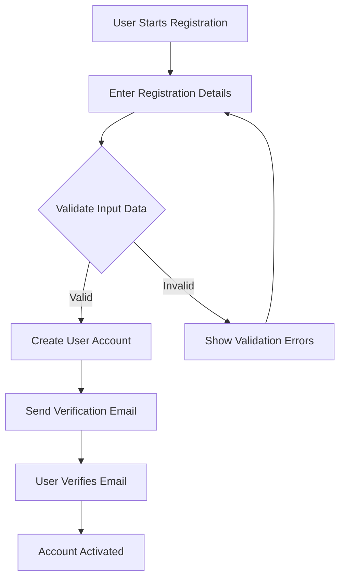
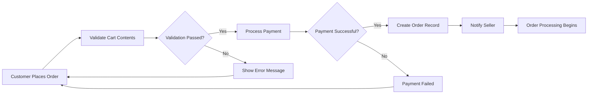

# Business Rules and Validation Requirements for E-commerce Platform

## Introduction to Business Rules Framework

This document defines the comprehensive business rules, validation requirements, and error handling scenarios that govern the operation of the shoppingMall e-commerce platform. These rules ensure consistent platform behavior, data integrity, and optimal user experience across all customer interactions.

### Scope of Business Rules
Business rules cover all aspects of platform operations including:
- User registration and authentication workflows
- Product catalog management and validation
- Shopping cart operations and order processing
- Payment transactions and financial validations
- Seller account management and inventory control
- Administrative functions and platform governance

## User Registration and Authentication Rules

### User Registration Validation
WHEN a user attempts to register, THE system SHALL validate the following requirements:
- Email address format must be valid and unique across the platform
- Password must meet minimum security requirements (8+ characters, including letters, numbers, and special characters)
- Required profile information must be provided (name, contact details)
- Terms of service acceptance must be confirmed

### Email Verification Process
WHEN a user registers successfully, THE system SHALL send an email verification link that expires within 24 hours.
WHERE email verification is pending, THE user SHALL have limited platform access until verification is complete.

### Address Management Rules
WHEN a user adds a shipping address, THE system SHALL validate:
- Address format completeness (street, city, state, postal code, country)
- Postal code format validity for the specified country
- Address uniqueness to prevent duplicates
- Maximum limit of 10 saved addresses per user

### Authentication Security Rules
WHILE a user is logged in, THE system SHALL automatically log out inactive sessions after 30 minutes.
IF a user enters incorrect credentials 5 times consecutively, THEN THE system SHALL temporarily lock the account for 15 minutes.

## Product Catalog Management Rules

### Product Creation Validation
WHEN a seller creates a new product, THE system SHALL validate:
- Product title must be between 5 and 200 characters
- Product description must be between 50 and 5000 characters
- Price must be positive numeric value with maximum 2 decimal places
- Stock quantity must be non-negative integer
- Category assignment must reference valid existing categories

### SKU Variant Management Rules
WHERE products have variants (colors, sizes, options), THE system SHALL enforce:
- Each variant combination must have a unique SKU
- Variant prices can differ from base product price
- Inventory must be tracked separately for each SKU
- Variant combinations must be logically consistent

### Category Hierarchy Rules
WHEN managing product categories, THE system SHALL enforce:
- Maximum category depth of 3 levels (main category → subcategory → sub-subcategory)
- Products can only be assigned to leaf-level categories
- Category names must be unique within the same parent category

### Inventory Management Rules
WHEN inventory levels change, THE system SHALL:
- Prevent orders when inventory reaches zero
- Show "low stock" warning when inventory falls below 10 units
- Automatically mark products as "out of stock" when inventory is zero
- Update inventory in real-time during order processing

## Shopping Cart and Order Processing Rules

### Cart Management Rules
WHEN users add items to cart, THE system SHALL:
- Validate product availability before adding to cart
- Limit maximum quantity per product to available inventory
- Allow maximum of 50 different products in a single cart
- Maintain cart contents for 30 days of user inactivity

### Order Validation Rules
WHEN a user places an order, THE system SHALL validate:
- All products in cart must be currently available
- Shipping address must be complete and valid
- Payment method must be supported and valid
- Order total must match calculated sum of products + shipping + tax

### Order Cancellation Rules
WHERE orders are eligible for cancellation, THE system SHALL:
- Allow cancellation within 1 hour of order placement
- Prevent cancellation once order status reaches "shipped"
- Process automatic refunds for cancelled paid orders
- Notify sellers immediately of order cancellations

## Payment and Transaction Validation Rules

### Payment Processing Rules
WHEN processing payments, THE system SHALL:
- Validate payment amount matches order total exactly
- Ensure payment method is supported for the user's region
- Require successful payment authorization before order confirmation
- Store payment transaction records for audit purposes

### Refund Processing Rules
WHERE refunds are requested, THE system SHALL:
- Process refunds only for orders in eligible status (delivered, cancelled)
- Refund amount equals original payment minus any non-refundable fees
- Complete refund processing within 7 business days
- Notify users via email when refund is processed

### Financial Validation Rules
WHILE handling financial transactions, THE system SHALL:
- Round currency calculations to 2 decimal places
- Validate tax calculations based on shipping address
- Apply shipping costs according to weight and destination
- Prevent duplicate payment processing for the same order

## Seller Management and Inventory Rules

### Seller Registration Rules
WHEN a user applies to become a seller, THE system SHALL:
- Require business verification documents
- Validate business registration information
- Approve seller applications within 3 business days
- Provide seller onboarding guidance

### Product Listing Rules
WHILE sellers manage products, THE system SHALL enforce:
- Maximum of 1000 active products per seller account
- Product updates require re-approval for significant changes
- Product images must meet quality standards (size, format, content)
- Product descriptions must not contain prohibited content

### Order Fulfillment Rules
WHEN sellers receive orders, THE system SHALL require:
- Order confirmation within 24 hours of receipt
- Shipping confirmation within 2 business days of order confirmation
- Tracking number provision for all shipped orders
- Order status updates at key fulfillment milestones

### Seller Performance Rules
WHERE seller performance is monitored, THE system SHALL:
- Calculate seller rating based on customer reviews and order completion
- Suspend sellers with consistently low ratings (<2.0/5.0)
- Provide performance analytics to sellers monthly
- Reward top-performing sellers with platform visibility

## Administrative Business Logic

### User Management Rules
WHEN administrators manage user accounts, THE system SHALL:
- Require dual approval for sensitive account actions
- Maintain audit logs of all administrative actions
- Provide warning before account suspension or deletion
- Allow bulk user management for common scenarios

### Order Administration Rules
WHILE administrators oversee orders, THE system SHALL:
- Allow order modification only before shipping confirmation
- Require reason documentation for manual order changes
- Provide order search and filtering capabilities
- Generate order analytics and reporting

### Platform Configuration Rules
WHERE system settings are configured, THE system SHALL:
- Validate configuration values before saving
- Maintain configuration change history
- Require administrative privileges for sensitive settings
- Provide configuration backup and restore capabilities

## Error Handling and User Notification Rules

### Validation Error Handling
IF user input fails validation, THEN THE system SHALL:
- Provide clear, specific error messages indicating the problem
- Highlight the specific field(s) causing validation failures
- Suggest corrections when possible
- Maintain form data to prevent re-entry

### System Error Handling
IF system errors occur during operations, THEN THE system SHALL:
- Display user-friendly error messages without technical details
- Log detailed error information for technical support
- Provide recovery options when available
- Maintain transaction integrity during error scenarios

### User Notification Rules
WHEN specific events occur, THE system SHALL notify users via appropriate channels:
- Order confirmations: Email and platform notification
- Shipping updates: Email and SMS (if opted in)
- Payment failures: Platform notification with retry option
- Security alerts: Immediate email notification

### Notification Timing Rules
WHERE notifications are time-sensitive, THE system SHALL:
- Send order confirmations immediately upon successful payment
- Provide shipping updates within 1 hour of status change
- Send review reminders 7 days after order delivery
- Notify of expiring promotions 24 hours before expiration

## Business Rule Implementation Guidelines

### Rule Enforcement Priority
Business rules shall be enforced in the following priority order:
1. Security and authentication rules
2. Financial transaction validations
3. Data integrity and consistency rules
4. User experience optimization rules

### Rule Change Management
WHEN business rules require modification, THE change process SHALL:
- Require approval from designated business stakeholders
- Include impact analysis on existing data and processes
- Provide adequate notice to affected users when applicable
- Maintain rule version history for audit purposes

### Rule Testing Requirements
WHERE business rules are implemented, THE testing process SHALL:
- Verify rule enforcement under normal operating conditions
- Test edge cases and boundary conditions
- Validate error handling for rule violations
- Confirm user notification accuracy

### Performance Considerations
WHILE enforcing business rules, THE system SHALL:
- Minimize impact on user experience response times
- Cache frequently accessed rule validations when appropriate
- Batch process non-critical rule validations
- Monitor rule enforcement performance metrics

## Business Process Flow Diagrams

### User Registration Flow


### Order Processing Flow


### Inventory Management Flow
```mermaid
graph TB
    A["Inventory Update Triggered"] --> B["Check Current Stock Levels"]
    B --> C{"Stock Level Change"}
    C -->|"Increase"| D["Update Available Quantity"]
    C -->|"Decrease"| E["Validate Minimum Stock"}
    E --> F{"Below Threshold?"}
    F -->|"Yes"| G["Send Low Stock Alert"]
    F -->|"No"| D
    D --> H["Update Product Availability"]
    G --> H
    H --> I["Sync Across Platform"]
```

## Comprehensive Error Scenarios

### Payment Processing Errors
WHEN payment processing fails, THE system SHALL handle the following scenarios:
- Insufficient funds: Provide clear error message and suggest alternative payment methods
- Network connectivity issues: Retry payment automatically up to 3 times
- Payment gateway timeout: Queue payment for retry and notify customer
- Fraud detection: Flag transaction for manual review and notify security team

### Inventory Synchronization Errors
IF inventory synchronization fails between systems, THEN THE system SHALL:
- Log the synchronization failure with detailed error information
- Retry synchronization automatically with exponential backoff
- Notify administrators if synchronization fails repeatedly
- Provide manual inventory adjustment tools for emergency corrections

### User Session Management Errors
WHEN user session management encounters errors, THE system SHALL:
- Preserve user data to prevent loss during session recovery
- Provide seamless re-authentication flow for expired sessions
- Log security-related session errors for audit purposes
- Maintain session integrity across multiple devices

## Advanced Business Rules

### Dynamic Pricing Rules
WHERE dynamic pricing is implemented, THE system SHALL:
- Calculate prices based on demand, inventory levels, and competitor pricing
- Apply time-limited promotions with clear start and end dates
- Support tiered pricing for volume purchases
- Maintain price change history for audit purposes

### Cross-Selling and Upselling Rules
WHEN displaying product recommendations, THE system SHALL:
- Show complementary products based on purchase history
- Suggest premium alternatives for products in cart
- Display bundle offers for frequently purchased combinations
- Personalize recommendations based on user preferences

### Customer Loyalty Rules
WHERE customer loyalty programs are implemented, THE system SHALL:
- Award points based on purchase value and frequency
- Provide tiered benefits for different loyalty levels
- Allow point redemption for discounts and special offers
- Track loyalty program participation and benefits

## Compliance and Regulatory Rules

### Data Privacy Compliance
WHEN handling customer data, THE system SHALL:
- Obtain explicit consent for data processing activities
- Provide data export functionality for GDPR compliance
- Implement data retention policies with automatic deletion
- Maintain data processing records for audit purposes

### Tax Compliance Rules
WHILE calculating taxes, THE system SHALL:
- Apply correct tax rates based on shipping destination
- Support tax-exempt customers with proper documentation
- Generate tax reports for accounting purposes
- Maintain tax calculation history for audit trails

### Age Verification Rules
WHERE age-restricted products are sold, THE system SHALL:
- Verify customer age during registration or purchase
- Require additional verification for high-risk products
- Maintain age verification records for compliance
- Prevent access to age-restricted content for underage users

## Conclusion

This comprehensive set of business rules provides the foundation for consistent, secure, and user-friendly platform operations. All rules are designed to be measurable, testable, and enforceable while maintaining flexibility for future business evolution.

> *Developer Note: This document defines **business requirements only**. All technical implementations (architecture, APIs, database design, etc.) are at the discretion of the development team.*