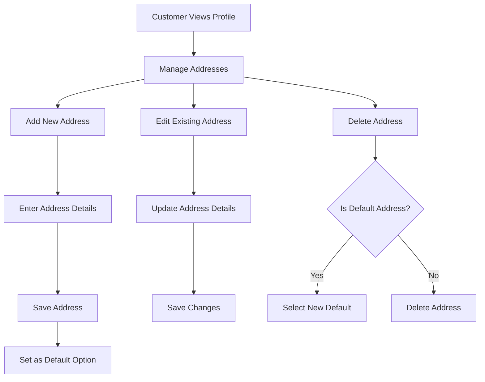
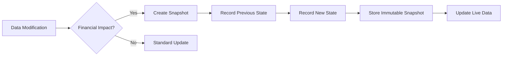
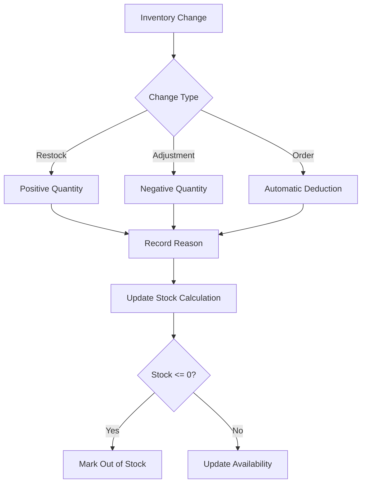
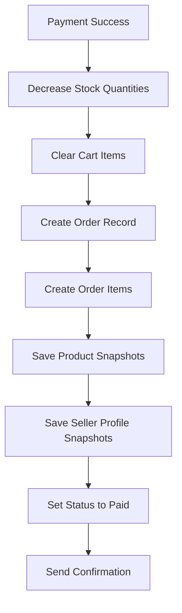

# E-Commerce Shopping Mall Platform Requirements Specification

## Executive Summary

This document specifies the complete requirements for a comprehensive e-commerce shopping mall platform that facilitates transactions between customers and multiple sellers. The platform implements a robust snapshot system to ensure data integrity for all financial transactions and maintains complete audit trails for dispute resolution.

## Platform Overview

### Business Model

The platform operates as a multi-vendor marketplace where individual sellers can list products and customers can purchase from multiple sellers in a single transaction. The system handles complex order management across different sellers while maintaining data consistency through immutable snapshots.

### Core Principles

- **Mandatory Registration**: All platform features require user registration
- **Multi-Seller Support**: Orders can contain items from multiple sellers
- **Snapshot Integrity**: All data modifications create immutable snapshots
- **Financial Security**: Complete audit trails for all money-related transactions
- **Legal Compliance**: Order preservation for regulatory requirements

## User Actors and Authentication

### Customer Account Management

**Registration Requirements**
- WHEN a user attempts to access platform features, THE system SHALL require authentication
- WHEN a new customer registers, THE system SHALL require email and password
- THE system SHALL validate email format and password strength requirements
- AFTER successful registration, THE system SHALL send confirmation email

**Login Process**
- WHEN a customer attempts to login, THE system SHALL verify email and password combination
- IF login credentials are invalid, THE system SHALL return authentication error
- UPON successful login, THE system SHALL create session with JWT token
- THE system SHALL maintain session timeout of 24 hours

**Password Management**
- WHEN a customer requests password change, THE system SHALL require current password verification
- THE system SHALL enforce password complexity requirements
- IF password change succeeds, THE system SHALL invalidate all existing sessions

**Account Deletion**
- WHEN a customer requests account deletion, THE system SHALL require password confirmation
- THE system SHALL preserve order history and reviews for legal compliance
- THE system SHALL anonymize customer profile information
- DELETED accounts SHALL display as "deleted user" in review system

### Seller Account Management

**Seller Registration**
- WHEN a user registers as seller, THE system SHALL require additional business information
- THE system SHALL place new seller accounts in "pending approval" status
- SELLER accounts SHALL remain inactive until administrator approval

**Approval Workflow**
- WHEN a seller registration is submitted, THE system SHALL notify administrators
- ADMINISTRATORS SHALL review seller applications within 48 hours
- IF approved, THE system SHALL activate seller account and send notification
- IF rejected, THE system SHALL provide detailed rejection reason
- REJECTED sellers SHALL be allowed to submit new registration requests

**Seller Account Deletion**
- WHEN a seller requests account deletion, THE system SHALL verify eligibility
- THE system SHALL prevent deletion if pending orders exist
- THE system SHALL preserve order history and snapshots
- DELETED seller products SHALL be removed from active listings

## Customer Profile Management

### Profile Structure
- EACH customer profile SHALL contain: display name and phone number
- THE system SHALL validate phone number format during profile updates
- PROFILE information SHALL be editable by the customer

### Address Management

**Address Requirements**
- EACH address SHALL contain: recipient name, phone number, street address, city, state/province, postal code, country
- THE system SHALL validate address format based on country-specific rules
- CUSTOMERS SHALL be able to set one address as default shipping address
- THE system SHALL prevent deletion of the last remaining address

## Seller Profile Management

### Shop Profile Structure
- EACH seller profile SHALL contain: shop name, shop description, and logo image
- THE system SHALL validate shop name uniqueness
- SHOP descriptions SHALL support rich text formatting
- LOGO images SHALL meet size and format requirements

### Profile Modification Workflow
- WHEN a seller edits their profile, THE system SHALL create a snapshot
- EACH modification SHALL record: timestamp, changed fields, previous values
- SNAPSHOTS SHALL be immutable and available for dispute resolution
- CUSTOMERS SHALL be able to view seller profiles with current information

## Category Management

### Category Hierarchy
- PRODUCTS SHALL be organized into categories and subcategories
- THE system SHALL support one level of category nesting
- EACH category SHALL contain: name and description
- CATEGORIES SHALL be created and managed by administrators only

### Category Operations
- WHEN administrators create categories, THE system SHALL validate name uniqueness
- CATEGORY modifications SHALL require administrator privileges
- IF a category is deleted, THE system SHALL move products to uncategorized status
- CUSTOMERS SHALL be able to browse products by category

## Snapshot System Implementation

### Snapshot Principle
- THE platform SHALL create snapshots for all data modifications involving financial transactions
- SNAPSHOTS SHALL record: timestamp, user ID, action type, previous values, new values
- ALL snapshots SHALL be immutable and permanent
- SNAPSHOTS SHALL be available to relevant parties for dispute resolution

### Snapshot Coverage

**Entities Requiring Snapshots**
- PRODUCTS: name, description, category, base price, images
- PRODUCT VARIANTS: SKU code, option values, price
- SELLER PROFILES: shop name, description, logo
- ORDER ITEMS: product, variant, seller profile at purchase time
- REVIEWS: rating, text content
- CANCELLATION REQUESTS: reason, status changes
- REFUND REQUESTS: reason, status changes

### Product Snapshot Structure
- WHEN a product is edited, THE system SHALL create comprehensive product snapshot
- PRODUCT snapshots SHALL include all product fields and variant snapshots
- THE system SHALL preserve complete product state at modification time
- SNAPSHOTS SHALL remain accessible even after product deletion

## Product Catalog Management

### Product Creation
- WHEN sellers create products, THE system SHALL require: name, description, category, base price
- THE system SHALL validate that sellers can only create products for their own shop
- NEW products SHALL start with zero variants and require at least one variant to be purchasable

### Product Modification
- WHEN sellers edit products, THE system SHALL create snapshots
- PRODUCT modifications SHALL be restricted to the owning seller
- THE system SHALL prevent edits that would affect pending orders

### Product Deletion Constraints
- SELLERS SHALL only be able to delete products with no pending order items
- THE system SHALL verify no pending cancellation or refund requests exist
- DELETED products SHALL be removed from search and category listings
- PRODUCT snapshots SHALL be preserved after deletion

## Product Variant System

### Variant Structure
- EACH variant SHALL have: SKU code, option values, price override, stock quantity
- THE system SHALL enforce SKU code uniqueness within each product
- OPTION values SHALL represent specific combinations (e.g., "Red/Large")
- PRICE overrides SHALL be optional and default to product base price

### Variant Management
- WHEN sellers add variants, THE system SHALL validate SKU uniqueness
- VARIANT edits SHALL create snapshots for audit purposes
- THE system SHALL prevent variant deletion if pending orders exist
- PRODUCTS without variants SHALL display as "unavailable"

## Inventory Management System

### Stock Tracking Methodology
- EACH variant SHALL maintain inventory through history records
- CURRENT stock SHALL be calculated as sum of all inventory records
- THE system SHALL track: quantity change, reason, timestamp for each adjustment

### Inventory Operations

**Inventory Rules**
- WHEN orders are placed, THE system SHALL automatically create negative inventory records
- WHEN orders are cancelled/refunded, THE system SHALL restore stock through positive records
- SELLERS SHALL be able to view complete inventory history for each variant
- OUT OF STOCK variants SHALL be unavailable for cart addition

## Product Discovery and Search

### Search Functionality
- CUSTOMERS SHALL be able to search products by name across all sellers
- SEARCH results SHALL be paginated with configurable page sizes
- THE system SHALL provide relevance-based sorting

### Filtering Options
- CUSTOMERS SHALL be able to filter search results by:
  - Category and subcategory
  - Price range (minimum and maximum)
  - In-stock availability
  - Seller rating

### Sorting Options
- SEARCH results SHALL be sortable by:
  - Newest products first
  - Price (low to high)
  - Price (high to low)
  - Customer rating
  - Relevance

## Product Display Requirements

### Product Listing View
- WHEN displaying product lists, THE system SHALL show: thumbnail image, name, price, seller name, average rating
- PRODUCT cards SHALL indicate out-of-stock status clearly
- THE system SHALL display price ranges for products with variant pricing

### Product Detail Page
- THE product detail page SHALL display: all images, full description, category, seller information, available variants, reviews
- VARIANT selection SHALL show: option combinations, prices, stock status
- THE system SHALL update availability in real-time

## Wishlist Management

### Wishlist Operations
- CUSTOMERS SHALL be able to add products to their wishlist
- THE wishlist SHALL display products (not specific variants)
- WISHLIST items SHALL be paginated for performance
- WHEN products are deleted, THE system SHALL automatically remove them from wishlists

### Wishlist Features
- CUSTOMERS SHALL be able to view, manage, and remove items from their wishlist
- THE system SHALL provide wishlist sharing capabilities
- WISHLIST items SHALL indicate if the product is currently on sale

## Shopping Cart System

### Cart Management
- CUSTOMERS SHALL add specific variants to cart with quantity selection
- THE system SHALL combine quantities when adding duplicate variants
- CART SHALL display: product name, variant options, price, quantity, subtotal
- THE system SHALL provide real-time stock validation

### Cart Validation
- WHEN cart items become unavailable, THE system SHALL display warnings
- OUT OF STOCK items SHALL be marked as unavailable
- THE system SHALL prevent checkout with unavailable items
- CART totals SHALL update dynamically with quantity changes

## Checkout Process

### Checkout Requirements
- CUSTOMERS SHALL proceed to checkout from their cart
- THE system SHALL require shipping address selection
- CHECKOUT SHALL display order summary: items, prices, shipping address, total
- THE system SHALL validate all items are available before payment

### Address Selection
- CUSTOMERS SHALL select from saved addresses or enter new one
- THE system SHALL use default address if available
- ONCE order is placed, shipping address SHALL be immutable

## Payment Processing

### Payment Integration
- THE system SHALL integrate with external payment gateway
- PAYMENT processing SHALL handle success and failure scenarios
- IF payment fails, THE system SHALL allow retry without losing cart
- SUCCESSFUL payments SHALL trigger order creation

### Order Creation Workflow

## Order Management System

### Order Structure
- ORDERS SHALL contain one or more order items from potentially multiple sellers
- EACH order item SHALL represent a purchased variant with quantity
- ORDER items SHALL have individual status tracking
- THE system SHALL group items by seller for shipping purposes

### Order Status Hierarchy
**Order Item Statuses**
- Paid: Payment completed, awaiting seller shipment
- Shipped: Seller has shipped the item
- Delivered: Item has been delivered to customer
- Cancelled: Item was cancelled before delivery
- Refunded: Item was refunded after delivery

**Overall Order Status**
- THE system SHALL derive order status from item statuses
- MIXED status orders SHALL display as "partially completed"
- COMPLETE delivery SHALL change order to "delivered" status

## Shipping and Tracking System

### Shipment Concept
- SHIPMENTS SHALL represent packages sent by individual sellers
- EACH shipment SHALL contain one or more order items from the same seller
- SELLERS SHALL choose whether to ship items individually or bundled

### Shipping Process
- WHEN sellers ship items, THE system SHALL require tracking information
- ALL items in a shipment SHALL share the same tracking details
- SHIPMENT creation SHALL change item statuses to "shipped"
- CUSTOMERS SHALL receive shipment notifications

### Delivery Confirmation
- CUSTOMERS SHALL confirm delivery per shipment
- THE system SHALL automatically mark as delivered after 14 days
- DELIVERY confirmation SHALL update all items in the shipment

## Cancellation and Refund System

### Cancellation Workflow
- CUSTOMERS SHALL request cancellation for individual "paid" items
- CANCELLATION requests SHALL include reason text
- SELLERS SHALL approve or reject cancellation requests
- APPROVED cancellations SHALL trigger refund and stock restoration

### Refund Workflow
- CUSTOMERS SHALL request refunds for "delivered" items within 7 days
- REFUND requests SHALL include reason text
- SELLERS SHALL approve or reject refund requests
- APPROVED refunds SHALL process payment reversal

### Snapshot Integration
- ALL cancellation and refund requests SHALL create snapshots
- SNAPSHOTS SHALL preserve request state changes
- THE system SHALL maintain complete audit trails

## Review and Rating System

### Review Eligibility
- CUSTOMERS SHALL only review products they have purchased and received
- REVIEWS SHALL be allowed after item status becomes "delivered"
- THE system SHALL enforce one review per product per order

### Rating System
- REVIEWS SHALL use 5-star rating scale
- THE system SHALL calculate average ratings from all active reviews
- PRODUCT ratings SHALL update in real-time
- DELETED user reviews SHALL preserve ratings

## Seller Dashboard

### Dashboard Overview
- SELLERS SHALL view: product count, order statistics, pending requests
- THE system SHALL provide order management interface
- SELLERS SHALL filter orders by status and date range

### Performance Metrics
- THE dashboard SHALL display: sales trends, popular products, customer feedback
- SELLERS SHALL access inventory analytics
- THE system SHALL provide cancellation and refund request queues

## Administrator System

### Administrator Hierarchy
- THE system SHALL support regular administrators and super administrators
- SUPER administrators SHALL manage administrator promotions/demotions
- ADMINISTRATOR requests SHALL require approval process

### Management Functions
**Seller Management**
- ADMINISTRATORS SHALL approve/reject seller registrations
- THE system SHALL support seller account suspension
- SUSPENDED sellers SHALL continue processing existing orders

**Category Management**
- ADMINISTRATORS SHALL create and manage categories
- CATEGORY modifications SHALL affect product organization

**Product Oversight**
- ADMINISTRATORS SHALL view all products and snapshots
- THE system SHALL allow administrative product deletion

**Order Intervention**
- ADMINISTRATORS SHALL force-cancel orders with refund
- THE system SHALL support administrative refund processing

**User Management**
- ADMINISTRATORS SHALL ban/unban customers and sellers
- BANNED users SHALL lose login access while preserving data

## Performance and Scalability Requirements

### System Performance
- PRODUCT search results SHALL load within 2 seconds
- ORDER processing SHALL handle 100+ concurrent transactions
- THE system SHALL support 10,000+ active products
- DATABASE queries SHALL optimize for e-commerce patterns

### Scalability Architecture
- THE system SHALL implement caching for frequently accessed data
- PRODUCT searches SHALL use efficient indexing strategies
- ORDER management SHALL handle peak holiday traffic
- THE platform SHALL support horizontal scaling

## Security and Compliance

### Data Security
- USER passwords SHALL be hashed with industry-standard algorithms
- PAYMENT information SHALL never be stored locally
- THE system SHALL implement secure session management
- DATA encryption SHALL protect sensitive information

### Legal Compliance
- ORDER records SHALL be preserved for regulatory requirements
- SNAPSHOTS SHALL support audit and dispute resolution
- USER data deletion SHALL comply with privacy regulations
- THE system SHALL maintain transaction records for tax purposes

## Error Handling and Resilience

### Payment Failure Handling
- WHEN payments fail, THE system SHALL preserve cart contents
- CUSTOMERS SHALL receive clear error messages
- THE system SHALL support multiple payment retry attempts

### Inventory Conflict Resolution
- WHEN stock conflicts occur, THE system SHALL notify customers
- THE system SHALL prevent overselling through real-time validation
- CONCURRENT order attempts SHALL use optimistic locking

### System Failure Recovery
- THE system SHALL maintain transaction consistency
- PARTIAL failures SHALL rollback cleanly
- CUSTOMERS SHALL receive status updates during recovery

## Integration Requirements

### External System Integration
- PAYMENT gateway integration SHALL support multiple providers
- EMAIL service SHALL handle notifications and confirmations
- SHIPPING carrier APIs SHALL provide tracking integration
- ANALYTICS integration SHALL track platform performance

### API Requirements
- THE system SHALL provide RESTful APIs for mobile applications
- WEBHOOKS SHALL support real-time event notifications
- THIRD-PARTY integrations SHALL use secure authentication

## Implementation Roadmap

### Phase 1: Core Platform
- User authentication and profile management
- Basic product catalog and search
- Shopping cart and checkout
- Order management foundation

### Phase 2: Seller Features
- Seller registration and approval
- Product variant and inventory management
- Seller dashboard and order processing
- Review and rating system

### Phase 3: Advanced Features
- Multi-seller order handling
- Shipping and tracking integration
- Cancellation and refund workflows
- Administrator management tools

### Phase 4: Optimization
- Performance optimization and caching
- Advanced search and filtering
- Mobile application support
- Analytics and reporting

This comprehensive requirements specification provides the foundation for building a robust, scalable e-commerce platform that ensures data integrity through snapshots while supporting complex multi-seller transactions.