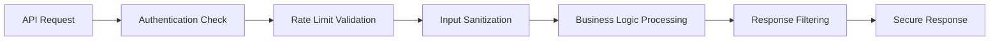
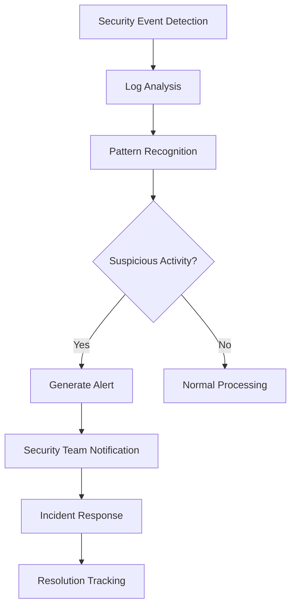

# Security and Compliance Requirements Document

## Executive Summary

This document outlines the comprehensive security framework and compliance requirements for the e-commerce shopping mall platform. Given the platform's financial transactions and sensitive user data handling, security measures are paramount to ensure customer trust, regulatory compliance, and business continuity. The platform implements a defense-in-depth approach to security, combining technical controls, administrative procedures, and physical safeguards to protect all stakeholders.

## Data Security Requirements

### User Data Protection

**WHEN user data is stored in the system, THE platform SHALL encrypt sensitive information at rest using industry-standard encryption algorithms.**
- Personal identifiable information (PII) including email addresses, phone numbers, and addresses must be encrypted using AES-256 encryption
- Payment information must never be stored in plain text and must be tokenized through PCI-compliant payment processors
- Encryption keys must be managed securely with automatic rotation every 90 days
- Database fields containing sensitive information must use column-level encryption

**WHILE user sessions are active, THE platform SHALL maintain secure session management with timeout controls.**
- Session tokens must expire after 30 minutes of inactivity with automatic logout
- Secure HTTP-only cookies must be used for session management to prevent XSS attacks
- Session data must be invalidated upon logout and cannot be reused
- Concurrent session limits must be enforced per user account

### Database Security

**THE database SHALL implement row-level security for multi-tenant data isolation between sellers and customers.**
- Sellers must only access their own product data, order information, and customer interactions
- Customers must only access their own order history, personal information, and payment records
- Administrators must have role-based access controls with granular permission levels
- Database views must enforce data segregation between different business entities

**WHEN database backups are created, THE platform SHALL ensure encrypted backup storage with access controls.**
- Backup files must be encrypted using AES-256 before storage in secure locations
- Access to backup systems must be restricted to authorized personnel with multi-factor authentication
- Backup retention must follow legal requirements of 7 years for financial records
- Backup integrity must be verified through regular restoration testing

### API Security

**WHEN API endpoints are accessed, THE platform SHALL implement comprehensive authentication and authorization controls.**
- All API calls must include valid JWT tokens with proper signature validation
- Rate limiting must prevent abuse with maximum 1000 requests per hour per user
- Input validation must sanitize all user inputs to prevent injection attacks
- API responses must not expose sensitive information in error messages

## Payment Security Requirements

### PCI DSS Compliance

**THE payment processing system SHALL comply with Payment Card Industry Data Security Standard (PCI DSS) Level 1 requirements.**
- Cardholder data must never traverse unsecured networks and must use TLS 1.2 or higher
- Payment information must be processed through PCI-compliant gateways with proper certification
- Regular security assessments must be conducted quarterly by qualified security assessors
- Network segmentation must isolate payment processing systems from other platform components

**WHEN payment transactions occur, THE platform SHALL use tokenization to protect sensitive payment data.**
- Payment tokens must replace actual card numbers in all system records and logs
- Tokenization service must be PCI DSS Level 1 certified with annual audits
- Payment failures must not expose sensitive information in error messages
- Token lifecycle management must include secure creation, usage, and revocation

### Payment Gateway Integration

**WHERE external payment gateways are integrated, THE platform SHALL implement secure communication protocols.**
- All payment API calls must use mutual TLS authentication with certificate validation
- Payment gateway credentials must be stored securely using hardware security modules
- Payment callback URLs must be validated against whitelisted domains
- Transaction status must be verified through multiple confirmation mechanisms

## Privacy Protection Requirements

### GDPR Compliance

**THE platform SHALL comply with General Data Protection Regulation (GDPR) requirements for all EU customer interactions.**
- User consent must be obtained for data processing with clear opt-in mechanisms
- Right to erasure must be implemented with proper data deletion procedures
- Data processing activities must be documented in a comprehensive data processing register
- Data protection impact assessments must be conducted for high-risk processing activities

**WHEN user data is processed, THE platform SHALL provide transparency through comprehensive privacy notices.**
- Privacy policy must clearly explain data collection, usage, sharing, and retention periods
- Users must be able to access their personal data through self-service portals
- Data breach notification procedures must be established with 72-hour reporting requirements
- Data subject rights must be honored including access, rectification, and portability

### Data Minimization

**THE platform SHALL implement data minimization principles throughout all system components.**
- Only collect data necessary for specific platform functionality with clear business purposes
- Regularly review and purge unnecessary data according to established retention schedules
- Implement data retention policies aligned with business needs and legal requirements
- Anonymize or pseudonymize data where possible to reduce privacy risks

## Legal Compliance Requirements

### E-commerce Regulations

**THE platform SHALL comply with e-commerce regulations in all operating jurisdictions including consumer protection laws.**
- Terms of service must be clearly displayed and require explicit acceptance during registration
- Return and refund policies must be transparent and accessible with 30-day return windows
- Consumer protection laws must be respected including right of withdrawal and warranty provisions
- Platform must maintain business registration and tax identification in all operating countries

### Tax Compliance

**WHERE tax calculations are required, THE platform SHALL maintain accurate tax records and reporting capabilities.**
- Sales tax calculations must be accurate for applicable jurisdictions with real-time rate updates
- Tax records must be maintained for 7 years for audit purposes with proper documentation
- Tax exemption handling must be properly implemented with certificate validation
- Cross-border tax compliance must address VAT, GST, and other regional tax requirements

## Audit Trail Requirements

### Comprehensive Logging

**THE platform SHALL maintain comprehensive audit logs for all significant user and system actions.**
- User authentication events must be logged with timestamps, IP addresses, and user agents
- Financial transactions must have complete audit trails including amount, parties, and status
- Administrative actions must be logged with user identification and change details
- System configuration changes must be recorded with approval workflows

**WHEN snapshots are created, THE platform SHALL preserve immutable audit records for dispute resolution.**
- Snapshot creation must include user identification, timestamp, and business context
- Modification history must be traceable through snapshot chains with cryptographic verification
- Audit logs must be protected from tampering using write-once storage mechanisms
- Log retention must comply with legal requirements of 7 years for financial transactions

### Monitoring and Alerting

**THE platform SHALL implement real-time security monitoring with automated alerting mechanisms.**
- Suspicious activity patterns must trigger alerts to security operations center
- Failed login attempts must be monitored and limited with account lockout after 5 failures
- Unusual transaction patterns must be flagged for manual review by fraud detection team
- System performance anomalies must be monitored for potential security incidents

## Security Best Practices

### Authentication Security

**THE authentication system SHALL implement industry best practices for credential management.**
- Password complexity requirements must be enforced with minimum 12 characters including uppercase, lowercase, numbers, and symbols
- Multi-factor authentication must be available for all user accounts with SMS or authenticator app options
- Password reset processes must be secure with time-limited tokens and identity verification
- Account lockout policies must prevent brute force attacks with progressive delay mechanisms

**WHEN user accounts are created, THE platform SHALL validate identities through multiple verification methods.**
- Email verification must be required before account activation with confirmation links
- Phone number verification should be implemented for high-value transactions
- Identity document verification may be required for seller accounts and large transactions
- Behavioral analysis should detect suspicious account creation patterns

### Infrastructure Security

**THE infrastructure SHALL implement defense-in-depth security measures across all system layers.**
- Web application firewalls must protect against common attacks including SQL injection and XSS
- Regular security patches must be applied to all components within 30 days of release
- Network segmentation must isolate different system components with firewall rules
- Intrusion detection systems must monitor network traffic for anomalous patterns

### Development Security

**WHEN code is developed, THE platform SHALL follow secure coding practices throughout the software lifecycle.**
- Regular security code reviews must be conducted before deployment to production
- Dependency vulnerability scanning must be automated with weekly checks
- Security testing must be part of the development lifecycle including SAST and DAST
- Security requirements must be defined during design phase and verified before release

## Incident Response Requirements

### Breach Management

**IF a security breach is detected, THEN THE platform SHALL execute comprehensive incident response procedures.**
- Breach containment procedures must be clearly defined with isolation and mitigation steps
- Notification processes must comply with legal requirements including customer and regulatory notifications
- Forensic analysis must be conducted to determine breach scope and root cause
- Business impact assessment must evaluate financial and reputational damage

### Business Continuity

**THE platform SHALL maintain business continuity plans for security incidents with recovery objectives.**
- Data recovery procedures must be tested quarterly with documented recovery time objectives
- Incident response team must be clearly defined with roles, responsibilities, and contact information
- Communication plans must be established for stakeholders including customers, partners, and regulators
- Backup systems must be maintained with regular failover testing

## Snapshot System Security Implications

### Data Integrity

**THE snapshot system SHALL ensure data integrity for financial transactions through cryptographic verification.**
- Snapshot creation must be atomic and consistent with database transaction boundaries
- Snapshot chains must be verifiable for audit purposes with hash-based integrity checks
- Historical data must be protected from modification using immutable storage techniques
- Snapshot access must be logged for security monitoring and compliance reporting

### Access Control

**WHEN snapshots are accessed, THE platform SHALL enforce proper authorization based on user roles.**
- Customers must only access snapshots related to their orders with proper authentication
- Sellers must only access snapshots of their own products and orders with business context
- Administrators must have controlled access to all snapshots with audit trail requirements
- Snapshot queries must be subject to rate limiting and resource constraints

## Multi-Tenant Security

### Data Isolation

**THE platform SHALL ensure complete data isolation between sellers through logical separation mechanisms.**
- Seller data must be logically separated at the application level with tenant context
- Cross-seller data access must be prevented through query rewriting and access controls
- Seller-specific data must be tagged with proper ownership attributes in database schemas
- Data leakage between tenants must be monitored and prevented through security controls

### Performance Security

**WHILE handling multiple sellers, THE platform SHALL maintain performance without compromising security controls.**
- Query performance must not degrade with increasing seller count through proper indexing
- Security checks must be efficient to prevent performance bottlenecks in high-traffic scenarios
- Resource allocation must be fair between sellers with quota enforcement mechanisms
- Caching strategies must respect data isolation requirements between different tenants

## Compliance Documentation

### Security Policies

**THE platform SHALL maintain comprehensive security documentation updated regularly.**
- Security policies must be documented and reviewed annually by security committee
- Employee security training must be conducted quarterly with role-based content
- Third-party vendor security assessments must be performed before integration
- Security awareness programs must be implemented for all platform users

### Regular Audits

**THE platform SHALL undergo regular security audits and assessments by independent third parties.**
- External security audits must be conducted annually by certified security firms
- Vulnerability assessments must be performed quarterly with remediation tracking
- Penetration testing must be conducted biannually with comprehensive scope
- Compliance certifications must be maintained for relevant standards and regulations

## Implementation Guidelines

### Security by Design

**WHEN new features are implemented, THE platform SHALL incorporate security considerations from initial design phase.**
- Security requirements must be part of feature specifications with threat modeling
- Security architecture reviews must be conducted before implementation begins
- Security testing must be integrated into development workflows with automation
- Security sign-off must be required before feature deployment to production

### Continuous Improvement

**THE security program SHALL evolve to address emerging threats through continuous monitoring.**
- Security measures must be regularly reviewed and updated based on threat intelligence
- Industry best practices must be adopted as they evolve through standards participation
- Security awareness must be maintained across the organization through regular training
- Security metrics must be tracked and reported to management for decision making

## Risk Management

### Risk Assessment

**THE platform SHALL conduct regular risk assessments to identify and prioritize security risks.**
- Security risks must be identified through threat modeling and vulnerability analysis
- Risk mitigation strategies must be implemented based on risk severity and business impact
- Risk acceptance criteria must be clearly defined with management approval requirements
- Risk register must be maintained with regular updates and tracking

### Insurance and Liability

**THE platform SHALL maintain appropriate cyber insurance coverage for potential security incidents.**
- Liability limits must be adequate for the business scale with minimum $10 million coverage
- Insurance coverage must address data breach scenarios including notification costs and fines
- Legal counsel must review terms and conditions to ensure proper protection
- Insurance claims procedures must be documented and tested annually

## Success Metrics and Monitoring

### Security Performance Indicators

**THE platform SHALL track key security metrics to measure effectiveness of security controls.**
- Mean time to detect security incidents should be less than 1 hour
- Mean time to respond to security incidents should be less than 4 hours
- Vulnerability remediation rate should exceed 95% within 30 days
- Security training completion rate should be 100% for all employees

### Compliance Monitoring

**THE platform SHALL monitor compliance status continuously through automated checks.**
- Regulatory compliance status must be tracked with gap analysis reports
- Policy violation rates must be monitored with trend analysis
- Audit finding remediation must be tracked with completion deadlines
- Certification maintenance must be monitored with renewal schedules

## Business Continuity and Disaster Recovery

### Recovery Objectives

**THE platform SHALL define clear recovery objectives for business continuity planning.**
- Recovery Time Objective (RTO) must be 4 hours for critical business functions
- Recovery Point Objective (RPO) must be 15 minutes for transactional data
- Maximum Tolerable Downtime (MTD) must be 8 hours for platform availability
- Business Impact Analysis (BIA) must be conducted annually

### Disaster Recovery Testing

**THE platform SHALL conduct regular disaster recovery testing to validate recovery capabilities.**
- Full-scale disaster recovery tests must be conducted annually
- Tabletop exercises must be conducted quarterly for incident response teams
- Backup restoration tests must be conducted monthly with success verification
- Failover procedures must be tested biannually with performance validation

> *Developer Note: This document defines **business requirements only**. All technical implementations (architecture, APIs, database design, etc.) are at the discretion of the development team.*