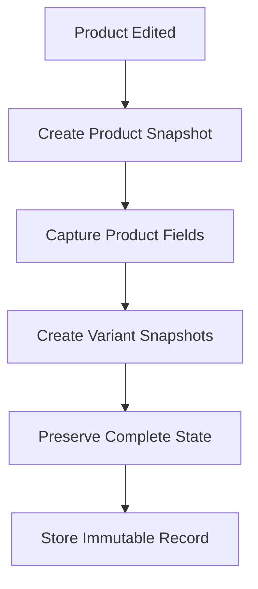
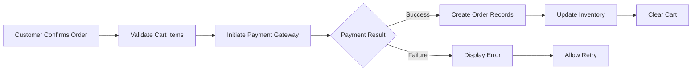

# E-Commerce Shopping Mall Platform Requirements Specification

## Executive Summary

This document provides comprehensive requirements for a secure e-commerce platform that facilitates transactions between customers and sellers. The platform implements a robust snapshot system to preserve transaction integrity and supports multi-seller operations with granular order management.

## 1. Customer Account Management

### 1.1 Registration Requirements
**WHEN** a user attempts to access platform features without authentication, **THE** system **SHALL** redirect them to the registration page.

**WHEN** a customer registers with valid email and password, **THE** system **SHALL** create a customer account and send email verification.

**WHEN** registration completes successfully, **THE** system **SHALL** automatically log the customer in and redirect to the platform dashboard.

### 1.2 Authentication Requirements
**WHEN** a customer attempts to log in with valid credentials, **THE** system **SHALL** authenticate the user and establish a secure session.

**WHEN** authentication fails due to invalid credentials, **THE** system **SHALL** display an appropriate error message without revealing whether the email exists.

**THE** authentication system **SHALL** implement secure password policies requiring minimum 8 characters with mixed case and special characters.

### 1.3 Account Management Requirements
**WHEN** a customer requests password change, **THE** system **SHALL** verify current password and implement the change immediately.

**WHEN** a customer deletes their account, **THE** system **SHALL**:
- Remove profile information within 24 hours
- Preserve all order history and records for legal compliance
- Convert reviews to "deleted user" status while preserving content
- Maintain order snapshots for seller records

## 2. Customer Profile Management

### 2.1 Profile Requirements
**EACH** customer profile **SHALL** contain:
- Display name (2-50 characters)
- Phone number (valid international format)
- Email address (verified)
- Account creation timestamp
- Last login timestamp

**WHEN** a customer edits their profile information, **THE** system **SHALL** validate all fields and update immediately upon successful validation.

## 3. Address Management System

### 3.1 Address Requirements
**EACH** shipping address **SHALL** contain:
- Recipient name (required)
- Phone number (required)
- Street address (required)
- City (required)
- State/province (required)
- Postal code (required)
- Country (required)
- Default address flag (optional)

### 3.2 Address Operations
**WHEN** a customer adds a new address, **THE** system **SHALL** validate all fields and store the address immediately.

**WHEN** a customer edits an existing address, **THE** system **SHALL** preserve the previous address in history for order reference.

**WHEN** a customer deletes an address, **THE** system **SHALL** prevent deletion if the address is referenced in active orders.

**WHEN** a customer sets an address as default, **THE** system **SHALL** automatically select it during checkout.

## 4. Seller Account Management

### 4.1 Seller Registration Requirements
**WHEN** a seller registers with valid credentials, **THE** system **SHALL** place the account in "pending approval" status.

**WHEN** administrator approves a seller account, **THE** system **SHALL** activate selling privileges immediately.

**WHEN** administrator rejects a seller account, **THE** system **SHALL** provide detailed rejection reasons and allow resubmission.

### 4.2 Seller Account Deletion Requirements
**WHEN** a seller requests account deletion, **THE** system **SHALL** validate that:
- No pending orders exist (paid or shipped status)
- No pending cancellation or refund requests exist
- All financial obligations are settled

**WHEN** account deletion conditions are met, **THE** system **SHALL**:
- Remove products from active listings
- Preserve order history and snapshots
- Maintain shop name in past orders
- Complete deletion within 72 hours

## 5. Seller Profile Management

### 5.1 Profile Requirements
**EACH** seller profile **SHALL** contain:
- Shop name (required, 2-100 characters)
- Shop description (optional, max 500 characters)
- Logo image (optional, max 5MB)
- Approval status (pending/approved/rejected)
- Registration timestamp

**WHEN** a seller edits their profile, **THE** system **SHALL** create a snapshot preserving the previous state.

## 6. Category Management

### 6.1 Category Structure
**THE** category system **SHALL** support:
- Parent categories (top-level)
- Subcategories (one level of nesting only)
- Category names (2-50 characters)
- Category descriptions (optional, max 200 characters)

### 6.2 Category Operations
**WHEN** administrator creates a category, **THE** system **SHALL** validate uniqueness and hierarchy constraints.

**WHEN** administrator deletes a category, **THE** system **SHALL** move existing products to "uncategorized" status.

**WHEN** customer browses categories, **THE** system **SHALL** display all active categories with product counts.

## 7. Snapshot Principle Implementation

### 7.1 Snapshot Creation Requirements
**WHEN** editable data is modified, **THE** system **SHALL** automatically create an immutable snapshot preserving:
- Timestamp of change
- User who made the change
- Previous values
- New values
- Change reason (if applicable)

### 7.2 Snapshot Scope
**SNAPSHOTS SHALL** be created for:
- Product modifications (all fields including images)
- Product variant changes (SKU, options, price)
- Seller profile updates
- Order item creation (product, variant, seller profile at purchase time)
- Review modifications
- Cancellation request status changes
- Refund request status changes

### 7.3 Product Snapshot Structure

**EACH** product snapshot **SHALL** include:
- Product name, description, category, base price
- All product images at the time of snapshot
- Complete variant information for each SKU
- Timestamp and user information

## 8. Product Management

### 8.1 Product Creation Requirements
**WHEN** seller creates a product, **THE** system **SHALL** require:
- Product name (2-200 characters)
- Description (10-2000 characters)
- Category selection
- Base price (positive decimal)

**THE** product **SHALL** belong exclusively to the creating seller.

### 8.2 Product Modification Requirements
**WHEN** seller edits a product, **THE** system **SHALL** create a snapshot before applying changes.

**WHEN** seller deletes a product, **THE** system **SHALL** validate:
- No pending order items for any variant
- No pending cancellation/refund requests
- All variants meet deletion criteria

### 8.3 Product Visibility Rules
**DELETED** products **SHALL** not appear in search results or category listings.

**SNAPSHOTS** of deleted products **SHALL** remain accessible for order reference.

## 9. Product Images Management

### 9.1 Image Requirements
**EACH** product **SHALL** support multiple images with:
- Maximum 10 images per product
- File size limit of 5MB per image
- Supported formats: JPEG, PNG, WebP
- First image treated as main/thumbnail

### 9.2 Image Operations
**WHEN** seller uploads images, **THE** system **SHALL** validate format and size constraints.

**WHEN** seller reorders images, **THE** system **SHALL** update the display order immediately.

**WHEN** seller deletes images, **THE** system **SHALL** preserve at least one image per product.

## 10. Product Variants System

### 10.1 Variant Requirements
**EACH** product variant **SHALL** have:
- SKU code (unique identifier, 3-50 characters)
- Option values (color, size, etc.)
- Price (optional override of base price)
- Stock quantity (required, non-negative integer)

### 10.2 Variant Operations
**WHEN** seller adds variants, **THE** system **SHALL** validate SKU uniqueness.

**WHEN** seller edits variants, **THE** system **SHALL** create snapshots of changes.

**WHEN** seller deletes variants, **THE** system **SHALL** prevent deletion if:
- Pending order items exist
- Pending cancellation/refund requests exist

### 10.3 Product Availability Rules
**PRODUCTS** without variants **SHALL** be visible but marked "unavailable" for purchase.

**VARIANTS** with zero stock **SHALL** be shown as "out of stock" and unavailable for cart addition.

## 11. Inventory Management

### 11.1 Inventory Tracking
**EACH** inventory change **SHALL** create a history record containing:
- Quantity change (positive/negative)
- Reason (restock, order, adjustment, loss)
- Timestamp
- User who made the change

### 11.2 Stock Calculation
**CURRENT** stock **SHALL** be calculated as the sum of all inventory records.

**WHEN** stock reaches zero, **THE** variant **SHALL** be marked "out of stock."

### 11.3 Automated Inventory Changes
**WHEN** order is placed, **THE** system **SHALL** automatically create negative inventory records.

**WHEN** order is cancelled/refunded, **THE** system **SHALL** automatically create positive inventory records.

## 12. Product Search System

### 12.1 Search Requirements
**WHEN** customer searches for products, **THE** system **SHALL**:
- Search product names across all sellers
- Return paginated results (20 items per page)
- Support filtering by category, price range, and stock status
- Support sorting by newest, price (low-high), price (high-low)

### 12.2 Search Performance
**SEARCH** results **SHALL** load within 2 seconds for typical queries.

**THE** search system **SHALL** handle concurrent searches from multiple users.

## 13. Product Display Requirements

### 13.1 Product Listing Display
**EACH** product in search results **SHALL** show:
- Main image thumbnail
- Product name
- Base price or price range
- Seller shop name
- Average rating (if available)

### 13.2 Product Detail Page
**THE** product detail page **SHALL** display:
- All product images in gallery format
- Complete product description
- Category breadcrumb navigation
- Seller profile link
- All available variants with prices and stock
- Average rating and review count
- All customer reviews

## 14. Wishlist Management

### 14.1 Wishlist Requirements
**WHEN** customer adds product to wishlist, **THE** system **SHALL** store the product reference.

**WHEN** customer views wishlist, **THE** system **SHALL** display paginated results.

**WHEN** product is deleted, **THE** system **SHALL** automatically remove it from all wishlists.

### 14.2 Wishlist Operations
**CUSTOMERS** can add/remove products from wishlist.

**WISHLIST** items **SHALL** be products (not specific variants).

## 15. Shopping Cart System

### 15.1 Cart Requirements
**WHEN** customer adds variant to cart, **THE** system **SHALL**:
- Require quantity specification (1-99)
- Combine quantities if variant already in cart
- Validate stock availability

### 15.2 Cart Display
**THE** cart **SHALL** show each item with:
- Product name
- Variant options
- Unit price
- Quantity
- Line item subtotal

### 15.3 Cart Management
**WHEN** stock becomes insufficient, **THE** system **SHALL** display warnings.

**WHEN** variant becomes unavailable, **THE** system **SHALL** mark it as such in cart.

## 16. Checkout Process

### 16.1 Checkout Requirements
**WHEN** customer proceeds to checkout, **THE** system **SHALL**:
- Validate all cart items are available
- Require shipping address selection
- Display order summary for review

### 16.2 Order Summary
**THE** order summary **SHALL** include:
- Itemized list with prices
- Shipping address
- Total price calculation
- Payment method selection

## 17. Payment Processing

### 17.1 Payment Requirements
**WHEN** customer confirms order, **THE** system **SHALL**:
- Process payment through external gateway
- Handle payment success/failure scenarios
- Create order only upon successful payment

### 17.2 Payment Flow

## 18. Order Creation System

### 18.1 Order Creation Requirements
**WHEN** payment succeeds, **THE** system **SHALL**:
- Decrease stock quantities for purchased variants
- Remove items from customer cart
- Create order record with unique identifier
- Create order items with "paid" status
- Create snapshots of products, variants, and seller profiles

### 18.2 Order Structure
**EACH** order **SHALL** contain one or more order items.

**IDENTICAL** variants **SHALL** be combined into single order items with quantity.

**ORDER** items from different sellers **SHALL** be handled separately.

## 19. Order Management

### 19.1 Order History
**WHEN** customer views order history, **THE** system **SHALL**:
- Display paginated list (20 orders per page)
- Sort by newest first
- Show order number, date, total price, status

### 19.2 Order Details
**THE** order detail page **SHALL** show:
- Complete item list with product names, variants, quantities, prices
- Shipping address used
- Shipment tracking information
- Individual item statuses

## 20. Order Status System

### 20.1 Order Item Statuses
**EACH** order item **SHALL** have one of:
- Paid: Payment completed, awaiting shipment
- Shipped: Seller has shipped the item
- Delivered: Item confirmed delivered
- Cancelled: Item cancelled before shipment
- Refunded: Item refunded after delivery

### 20.2 Overall Order Status
**THE** overall order status **SHALL** be derived from item statuses:
- All paid → "paid"
- Any shipped (none delivered) → "shipped"
- All delivered → "delivered"
- All cancelled → "cancelled"
- All refunded → "refunded"
- Mixed states → "partially completed"

## 21. Shipping and Tracking System

### 21.1 Shipment Concept
**SHIPMENTS** represent packages sent by sellers.

**EACH** shipment **SHALL** contain items from a single seller.

**SELLERS** can choose to ship items individually or bundled.

### 21.2 Shipping Process
**WHEN** seller creates shipment, **THE** system **SHALL**:
- Allow selection of items to include
- Require tracking information (carrier, tracking number)
- Update all included items to "shipped" status
- Notify customer of shipment

### 21.3 Delivery Confirmation
**WHEN** customer confirms delivery, **THE** system **SHALL** update all items in shipment to "delivered."

**IF** customer doesn't confirm, **THE** system **SHALL** auto-confirm after 14 days.

## 22. Order Cancellation Process

### 22.1 Cancellation Requirements
**CUSTOMERS** can request cancellation for "paid" items only.

**EACH** cancellation request **SHALL** include a reason.

**SELLERS** can approve or reject cancellation requests.

### 22.2 Cancellation Flow
**WHEN** cancellation approved, **THE** system **SHALL**:
- Cancel the specific item
- Process refund for that item
- Restore stock quantity
- Continue processing other order items

## 23. Refund Request System

### 23.1 Refund Requirements
**CUSTOMERS** can request refund for "delivered" items within 7 days.

**EACH** refund request **SHALL** include a reason.

**SELLERS** can approve or reject refund requests.

### 23.2 Refund Processing
**WHEN** refund approved, **THE** system **SHALL**:
- Refund the specific item
- Restore stock quantity
- Update item status to "refunded"

## 24. Reviews and Ratings System

### 24.1 Review Requirements
**CUSTOMERS** can review products after delivery.

**EACH** review **SHALL** include:
- Rating (1-5 stars)
- Optional text content

### 24.2 Review Management
**CUSTOMERS** can edit their reviews (creates snapshot).

**CUSTOMERS** can delete reviews (preserves snapshots).

**PRODUCT** average rating **SHALL** be calculated from non-deleted reviews.

## 25. Seller Dashboard

### 25.1 Dashboard Requirements
**THE** seller dashboard **SHALL** display:
- Total products count
- Total order items count
- Pending cancellation requests
- Pending refund requests

### 25.2 Order Management
**SELLERS** can view all order items for their products.

**SELLERS** can filter items by status.

## 26. Administrator System

### 26.1 Administrator Roles
**THERE SHALL** be two administrator grades:
- Regular administrator
- Super administrator

### 26.2 Administrator Functions
**ADMINISTRATORS** can:
- Approve/reject seller registrations
- Manage categories
- Oversee products
- Manage orders
- Manage users (customers and sellers)

### 26.3 User Management
**WHEN** administrator bans a user, **THE** system **SHALL** prevent login while preserving data.

**WHEN** administrator suspends a seller, **THE** system **SHALL** hide products while allowing order processing.

## 27. Performance Requirements

### 27.1 Response Time Requirements
**THE** system **SHALL** respond to user actions within:
- Page loads: < 2 seconds
- Search queries: < 3 seconds
- Cart operations: < 1 second
- Order processing: < 5 seconds

### 27.2 Scalability Requirements
**THE** platform **SHALL** support:
- 10,000 concurrent users
- 100,000 products
- 1,000,000 orders annually
- 99.9% uptime

## 28. Security Requirements

### 28.1 Data Protection
**ALL** user data **SHALL** be encrypted at rest and in transit.

**PASSWORDS** **SHALL** be hashed using industry-standard algorithms.

### 28.2 Access Control
**THE** system **SHALL** implement role-based access control.

**USERS** **SHALL** only access their own data and authorized functions.

## 29. Compliance Requirements

### 29.1 Data Retention
**ORDER** records **SHALL** be preserved for 7 years for legal compliance.

**USER** data **SHALL** be handled according to GDPR and local regulations.

### 29.2 Financial Compliance
**THE** platform **SHALL** comply with payment card industry standards.

**ALL** financial transactions **SHALL** be logged for audit purposes.

## Conclusion

This requirements specification defines a comprehensive e-commerce platform with robust transaction integrity through snapshot preservation. The platform supports multi-seller operations with granular order management and ensures data preservation for legal compliance while maintaining user privacy through proper account deletion workflows.