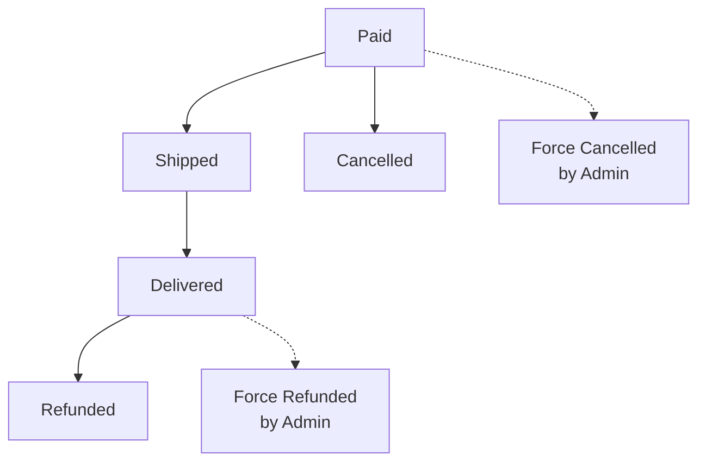

# E-Commerce Shopping Mall Platform Requirements Specification

## Executive Summary

This document provides comprehensive requirements specification for a secure, scalable e-commerce shopping mall platform that handles financial transactions with full data integrity through snapshot-based auditing. The platform supports customer shopping journeys, seller product management, order processing with multi-seller support, and comprehensive administrative oversight.

## Platform Architecture Overview

### Core Principles

**Snapshot-Based Data Integrity**
- THE platform SHALL implement immutable snapshots for all data modifications involving financial transactions
- THE platform SHALL preserve historical states of products, seller profiles, orders, and reviews
- THE platform SHALL enable dispute resolution through complete audit trails

**Multi-Actor Authentication System**
- THE platform SHALL support three primary user types: customers, sellers, and administrators
- THE platform SHALL implement role-based access control for all system features
- THE platform SHALL require authentication for all platform interactions

**Financial Transaction Security**
- THE platform SHALL ensure data consistency for all money-related operations
- THE platform SHALL implement proper inventory management to prevent overselling
- THE platform SHALL support secure payment gateway integration

## User Authentication and Account Management

### Customer Account Requirements

**Registration Process**
- WHEN a new customer registers, THE system SHALL require email and password
- THE system SHALL validate email format and password strength
- THE system SHALL send email verification before account activation
- THE system SHALL prevent duplicate email registrations

**Login and Session Management**
- WHEN a customer logs in, THE system SHALL authenticate with email and password
- THE system SHALL generate JWT tokens for session management
- THE system SHALL implement session timeout after 24 hours of inactivity
- THE system SHALL support secure password reset functionality

**Account Deletion Protocol**
- WHEN a customer requests account deletion, THE system SHALL preserve order history and reviews
- THE system SHALL anonymize customer profile information
- THE system SHALL maintain financial records for legal compliance
- THE system SHALL remove customer from active user lists

### Seller Account Requirements

**Seller Registration and Approval**
- WHEN a seller registers, THE system SHALL place account in "pending approval" status
- THE system SHALL require administrator approval before selling privileges are granted
- THE system SHALL notify administrators of new seller registration requests
- THE system SHALL provide rejection reasons when seller applications are denied

**Seller Account Management**
- WHEN a seller is approved, THE system SHALL enable product creation and management
- THE system SHALL provide seller dashboard for order management
- THE system SHALL implement seller suspension capabilities for policy violations
- THE system SHALL preserve seller data during account suspension

**Seller Account Deletion Constraints**
- THE system SHALL prevent seller account deletion while pending orders exist
- THE system SHALL preserve order history and snapshots after account deletion
- THE system SHALL remove seller products from active listings
- THE system SHALL maintain shop name in historical orders

### Administrator Account Requirements

**Administrator Promotion Process**
- WHEN a user requests administrator privileges, THE system SHALL require super administrator approval
- THE system SHALL maintain two administrator grades: regular and super
- THE system SHALL track administrator actions for audit purposes
- THE system SHALL implement privilege escalation controls

**Administrative Functions**
- THE system SHALL provide user management capabilities for administrators
- THE system SHALL enable seller approval and suspension workflows
- THE system SHALL support category management and product oversight
- THE system SHALL provide order intervention capabilities

## Product Catalog Management

### Category System

**Category Hierarchy**
- THE system SHALL support two-level category structure (categories and subcategories)
- THE system SHALL allow administrators to create, edit, and delete categories
- THE system SHALL prevent category deletion if products are assigned
- THE system SHALL provide category browsing for customers

**Product Organization**
- THE system SHALL require products to be assigned to valid categories
- THE system SHALL support product discovery through category navigation
- THE system SHALL maintain category assignments during product edits
- THE system SHALL handle uncategorized products appropriately

### Product Creation and Management

**Product Information Requirements**
- WHEN creating a product, THE system SHALL require: name, description, category, base price
- THE system SHALL validate product information completeness
- THE system SHALL enforce character limits for product names and descriptions
- THE system SHALL require at least one variant for purchasable products

**Product Editing and Snapshots**
- WHEN a product is edited, THE system SHALL create a complete product snapshot
- THE snapshot SHALL include all product fields and current variant states
- THE system SHALL preserve snapshots indefinitely for audit purposes
- THE system SHALL allow sellers to view their product snapshots

**Product Deletion Constraints**
- THE system SHALL prevent product deletion if pending orders exist
- THE system SHALL check all variants for active orders before deletion
- THE system SHALL preserve product snapshots after deletion
- THE system SHALL remove deleted products from search and category listings

### Product Variants System

**Variant Creation and Management**
- WHEN creating variants, THE system SHALL require SKU code and stock quantity
- THE system SHALL support option-based variant configurations (color, size, etc.)
- THE system SHALL allow variant-specific pricing overrides
- THE system SHALL enforce SKU uniqueness within products

**Variant Editing and Snapshots**
- WHEN a variant is edited, THE system SHALL create variant snapshot
- THE snapshot SHALL capture SKU, options, price, and stock quantity
- THE system SHALL preserve variant snapshots with product snapshots
- THE system SHALL prevent variant edits affecting active orders

**Variant Deletion Protocol**
- THE system SHALL prevent variant deletion with pending orders
- THE system SHALL check order status before allowing variant deletion
- THE system SHALL preserve variant data in order snapshots
- THE system SHALL update product availability when variants are deleted

### Product Images Management

**Image Upload and Organization**
- THE system SHALL support multiple images per product
- THE system SHALL allow image reordering with first image as thumbnail
- THE system SHALL validate image formats and sizes
- THE system SHALL include image changes in product snapshots

**Image Processing Requirements**
- THE system SHALL generate thumbnails for product listings
- THE system SHALL optimize images for web display
- THE system SHALL support image deletion with snapshot preservation
- THE system SHALL maintain image references in product snapshots

## Inventory Management System

### Stock Tracking Methodology

**Inventory Record System**
- THE system SHALL track stock through inventory history records rather than direct quantity updates
- EACH inventory record SHALL contain: quantity change, reason, timestamp
- THE current stock SHALL be calculated as sum of all inventory records
- THE system SHALL provide full inventory history for each variant

**Stock Adjustment Operations**
- WHEN sellers restock, THE system SHALL create positive inventory records
- WHEN orders are placed, THE system SHALL create negative inventory records
- WHEN orders are cancelled, THE system SHALL create positive inventory records
- THE system SHALL support manual stock adjustments with reason tracking

**Stock Availability Controls**
- THE system SHALL mark variants as "out of stock" when quantity reaches 0
- THE system SHALL prevent adding out-of-stock variants to cart
- THE system SHALL show stock warnings in shopping cart
- THE system SHALL update availability in real-time during order processing

## Shopping Experience

### Product Discovery

**Search Functionality**
- THE system SHALL provide product search by name with fuzzy matching
- THE system SHALL support search result pagination
- THE system SHALL implement search performance optimization
- THE system SHALL provide search suggestions based on popularity

**Filtering and Sorting**
- THE system SHALL allow filtering by: category, price range, availability
- THE system SHALL support sorting by: newest, price (low-high), price (high-low)
- THE system SHALL maintain filter state during browsing
- THE system SHALL provide filter result counts

**Product Display Requirements**
- WHEN displaying product lists, THE system SHALL show: thumbnail, name, price, seller, rating
- THE system SHALL indicate out-of-stock products clearly
- THE system SHALL show price ranges for products with variant pricing
- THE system SHALL provide quick add-to-cart functionality

### Product Detail Pages

**Comprehensive Product Information**
- THE product detail page SHALL display all product images in gallery format
- THE page SHALL show complete product description and specifications
- THE page SHALL display available variants with prices and stock status
- THE page SHALL show seller information with profile link

**Review Integration**
- THE product page SHALL display average rating and review count
- THE page SHALL show individual reviews sorted by newest first
- THE page SHALL indicate if customer can review based on purchase history
- THE page SHALL preserve review integrity through snapshots

### Wishlist Management

**Wishlist Functionality**
- THE system SHALL allow customers to add products to wishlist
- THE system SHALL provide wishlist viewing with pagination
- THE system SHALL support product removal from wishlist
- THE system SHALL automatically remove deleted products from wishlists

**Wishlist Integration**
- THE system SHALL show wishlist status on product pages
- THE system SHALL provide quick move-to-cart from wishlist
- THE system SHALL support wishlist sharing capabilities
- THE system SHALL maintain wishlist privacy controls

## Shopping Cart and Checkout

### Cart Management

**Cart Operations**
- WHEN adding to cart, THE system SHALL require specific variant selection
- THE system SHALL combine quantities when same variant is added multiple times
- THE system SHALL validate stock availability during cart operations
- THE system SHALL provide cart item modification capabilities

**Cart Display Requirements**
- THE cart SHALL show: product name, variant options, price, quantity, subtotal
- THE cart SHALL display total price calculation
- THE cart SHALL indicate low stock warnings
- THE cart SHALL mark unavailable items clearly

**Cart Integrity Controls**
- THE system SHALL prevent checkout with unavailable items
- THE system SHALL update cart prices based on current variant pricing
- THE system SHALL preserve cart contents during session
- THE system SHALL implement cart expiration after 7 days of inactivity

### Checkout Process

**Address Selection**
- THE system SHALL require shipping address selection during checkout
- THE system SHALL provide default address option
- THE system SHALL validate address completeness
- THE system SHALL preserve selected address with order

**Order Review and Confirmation**
- THE checkout page SHALL display complete order summary
- THE summary SHALL include: item list, prices, shipping address, total
- THE system SHALL require explicit order confirmation
- THE system SHALL prevent address changes after order placement

**Payment Processing**
- THE system SHALL integrate with external payment gateway
- THE system SHALL handle payment success and failure scenarios
- THE system SHALL provide secure payment tokenization
- THE system SHALL support payment retry for failed transactions

## Order Management System

### Order Creation Protocol

**Order Creation Workflow**
- WHEN payment succeeds, THE system SHALL create order record
- THE system SHALL decrease stock quantities for purchased variants
- THE system SHALL clear items from customer's cart
- THE system SHALL create order items with "paid" status

**Snapshot Preservation**
- THE system SHALL save product snapshots with each order item
- THE snapshots SHALL preserve: product name, description, variant options, price
- THE system SHALL save seller profile snapshots with order items
- THE snapshots SHALL be immutable and preserved indefinitely

### Order Structure Design

**Order Item Organization**
- EACH order SHALL contain one or more order items
- EACH order item SHALL represent a specific product variant with quantity
- Order items from different sellers SHALL be grouped separately
- EACH order item SHALL maintain independent status tracking

**Multi-Seller Order Handling**
- THE system SHALL support orders containing items from multiple sellers
- EACH seller SHALL see only their items in order management
- Shipping SHALL be handled per seller through separate shipments
- Payment SHALL be distributed to respective sellers

### Order Status Management

**Order Item Status Flow**

**Status Transition Rules**
- WHEN seller ships items, THE system SHALL update status to "shipped"
- WHEN customer confirms delivery, THE system SHALL update status to "delivered"
- WHEN cancellation approved, THE system SHALL update status to "cancelled"
- WHEN refund approved, THE system SHALL update status to "refunded"

**Automatic Delivery Confirmation**
- THE system SHALL automatically mark items as "delivered" after 14 days
- THE automatic update SHALL only apply to "shipped" status items
- THE system SHALL notify customers before automatic delivery confirmation
- THE system SHALL allow manual delivery confirmation at any time

### Order History and Tracking

**Customer Order View**
- THE system SHALL provide paginated order history for customers
- EACH order in list SHALL show: order number, date, total, overall status
- THE order detail view SHALL show complete item breakdown
- THE system SHALL provide shipment tracking information

**Seller Order Management**
- THE system SHALL show sellers only their relevant order items
- THE seller view SHALL allow filtering by order status
- THE system SHALL provide bulk operations for shipping
- THE system SHALL show pending cancellation and refund requests

## Shipping and Tracking System

### Shipment Management

**Shipment Creation Process**
- WHEN seller prepares shipment, THE system SHALL allow item selection
- THE seller SHALL provide carrier and tracking number
- THE system SHALL update all items in shipment to "shipped" status
- THE system SHALL preserve shipment details with order

**Multi-Item Shipment Support**
- THE system SHALL support bundling multiple items into one shipment
- EACH shipment SHALL contain items only from the same seller
- THE system SHALL track shipment status independently
- THE system SHALL provide shipment cost calculation

### Delivery Management

**Delivery Confirmation Workflow**
- WHEN customer confirms delivery, THE system SHALL update all items in shipment
- THE confirmation SHALL apply to entire shipment, not individual items
- THE system SHALL provide delivery confirmation interface
- THE system SHALL track delivery confirmation timestamp

**Tracking Integration**
- THE system SHALL display tracking information to customers
- THE system SHALL support multiple carrier integrations
- THE system SHALL provide tracking status updates
- THE system SHALL handle tracking number validation

## Cancellation and Refund System

### Cancellation Request Process

**Cancellation Eligibility**
- THE system SHALL allow cancellation only for "paid" status items
- THE system SHALL prevent cancellation after shipping preparation
- THE customer SHALL provide reason for cancellation request
- THE system SHALL notify seller of cancellation requests

**Seller Response Workflow**
- WHEN seller receives cancellation request, THE system SHALL require response
- THE seller SHALL approve or reject with reason
- THE system SHALL create snapshot of request state
- WHEN approved, THE system SHALL process refund and restore stock

### Refund Request Process

**Refund Eligibility Rules**
- THE system SHALL allow refund only for "delivered" status items
- THE system SHALL enforce 7-day refund window from delivery
- THE customer SHALL provide reason for refund request
- THE system SHALL validate delivery timestamp for eligibility

**Refund Processing**
- WHEN seller approves refund, THE system SHALL process payment reversal
- THE system SHALL restore stock quantity through inventory record
- THE system SHALL update order item status to "refunded"
- THE system SHALL preserve refund request snapshots

## Review and Rating System

### Review Creation Rules

**Review Eligibility**
- THE system SHALL allow reviews only for "delivered" items
- THE system SHALL enforce one review per product per order
- THE review SHALL require rating (1-5 stars)
- THE review text SHALL be optional but encouraged

**Review Management**
- THE system SHALL allow customers to edit their reviews
- EACH edit SHALL create review snapshot for audit trail
- THE system SHALL allow customers to delete their reviews
- THE system SHALL preserve review snapshots after deletion

### Rating Calculation

**Average Rating Computation**
- THE system SHALL calculate product average from non-deleted reviews
- THE calculation SHALL use weighted average based on review recency
- THE system SHALL update ratings in real-time
- THE system SHALL display rating breakdown (star distribution)

**Review Display Standards**
- THE system SHALL show reviews sorted by newest first
- THE system SHALL indicate edited reviews with timestamp
- THE system SHALL show "deleted user" for reviews from deleted accounts
- THE system SHALL implement review moderation capabilities

## Seller Dashboard

### Dashboard Overview

**Key Metrics Display**
- THE dashboard SHALL show: total products, total order items, pending requests
- THE system SHALL provide sales trends and performance indicators
- THE dashboard SHALL show inventory status and low stock alerts
- THE system SHALL provide revenue calculations

**Order Management Interface**
- THE system SHALL provide comprehensive order item listing
- THE interface SHALL support filtering by status and date range
- THE system SHALL show cancellation and refund request queues
- THE dashboard SHALL provide bulk action capabilities

### Inventory Management

**Stock Overview**
- THE system SHALL show current stock levels for all variants
- THE interface SHALL highlight low stock and out-of-stock items
- THE system SHALL provide quick restocking functionality
- THE dashboard SHALL show inventory value calculations

**Product Performance**
- THE system SHALL show sales performance per product
- THE dashboard SHALL display popular products and variants
- THE system SHALL provide inventory turnover metrics
- THE interface SHALL support product performance comparisons

## Administrator System

### User Management

**Customer Management**
- THE system SHALL provide customer account listing with search
- THE interface SHALL support customer banning and unbanning
- THE system SHALL show customer order history and activity
- THE dashboard SHALL provide customer behavior analytics

**Seller Management**
- THE system SHALL show seller approval queue with details
- THE interface SHALL support seller suspension and reinstatement
- THE system SHALL display seller performance metrics
- THE dashboard SHALL provide seller compliance monitoring

### Content Management

**Category Administration**
- THE system SHALL provide category creation and editing interface
- THE interface SHALL support category hierarchy management
- THE system SHALL prevent category deletion with assigned products
- THE dashboard SHALL show category usage statistics

**Product Oversight**
- THE system SHALL provide product search and filtering for administrators
- THE interface SHALL support product deletion for policy violations
- THE system SHALL allow administrators to view product snapshots
- THE dashboard SHALL show product reporting and analytics

### Order Intervention

**Administrative Order Actions**
- THE system SHALL allow force cancellation of orders
- THE interface SHALL support force refund processing
- THE system SHALL preserve audit trail for administrative actions
- THE dashboard SHALL provide order dispute resolution tools

**System Monitoring**
- THE system SHALL provide platform health monitoring
- THE interface SHALL show system performance metrics
- THE dashboard SHALL display transaction volume and trends
- THE system SHALL provide administrative alert configuration

## Security and Compliance

### Data Protection

**Privacy Controls**
- THE system SHALL implement GDPR-compliant data handling
- THE platform SHALL provide user data export capabilities
- THE system SHALL support account deletion with data preservation requirements
- THE platform SHALL implement secure data encryption

**Financial Security**
- THE system SHALL implement PCI DSS compliance for payment processing
- THE platform SHALL use secure tokenization for payment data
- THE system SHALL maintain audit trails for all financial transactions
- THE platform SHALL implement fraud detection mechanisms

### Access Controls

**Role-Based Permissions**
- THE system SHALL implement fine-grained access control
- THE platform SHALL prevent privilege escalation attacks
- THE system SHALL maintain session security controls
- THE platform SHALL implement secure authentication flows

**Audit and Compliance**
- THE system SHALL maintain comprehensive activity logs
- THE platform SHALL support regulatory compliance reporting
- THE system SHALL implement data retention policies
- THE platform SHALL provide audit trail accessibility

## Integration Requirements

### Payment Gateway Integration

**Payment Processing**
- THE system SHALL integrate with major payment gateways
- THE platform SHALL support multiple payment methods
- THE system SHALL handle payment success and failure scenarios
- THE platform SHALL provide payment status tracking

**Email Service Integration**
- THE system SHALL integrate with email service providers
- THE platform SHALL send order confirmation emails
- THE system SHALL provide notification preferences
- THE platform SHALL support transactional email templates

### Analytics Integration

**Business Intelligence**
- THE system SHALL integrate with analytics platforms
- THE platform SHALL track key business metrics
- THE system SHALL provide data export capabilities
- THE platform SHALL support custom reporting

**Shipping Carrier Integration**
- THE system SHALL integrate with shipping carrier APIs
- THE platform SHALL provide real-time shipping rates
- THE system SHALL support tracking number validation
- THE platform SHALL handle shipping label generation

## Performance and Scalability

### Response Time Requirements

**User Experience Targets**
- THE platform SHALL load product pages within 1.5 seconds
- THE system SHALL process search queries within 500 milliseconds
- THE platform SHALL handle checkout within 3 seconds
- THE system SHALL maintain sub-200ms API response times

**Scalability Architecture**
- THE platform SHALL support 10,000 concurrent users at launch
- THE system SHALL scale to 50,000 concurrent users within 12 months
- THE platform SHALL handle 1,000 orders per hour initially
- THE system SHALL support 5,000 orders per hour within 24 months

### Database Performance

**Query Optimization**
- THE system SHALL implement efficient indexing strategy
- THE platform SHALL use database partitioning for large tables
- THE system SHALL optimize complex JOIN operations
- THE platform SHALL implement query performance monitoring

**Caching Strategy**
- THE system SHALL implement multi-layer caching architecture
- THE platform SHALL cache frequently accessed data
- THE system SHALL implement cache invalidation protocols
- THE platform SHALL use distributed caching for session management

## Implementation Roadmap

### Phase 1: Core Platform (Months 1-3)
- Implement user authentication and account management
- Build basic product catalog with categories
- Develop shopping cart and checkout functionality
- Implement order creation and basic tracking

### Phase 2: Seller Features (Months 4-6)
- Develop seller registration and approval workflow
- Build product management interface for sellers
- Implement seller dashboard with order management
- Add inventory management capabilities

### Phase 3: Advanced Features (Months 7-9)
- Implement snapshot system for data integrity
- Develop review and rating system
- Build administrative oversight capabilities
- Add advanced search and filtering

### Phase 4: Optimization (Months 10-12)
- Implement performance optimization
- Add advanced analytics and reporting
- Develop mobile-responsive interfaces
- Conduct security hardening

## Success Criteria

### Functional Requirements
- All user stories implemented according to specification
- Snapshot system functioning correctly for audit trails
- Payment processing secure and reliable
- Multi-seller order handling working correctly

### Performance Metrics
- Page load times under 2 seconds for 95% of requests
- API response times under 200ms for read operations
- System availability of 99.9% during business hours
- Successful handling of peak traffic loads

### Business Objectives
- Support seamless customer shopping experience
- Enable efficient seller product management
- Provide comprehensive administrative oversight
- Ensure platform scalability for future growth

This requirements specification provides complete guidance for developing a robust, scalable e-commerce platform that meets both user needs and business objectives while maintaining data integrity through comprehensive snapshot-based auditing.