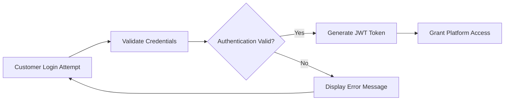
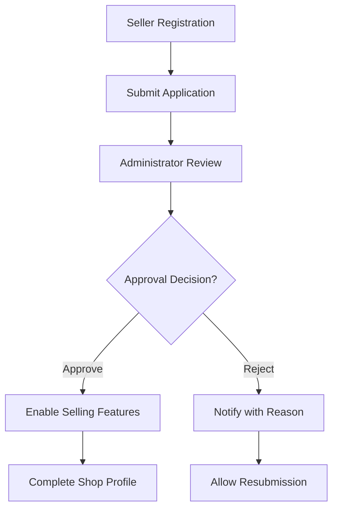
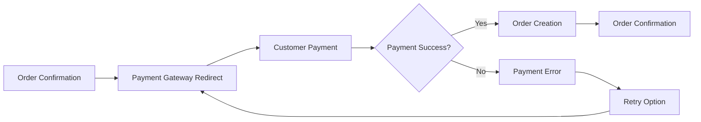

# E-Commerce Shopping Mall Platform Requirements Specification

## Executive Summary

This document defines the complete business requirements for a comprehensive e-commerce shopping mall platform that facilitates secure transactions between customers and sellers. The platform operates on a mandatory registration model with no guest browsing, ensuring full accountability through comprehensive data preservation via snapshots. All financial transactions maintain integrity through immutable records while providing flexible order management across multiple sellers.

## Platform Architecture Principles

### Mandatory Registration Model
THE platform SHALL require user registration before accessing any features, eliminating guest browsing capabilities.

**Registration Enforcement:**
- WHEN any user attempts to access platform features without authentication, THE system SHALL redirect to registration/login
- ALL platform functionality SHALL require valid authentication tokens
- NO features SHALL be accessible to unauthenticated users

### Snapshot-Based Data Integrity
THE platform SHALL implement comprehensive snapshot preservation for all critical data modifications.

**Snapshot Triggers:**
- WHENEVER editable data is modified, THE system SHALL create immutable snapshots
- SNAPSHOTS SHALL preserve complete state including timestamps and modification details
- IMMUTABLE records SHALL support dispute resolution and audit requirements

## Customer Account Management

### Registration Process
WHEN a new customer registers, THE system SHALL collect email address and password with validation.

**Registration Requirements:**
- EMAIL validation SHALL verify format and uniqueness across the platform
- PASSWORD complexity SHALL require minimum 8 characters with mixed case and numbers
- ACCOUNT activation SHALL require email verification before feature access
- REGISTRATION completion SHALL create a basic customer profile requiring completion

### Authentication Workflow
WHEN a customer attempts to log in, THE system SHALL authenticate using email and password combination.

**Authentication Process:**

### Account Management
WHEN a customer manages their account, THE system SHALL provide comprehensive self-service capabilities.

**Account Operations:**
- PASSWORD changes SHALL require current password verification
- PROFILE edits SHALL allow modification of display name and phone number
- ACCOUNT deletion SHALL follow specific data preservation rules

### Account Deletion Rules
WHEN a customer requests account deletion, THE system SHALL process according to legal compliance requirements.

**Deletion Constraints:**
- PROFILE information SHALL be removed from public display
- ORDER history SHALL be preserved with customer marked as "deleted user"
- REVIEWS SHALL remain visible with anonymized authorship
- TRANSACTION records SHALL be maintained for legal and seller requirements

## Customer Profile Management

### Profile Structure
EACH customer SHALL maintain a profile containing essential personal information.

**Profile Components:**
- DISPLAY name for public identification
- PHONE number for order communications
- REGISTRATION date and account status
- PROFILE completion status indicator

### Profile Editing
WHEN customers edit their profiles, THE system SHALL validate changes and update records.

**Edit Validation:**
- DISPLAY name SHALL have minimum 2 and maximum 50 characters
- PHONE number SHALL follow international format standards
- PROFILE changes SHALL be logged for audit purposes

## Address Management System

### Address Creation
WHEN a customer adds a shipping address, THE system SHALL collect comprehensive address details.

**Address Fields Required:**
- RECIPIENT name for package delivery
- PHONE number for delivery coordination
- STREET address with apartment/unit information
- CITY, state/province, and postal code
- COUNTRY for international shipping considerations

### Address Management Operations
THE system SHALL provide complete address management capabilities for customers.

**Management Features:**
- MULTIPLE address storage with individual management
- ADDRESS editing with validation of all field changes
- ADDRESS deletion with constraints for addresses used in active orders
- DEFAULT address designation for checkout convenience

**Default Address Rules:**
- EACH customer SHALL be able to designate one default shipping address
- DEFAULT address SHALL be pre-selected during checkout process
- ADDRESS changes SHALL not affect existing orders using previous addresses

## Seller Account Management

### Seller Registration
WHEN a user registers as a seller, THE system SHALL implement approval-based registration.

**Registration Workflow:**

### Approval Process
WHEN a seller registration is submitted, THE system SHALL route it for administrative review.

**Approval Requirements:**
- ADMINISTRATORS SHALL review seller applications within 7 business days
- APPROVAL decisions SHALL include specific acceptance or rejection reasons
- REJECTED sellers SHALL be able to submit improved applications
- APPROVED sellers SHALL gain immediate access to selling features

### Seller Profile Management
WHEN a seller creates their shop profile, THE system SHALL require essential business information.

**Profile Components:**
- SHOP name for customer identification
- SHOP description detailing products and business
- LOGO image for brand representation
- CONTACT information for customer communications

### Account Deletion Constraints
WHEN a seller requests account deletion, THE system SHALL enforce business continuity rules.

**Deletion Eligibility:**
- NO pending orders with status "paid" or "shipped"
- NO active cancellation or refund requests
- COMPLETE settlement of all financial transactions
- PRESERVATION of order history and seller snapshots

**Deletion Consequences:**
- PRODUCT listings SHALL be removed from public view
- ORDER history SHALL be preserved with shop name at time of purchase
- SNAPSHOTS SHALL remain available for dispute resolution
- CUSTOMER communications SHALL be maintained for existing orders

## Category Management System

### Category Hierarchy
THE platform SHALL organize products using a structured category system.

**Category Structure:**
- PARENT categories for broad product groupings
- SUBCATEGORIES for specific product types (one nesting level only)
- EACH category SHALL have name and description fields
- CATEGORY management SHALL be exclusive to administrators

### Category Operations
WHEN administrators manage categories, THE system SHALL provide comprehensive control.

**Administrative Capabilities:**
- CATEGORY creation with validation of unique names
- CATEGORY editing for name and description updates
- CATEGORY deletion with product recategorization
- HIERARCHY reorganization with constraint validation

**Deletion Impact:**
- WHEN a category is deleted, PRODUCTS in that category SHALL become uncategorized
- RECATEGORIZATION options SHALL be provided for affected products
- HISTORICAL category assignments SHALL be preserved in order snapshots

## Snapshot Principle Implementation

### Snapshot Creation Triggers
THE system SHALL create snapshots whenever critical data modifications occur.

**Snapshot Events:**
- PRODUCT edits including all fields and images
- PRODUCT variant modifications
- SELLER profile changes
- ORDER item creation with product and seller snapshots
- REVIEW edits and deletions
- CANCELLATION and refund request responses

### Snapshot Structure
EACH snapshot SHALL preserve complete state information for audit purposes.

**Snapshot Components:**
- TIMESTAMP of modification
- USER identifier making the change
- COMPLETE before-and-after state
- MODIFICATION reason when applicable
- BUSINESS context for dispute resolution

### Product Snapshot Details
WHEN a product is edited, THE system SHALL create comprehensive snapshots.

**Product Snapshot Contents:**
- PRODUCT name, description, category, and base price
- PRODUCT images with ordering and metadata
- ALL variant information at the moment of snapshot
- SELLER profile details at time of modification

### Immutable Record Keeping
SNAPSHOTS SHALL be immutable and preserved indefinitely for legal compliance.

**Preservation Rules:**
- NO deletion or modification of existing snapshots
- COMPLETE audit trail for all critical modifications
- DISPUTE resolution support through historical records
- LEGAL compliance with financial transaction preservation

## Product Management System

### Product Creation
WHEN a seller creates a product, THE system SHALL require essential product information.

**Product Requirements:**
- NAME with minimum 2 and maximum 200 characters
- DESCRIPTION with minimum 10 and maximum 2000 characters
- CATEGORY selection from available administrator-defined categories
- BASE price with validation against reasonable ranges

### Product Ownership Rules
PRODUCTS SHALL belong exclusively to the seller who creates them.

**Ownership Constraints:**
- SELLERS can only edit and delete their own products
- PRODUCT visibility follows seller account status
- TRANSFER of product ownership between sellers SHALL not be supported

### Product Editing and Snapshots
WHENEVER product information is modified, THE system SHALL create preservation snapshots.

**Edit Workflow:**
- PRODUCT changes SHALL trigger immediate snapshot creation
- SNAPSHOTS SHALL preserve complete product state including variants
- HISTORICAL product information SHALL be available for order context
- REAL-TIME product updates SHALL not affect existing order snapshots

### Product Deletion Constraints
WHEN a seller attempts to delete a product, THE system SHALL validate deletion eligibility.

**Deletion Validation:**
- NO order items with status "paid" or "shipped" for any variant
- NO active cancellation or refund requests for any variant
- COMPLETE removal from search and category listings
- PRESERVATION of order-related snapshots

**Deletion Impact:**
- PRODUCT variants and inventory records SHALL be deleted
- WISHLIST entries SHALL be automatically removed
- ORDER history SHALL maintain product snapshots
- CUSTOMER notifications SHALL be sent for wishlist removals

## Product Image Management

### Image Upload Capabilities
SELLERS SHALL be able to upload multiple images for each product.

**Image Specifications:**
- MAXIMUM 10 images per product
- SUPPORTED formats: JPEG, PNG, WebP
- MAXIMUM file size: 5MB per image
- MINIMUM dimensions: 300x300 pixels
- MAXIMUM dimensions: 4000x4000 pixels

### Image Management Operations
THE system SHALL provide comprehensive image management features.

**Management Features:**
- IMAGE reordering to set primary/thumbnail image
- IMAGE deletion with confirmation
- UPLOAD progress indicators
- FORMAT validation and automatic optimization

### Snapshot Integration
IMAGE changes SHALL be included in product snapshots for complete state preservation.

**Snapshot Rules:**
- IMAGE additions SHALL trigger product snapshot creation
- IMAGE deletions SHALL preserve historical image references
- ORDER snapshots SHALL include product images at time of purchase

## Product Variant System (SKU)

### Variant Creation
WHEN a seller adds variants to a product, THE system SHALL require specific variant information.

**Variant Requirements:**
- SKU code as unique identifier within seller's products
- OPTION values defining specific combinations (e.g., "Red/Large")
- PRICE override capability for variant-specific pricing
- STOCK quantity management with initial zero value

### Variant Management
SELLERS SHALL have comprehensive control over product variants.

**Variant Operations:**
- VARIANT creation with unique SKU validation
- VARIANT editing including option values and pricing
- VARIANT deletion with order constraint validation
- INVENTORY management per variant

### Purchasability Rules
PRODUCTS SHALL require at least one variant to be available for purchase.

**Availability Rules:**
- PRODUCTS without variants SHALL be visible but marked "unavailable"
- VARIANT selection SHALL be required before adding to cart
- STOCK quantity SHALL determine purchase availability
- OUT of stock variants SHALL prevent cart addition

### Variant Deletion Constraints
WHEN deleting variants, THE system SHALL enforce business continuity rules.

**Deletion Validation:**
- NO pending order items for the specific variant
- NO active cancellation or refund requests for the variant
- INVENTORY records SHALL be deleted with variant removal

## Inventory Management System

### Stock Tracking Methodology
THE system SHALL track inventory through comprehensive history records.

**Inventory Records:**
- QUANTITY changes (positive for additions, negative for deductions)
- REASON for each inventory adjustment
- TIMESTAMP of inventory modification
- USER identifier for audit purposes

### Inventory Operations
SELLERS SHALL have flexible inventory management capabilities.

**Management Features:**
- RESTOCKING with quantity and reason recording
- ADJUSTMENTS for inventory corrections or losses
- AUTOMATIC deductions for order placements
- AUTOMATIC restorations for cancellations and refunds

### Stock Calculation
CURRENT stock levels SHALL be calculated by summing all inventory records.

**Calculation Rules:**
- REAL-TIME stock level computation
- NEGATIVE stock prevention through validation
- OUT of stock indicators when quantity reaches zero
- LOW stock warnings for inventory management

### Inventory History
SELLERS SHALL have access to complete inventory transaction history.

**History Access:**
- COMPLETE record of all inventory changes
- FILTERING by date range and adjustment type
- EXPORT capabilities for accounting purposes
- AUDIT trail for financial compliance

## Product Search and Discovery

### Search Functionality
WHEN customers search for products, THE system SHALL provide comprehensive search capabilities.

**Search Features:**
- PRODUCT name search across all sellers
- PAGINATED results with 20 items per page
- RELEVANCE scoring for search result ordering
- SPELLING correction and synonym matching

### Search Filters
CUSTOMERS SHALL be able to refine search results using multiple filter options.

**Available Filters:**
- CATEGORY filtering for product type selection
- PRICE range with minimum and maximum values
- IN-STOCK only toggle for availability filtering
- SELLER selection for brand preference

### Search Sorting
CUSTOMERS SHALL be able to sort search results by various criteria.

**Sorting Options:**
- NEWEST first for recent product additions
- PRICE low to high for budget shopping
- PRICE high to low for premium products
- RELEVANCE for best search match quality
- HIGHEST rated for customer satisfaction

### Search Performance
THE search system SHALL deliver results within acceptable timeframes.

**Performance Targets:**
- SEARCH results within 2 seconds for typical queries
- FILTER applications without significant delay
- PAGINATION loading under 1 second per page
- INDEX updates in near real-time

## Product Display System

### Product Listing Pages
WHEN customers browse product lists, THE system SHALL display consistent product information.

**Listing Information:**
- MAIN image thumbnail for visual identification
- PRODUCT name with character limit display
- PRICE information (base or variant range)
- SELLER shop name with profile link
- AVERAGE rating with review count
- STOCK availability indicator

### Product Detail Pages
WHEN customers view individual products, THE system SHALL show comprehensive details.

**Detail Page Components:**
- ALL product images in gallery format
- PRODUCT name and full description
- CATEGORY navigation with breadcrumbs
- SELLER information with profile link
- ALL available variants with pricing and stock
- AVERAGE rating and review statistics
- COMPLETE review list with pagination

### Variant Selection Interface
CUSTOMERS SHALL have clear variant selection before purchase.

**Selection Features:**
- VISUAL variant option presentation
- REAL-TIME stock quantity display
- PRICE differences between variants
- UNAVAILABLE variant clear indication
- QUANTITY selection with stock validation

## Wishlist Management

### Wishlist Operations
CUSTOMERS SHALL be able to maintain personal product wishlists.

**Wishlist Features:**
- PRODUCT addition to wishlist
- WISHLIST viewing with pagination
- PRODUCT removal from wishlist
- WISHLIST persistence across sessions
- PRODUCT movement to shopping cart

### Wishlist Constraints
THE system SHALL enforce wishlist management rules.

**Management Rules:**
- MAXIMUM 500 items per wishlist
- PRODUCT-based entries (not variant-specific)
- AUTOMATIC removal when products are deleted
- PRIVATE wishlist visibility

### Integration with Product Management
WISHLISTS SHALL integrate seamlessly with product lifecycle.

**Integration Rules:**
- PRODUCT deletions SHALL trigger wishlist cleanup
- PRICE changes SHALL be reflected in wishlist displays
- STOCK status SHALL update wishlist item availability
- SELLER changes SHALL not affect wishlist entries

## Shopping Cart System

### Cart Addition Process
WHEN customers add products to cart, THE system SHALL manage item aggregation.

**Addition Rules:**
- VARIANT selection required before cart addition
- QUANTITY specification with stock validation
- DUPLICATE variant combination into single line item
- QUANTITY limits based on available stock

### Cart Management
CUSTOMERS SHALL have comprehensive cart management capabilities.

**Management Features:**
- QUANTITY adjustment with stock validation
- ITEM removal with confirmation
- PRODUCT details access from cart items
- CART total calculation with item subtotals

### Cart Validation
THE system SHALL continuously validate cart contents.

**Validation Rules:**
- STOCK quantity checks against cart quantities
- UNAVAILABLE item identification and marking
- PRICE consistency with current product pricing
- SELLER status validation for order eligibility

### Cart Persistence
SHOPPING carts SHALL persist across user sessions.

**Persistence Rules:**
- BROWSER session maintenance
- USER account association for cross-device access
- CART expiration after 30 days of inactivity
- GUEST cart conversion upon registration

## Checkout Process

### Checkout Initiation
WHEN customers proceed to checkout, THE system SHALL validate cart contents.

**Validation Steps:**
- ITEM availability confirmation
- QUANTITY validation against current stock
- SELLER status checks for order eligibility
- CART total calculation verification

### Address Selection
CUSTOMERS SHALL select shipping addresses during checkout.

**Selection Options:**
- DEFAULT address pre-selection
- SAVED address list for quick selection
- NEW address creation with validation
- ADDRESS locking after order placement

### Order Review
CUSTOMERS SHALL review complete order details before payment.

**Review Information:**
- ITEM list with prices and quantities
- SHIPPING address confirmation
- ORDER total with breakdown
- TERMS and conditions acceptance

### Payment Processing
WHEN customers confirm orders, THE system SHALL process payments.

**Payment Flow:**

## Order Creation and Management

### Order Creation Process
WHEN payment succeeds, THE system SHALL create comprehensive order records.

**Creation Steps:**
- INVENTORY deduction for purchased quantities
- CART clearance upon successful order creation
- ORDER record generation with unique identifier
- ITEM snapshots preserving product and seller states
- CUSTOMER notification with order details

### Order Structure
ORDERS SHALL contain detailed information for proper management.

**Order Components:**
- ORDER header with number, date, and customer information
- ITEM list with product snapshots and quantities
- SHIPPING address used for delivery
- PAYMENT transaction reference
- STATUS tracking for order progression

### Multi-Seller Order Handling
ORDERS containing items from multiple sellers SHALL be properly managed.

**Management Rules:**
- ITEM grouping by seller for independent processing
- SEPARATE shipment creation for each seller
- INDIVIDUAL item status tracking
- COMBINED order status calculation

### Order Status Lifecycle
EACH order item SHALL progress through defined status stages.

**Status Definitions:**
- **PAID**: Payment completed, awaiting seller shipment
- **SHIPPED**: Seller has shipped with tracking information
- **DELIVERED**: Customer confirmation or automatic delivery
- **CANCELLED**: Item cancelled through approval process
- **REFUNDED**: Item refunded after delivery

### Order Status Aggregation
OVERALL order status SHALL be derived from constituent items.

**Aggregation Rules:**
- ALL items paid → "paid" status
- ANY items shipped → "shipped" status
- ALL items delivered → "delivered" status
- ALL items cancelled → "cancelled" status
- ALL items refunded → "refunded" status
- MIXED statuses → "partially completed" status

## Shipping and Tracking System

### Shipment Concept
SHIPMENTS represent physical packages sent by sellers to customers.

**Shipment Definition:**
- SINGLE package containing one or more order items
- SELLER-specific shipments (different sellers always ship separately)
- TRACKING information per shipment
- DELIVERY confirmation per shipment

### Shipment Creation
SELLERS SHALL create shipments for their order items.

**Creation Process:**
- ITEM selection from "paid" status orders
- CARRIER information entry with tracking number
- SHIPMENT record creation with item associations
- STATUS update for all included items

### Delivery Confirmation
CUSTOMERS SHALL confirm delivery for received shipments.

**Confirmation Methods:**
- MANUAL confirmation by customer
- AUTOMATIC confirmation after 14 days
- ITEM status update to "delivered"
- REVIEW eligibility activation

### Tracking Integration
THE system SHALL provide comprehensive tracking capabilities.

**Tracking Features:**
- CARRIER integration for real-time updates
- TRACKING number validation and formatting
- DELIVERY estimate calculations
- EXCEPTION handling for delivery issues

## Cancellation Request Workflow

### Cancellation Eligibility
CUSTOMERS SHALL be able to request cancellations under specific conditions.

**Eligibility Rules:**
- ITEMS with "paid" status (not yet shipped)
- INDIVIDUAL item cancellation (not entire orders)
- REASON requirement for cancellation requests
- SELLER approval process for request processing

### Cancellation Process
WHEN customers request cancellations, THE system SHALL manage the workflow.

**Process Steps:**
- REQUEST creation with reason and item selection
- SELLER notification of pending cancellation
- APPROVAL/REJECTION decision by seller
- STATUS update and inventory restoration if approved
- REFUND processing for cancelled amounts

### Snapshot Integration
CANCELLATION requests SHALL integrate with the snapshot system.

**Snapshot Rules:**
- REQUEST creation snapshot preserving initial state
- RESPONSE snapshot capturing seller decision
- COMPLETION snapshot for audit trail
- IMMUTABLE records for dispute resolution

## Refund Request Workflow

### Refund Eligibility
CUSTOMERS SHALL be able to request refunds under specific conditions.

**Eligibility Rules:**
- ITEMS with "delivered" status
- REQUEST within 7 days of delivery
- INDIVIDUAL item refund requests
- REASON requirement for refund justification

### Refund Process
WHEN customers request refunds, THE system SHALL manage the approval workflow.

**Process Steps:**
- REQUEST creation with delivery timestamp validation
- SELLER notification of pending refund request
- APPROVAL/REJECTION decision with reason
- REFUND processing for approved requests
- INVENTORY restoration for refunded items

### Time Constraints
REFUND requests SHALL be subject to strict time limitations.

**Time Rules:**
- 7-DAY window from delivery for request submission
- AUTOMATIC rejection for expired requests
- CLEAR communication of time constraints
- EXCEPTION handling for legitimate delays

## Review and Rating System

### Review Eligibility
CUSTOMERS SHALL be able to write reviews under specific conditions.

**Eligibility Rules:**
- PRODUCT purchase with "delivered" status
- ONE review per product per order
- TIME window of 90 days from delivery
- RATING requirement (1-5 stars)

### Review Creation
WHEN eligible customers write reviews, THE system SHALL capture comprehensive feedback.

**Review Components:**
- STAR rating (required, 1-5 scale)
- TEXT content (optional, 2000 character limit)
- PRODUCT and order reference
- TIMESTAMP of review creation

### Review Management
CUSTOMERS SHALL have control over their own reviews.

**Management Features:**
- REVIEW editing with snapshot preservation
- REVIEW deletion with historical maintenance
- RATING updates with average recalculation
- CONTENT moderation for policy compliance

### Average Rating Calculation
PRODUCT ratings SHALL be calculated from customer reviews.

**Calculation Rules:**
- AVERAGE from all non-deleted reviews
- REAL-TIME updates with new reviews
- ONE decimal place precision
- DISTRIBUTION breakdown by star rating

## Seller Dashboard System

### Dashboard Overview
SELLERS SHALL have comprehensive business management tools.

**Dashboard Components:**
- PRODUCT count and performance metrics
- ORDER item statistics by status
- CANCELLATION and refund request counts
- REVENUE trends and analytics

### Order Management
SELLERS SHALL manage orders for their products efficiently.

**Management Features:**
- ORDER filtering by status and date
- SHIPMENT creation with tracking
- CANCELLATION and refund response
- CUSTOMER communication tools

### Performance Analytics
SELLERS SHALL access business performance data.

**Analytics Provided:**
- SALES trends over time periods
- PRODUCT performance comparisons
- CUSTOMER satisfaction metrics
- INVENTORY turnover rates

## Administrator System

### Administrator Hierarchy
THE platform SHALL maintain structured administrator privileges.

**Administrator Levels:**
- REGULAR administrators with standard privileges
- SUPER administrators with enhanced capabilities
- PROMOTION process through request and approval
- DEMOTION restrictions for self-protection

### Seller Management
ADMINISTRATORS SHALL oversee seller accounts and approvals.

**Management Capabilities:**
- SELLER registration approval/rejection
- SELLER account suspension/unsuspension
- PERFORMANCE monitoring and intervention
- POLICY enforcement and compliance

### Category Management
ADMINISTRATORS SHALL maintain product categorization.

**Management Features:**
- CATEGORY creation and organization
- CATEGORY editing and deletion
- PRODUCT recategorization tools
- HIERARCHY maintenance

### User Management
ADMINISTRATORS SHALL manage platform user accounts.

**Management Capabilities:**
- CUSTOMER account viewing and banning
- SELLER account oversight
- ADMINISTRATOR promotion/demotion
- SECURITY and compliance monitoring

### Order Intervention
ADMINISTRATORS SHALL have order management authority.

**Intervention Capabilities:**
- FORCE cancellation with refund processing
- FORCE refund for dispute resolution
- ORDER status modification
- TRANSACTION oversight

## Error Handling and Recovery

### Payment Errors
WHEN payment processing fails, THE system SHALL handle errors gracefully.

**Error Handling:**
- PAYMENT gateway failure recovery
- ORDER state preservation during retries
- CUSTOMER communication for payment issues
- AUTOMATIC refund initiation for failed orders

### Inventory Conflicts
WHEN inventory changes affect transactions, THE system SHALL manage conflicts.

**Conflict Resolution:**
- REAL-TIME stock validation
- CART updates for unavailable items
- ORDER prevention for inventory conflicts
- CUSTOMER notification of changes

### System Failures
WHEN system components fail, THE system SHALL maintain data integrity.

**Failure Recovery:**
- TRANSACTION rollback for partial failures
- SNAPSHOT preservation during errors
- AUTOMATIC retry mechanisms
- ADMINISTRATOR notification for critical issues

## Performance Requirements

### Response Time Targets
THE system SHALL meet specific performance benchmarks.

**Performance Goals:**
- PAGE loads within 2 seconds
- SEARCH results within 2 seconds
- ORDER processing within 5 seconds
- PAYMENT completion within 10 seconds

### Scalability Requirements
THE platform SHALL support growing user and transaction volumes.

**Scalability Targets:**
- CONCURRENT user support for peak loads
- DATABASE performance for large datasets
- PAYMENT processing during high volume
- INVENTORY management under heavy usage

## Security Requirements

### Data Protection
THE system SHALL implement comprehensive security measures.

**Protection Measures:**
- ENCRYPTION for sensitive data
- ACCESS controls for user permissions
- AUDIT trails for security monitoring
- COMPLIANCE with data protection regulations

### Transaction Security
FINANCIAL transactions SHALL be secured against fraud.

**Security Implementation:**
- PAYMENT gateway security compliance
- TRANSACTION validation and verification
- FRAUD detection and prevention
- CHARGEBACK handling procedures

This comprehensive requirements specification provides the foundation for developing a robust, secure, and scalable e-commerce platform that meets the needs of customers, sellers, and administrators while maintaining data integrity through comprehensive snapshot preservation.