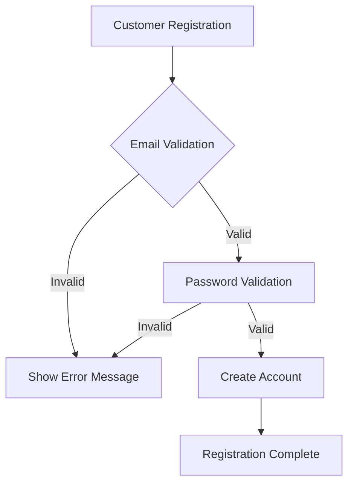
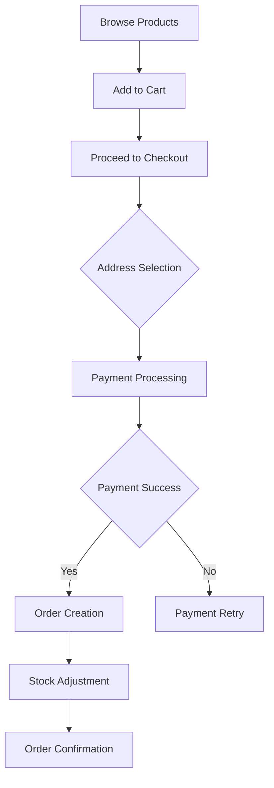
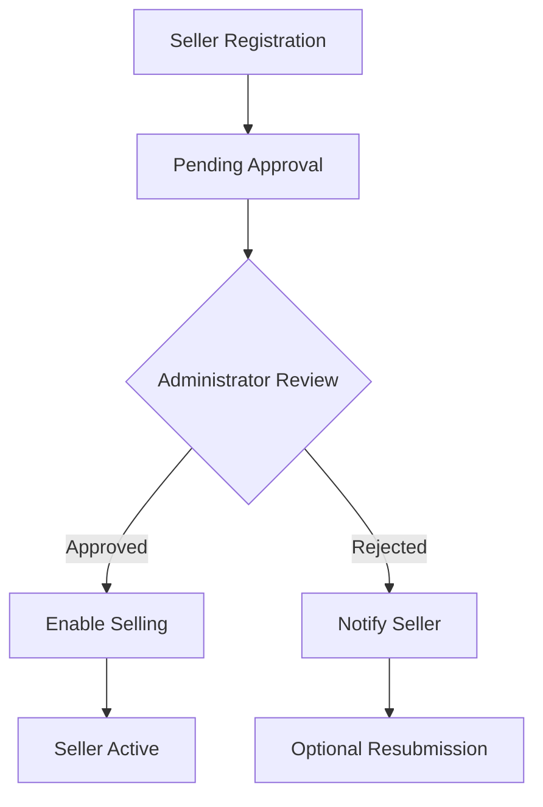

# E-Commerce Shopping Mall Platform Requirements Specification

## Executive Summary

The E-Commerce Shopping Mall Platform is a comprehensive online marketplace that facilitates secure transactions between customers and sellers with robust data preservation through snapshot technology. This platform requires user registration for all features, ensuring authenticated interactions and maintaining transaction integrity.

## Business Model

This platform operates as a multi-vendor marketplace where sellers list products and customers make purchases. The business model focuses on transaction security, data immutability for dispute resolution, and comprehensive seller-customer interactions. The snapshot principle ensures all data modifications are preserved for audit and legal compliance.

## Target Market

Primary users include individual consumers seeking diverse products, small to medium-sized businesses looking to sell products online, and administrators managing platform operations. The platform serves markets requiring secure transaction records and comprehensive audit trails.

## Competitive Advantage

The snapshot system provides unique competitive advantage by preserving all data modifications, enabling transparent dispute resolution and maintaining legal compliance for financial transactions. The requirement-based authentication system ensures platform security while the multi-vendor marketplace model offers diverse product selection.

## Success Metrics

Key performance indicators include user registration rates, seller approval conversion, transaction volume, order completion rates, and dispute resolution efficiency. Platform success is measured by user satisfaction, transaction security, and data integrity maintenance.

## Functional Requirements

### Authentication System

**User Registration Requirements**
- WHEN a user attempts to register with email and password, THE system SHALL validate email format and password complexity
- THE system SHALL require minimum 8-character passwords with at least one uppercase letter and one number
- WHERE registration succeeds, THE system SHALL create user account with "active" status

**Login Requirements**
- WHEN a user provides valid credentials, THE system SHALL create authenticated session
- IF invalid credentials are provided three times consecutively, THE system SHALL temporarily lock account for 15 minutes
- THE system SHALL invalidate all active sessions upon password change

**Account Management Requirements**
- Users SHALL be able to change their password with current password verification
- Account deletion SHALL require confirmation and preserve order history
- WHEN a customer deletes account, THE system SHALL preserve orders and mark reviews as "deleted user"

### Customer Profile Management

**Profile Requirements**
- EACH customer SHALL have profile with display name and phone number
- Display names SHALL be 2-50 characters containing alphanumeric characters and spaces
- Phone numbers SHALL follow international format standards

**Profile Editing Requirements**
- Customers SHALL be able to edit display name and phone number
- Profile updates SHALL validate data format before saving
- THE system SHALL maintain profile change history

### Address Management System

**Address Creation Requirements**
- Customers SHALL be able to add up to 5 shipping addresses
- EACH address SHALL contain recipient name, phone, street address, city, state, postal code, country
- Address validation SHALL verify format completeness

**Address Management Requirements**
- Customers SHALL be able to edit existing addresses
- Address deletion SHALL be prevented if address is associated with pending orders
- Customers SHALL be able to set one address as default shipping address

### Seller Registration and Approval

**Seller Registration Requirements**
- Sellers SHALL register with email and password following same validation as customers
- New seller accounts SHALL be placed in "pending approval" status
- Administrators SHALL review and approve/reject seller applications

**Approval Workflow Requirements**
- WHEN administrator approves seller, THE system SHALL enable product creation privileges
- IF administrator rejects seller, THE system SHALL provide rejection reason
- Rejected sellers SHALL be able to submit new registration after 30 days

**Seller Account Deletion Requirements**
- Seller account deletion SHALL require verification of no pending orders or requests
- WHEN seller deletes account, THE system SHALL remove products but preserve order history
- Shop names in past orders SHALL be preserved after account deletion

### Seller Profile Management

**Profile Requirements**
- EACH seller SHALL have profile with shop name, description, and logo
- Shop names SHALL be unique within platform
- Profile edits SHALL create snapshots preserving previous state

**Profile Visibility Requirements**
- Customers SHALL be able to view seller profiles
- Seller profiles SHALL display shop information and product listings
- Profile snapshots SHALL be accessible for dispute resolution

### Category Management System

**Category Creation Requirements**
- ONLY administrators SHALL create and manage categories
- Categories SHALL support one level of subcategory nesting
- EACH category SHALL have name and description

**Category Management Requirements**
- Category names SHALL be unique within same hierarchy level
- WHEN category is deleted, products SHALL become uncategorized
- Customers SHALL be able to browse categories and view products

### Snapshot System Implementation

**Snapshot Creation Requirements**
- THE system SHALL create snapshots for all product edits including images
- Variant modifications SHALL trigger product-level snapshots
- Seller profile updates SHALL create snapshots preserving previous information

**Snapshot Structure Requirements**
- EACH snapshot SHALL record timestamp, user identifier, and complete state
- Product snapshots SHALL include all product fields and variant states
- Snapshots SHALL be immutable and preserved indefinitely

**Snapshot Access Requirements**
- Sellers SHALL access snapshots of their own products
- Administrators SHALL access snapshots of any product
- Snapshots SHALL be used for dispute resolution and audit purposes

### Product Management System

**Product Creation Requirements**
- Sellers SHALL create products with name, description, category, and base price
- Products SHALL belong to creating seller
- Products SHALL require at least one variant to be purchasable

**Product Editing Requirements**
- Sellers SHALL edit their own products with snapshot creation
- Product edits SHALL validate all required fields
- Image changes SHALL be included in product snapshots

**Product Deletion Requirements**
- Product deletion SHALL require verification of no pending orders or requests
- WHEN product is deleted, variants and inventory records SHALL be removed
- Deleted products SHALL not appear in search or category listings

### Product Image Management

**Image Upload Requirements**
- Sellers SHALL upload multiple images per product
- Image order SHALL be customizable with first image as thumbnail
- Image changes SHALL be included in product snapshots

**Image Management Requirements**
- Sellers SHALL be able to delete images from products
- Image modifications SHALL preserve previous states in snapshots
- Product displays SHALL show images in specified order

### Product Variant System

**Variant Creation Requirements**
- Products SHALL support multiple variants with specific option combinations
- EACH variant SHALL have unique SKU code, option values, price, and stock quantity
- Variant prices SHALL override product base price when specified

**Variant Management Requirements**
- Sellers SHALL edit variants with snapshot creation
- Variant deletion SHALL require verification of no pending orders
- Products without variants SHALL be visible but marked "unavailable"

### Inventory Management System

**Stock Management Requirements**
- EACH variant SHALL maintain stock quantity through inventory history
- Inventory records SHALL track quantity changes with reasons and timestamps
- Current stock SHALL be calculated as sum of all inventory records

**Inventory Operations Requirements**
- Sellers SHALL add inventory with positive quantity and reason
- Order placement SHALL create negative inventory records
- Cancellations and refunds SHALL create positive inventory records

**Stock Status Requirements**
- WHEN stock reaches 0, variant SHALL be marked "out of stock"
- Out of stock variants SHALL not be addable to cart
- Stock warnings SHALL display when cart quantity exceeds available stock

### Product Search and Discovery

**Search Functionality Requirements**
- Customers SHALL search products by name across all sellers
- Search results SHALL be paginated with 50 items per page
- Search SHALL support filtering by category, price range, and stock status

**Sorting and Filtering Requirements**
- Search results SHALL be sortable by newest, price low-high, price high-low
- Price range filters SHALL validate minimum < maximum
- In-stock filtering SHALL show only available variants

### Product Display Requirements

**Listing Display Requirements**
- Product listings SHALL show thumbnail, name, price range, seller, and rating
- Price ranges SHALL display when variants have different prices
- Average ratings SHALL calculate from non-deleted reviews

**Detail Page Requirements**
- Product detail pages SHALL display all images, description, category information
- Variant availability SHALL be clearly indicated
- Reviews and ratings SHALL be displayed with pagination

### Wishlist Management

**Wishlist Operations Requirements**
- Customers SHALL add products to wishlist
- Wishlist SHALL display products with pagination
- Customers SHALL remove products from wishlist

**Wishlist Maintenance Requirements**
- WHEN product is deleted, THE system SHALL remove from all wishlists
- Wishlist SHALL track products rather than specific variants
- Wishlist items SHALL maintain product reference integrity

### Shopping Cart System

**Cart Operations Requirements**
- Customers SHALL add specific variants to cart with quantity
- Duplicate variants SHALL combine quantities in cart
- Cart SHALL display items with product name, variant, price, quantity, subtotal

**Cart Management Requirements**
- Customers SHALL modify quantities and remove items from cart
- Cart SHALL calculate and display total price
- Stock validation SHALL warn when cart quantity exceeds availability

**Cart Validation Requirements**
- Unavailable items SHALL be marked in cart
- Checkout SHALL be prevented if cart contains unavailable items
- Cart contents SHALL persist between sessions

### Checkout Process

**Checkout Preparation Requirements**
- Customers SHALL proceed to checkout from cart
- Checkout SHALL require selection of shipping address
- Order summary SHALL display items, address, and total price

**Order Review Requirements**
- Customers SHALL review order details before confirmation
- Shipping address SHALL be locked after order placement
- Payment processing SHALL occur after order confirmation

### Payment Processing

**Payment Workflow Requirements**
- Payment SHALL be processed through external gateway integration
- Successful payment SHALL trigger order creation
- Failed payment SHALL allow retry without order creation

**Payment Validation Requirements**
- Payment success SHALL be verified before inventory adjustment
- Order creation SHALL only occur after confirmed payment
- Payment failures SHALL preserve cart contents for retry

### Order Creation and Management

**Order Creation Requirements**
- Successful payment SHALL create order record
- Stock quantities SHALL be decreased for purchased variants
- Cart SHALL be cleared after successful order creation

**Order Structure Requirements**
- Orders SHALL contain one or more order items
- EACH order item SHALL preserve product, variant, and seller snapshots
- Order items from different sellers SHALL be grouped in same order

**Order History Requirements**
- Customers SHALL view paginated order history
- Order details SHALL show items, statuses, shipments, and tracking
- Order status SHALL derive from constituent item statuses

### Order Status Management

**Item Status Requirements**
- Order items SHALL have statuses: paid, shipped, delivered, cancelled, refunded
- Status transitions SHALL follow defined workflow rules
- EACH item SHALL maintain independent status

**Order Status Derivation Requirements**
- WHEN all items are paid, order status SHALL be "paid"
- WHEN any item ships, order status SHALL be "shipped"
- WHEN all items deliver, order status SHALL be "delivered"
- Mixed statuses SHALL result in "partially completed"

### Shipping and Tracking System

**Shipment Creation Requirements**
- Sellers SHALL create shipments containing their order items
- Shipments SHALL include tracking information with carrier and number
- All items in shipment SHALL share same tracking information

**Delivery Confirmation Requirements**
- Customers SHALL confirm delivery at shipment level
- Automatic delivery confirmation SHALL occur after 14 days
- Delivery confirmation SHALL update all shipment items to "delivered"

### Cancellation Request System

**Cancellation Eligibility Requirements**
- Customers SHALL request cancellation for "paid" status items
- Cancellation requests SHALL include reason text minimum 10 characters
- Sellers SHALL respond within 72 hours

**Cancellation Processing Requirements**
- Approved cancellations SHALL trigger refund and stock restoration
- Cancelled items SHALL be removed from order calculations
- Snapshot SHALL be created for cancellation request responses

### Refund Request System

**Refund Eligibility Requirements**
- Refund requests SHALL be accepted within 7 days of delivery
- EACH request SHALL include reason text minimum 10 characters
- ONLY "delivered" status items SHALL be eligible for refund

**Refund Processing Requirements**
- Approved refunds SHALL restore stock quantities
- Refunded items SHALL be marked accordingly
- Snapshot SHALL preserve refund request state changes

### Review and Rating System

**Review Eligibility Requirements**
- Customers SHALL review products after corresponding items deliver
- EACH customer SHALL be limited to one review per product per order
- Ratings SHALL be integers between 1 and 5

**Review Management Requirements**
- Customers SHALL edit reviews with snapshot creation
- Review deletion SHALL preserve historical snapshots
- Average ratings SHALL calculate from non-deleted reviews

### Seller Dashboard

**Dashboard Display Requirements**
- Sellers SHALL view shop summary with product counts and pending requests
- Order item lists SHALL be filterable by status
- Dashboard SHALL provide quick access to common operations

**Seller Operations Requirements**
- Sellers SHALL manage products, inventory, and orders from dashboard
- Pending requests SHALL be prominently displayed
- Performance metrics SHALL be available for business analysis

### Administrator System

**Administrator Promotion Requirements**
- ANY user SHALL request administrator status
- Super administrators SHALL approve/reject promotion requests
- Promotion approvals SHALL grant appropriate permissions

**Seller Management Requirements**
- Administrators SHALL approve/reject seller registrations
- Seller suspensions SHALL hide products while preserving order processing
- Administrative actions SHALL include reason documentation

**Category Management Requirements**
- Administrators SHALL create, edit, and delete categories
- Category changes SHALL maintain product relationships
- Category hierarchy SHALL support one-level nesting

**User Management Requirements**
- Administrators SHALL view and manage customer and seller accounts
- Account bans SHALL prevent login while preserving data
- Administrative oversight SHALL include audit trail maintenance

## Business Process Flows

### Customer Registration Flow

### Product Purchase Flow

### Seller Approval Flow

## Data Preservation Requirements

### Account Deletion Preservation
- Customer account deletion SHALL preserve order history with anonymized user reference
- Seller account deletion SHALL preserve order snapshots with shop name
- Review content SHALL be preserved with "deleted user" attribution

### Legal Compliance Requirements
- Order records SHALL be preserved for minimum 7 years
- Financial transaction data SHALL comply with accounting standards
- User data handling SHALL follow data protection regulations

## Performance Requirements

### System Performance Targets
- Product search results SHALL load within 2 seconds
- Order processing SHALL complete within 5 seconds
- Page navigation SHALL respond within 1 second

### Scalability Requirements
- Platform SHALL support 10,000 concurrent users
- Database SHALL handle 1 million product listings
- Order processing SHALL scale to 1,000 transactions per minute

## Security Requirements

### Authentication Security
- Password storage SHALL use industry-standard hashing algorithms
- Session management SHALL include timeout and invalidation controls
- API endpoints SHALL enforce role-based access control

### Data Security
- Personal information SHALL be encrypted at rest and in transit
- Financial data SHALL comply with PCI DSS standards
- Audit trails SHALL be maintained for all sensitive operations

## Integration Requirements

### Payment Gateway Integration
- Platform SHALL integrate with major payment processors
- Payment API SHALL support multiple currency transactions
- Failed payment handling SHALL include comprehensive error recovery

### Shipping Carrier Integration
- Tracking system SHALL integrate with major shipping carriers
- Real-time tracking updates SHALL be available to customers
- Shipping cost calculations SHALL be accurate and transparent

## Error Handling Requirements

### User-Facing Errors
- Error messages SHALL be clear and actionable
- System failures SHALL preserve user data and state
- Recovery procedures SHALL be automated where possible

### System Recovery
- Transaction failures SHALL roll back partial changes
- Data consistency SHALL be maintained during system outages
- Backup and recovery procedures SHALL be regularly tested

## Compliance Requirements

### Regulatory Compliance
- Platform operations SHALL comply with e-commerce regulations
- Tax calculation SHALL be accurate for applicable jurisdictions
- Consumer protection laws SHALL be fully implemented

### Data Privacy
- User data collection SHALL follow privacy-by-design principles
- Data retention policies SHALL be clearly documented
- User consent SHALL be obtained for data processing activities

> *This requirements specification provides comprehensive business requirements for the e-commerce platform implementation. All technical implementation details are at the discretion of the development team while ensuring compliance with these business rules and functional requirements.*