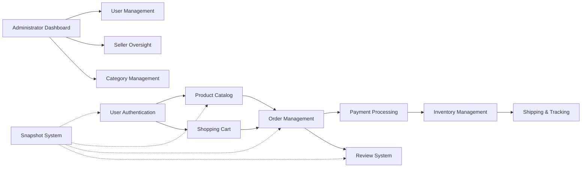

# E-Commerce Shopping Mall Platform - Service Overview

## Executive Summary

The E-Commerce Shopping Mall Platform is a comprehensive online marketplace designed to facilitate secure transactions between sellers and customers while maintaining complete data integrity through a robust snapshot system. This platform addresses the growing need for trustworthy e-commerce solutions that preserve transaction history while protecting user privacy.

### Core Value Proposition
The platform provides a secure, transparent marketplace where:
- **Customers** can shop with confidence knowing their purchase history is preserved
- **Sellers** can manage their business with comprehensive inventory and order tracking
- **Administrators** can maintain platform integrity through detailed oversight capabilities
- **All parties** benefit from immutable transaction records for dispute resolution

### Platform Vision
To create the most reliable e-commerce platform where every transaction is permanently documented, providing unprecedented transparency and trust for all participants.

## Business Model

### Revenue Strategy
The platform will generate revenue through:
- **Transaction Fees**: Percentage-based commission on completed sales
- **Seller Subscription Tiers**: Premium features for advanced sellers
- **Featured Listings**: Promoted product placement for sellers
- **Future Expansion**: Payment processing fees, premium analytics

### Monetization Timeline
- **Phase 1 (Launch)**: Focus on transaction volume with minimal fees to attract sellers
- **Phase 2 (Growth)**: Introduce subscription tiers as seller base expands
- **Phase 3 (Maturity)**: Implement advanced monetization features

### Growth Plan
- **User Acquisition**: Targeted marketing to both sellers and customers
- **Seller Onboarding**: Streamlined approval process with seller support
- **Customer Acquisition**: SEO optimization and referral programs
- **Retention Strategy**: Loyalty programs and seller performance incentives

### Success Metrics
- **Monthly Active Users (MAU)**: Target 10,000+ within first year
- **Gross Merchandise Volume (GMV)**: Target $1M+ in first year
- **Seller Retention Rate**: Maintain 80%+ seller retention
- **Customer Satisfaction**: Achieve 4.5+ average rating
- **Transaction Completion Rate**: Maintain 95%+ successful transactions

## Target Market

### Primary User Segments

#### Customers
- **Demographics**: Age 18-65, tech-savvy online shoppers
- **Needs**: Secure shopping, reliable sellers, purchase history preservation
- **Pain Points**: Lack of transaction transparency, lost purchase records

#### Sellers
- **Profile**: Small to medium businesses, individual entrepreneurs
- **Needs**: Easy product management, reliable payment processing, customer reach
- **Pain Points**: Complex platforms, high fees, limited oversight capabilities

#### Administrators
- **Role**: Platform governance, dispute resolution, user management
- **Needs**: Comprehensive oversight tools, data integrity assurance

### Market Opportunity
- **E-commerce Growth**: Global e-commerce market projected to reach $6.3 trillion by 2024
- **Trust Gap**: Increasing demand for transparent transaction platforms
- **SME Opportunity**: Small businesses seeking accessible online marketplaces

## Competitive Advantage

### Unique Selling Propositions

#### 1. Comprehensive Snapshot System
- **Data Integrity**: Every modification creates immutable records
- **Dispute Resolution**: Complete transaction history for all parties
- **Legal Compliance**: Meets regulatory requirements for transaction records

#### 2. Multi-Seller Order Management
- **Seamless Experience**: Customers can purchase from multiple sellers in one transaction
- **Independent Fulfillment**: Sellers manage their own shipments independently
- **Unified Tracking**: Customers track all shipments in one interface

#### 3. Advanced Seller Tools
- **Inventory Management**: Real-time stock tracking with historical records
- **Order Analytics**: Comprehensive sales and performance metrics
- **Flexible Product Variants**: Sophisticated SKU management system

#### 4. Customer-Centric Features
- **Wishlist Integration**: Save products for future purchase
- **Review System**: Authentic customer feedback with purchase verification
- **Order History**: Complete purchase records even after account deletion

### Differentiation Factors

| Feature | Traditional Platforms | Our Platform |
|---------|---------------------|--------------|
| Data Preservation | Limited retention | Complete snapshot system |
| Multi-Seller Orders | Separate transactions | Unified checkout |
| Seller Approval | Manual process | Streamlined with oversight |
| Dispute Resolution | Limited evidence | Full transaction snapshots |

## Platform Architecture Overview

### Core Components

### Key Relationships
- **User Management**: Foundation for all platform interactions
- **Product Catalog**: Central repository for seller offerings
- **Order Processing**: Core transaction engine connecting customers and sellers
- **Snapshot System**: Cross-cutting concern ensuring data integrity

## Business Justification

### Market Need
Current e-commerce platforms lack comprehensive transaction history preservation, creating challenges for:
- **Customers**: Lost purchase records after account deletion
- **Sellers**: Inability to prove product state at time of sale
- **Legal Requirements**: Inadequate records for dispute resolution

### Problem Statement
The e-commerce industry faces a trust deficit due to:
- Incomplete transaction records
- Limited seller accountability
- Poor dispute resolution mechanisms
- Data loss during account management

### Solution Benefits
- **Enhanced Trust**: Transparent transaction records build confidence
- **Legal Compliance**: Meets data preservation requirements
- **Seller Protection**: Protects against fraudulent claims
- **Customer Satisfaction**: Preserves purchase history

## Success Criteria

### Key Performance Indicators

#### User Growth Metrics
- Monthly Active Users (MAU) growth rate
- Seller registration and approval rates
- Customer acquisition and retention rates

#### Transaction Metrics
- Gross Merchandise Volume (GMV)
- Average Order Value (AOV)
- Transaction completion rate
- Refund and cancellation rates

#### Platform Health Metrics
- System uptime and performance
- Customer satisfaction scores
- Seller satisfaction scores
- Dispute resolution efficiency

### Business Objectives
- **Year 1**: Establish platform credibility and user base
- **Year 2**: Achieve profitability through transaction volume
- **Year 3**: Expand feature set and market penetration
- **Year 4**: Become industry leader in transaction transparency

## Implementation Strategy

### Phased Approach

#### Phase 1: Core Platform (Months 1-6)
- User authentication and registration
- Basic product catalog and shopping cart
- Simple order processing and payment
- Essential seller dashboard

#### Phase 2: Advanced Features (Months 7-12)
- Complete snapshot system implementation
- Multi-seller order management
- Advanced inventory and variant system
- Comprehensive review system

#### Phase 3: Optimization (Months 13-18)
- Performance optimization
- Advanced analytics and reporting
- Mobile app development
- Integration ecosystem expansion

### Risk Mitigation
- **Technical Risks**: Comprehensive testing of snapshot system
- **Market Risks**: Gradual fee introduction to avoid seller resistance
- **Operational Risks**: Scalable infrastructure planning
- **Compliance Risks**: Legal review of data preservation policies

## Future Vision

### Platform Evolution
- **AI Integration**: Smart product recommendations and seller insights
- **International Expansion**: Multi-currency and multi-language support
- **Mobile-First Experience**: Progressive web app and native mobile applications
- **API Ecosystem**: Third-party integration opportunities

### Long-term Goals
- Become the most trusted e-commerce platform globally
- Set industry standards for transaction transparency
- Enable small businesses to compete effectively online
- Create sustainable economic opportunities for sellers

## Business Requirements in EARS Format

### Customer Registration Requirements
- **WHEN** a user attempts to register, **THE** system **SHALL** require email and password validation
- **WHERE** email format is invalid, **THE** system **SHALL** display specific error message
- **WHILE** registration is pending email verification, **THE** user **SHALL** not access platform features

### Seller Approval Workflow
- **WHEN** a seller submits registration, **THE** system **SHALL** place account in "pending approval" status
- **IF** administrator approves seller, **THEN THE** system **SHALL** enable product creation capabilities
- **WHERE** seller registration is rejected, **THE** system **SHALL** provide specific rejection reason

### Product Creation Constraints
- **WHEN** creating a product, **THE** seller **SHALL** provide name, description, category, and base price
- **THE** product **SHALL** require at least one variant to be purchasable
- **WHERE** product has pending orders, **THE** system **SHALL** prevent product deletion

### Order Processing Rules
- **WHEN** payment is successful, **THE** system **SHALL** create order with item snapshots
- **EACH** order item **SHALL** maintain independent status tracking
- **WHERE** order contains items from multiple sellers, **THE** system **SHALL** create separate shipments

### Snapshot System Requirements
- **WHENEVER** editable data is modified, **THE** system **SHALL** create immutable snapshot
- **THE** snapshot **SHALL** preserve complete state including all variant information
- **WHERE** dispute arises, **THE** system **SHALL** provide access to relevant snapshots

### Account Deletion Policies
- **WHEN** customer deletes account, **THE** system **SHALL** preserve order history with anonymized user
- **WHERE** seller attempts account deletion, **THE** system **SHALL** verify no pending orders exist
- **THE** system **SHALL** maintain legal compliance through proper data preservation

## Conclusion

The E-Commerce Shopping Mall Platform addresses critical gaps in the current e-commerce landscape by providing unprecedented transaction transparency and data integrity. Through our innovative snapshot system and comprehensive feature set, we will establish a new standard for trust and reliability in online marketplaces.

> *Developer Note: This document defines **business requirements only**. All technical implementations (architecture, APIs, database design, etc.) are at the discretion of the development team.*