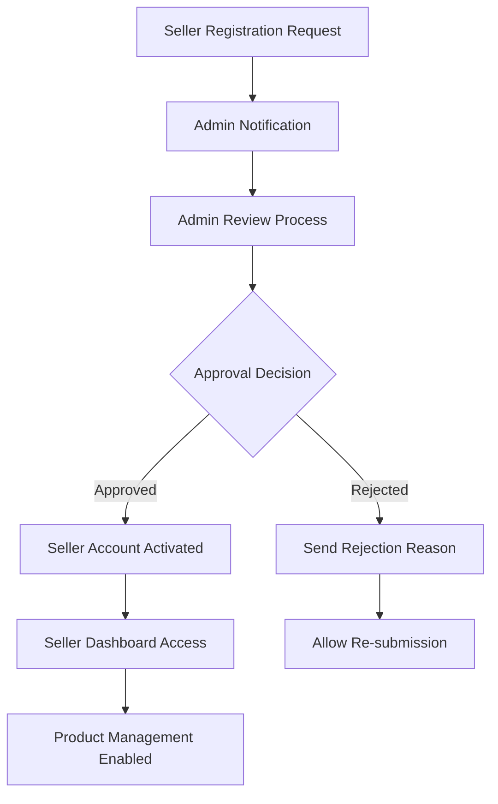

# Implementation Roadmap for E-Commerce Shopping Mall Platform

## Executive Summary

This document outlines the comprehensive phased implementation strategy for the e-commerce shopping mall platform. The roadmap is structured to deliver maximum business value while ensuring technical stability, data integrity through snapshot preservation, and scalability throughout the development process. Each phase builds upon the previous, systematically enabling platform capabilities while mitigating risks through incremental delivery.

### Business Vision Alignment
The implementation strategy supports the platform's core value proposition of providing a secure, transparent marketplace where customers shop with confidence, sellers manage businesses effectively, and administrators maintain platform integrity through comprehensive oversight capabilities.

### Platform Architecture Foundation
Based on the detailed requirement analysis, the platform architecture centers around key components:
- User authentication and role-based access control
- Product catalog with variant and inventory management
- Multi-seller order processing with shipping coordination
- Comprehensive snapshot system for data integrity
- Review and rating system with purchase verification

## Phase 1: Core Platform Foundation (Months 1-2)

### Strategic Objectives
Establish the fundamental platform infrastructure that enables basic customer registration, product discovery, and administrative management while laying the groundwork for subsequent phases.

### Key Deliverables with Success Criteria

#### User Authentication & Profile Management
**Requirements Specification:**
- WHEN a user attempts to register with email and password, THE system SHALL validate email format and password complexity requirements
- THE registration process SHALL require email verification before account activation
- WHEN a customer completes registration, THE system SHALL prompt for profile completion with display name and phone number
- THE address management system SHALL support multiple shipping addresses with default selection capability

**Implementation Validation:**
- User registration completion rate exceeding 90%
- Email verification success rate above 95%
- Profile completion rate for new users exceeding 80%
- Address management functionality working without data corruption

#### Category Management System
**Requirements Specification:**
- WHEN an administrator creates a category, THE system SHALL validate category name uniqueness within the hierarchy
- THE category system SHALL support one level of nesting with clear parent-child relationships
- WHEN a category is deleted, THE system SHALL move associated products to uncategorized status
- CUSTOMERS SHALL be able to browse complete category structure with proper navigation

**Technical Implementation:**
- Category creation and editing interfaces for administrators
- Category browsing interface for customers
- Database schema supporting hierarchical categorization
- API endpoints for category management operations

#### Basic Product Catalog Foundation
**Requirements Specification:**
- SELLERS SHALL be able to create products with required fields (name, description, category, base price)
- THE product creation interface SHALL include image upload functionality
- PRODUCTS without variants SHALL be visible but marked as "unavailable" for purchase
- CUSTOMERS SHALL be able to search products by name with basic keyword matching

**Quality Assurance Metrics:**
- Product search response time under 2 seconds for typical queries
- Image upload and display functionality working correctly
- Product creation success rate exceeding 95%
- Search functionality returning relevant results

### Phase 1 Success Criteria
- User authentication system handling 1,000+ concurrent users
- Category management supporting 200+ categories with subcategories
- Product catalog supporting 10,000+ products with efficient search
- Platform availability exceeding 99.5% uptime

## Phase 2: Seller Features & Transaction Processing (Months 3-4)

### Strategic Objectives
Enable sellers to onboard, manage products comprehensively, and process secure transactions while implementing the core snapshot system for data integrity.

### Key Deliverables with Success Criteria

#### Seller Registration & Approval Workflow
**Requirements Specification:**
- WHEN a seller registers, THE system SHALL place the account in pending approval status
- ADMINISTRATORS SHALL be able to review seller applications with approval/rejection capability
- REJECTED sellers SHALL receive specific rejection reasons and be able to submit new applications
- APPROVED sellers SHALL gain immediate access to seller dashboard and product management tools

**Workflow Implementation:**

#### Advanced Product Variant System
**Requirements Specification:**
- SELLERS SHALL be able to create multiple variants for each product with SKU codes
- EACH variant SHALL support option values, optional price overrides, and stock quantity
- WHEN a variant is created or edited, THE system SHALL create comprehensive snapshots
- THE inventory system SHALL track stock through history records rather than simple quantity fields

**Implementation Details:**
- Variant creation interface with option configuration
- Inventory tracking with positive/negative change records
- Snapshot system capturing product and variant states
- Stock validation during cart operations

#### Shopping Cart & Secure Checkout
**Requirements Specification:**
- CUSTOMERS SHALL be able to add specific variants to cart with quantity selection
- THE cart system SHALL combine quantities when the same variant is added multiple times
- WHEN proceeding to checkout, THE system SHALL validate address selection and stock availability
- THE payment integration SHALL process transactions securely with success/failure handling

**Technical Architecture:**
- Cart persistence across browser sessions
- Real-time stock validation during cart operations
- Secure payment gateway integration
- Order creation with comprehensive data preservation

### Phase 2 Success Criteria
- Seller approval process completed within 48 hours for 95% of applications
- Product variant creation success rate exceeding 95%
- Checkout completion rate above 85% for initiated transactions
- Payment processing success rate above 98%
- Snapshot system capturing 100% of product modifications

## Phase 3: Order Management & Customer Engagement (Months 4-5)

### Strategic Objectives
Implement comprehensive order lifecycle management, shipping coordination, and customer engagement features that build platform credibility and user trust.

### Key Deliverables with Success Criteria

#### Comprehensive Order Status Management
**Requirements Specification:**
- EACH order item SHALL have individual status tracking (paid, shipped, delivered, cancelled, refunded)
- THE overall order status SHALL derive from individual item statuses with clear business logic
- CUSTOMERS SHALL be able to view detailed order history with real-time status updates
- STATUS changes SHALL trigger appropriate notifications to relevant parties

**Status Derivation Logic:**
- WHEN all items are paid, THE order status SHALL be "paid"
- WHEN any item is shipped (none delivered), THE order status SHALL be "shipped"
- WHEN all items are delivered, THE order status SHALL be "delivered"
- WHEN all items are cancelled, THE order status SHALL be "cancelled"
- WHEN mixed statuses exist, THE order status SHALL be "partially completed"

#### Shipping & Multi-Seller Coordination
**Requirements Specification:**
- SELLERS SHALL be able to create shipments by selecting multiple order items
- EACH shipment SHALL include carrier information and tracking number
- WHEN a shipment is created, ALL included items SHALL change status to "shipped"
- CUSTOMERS SHALL be able to track shipments and confirm delivery per shipment

**Implementation Workflow:**

#### Cancellation & Refund Workflow Implementation
**Requirements Specification:**
- CUSTOMERS SHALL be able to request cancellation for items with "paid" status
- CANCELLATION requests SHALL require reason specification and seller approval
- REFUND requests SHALL be allowed within 7 days of item delivery
- SELLERS SHALL respond to cancellation/refund requests within 24 hours

**Business Rule Enforcement:**
- Stock restoration upon cancellation/refund approval
- Snapshot preservation of request and response states
- Time-bound constraints for refund eligibility
- Clear communication of approval/rejection reasons

#### Verified Review System
**Requirements Specification:**
- CUSTOMERS SHALL be able to write reviews only for delivered products
- EACH review SHALL include 1-5 star rating and optional text content
- THE system SHALL enforce one review per product per order
- REVIEW edits SHALL create snapshots preserving previous versions

**Review Quality Controls:**
- Purchase verification for review eligibility
- Rating calculation from non-deleted reviews only
- Review moderation tools for administrators
- Anti-spam measures and duplicate prevention

### Phase 3 Success Criteria
- Order status accuracy exceeding 99% across all transactions
- Shipping information accuracy above 98% for created shipments
- Cancellation request response time under 24 hours for 90% of requests
- Review submission rate exceeding 30% of delivered orders
- Delivery confirmation automation working reliably

## Phase 4: Optimization & Advanced Features (Months 5-6)

### Strategic Objectives
Enhance platform performance, implement advanced discovery features, and provide comprehensive analytics for sustainable platform growth.

### Key Deliverables with Success Criteria

#### Advanced Search & Product Discovery
**Requirements Specification:**
- THE search system SHALL support filtering by category, price range, and stock status
- SEARCH results SHALL include sorting by relevance, price, and recency
- PRODUCT listings SHALL display comprehensive information including ratings and seller details
- THE search interface SHALL provide intuitive filtering controls with real-time results

**Search Performance Targets:**
- Search response time under 2 seconds for complex queries
- Filter application without significant performance degradation
- Pagination handling for result sets exceeding 10,000 items
- Relevance algorithm providing accurate product matching

#### Customer Engagement Features
**Requirements Specification:**
- CUSTOMERS SHALL be able to create and manage personal wishlists
- THE wishlist system SHALL automatically remove deleted products
- WISHLIST items SHALL show current pricing and availability status
- CUSTOMERS SHALL be able to move items from wishlist to cart easily

**Implementation Architecture:**
- Wishlist persistence across sessions and devices
- Real-time synchronization with product availability
- Efficient storage and retrieval for large wishlist collections
- Integration with product notification systems

#### Seller Analytics & Performance Dashboard
**Requirements Specification:**
- SELLERS SHALL have access to comprehensive performance metrics
- THE dashboard SHALL display sales trends, inventory insights, and customer feedback
- ANALYTICS data SHALL cover customizable time periods with comparison capabilities
- PERFORMANCE alerts SHALL notify sellers of significant changes or opportunities

**Analytics Coverage:**
- Sales volume and revenue trends
- Product performance and inventory turnover
- Customer satisfaction metrics and review analysis
- Cancellation and refund rate monitoring
- Competitive positioning within platform

#### Administrator Oversight Enhancement
**Requirements Specification:**
- ADMINISTRATORS SHALL have comprehensive user management capabilities
- THE system SHALL support user suspension and account restoration
- ADMINISTRATOR promotion/demotion workflows SHALL maintain system security
- PLATFORM health monitoring SHALL provide real-time performance insights

**Administrative Security:**
- Role-based access control with permission granularity
- Audit logging for all administrative actions
- Emergency access procedures for critical situations
- Regular security review and compliance verification

### Phase 4 Success Criteria
- Advanced search utilization rate exceeding 60% of customer searches
- Wishlist adoption rate above 40% of registered customers
- Seller dashboard usage exceeding 80% of active sellers
- Platform performance maintaining sub-2-second response times
- Administrative efficiency supporting platform scale

## Critical Implementation Dependencies

### Technical Infrastructure Dependencies
- **Payment Gateway Integration**: Secure transaction processing must be validated before Phase 2 completion
- **Email Service Provider**: Reliable email delivery required for user verification and notifications
- **Image Storage Solution**: Scalable image management needed for product catalogs and seller logos
- **Database Optimization**: Performance tuning required for snapshot system and inventory tracking

### Business Process Dependencies
- **Seller Onboarding Documentation**: Comprehensive guides needed before Phase 2 seller enablement
- **Customer Support Framework**: Escalation procedures required for transaction dispute resolution
- **Legal Compliance Verification**: Data protection and financial regulations must be addressed
- **Marketing Strategy Alignment**: User acquisition plans synchronized with feature availability

## Risk Mitigation Framework

### Technical Risk Mitigation

**Snapshot System Complexity:**
- Implementation approach: Incremental testing with mock transaction data
- Validation strategy: Comprehensive audit trails verifying data integrity
- Fallback mechanism: Manual recovery procedures for snapshot corruption

**Payment Integration Reliability:**
- Testing methodology: Extensive sandbox environment testing
- Contingency planning: Multiple payment gateway fallback options
- Monitoring: Real-time transaction failure alerts and automatic retry mechanisms

**Inventory Race Conditions:**
- Technical solution: Database-level locking for stock updates
- Validation: Concurrent transaction testing with load simulation
- Recovery: Automated inventory reconciliation procedures

### Business Risk Mitigation

**Seller Adoption Challenges:**
- Onboarding support: Comprehensive seller education materials
- Incentive programs: Early adopter benefits and support prioritization
- Feedback incorporation: Rapid iteration based on seller input

**Customer Trust Building:**
- Transparency: Clear communication of data protection measures
- Support accessibility: Multiple channels for issue resolution
- Quality assurance: Rigorous testing of critical customer pathways

## Performance & Scalability Metrics

### Phase 1 Performance Targets
- User authentication: Support 1,000+ concurrent users
- Product search: Sub-2-second response for 10,000+ products
- Category management: Efficient handling of 200+ categories
- Database performance: Optimal query execution under normal load

### Phase 2 Scalability Requirements
- Transaction processing: 100+ concurrent checkout sessions
- Seller operations: Support for 500+ active sellers
- Inventory management: Real-time stock validation for high-volume products
- Payment processing: 99.9% uptime during peak shopping periods

### Phase 3 System Resilience
- Order management: Handle 10,000+ daily transactions
- Shipping coordination: Support multiple carriers and tracking systems
- Notification system: Reliable delivery of status updates and alerts
- Data integrity: 100% snapshot capture rate for all modifications

### Phase 4 Optimization Goals
- Search performance: Sub-1-second response for complex queries
- Wishlist management: Efficient handling of 50,000+ wishlist items
- Analytics processing: Near real-time reporting for seller dashboards
- Platform availability: 99.9% uptime with automated failover

## Implementation Team Structure

### Core Development Team Composition
- **Backend Developers (4-6)**: API development, database design, business logic implementation
- **Frontend Developers (2-3)**: Customer interface, seller dashboard, administrative tools
- **DevOps Engineer (1-2)**: Infrastructure management, deployment automation, monitoring
- **QA Engineers (2)**: Testing strategy, quality assurance, user acceptance validation

### Supporting Role Requirements
- **Product Manager**: Requirement prioritization, stakeholder communication, timeline management
- **UX/UI Designer**: User experience optimization, interface consistency, accessibility compliance
- **Security Specialist**: Security audits, compliance verification, vulnerability assessment
- **Database Administrator**: Performance optimization, backup strategies, capacity planning

## Success Measurement Framework

### Quantitative Success Metrics

**User Engagement Metrics:**
- Monthly Active Users (MAU) growth rate trajectory
- Customer retention rates by cohort analysis
- Seller activation and productivity measurements
- Feature adoption rates across user segments

**Transaction Quality Metrics:**
- Gross Merchandise Volume (GMV) growth and composition
- Order completion rates by payment method and user type
- Cancellation and refund rates with root cause analysis
- Customer satisfaction scores from post-purchase surveys

**Platform Performance Metrics:**
- System uptime and availability percentages
- Response time percentiles across critical user journeys
- Error rates and resolution timeframes
- Scalability thresholds and capacity utilization

### Qualitative Success Indicators

**User Experience Feedback:**
- Customer testimonials and satisfaction surveys
- Seller feedback on platform usability and effectiveness
- Administrator efficiency improvements and pain point resolution
- Support ticket analysis for common user challenges

**Market Position Assessment:**
- Competitive feature comparison and differentiation
- Industry analyst reviews and platform evaluations
- Partner integration feedback and ecosystem growth
- Media coverage and public perception analysis

## Future Enhancement Roadmap

### Post-Launch Feature Pipeline

**Quarter 1 Post-Launch (Months 7-9):**
- Mobile application development for iOS and Android
- Advanced analytics with predictive insights
- Enhanced seller tools for inventory optimization
- Customer loyalty program implementation

**Quarter 2 Post-Launch (Months 10-12):**
- International shipping and multi-currency support
- Advanced recommendation engine implementation
- Social commerce integration capabilities
- API ecosystem for third-party integrations

**Year 2 Strategic Initiatives:**
- Artificial intelligence for customer service automation
- Advanced fraud detection and prevention systems
- Marketplace expansion to new product categories
- Strategic partnerships with logistics providers

### Long-term Platform Vision

**Technical Architecture Evolution:**
- Microservices migration for improved scalability
- Advanced caching strategies using CDN integration
- Database sharding for transaction volume growth
- Real-time analytics infrastructure for instant insights

**Business Model Expansion:**
- Subscription tiers for premium seller features
- Advertising platform for promoted product placement
- White-label solutions for enterprise customers
- International market expansion strategy

## Conclusion

This implementation roadmap provides a comprehensive, phased approach to building a robust e-commerce platform that balances technical excellence with business value delivery. The systematic progression from core infrastructure to advanced features ensures that each phase delivers tangible benefits while maintaining platform stability.

The emphasis on data integrity through the snapshot system, combined with comprehensive order management and seller tools, creates a foundation for sustainable platform growth. By following this roadmap, the development team can deliver a market-ready e-commerce solution within the 6-month timeline while establishing a clear path for future enhancements and scalability.

Each phase includes specific success criteria and risk mitigation strategies, ensuring that progress can be measured objectively and challenges can be addressed proactively. The roadmap aligns technical implementation with business objectives, creating a cohesive strategy for platform success in the competitive e-commerce landscape.

> *Developer Note: This document defines **business requirements only**. All technical implementations (architecture, APIs, database design, etc.) are at the discretion of the development team.*