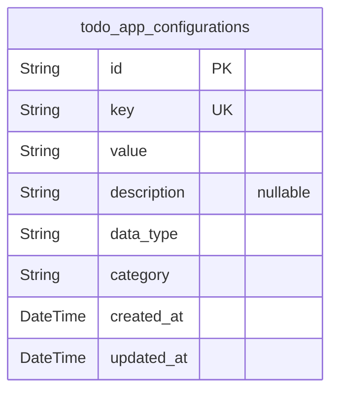
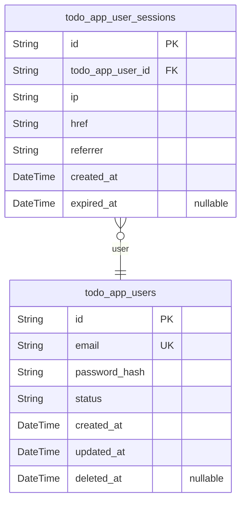
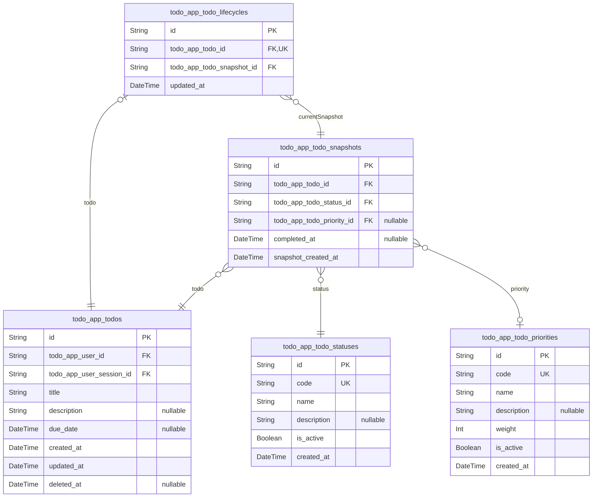

# Prisma Markdown

> Generated by [`prisma-markdown`](https://github.com/samchon/prisma-markdown)

- [Systematic](#systematic)
- [Actors](#actors)
- [Todos](#todos)

## Systematic

### `todo_app_configurations`

System-wide configuration settings for the Todo application.

Stores key-value pairs that control application behavior, feature flags,
and system parameters. These settings are managed by administrators and
affect the entire application instance.

Configuration values can include feature toggles, default settings,
performance parameters, and business rules. Each configuration item has a
unique key and can store various data types as string values that are
parsed by the application.

The table supports documentation of each configuration item through the
description field, helping administrators understand the purpose and
impact of each setting. Changes to configuration values are tracked
through temporal fields for audit purposes.

Configuration settings are loaded at application startup and cached for
performance. Changes may require application restart or specific refresh
mechanisms to take effect.

Properties as follows:

- `id`: Primary Key.
- `key`
  > Unique configuration key identifier. Used to reference the configuration
  > setting in application code. Must follow naming conventions and be unique
  > across all configuration items.
- `value`
  > Configuration value stored as string. The application parses this value
  > according to the expected data type (boolean, number, string, JSON,
  > etc.).
- `description`
  > Human-readable description explaining the purpose, usage, and impact of
  > this configuration setting. Helps administrators understand what the
  > setting controls.
- `data_type`
  > Expected data type for the value field. Valid values: 'boolean',
  > 'number', 'string', 'json', 'array'. Helps with validation and proper
  > parsing.
- `category`
  > Configuration category for organizational purposes. Examples:
  > 'feature-flags', 'performance', 'security', 'ui', 'business-rules'.
- `created_at`: Timestamp when the configuration item was first created.
- `updated_at`: Timestamp when the configuration item was last modified.

## Actors

### `todo_app_users`

User accounts for the Todo application with authentication credentials.

Stores user registration information including email, password hash, and
account status. Each user has their own private todo list and can manage
their personal tasks independently.

Users are authenticated through email/password combination and can have
multiple active sessions across different devices. Account status tracks
whether the user is active, pending verification, or suspended.

User data is isolated from other users' data, maintaining strict privacy
and security boundaries.

Properties as follows:

- `id`: Primary Key.
- `email`
  > User's email address used for authentication and communication. Must be
  > unique across all users.
- `password_hash`
  > Securely hashed password for user authentication. Never stored in plain
  > text.
- `status`: Current account status. Valid values: pending, active, suspended.
- `created_at`: Timestamp when the user account was created.
- `updated_at`: Timestamp when the user account was last updated.
- `deleted_at`: Timestamp when the user account was soft deleted. Null if active.

### `todo_app_user_sessions`

User authentication sessions for tracking login activity.

Stores session information for authenticated users including connection
context and timestamps. Each session represents a single login instance
and is used for audit tracing of user actions.

Sessions are managed through identity flows and are automatically expired
after a period of inactivity. Multiple concurrent sessions are supported
per user across different devices.

Connection context includes IP address, URL, and referrer information for
security monitoring and audit purposes.

Properties as follows:

- `id`: Primary Key.
- `todo_app_user_id`: Belonged user's [todo_app_users.id](#todo_app_users).
- `ip`: IP address of the connection that created this session.
- `href`: Connection URL where the session was created.
- `referrer`: Referrer URL that directed to the session creation.
- `created_at`: Timestamp when the session was created.
- `expired_at`: Timestamp when the session expired. Null if still active.

## Todos

### `todo_app_todos`

Core todo items with immutable attributes and ownership information.

Stores the fundamental, immutable attributes of todo items that remain
constant throughout their lifecycle. This table contains the core
business data that defines what the todo is, while mutable state
information is handled through separate lifecycle and snapshot tables.

Each todo is owned by a specific user and created through an
authenticated session for audit tracing. The immutable attributes include
the todo's title, description, and creation context, while status,
priority, and completion tracking are managed through normalized
reference tables.

This separation ensures proper normalization and enables comprehensive
audit trails through the snapshot pattern. Soft deletion is supported
while maintaining data integrity and recovery capability.

The table serves as the anchor point for todo management, with all
mutable state tracked through related entities to support robust
lifecycle management and compliance requirements.

Properties as follows:

- `id`: Primary Key.
- `todo_app_user_id`: Owner user who created this todo. [todo_app_users.id](#todo_app_users)
- `todo_app_user_session_id`
  > User session that created this todo for audit tracing. {@link
  > todo_app_user_sessions.id}
- `title`
  > Todo title that briefly describes the task. Required field with maximum
  > length of 255 characters.
- `description`
  > Detailed description of the todo task. Optional field with maximum length
  > of 1000 characters.
- `due_date`: Optional due date for the todo item. Must be in the future if provided.
- `created_at`: Timestamp when the todo was created.
- `updated_at`: Timestamp when the todo was last updated.
- `deleted_at`: Timestamp when the todo was soft deleted. Null for active todos.

### `todo_app_todo_snapshots`

Historical snapshots of todo items for audit trails and version control.

Captures point-in-time states of todo items whenever significant changes
occur, such as status updates, priority changes, or completion. This
append-only table provides comprehensive audit trails for compliance,
debugging, and historical analysis.

Each snapshot references the original todo and includes all mutable state
information at the time of capture. The system creates new snapshots for
important state transitions, ensuring complete visibility into the todo's
lifecycle.

Snapshots are automatically generated by the application when todos are
modified, providing immutable records of changes. This pattern enables
features like undo operations, change history viewing, and compliance
reporting.

The snapshot architecture separates mutable state from immutable todo
attributes, ensuring proper normalization while maintaining full audit
capability for business requirements.

Properties as follows:

- `id`: Primary Key.
- `todo_app_todo_id`: Reference to the original todo item. [todo_app_todos.id](#todo_app_todos)
- `todo_app_todo_status_id`: Status at the time of snapshot creation. [todo_app_todo_statuses.id](#todo_app_todo_statuses)
- `todo_app_todo_priority_id`
  > Priority at the time of snapshot creation. {@link
  > todo_app_todo_priorities.id}
- `completed_at`
  > Timestamp when the todo was marked as completed in this snapshot. Null if
  > not completed.
- `snapshot_created_at`: Timestamp when this snapshot was created.

### `todo_app_todo_statuses`

Reference table for valid todo status values.

Defines the possible states a todo item can be in throughout its
lifecycle. This normalized approach ensures consistent status values
across the application and enables easy extension of status options
without schema changes.

Standard status values include: pending (default state), in-progress
(actively being worked on), and completed (finished). Each status has a
unique code and descriptive name for user interface display.

Using a reference table instead of hardcoded enum values provides
flexibility for future status additions and maintains data integrity
through foreign key constraints. The table supports internationalization
and custom status workflows.

This normalization separates business logic from database schema, making
the system more maintainable and extensible while ensuring consistent
status handling across all todo operations.

Properties as follows:

- `id`: Primary Key.
- `code`
  > Unique status code used for system identification. Examples: pending,
  > in-progress, completed.
- `name`
  > Descriptive status name for user interface display. Examples: Pending, In
  > Progress, Completed.
- `description`: Detailed explanation of what this status represents.
- `is_active`: Whether this status is currently available for use.
- `created_at`: Timestamp when this status was created.

### `todo_app_todo_priorities`

Reference table for valid todo priority levels.

Defines the priority classification system for todo items, enabling
consistent prioritization across the application. This normalized
approach separates business logic from database schema and supports
flexible priority management.

Standard priority levels include: low (non-urgent tasks), medium (normal
priority), and high (urgent tasks). Each priority has a unique code,
display name, and optional weighting for sorting.

The reference table pattern allows for easy extension of priority options
and maintains data integrity through foreign key constraints. It supports
customization of priority systems for different user preferences or
organizational needs.

By normalizing priorities, the system achieves better data consistency
and enables features like priority-based filtering, sorting, and
notification systems without hardcoded business logic in the schema.

Properties as follows:

- `id`: Primary Key.
- `code`
  > Unique priority code used for system identification. Examples: low,
  > medium, high.
- `name`
  > Descriptive priority name for user interface display. Examples: Low,
  > Medium, High.
- `description`: Detailed explanation of what this priority level represents.
- `weight`: Numerical weight for sorting purposes (lower numbers = higher priority).
- `is_active`: Whether this priority is currently available for use.
- `created_at`: Timestamp when this priority was created.

### `todo_app_todo_lifecycles`

Current lifecycle state of todo items for real-time status tracking.

Maintains the present state of each todo item, including current status,
priority, and completion information. This table represents the mutable
aspects of todo management while the main todo table contains immutable
attributes.

Each lifecycle record points to the current snapshot, ensuring data
consistency between real-time state and historical tracking. The system
updates this table whenever todo state changes, providing efficient
access to current todo information without querying historical snapshots.

This separation enables efficient querying for current todo states while
maintaining comprehensive audit trails through the snapshot pattern. It
also supports concurrent todo modifications by isolating mutable state
from immutable attributes.

The lifecycle table serves as the performance-optimized access point for
most todo operations, with snapshots providing the historical record for
compliance and analysis purposes.

Properties as follows:

- `id`: Primary Key.
- `todo_app_todo_id`: Reference to the todo item. [todo_app_todos.id](#todo_app_todos)
- `todo_app_todo_snapshot_id`
  > Reference to the current snapshot representing this state. {@link
  > todo_app_todo_snapshots.id}
- `updated_at`: Timestamp when this lifecycle state was last updated.
