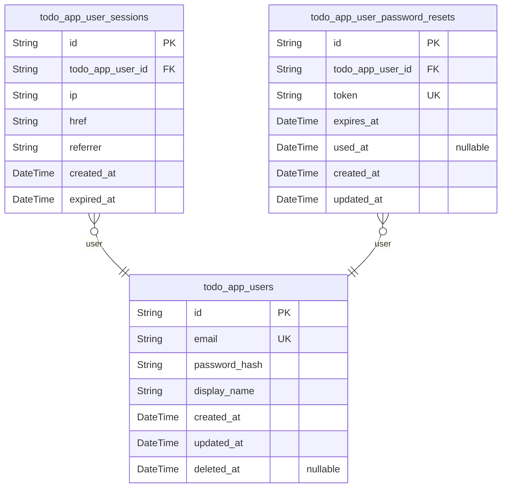
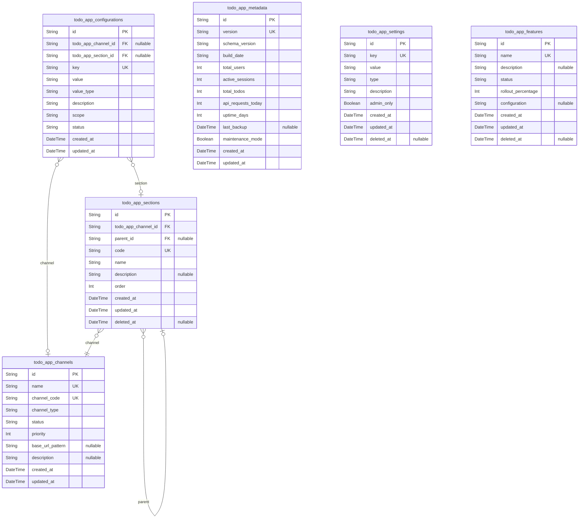
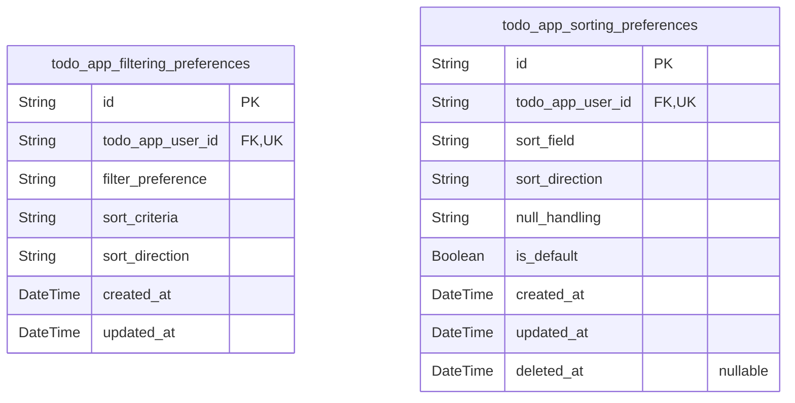
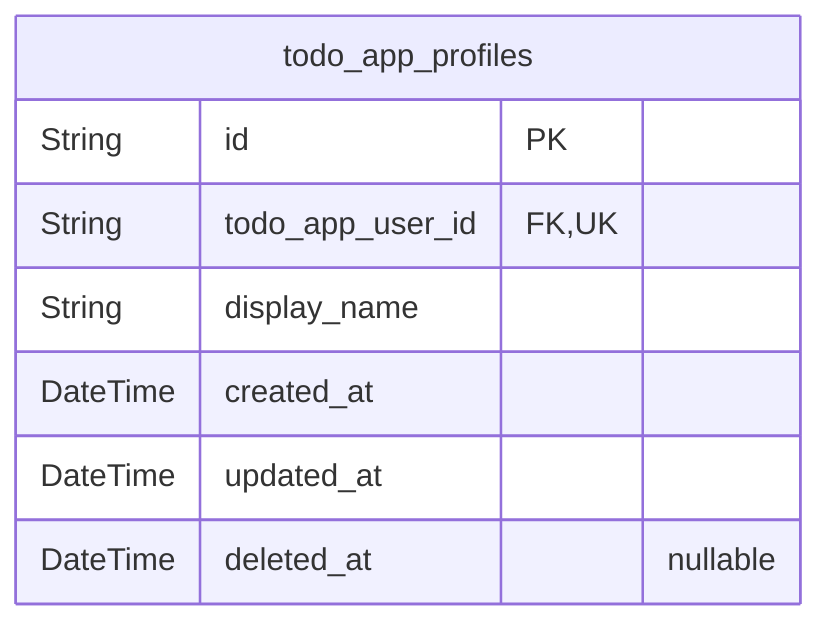

# Prisma Markdown

> Generated by [`prisma-markdown`](https://github.com/samchon/prisma-markdown)

- [Actors](#actors)
- [Systematic](#systematic)
- [Todo](#todo)
- [Filtering](#filtering)
- [Profile](#profile)

## Actors

### `todo_app_users`

Registered user accounts with email/password authentication credentials
and profile information for todo management.

Stores the core identity information for authenticated users including
email addresses used for login, securely hashed passwords, and display
names for user identification. Each user account serves as the root
entity for all user-specific data including todos, sessions, and profile
information.

The table enforces email uniqueness across the entire application to
prevent duplicate accounts and supports comprehensive authentication
workflows including registration, login, password changes, and account
deletion. Soft deletion is implemented to support reversible account
operations while maintaining data integrity.

User accounts are completely isolated from each other with strict privacy
enforcement ensuring users can only access their own data. The table
forms the foundation for all user-centric functionality in the todo
application.

Properties as follows:

- `id`: Primary Key.
- `email`
  > User's unique email address used for authentication and account
  > identification. Must be unique across all users in the system.
- `password_hash`
  > Securely hashed password for user authentication. Stored using
  > industry-standard bcrypt hashing algorithm.
- `display_name`
  > User-chosen display name for identification purposes. Displayed
  > throughout the application interface.
- `created_at`: Timestamp when the user account was originally created.
- `updated_at`: Timestamp of the most recent update to the user account information.
- `deleted_at`
  > Timestamp when the user account was soft-deleted. Null indicates active
  > account.

### `todo_app_user_sessions`

JWT session tokens for user authentication with access and refresh token
support for secure session management.

Tracks user login sessions with connection metadata including IP address,
connection URL, and referrer information. Each session belongs to exactly
one user and includes creation timestamp and mandatory expiration time
for security.

Sessions are managed through authentication workflows and provide
append-only audit trail of user login events. The expired_at field
ensures sessions have finite lifetimes for security compliance.

Properties as follows:

- `id`: Primary Key.
- `todo_app_user_id`: Belonged user's [todo_app_users.id](#todo_app_users).
- `ip`: IP address of the connection where the session was created.
- `href`: Connection URL where the session was established.
- `referrer`: Referrer URL that directed the user to the session creation page.
- `created_at`: Timestamp when the session was created.
- `expired_at`
  > Timestamp when the session expires. Sessions must have finite lifetimes
  > for security.

### `todo_app_user_password_resets`

Password reset tokens with expiration for secure user password recovery
workflow.

Stores temporary tokens generated for password reset requests, allowing
users to securely reset their passwords through email verification. Each
token has a limited validity period and can only be used once to prevent
unauthorized access.

The token system provides a secure mechanism for password recovery while
maintaining account security through expiration and single-use
constraints. Tokens are automatically invalidated after use or expiration
to prevent replay attacks.

This table supports the authentication requirements for password reset
functionality, ensuring users can recover access to their accounts while
maintaining security best practices.

Properties as follows:

- `id`: Primary Key.
- `todo_app_user_id`: Target user's [todo_app_users.id](#todo_app_users).
- `token`: Unique password reset token generated for secure password recovery.
- `expires_at`: Expiration timestamp when the reset token becomes invalid.
- `used_at`: Timestamp when the reset token was successfully used.
- `created_at`: Timestamp when the reset token was created.
- `updated_at`: Timestamp when the reset token was last updated.

## Systematic

### `todo_app_configurations`

System-wide configuration settings and feature flags that control
application behavior.

Stores global application settings, feature flags, and configuration
parameters that affect the entire system. Each configuration entry
represents a specific setting that can be toggled, configured, or
enabled/disabled to control application behavior across different
environments.

Configurations support various scopes including global, channel-specific,
and section-specific settings. The system maintains audit trails for
configuration changes and supports versioning through snapshot patterns.

Configuration values can include boolean flags, numeric values, string
parameters, and JSON objects for complex settings. Each configuration is
validated against its defined type constraints and business rules.

Properties as follows:

- `id`: Primary Key.
- `todo_app_channel_id`
  > Target channel for channel-specific configurations. {@link
  > todo_app_channels.id}.
- `todo_app_section_id`
  > Target section for section-specific configurations. {@link
  > todo_app_sections.id}.
- `key`: Unique configuration key identifier used to reference the setting in code.
- `value`: Configuration value stored as string with type validation applied.
- `value_type`: Data type of the configuration value (boolean, number, string, json).
- `description`
  > Human-readable description explaining the configuration's purpose and
  > usage.
- `scope`
  > Configuration scope (global, channel, section) determining visibility and
  > access.
- `status`
  > Configuration status (active, inactive, deprecated) controlling
  > availability.
- `created_at`: Timestamp when the configuration was initially created.
- `updated_at`: Timestamp when the configuration was last modified.

### `todo_app_channels`

Application channels representing different access points or deployment
environments for the todo application.

Channels define different entry points and deployment contexts for the
application, such as web interfaces, mobile apps, API endpoints, or
different deployment environments (production, staging, development).
Each channel has specific configuration that determines how the
application behaves within that context.

Channel metadata includes identification fields, status tracking
indicating whether the channel is active or inactive, priority levels for
channel routing decisions, and URL patterns or access specifications. The
system uses channel information to apply environment-specific
configuration and access control policies.

Channels are managed as infrastructure components rather than user-facing
entities, with changes typically made during deployment or configuration
updates rather than through user-driven CRUD operations. Relationships
with other systematic components ensure consistent configuration across
the application ecosystem.

Properties as follows:

- `id`: Primary Key.
- `name`
  > Human-readable name for the channel, such as "Web Interface", "Mobile
  > App", "API Gateway", etc. Used for display and identification purposes.
- `channel_code`
  > Unique machine-readable code identifier for the channel. Used for
  > programmatic channel selection and routing decisions. Examples: "web",
  > "mobile", "api", "admin".
- `channel_type`
  > Type classification of the channel indicating its purpose and access
  > pattern. Valid types: "web", "mobile", "api", "internal", "integration".
- `status`
  > Current operational status of the channel. Valid values: "active",
  > "inactive", "maintenance". Controls whether the channel is accessible.
- `priority`
  > Priority level for channel selection and routing decisions. Lower numbers
  > indicate higher priority. Used when multiple channels are available for
  > the same functionality.
- `base_url_pattern`
  > URL pattern or base path that identifies requests originating from this
  > channel. Used for request routing and channel-specific configuration
  > application.
- `description`
  > Detailed description of the channel's purpose, capabilities, and intended
  > usage context. Provides context for system administrators managing
  > deployment environments.
- `created_at`
  > Timestamp when the channel configuration was initially created in the
  > system.
- `updated_at`
  > Timestamp when the channel configuration was last modified. Tracked for
  > configuration change auditing.

### `todo_app_sections`

Hierarchical sections within channels for organizing application
components and system structure.

Sections provide organizational hierarchy within application channels,
enabling structured content organization and navigation. Each section can
have parent-child relationships to create nested organizational
structures that support complex application layouts.

Sections are referenced by other system components for organizational
context and are managed as independent infrastructure entities. The
hierarchical structure allows for flexible organization patterns while
maintaining referential integrity through parent-child relationships.

Channel association ensures sections are properly scoped within specific
application deployment environments or access points.

Properties as follows:

- `id`: Primary Key.
- `todo_app_channel_id`: Associated channel's [todo_app_channels.id](#todo_app_channels).
- `parent_id`
  > Parent section's [todo_app_sections.id](#todo_app_sections) for hierarchical
  > organization.
- `code`: Unique section code identifier for system reference and navigation.
- `name`: Display name of the section for organizational purposes.
- `description`: Detailed description explaining the section's purpose and usage context.
- `order`: Sort order for section display within parent context.
- `created_at`: Timestamp when the section was created.
- `updated_at`: Timestamp when the section was last updated.
- `deleted_at`: Timestamp when the section was soft deleted.

### `todo_app_metadata`

Core application metadata including version information and system
statistics.

Contains infrastructure-level data that supports the entire application
system, such as version tracking, operational statistics, and system
configuration metadata. This table provides centralized metadata
management for application monitoring, version control, and system health
tracking.

Stores version information including current application version,
database schema version, and compatibility information. Also maintains
system statistics such as user count, active session count, and
performance metrics for monitoring purposes.

This metadata is managed through system operations and background
processes rather than direct user interaction. It serves as a
foundational component for system administration, monitoring, and
operational visibility across the entire application infrastructure.

Relationships with other systematic infrastructure tables provide
comprehensive system management capabilities while maintaining clear
separation from user-facing business logic domains.

Properties as follows:

- `id`: Primary Key.
- `version`
  > Current application version number in semantic versioning format (e.g.,
  > 1.0.0). Used for version tracking and compatibility verification.
- `schema_version`
  > Database schema version number that corresponds to this application
  > version. Used for schema migration tracking and compatibility checking.
- `build_date`
  > Build timestamp or date when this application version was deployed. Helps
  > tracking deployment history and system updates.
- `total_users`
  > Total number of registered users in the system. Used for system growth
  > monitoring and capacity planning.
- `active_sessions`
  > Current number of active user sessions. Provides real-time visibility
  > into system usage and load.
- `total_todos`
  > Total number of todos created in the system. Statistical metric for
  > monitoring application usage patterns.
- `api_requests_today`
  > Number of API requests processed today. Operational metric for monitoring
  > system load and performance.
- `uptime_days`
  > Number of consecutive days the system has been operational. Measures
  > system reliability and stability.
- `last_backup`
  > Timestamp of the last successful system backup. Critical for disaster
  > recovery monitoring and data safety assurance.
- `maintenance_mode`
  > Indicates whether the system is currently in maintenance mode. Used for
  > system administration and operational control.
- `created_at`
  > Timestamp when this metadata record was created. Typically corresponds to
  > initial system setup or version deployment.
- `updated_at`
  > Timestamp when this metadata record was last updated. Tracks changes to
  > system metadata and statistics.

### `todo_app_settings`

Global application settings and preferences that affect all users across
the entire system.

Stores configuration parameters that control application behavior,
feature toggles, system defaults, and user experience preferences.
Settings are maintained as key-value pairs with type validation to ensure
data integrity.

Managed by system administrators through dedicated settings management
interfaces. Changes to these settings can impact all users and should be
carefully controlled and monitored through proper audit trails.

This table provides centralized configuration management for application
customization, A/B testing, feature rollouts, and system behavior tuning
without requiring code deployments.

Properties as follows:

- `id`: Primary Key.
- `key`
  > Unique identifier for the setting, following reverse domain notation
  > (e.g., 'app.features.advanced_editing'). Used to retrieve and reference
  > specific settings programmatically.
- `value`
  > Setting value stored as string with type validation determined by the
  > type field. Contains the actual configuration data that controls
  > application behavior.
- `type`
  > Data type of the setting value to enforce validation. Valid values:
  > 'string', 'boolean', 'number', 'json'. Determines how the value field
  > should be parsed and validated.
- `description`
  > Human-readable description explaining the setting's purpose, usage, and
  > impact. Provides context for administrators managing application
  > configuration.
- `admin_only`
  > Restricts access to sensitive settings that should only be modified by
  > system administrators. True: admin-level access required; False: broader
  > administrative access allowed.
- `created_at`
  > Timestamp when the setting was first created and added to the system
  > configuration.
- `updated_at`
  > Timestamp when the setting was last modified, providing audit trail for
  > configuration changes.
- `deleted_at`
  > Timestamp when the setting was soft-deleted, allowing for reversible
  > configuration removal without permanent data loss.

### `todo_app_features`

Feature flag management and rollout configurations for controlled feature
releases.

Stores feature toggle settings that control functionality availability
across the application. Each feature can be completely disabled, enabled
for all users, or gradually rolled out to a percentage of users for A/B
testing.

Features support percentage-based rollouts where access is granted to a
specified percentage of users, allowing controlled feature releases and
gradual deployment strategies. Feature status can be tracked
(development, testing, production) with specific rollout percentages for
each environment.

The configuration field stores JSON settings for advanced feature
behaviors, A/B testing parameters, and environment-specific
configurations. Features are managed independently with audit trails for
changes to rollout settings and configurations.

Feature flags enable decoupling deployment from feature releases,
supporting safe deployments and gradual rollouts with minimal risk.

Properties as follows:

- `id`: Primary Key.
- `name`
  > Unique name identifier for the feature. Used as the feature key in
  > application code to check feature availability.
- `description`
  > Detailed description explaining the feature's purpose and functionality.
  > Used for documentation and administrative interfaces.
- `status`
  > Current feature status. Valid values: 'development', 'testing',
  > 'production', 'disabled'. Controls feature rollout stage and access
  > policies.
- `rollout_percentage`
  > Percentage of users who can access this feature (0-100). Used for gradual
  > feature rollouts and A/B testing.
- `configuration`
  > JSON configuration data for feature-specific settings, A/B testing
  > parameters, and environment-specific behaviors.
- `created_at`: Timestamp when the feature flag was first created.
- `updated_at`: Timestamp when the feature flag configuration was last modified.
- `deleted_at`
  > Timestamp when the feature flag was soft-deleted. Null indicates the
  > feature is active.

## Todo

```mermaid
erDiagram
"todo_app_todos" {
  String id PK
  String todo_app_user_id FK
  String title
  String description "nullable"
  DateTime start_date "nullable"
  DateTime due_date "nullable"
  Boolean completed
  DateTime created_at
  DateTime updated_at
  DateTime deleted_at "nullable"
}
"todo_app_todo_snapshots" {
  String id PK
  String todo_app_todo_id FK
  String title
  String description "nullable"
  Boolean completion_status
  DateTime start_date "nullable"
  DateTime due_date "nullable"
  DateTime created_at
}
"todo_app_todo_edit_histories" {
  String id PK
  String todo_app_todo_id FK
  String todo_app_user_session_id FK
  DateTime created_at
  String previous_title "nullable"
  String new_title "nullable"
  String previous_description "nullable"
  String new_description "nullable"
  DateTime previous_start_date "nullable"
  DateTime new_start_date "nullable"
  DateTime previous_due_date "nullable"
  DateTime new_due_date "nullable"
}
"todo_app_todo_completion_histories" {
  String id PK
  String todo_app_todo_id FK
  String todo_app_user_id FK
  Boolean old_completed
  Boolean new_completed
  DateTime completed_at
  DateTime created_at
  DateTime updated_at
  DateTime deleted_at "nullable"
}
"todo_app_todo_tags" {
  String id PK
  String todo_app_todo_id FK
  String todo_app_user_id FK
  DateTime created_at
  DateTime updated_at
}
"todo_app_todo_attachments" {
  String id PK
  String todo_app_todo_id FK
  String todo_app_user_id FK
  String filename
  String file_type
  Int file_size
  String storage_path
  DateTime created_at
  DateTime updated_at
}
"todo_app_todo_comments" {
  String id PK
  String todo_app_todo_id FK
  String todo_app_user_id FK
  String content
  DateTime created_at
  DateTime updated_at
  DateTime deleted_at "nullable"
}
"todo_app_todo_reminders" {
  String id PK
  String todo_app_todo_id FK
  String reminder_type
  Int trigger_offset
  String recurrence_pattern "nullable"
  String status
  DateTime scheduled_at
  DateTime triggered_at "nullable"
  String notification_method
  DateTime created_at
  DateTime updated_at
  DateTime deleted_at "nullable"
}
"todo_app_todo_dependencies" {
  String id PK
  String parent_todo_id FK
  String child_todo_id FK
  String dependency_type
  DateTime created_at
  DateTime updated_at
  DateTime deleted_at "nullable"
}
"todo_app_todo_templates" {
  String id PK
  String user_id FK
  String template_name
  String title
  String description "nullable"
  String start_date_pattern "nullable"
  String due_date_pattern "nullable"
  String category_default "nullable"
  Boolean is_public
  Int usage_count
  DateTime created_at
  DateTime updated_at
  DateTime deleted_at "nullable"
}
"todo_app_todo_template_categories" {
  String id PK
  String todo_template_id FK
  String user_id FK
  String category_name
  String description "nullable"
  Int sort_order "nullable"
  String parent_category_id "nullable"
  Boolean is_default
  DateTime created_at
  DateTime updated_at
}
"todo_app_todo_template_tags" {
  String id PK
  String todo_template_id FK
  String user_id FK
  String tag_name
  String color_code "nullable"
  DateTime created_at
}
"todo_app_todo_categories" {
  String id PK
  String user_id FK
  String name
  String description "nullable"
  String color "nullable"
  Int sort_order "nullable"
  DateTime created_at
  DateTime updated_at
  DateTime deleted_at "nullable"
}
"todo_app_todo_completions" {
  String id PK
  String todo_app_todo_id FK
  String todo_app_user_id FK
  Boolean completed
  DateTime created_at
}
"todo_app_todo_trash_entries" {
  String id PK
  String todo_app_user_id FK
  String todo_app_todo_id FK,UK
  DateTime soft_deleted_at
  DateTime restored_at "nullable"
  DateTime created_at
  DateTime updated_at
  DateTime permanently_deleted_at "nullable"
}
"todo_app_user_todos" {
  String id PK
  String todo_app_user_id FK
  String todo_app_todo_id FK
  DateTime created_at
  DateTime updated_at
  DateTime deleted_at "nullable"
}
"todo_app_todo_trash_items" {
  String id PK
  String todo_app_user_id FK
  String todo_app_todo_id FK,UK
  DateTime deleted_at
  DateTime restored_at "nullable"
  DateTime created_at
  DateTime updated_at
}
"todo_app_todo_snapshots" }o--|| "todo_app_todos" : todo
"todo_app_todo_edit_histories" }o--|| "todo_app_todos" : todo
"todo_app_todo_completion_histories" }o--|| "todo_app_todos" : todo
"todo_app_todo_tags" }o--|| "todo_app_todos" : todo
"todo_app_todo_attachments" }o--|| "todo_app_todos" : todo
"todo_app_todo_comments" }o--|| "todo_app_todos" : todo
"todo_app_todo_reminders" }o--|| "todo_app_todos" : todo
"todo_app_todo_dependencies" }o--|| "todo_app_todos" : parentTodo
"todo_app_todo_dependencies" }o--|| "todo_app_todos" : childTodo
"todo_app_todo_template_categories" }o--|| "todo_app_todo_templates" : template
"todo_app_todo_template_tags" }o--|| "todo_app_todo_templates" : template
"todo_app_todo_completions" }o--|| "todo_app_todos" : todo
"todo_app_todo_trash_entries" |o--|| "todo_app_todos" : todo
"todo_app_user_todos" }o--|| "todo_app_todos" : todo
"todo_app_todo_trash_items" |o--|| "todo_app_todos" : todo
```

### `todo_app_todos`

Core todo items that users create, manage, and organize.

Stores the essential todo information including title, description,
optional start and due dates, and completion status. Each todo is owned
by exactly one user and maintains a complete lifecycle with creation,
modification, and soft deletion tracking.

Todos serve as the central entity in the application, supporting
comprehensive management operations including creation, viewing, editing,
completion tracking, and organization through filtering and sorting. The
table enforces strict data isolation between users, ensuring complete
privacy for all todo operations.

Properties as follows:

- `id`: Primary Key.
- `todo_app_user_id`: Owner user's [todo_app_users.id](#todo_app_users).
- `title`
  > Main todo description text. Required field with maximum length of 200
  > characters.
- `description`
  > Optional detailed description providing additional context about the
  > todo. Maximum length of 2000 characters.
- `start_date`
  > Optional date indicating when work on this todo can begin. Can be left
  > empty for todos without specific start timing.
- `due_date`
  > Optional date indicating when this todo should be completed. Can be left
  > empty for todos without deadlines.
- `completed`
  > Completion status indicating whether the todo is marked as complete.
  > Default value is false for new todos.
- `created_at`: Timestamp when the todo was initially created by the user.
- `updated_at`
  > Timestamp of the most recent modification to the todo, including status
  > changes and edits.
- `deleted_at`
  > Timestamp when the todo was soft-deleted and moved to trash. Null
  > indicates the todo is active.

### `todo_app_todo_snapshots`

Point-in-time snapshots of todo items for comprehensive audit trail and
version history.

Captures the complete state of a todo at specific moments in time,
typically after significant modifications or completion status changes.
Each snapshot preserves the exact combination of title, description,
dates, and completion status that existed when the snapshot was created.

Snapshots serve as an indelible audit trail that enables users to review
the evolution of their todos over time, providing accountability and
historical context. They are particularly valuable for tracking
significant milestones such as completion status changes, major content
revisions, or deadline modifications.

The snapshot architecture ensures that even after multiple edits, users
can reconstruct the complete lifecycle of their todo items. This supports
compliance requirements, troubleshooting efforts, and personal
productivity analysis by maintaining accurate historical records of task
evolution.

Each snapshot is permanently linked to its parent {@link
todo_app_todos.id} and cannot be modified once created, ensuring data
integrity for audit purposes. Snapshots are managed automatically by the
system during significant todo state transitions.

Properties as follows:

- `id`: Primary Key.
- `todo_app_todo_id`
  > Reference to the parent todo item's [todo_app_todos.id](#todo_app_todos) that this
  > snapshot captures.
- `title`
  > The exact title text that existed on the todo when this snapshot was
  > created. Preserves historical context for audit trail purposes.
- `description`
  > The complete description content that existed on the todo when this
  > snapshot was created. May be empty if no description was set.
- `completion_status`
  > The completion status (true/false) that was active on the todo when this
  > snapshot was captured. Essential for tracking workflow progress.
- `start_date`
  > The start date that was set on the todo when this snapshot was created.
  > Preserves planning timeline for historical analysis.
- `due_date`
  > The due date that was set on the todo when this snapshot was created.
  > Maintains historical context for deadline management.
- `created_at`
  > The exact timestamp when this snapshot was created. Essential for
  > chronological ordering and audit trail accuracy.

### `todo_app_todo_edit_histories`

Individual edit history entries tracking specific field changes made to
todos.

Captures detailed audit trail of todo modifications with before/after
values for title, description, start date, and due date fields. Each
entry represents a single edit session and includes timestamp with
millisecond precision for chronological ordering.

History entries are subsidiary to the main todo entity and are accessed
through todo-specific operations. The system creates separate entries for
each distinct save operation, maintaining edit session integrity and
providing comprehensive audit trail capabilities.

Edit history is preserved through soft delete operations and permanently
removed only when todos are permanently deleted from the system.

Properties as follows:

- `id`: Primary Key.
- `todo_app_todo_id`: Reference to the parent todo being edited. [todo_app_todos.id](#todo_app_todos)
- `todo_app_user_session_id`
  > Reference to the user session that performed the edit. {@link
  > todo_app_user_sessions.id}
- `created_at`
  > Timestamp when the edit was made, recorded with millisecond precision in
  > UTC format.
- `previous_title`
  > Original title value before the edit, captured only if title was changed
  > during this edit session.
- `new_title`
  > Updated title value after the edit, captured only if title was changed
  > during this edit session.
- `previous_description`
  > Original description value before the edit, captured only if description
  > was changed during this edit session.
- `new_description`
  > Updated description value after the edit, captured only if description
  > was changed during this edit session.
- `previous_start_date`
  > Original start date value before the edit, captured only if start date
  > was changed during this edit session.
- `new_start_date`
  > Updated start date value after the edit, captured only if start date was
  > changed during this edit session.
- `previous_due_date`
  > Original due date value before the edit, captured only if due date was
  > changed during this edit session.
- `new_due_date`
  > Updated due date value after the edit, captured only if due date was
  > changed during this edit session.

### `todo_app_todo_completion_histories`

Tracks completion status changes for todos with full audit trail.

Each entry records when a todo was marked complete or incomplete,
capturing the timestamp and user who made the change. This provides
complete historical tracking of completion status transitions for audit
purposes and enables features like "time to completion" analytics.

The history preserves both the previous status and new status, allowing
for comprehensive change tracking. Each entry is automatically created
whenever a user toggles the completion status of a todo, ensuring no
completion events are lost.

Soft delete capability is supported to maintain audit trail integrity
while allowing for data management.

Properties as follows:

- `id`: Primary Key.
- `todo_app_todo_id`
  > Reference to the parent todo whose completion status changed. {@link
  > todo_app_todos.id}
- `todo_app_user_id`
  > Reference to the user who changed the completion status. {@link
  > todo_app_users.id}
- `old_completed`
  > Previous completion status before the change. True if todo was completed,
  > false if not completed.
- `new_completed`
  > New completion status after the change. True if todo was marked complete,
  > false if marked incomplete.
- `completed_at`
  > Timestamp when the completion status change occurred. Used for audit
  > trail and chronological ordering of history entries.
- `created_at`
  > Timestamp when this history entry was created. Should match completed_at
  > but maintained for audit consistency.
- `updated_at`
  > Timestamp when this history entry was last updated. Typically remains
  > unchanged after creation.
- `deleted_at`: Timestamp when this history entry was soft deleted, or null if active.

### `todo_app_todo_tags`

Junction table for many-to-many relationships between todos and tags.

Enables optional tagging system for todo categorization and organization.
Each todo can have multiple tags, and each tag can be associated with
multiple todos, providing flexible classification capabilities for better
organization and search functionality.

Tags are reusable across todos to maintain consistency and efficiency.
The table ensures proper referential integrity while supporting the
categorization requirements specified in the todo management
functionality.

Properties as follows:

- `id`: Primary Key.
- `todo_app_todo_id`: Reference to the associated todo. [todo_app_todos.id](#todo_app_todos)
- `todo_app_user_id`
  > Reference to the user who created this tag association. {@link
  > todo_app_users.id}
- `created_at`: Timestamp when this tag was associated with the todo.
- `updated_at`: Timestamp when this tag association was last modified.

### `todo_app_todo_attachments`

File attachments associated with todos for providing additional context
and supporting information.

Stores metadata for files uploaded by users to enhance their todo items
with supplementary materials. Each attachment is linked to a specific
todo and tracks file information including name, type, size, and storage
location.

Attachments maintain privacy by being accessible only to the todo owner
and are managed through parent todo operations. The system tracks upload
timestamps and user information for audit purposes while ensuring file
integrity through proper storage path management.

Properties as follows:

- `id`: Primary Key.
- `todo_app_todo_id`: Associated todo that this attachment belongs to. [todo_app_todos.id](#todo_app_todos)
- `todo_app_user_id`: User who uploaded this attachment. [todo_app_users.id](#todo_app_users)
- `filename`: Original filename of the uploaded attachment as provided by the user.
- `file_type`
  > MIME type or file extension indicating the attachment format (e.g.,
  > image/jpeg, application/pdf).
- `file_size`
  > Size of the attachment file in bytes for storage management and display
  > purposes.
- `storage_path`
  > File system or cloud storage path where the actual attachment file is
  > stored.
- `created_at`: Timestamp when this attachment was uploaded to the system.
- `updated_at`: Timestamp when this attachment record was last modified.

### `todo_app_todo_comments`

User comments and notes on individual todos for collaboration and
discussion.

Stores textual comments created by users on specific todo items, enabling
collaborative task management and communication around task details. Each
comment is associated with both the target todo and the user who created
it, maintaining clear ownership and context.

Comments support rich discussion around todo items, allowing users to ask
questions, provide updates, share insights, or coordinate work. The
system maintains complete audit trails of comment creation and
modification, with soft deletion support for content moderation while
preserving discussion history.

Comments remain attached to their parent todo even if the todo content
changes, providing persistent context for ongoing discussions. Users can
create multiple comments per todo, and each comment can be independently
managed, edited, or deleted by its author.

Properties as follows:

- `id`: Primary Key.
- `todo_app_todo_id`: Target todo item that this comment belongs to. [todo_app_todos.id](#todo_app_todos)
- `todo_app_user_id`: User who created this comment. [todo_app_users.id](#todo_app_users)
- `content`
  > The textual content of the comment. Supports rich discussion and
  > collaboration around todo items.
- `created_at`: Timestamp when the comment was originally created.
- `updated_at`: Timestamp when the comment was last modified.
- `deleted_at`
  > Timestamp when the comment was soft-deleted, allowing for restoration if
  > needed.

### `todo_app_todo_reminders`

Scheduled reminders for todos with due dates or start dates.

Tracks notification settings and timing for todo reminders, allowing
users to receive alerts for upcoming tasks. Each reminder is associated
with a specific todo and can be configured for different trigger
conditions including due date proximity, start date notifications, or
custom timing.

Reminders support various scheduling options including one-time
notifications, recurring patterns, and custom timing intervals. The
system tracks reminder status to ensure proper delivery and user
notification management.

Reminders maintain their own lifecycle independent of the associated
todo, allowing users to manage notification preferences separately from
the core todo functionality.

Properties as follows:

- `id`: Primary Key.
- `todo_app_todo_id`: Associated todo for this reminder. [todo_app_todos.id](#todo_app_todos)
- `reminder_type`
  > Type of reminder trigger condition. Valid values: 'due_date',
  > 'start_date', 'custom'. Determines when the reminder should be triggered.
- `trigger_offset`
  > Time offset in minutes before the target date when reminder should
  > trigger. Positive values indicate time before, negative values indicate
  > time after.
- `recurrence_pattern`
  > Recurrence pattern for repeating reminders. Examples: 'none', 'daily',
  > 'weekly', 'monthly'. Empty for one-time reminders.
- `status`
  > Current status of the reminder. Valid values: 'pending', 'triggered',
  > 'cancelled', 'completed'.
- `scheduled_at`: Exact date and time when the reminder is scheduled to trigger.
- `triggered_at`: Date and time when the reminder was actually triggered, if applicable.
- `notification_method`
  > Method for delivering the reminder notification. Examples: 'push',
  > 'email', 'in_app'.
- `created_at`: Date and time when the reminder was created.
- `updated_at`: Date and time when the reminder was last updated.
- `deleted_at`: Date and time when the reminder was soft-deleted, if applicable.

### `todo_app_todo_dependencies`

Tracks dependency relationships between todos for workflow management.

This table establishes many-to-many relationships between todos where one
todo depends on the completion of another todo. Each dependency
represents a workflow relationship such as "Task B cannot start until
Task A is completed."

The dependency structure enables complex todo workflows and ensures
proper sequencing of tasks. Each dependency record connects a parent todo
(the prerequisite) to a child todo (the dependent task) and includes
metadata about the relationship type and creation context.

Dependencies are managed through todo operations and provide the
foundation for workflow automation and task sequencing capabilities.

Properties as follows:

- `id`: Primary Key.
- `parent_todo_id`: Parent todo that serves as the prerequisite. [todo_app_todos.id](#todo_app_todos)
- `child_todo_id`: Child todo that depends on the parent todo. [todo_app_todos.id](#todo_app_todos)
- `dependency_type`
  > Type of dependency relationship between todos. Common types include:
  > 'completion' (child depends on parent completion), 'start' (child depends
  > on parent start), or custom workflow relationships.
- `created_at`: Timestamp when the dependency relationship was created.
- `updated_at`: Timestamp when the dependency relationship was last modified.
- `deleted_at`
  > Timestamp when the dependency relationship was soft-deleted, allowing for
  > restoration if needed.

### `todo_app_todo_templates`

Reusable todo templates for creating standardized task patterns with
predefined fields and settings.

Templates allow users to define reusable patterns for common tasks,
capturing title structures, descriptions, date patterns, and
categorization rules. Each template is owned by a specific user and can
be used to quickly create todos with consistent properties.

Templates include standardized fields similar to actual todos but
designed for reuse across multiple todo instances. They serve as
blueprints for task creation while maintaining separation from actual
work items. Templates support categorization and tagging for organization
of frequently used patterns.

Template management includes creation, updating, and deletion operations
independent of todo lifecycle. Templates can be shared within user
accounts or kept private depending on business rules.

Properties as follows:

- `id`: Primary Key.
- `user_id`: Template creator's [todo_app_users.id](#todo_app_users).
- `template_name`: Name of the template for identification and selection purposes.
- `title`
  > Default todo title pattern that will be used when creating todos from
  > this template.
- `description`: Optional description pattern for todos created from this template.
- `start_date_pattern`
  > Pattern or rule for setting start dates when using this template (e.g.,
  > '+1 day', 'next monday').
- `due_date_pattern`
  > Pattern or rule for setting due dates when using this template (e.g., '+7
  > days', 'end of week').
- `category_default`: Default category suggestion for todos created from this template.
- `is_public`: Whether this template is publicly available for other users to utilize.
- `usage_count`
  > Number of times this template has been used to create todos, tracked for
  > popularity and analytics.
- `created_at`: Timestamp when this template was originally created by the user.
- `updated_at`: Timestamp of the most recent modification to this template.
- `deleted_at`
  > Timestamp when this template was soft-deleted, allowing for restoration
  > if needed.

### `todo_app_todo_template_categories`

Categories for organizing and classifying reusable todo templates.

Template categories allow users to organize their templates into logical
groups such as 'Work', 'Personal', 'Project Tasks', or 'Recurring
Activities'. Categories provide organizational structure for template
management and discovery.

Each category belongs to a specific user and can be associated with
multiple templates. Categories support hierarchical organization if
needed, with parent-child relationships for nested categorization.
Category application is optional, allowing templates to remain
uncategorized if preferred.

Categories improve template discoverability and management efficiency by
grouping related patterns together, making it easier for users to find
appropriate templates for different contexts.

Properties as follows:

- `id`: Primary Key.
- `todo_template_id`: Template being categorized [todo_app_todo_templates.id](#todo_app_todo_templates).
- `user_id`: Category creator's [todo_app_users.id](#todo_app_users).
- `category_name`: Name of the category for template organization.
- `description`: Optional description explaining the purpose and scope of this category.
- `sort_order`: Numerical order for displaying categories in user interfaces.
- `parent_category_id`: Optional parent category reference for hierarchical organization.
- `is_default`
  > Whether this category should be default for new templates belonging to
  > this user.
- `created_at`: Timestamp when this category was created.
- `updated_at`: Timestamp of the most recent modification to this category.

### `todo_app_todo_template_tags`

Tags for labeling and filtering reusable todo templates.

Template tags provide flexible labeling system for templates, allowing
users to apply multiple descriptive labels to each template. Tags support
free-form categorization beyond the hierarchical category system,
enabling cross-cutting classification.

Tags can represent various template characteristics such as 'quick-task',
'complex', 'weekly', 'monthly', or 'high-priority'. Multiple tags can be
applied to a single template, and tags can be shared across different
templates for consistent labeling.

Tags enable advanced filtering and discovery capabilities, allowing users
to find templates based on multiple classification dimensions
simultaneously. Tag management includes creation, application, and search
functionality.

Properties as follows:

- `id`: Primary Key.
- `todo_template_id`: Template being tagged [todo_app_todo_templates.id](#todo_app_todo_templates).
- `user_id`: Tag creator's [todo_app_users.id](#todo_app_users).
- `tag_name`
  > Descriptive label applied to the template for classification and
  > filtering.
- `color_code`
  > Optional color code for visual representation of this tag in user
  > interfaces.
- `created_at`: Timestamp when this tag was applied to the template.

### `todo_app_todo_categories`

Category classification system for organizing todos by type or project.

Provides flexible categorization for user todos, allowing organization by
project, type, priority, or custom classification systems. Each category
is private to the user who created it, maintaining complete data
isolation and privacy.

Categories can be used to group related todos and provide additional
organizational structure beyond basic filtering. Users can create, edit,
and manage their categories independently from their todo management
workflow.

Soft deletion is supported to maintain audit trails while allowing
category management. Categories remain accessible through their
association with existing todos even when marked as deleted.

Properties as follows:

- `id`: Primary Key.
- `user_id`: Owner user's [todo_app_users.id](#todo_app_users).
- `name`: Display name of the category for user identification and selection.
- `description`
  > Optional description providing additional context about the category's
  > purpose and scope.
- `color`: Optional color code for visual categorization and user interface display.
- `sort_order`
  > Sorting order for category display in user interfaces, allowing custom
  > organization.
- `created_at`: Timestamp when the category was initially created.
- `updated_at`: Timestamp when the category was last modified.
- `deleted_at`
  > Timestamp when the category was soft-deleted, enabling restoration
  > capabilities.

### `todo_app_todo_completions`

Tracks historical completion status changes for todos with timestamps and
user references.

Each entry represents a single completion status change event, recording
when a todo was marked as complete or incomplete by a specific user. This
provides a complete audit trail of completion activity across the
application.

The table maintains referential integrity with both the todo being
completed and the user who performed the action. This enables
comprehensive reporting on completion patterns, user productivity
metrics, and todo lifecycle analysis.

Completion history is preserved indefinitely to support accountability
and historical analysis requirements. The records are append-only and
cannot be modified once created, ensuring data integrity for audit
purposes.

Properties as follows:

- `id`: Primary Key.
- `todo_app_todo_id`
  > Reference to the todo whose completion status was changed. {@link
  > todo_app_todos.id}
- `todo_app_user_id`
  > Reference to the user who changed the completion status. {@link
  > todo_app_users.id}
- `completed`
  > The new completion status after the change. True indicates the todo was
  > marked as complete, false indicates it was marked as incomplete.
- `created_at`
  > Timestamp when the completion status change occurred. Used for
  > chronological ordering and audit trail purposes.

### `todo_app_todo_trash_entries`

Manages soft-deleted todos with deletion timestamps and restoration
tracking.

Stores todos that have been moved to trash through soft delete operations
but remain recoverable until permanent deletion. Each entry tracks when
the todo was deleted, which user performed the deletion, and provides
restoration capability.

Trash entries maintain complete todo data integrity while preventing
accidental data loss. Users can independently manage their trash contents
through restoration or permanent deletion workflows. The system ensures
strict privacy by isolating trash entries to their respective owners.

Soft deletion preserves all todo attributes and edit history, allowing
complete recovery of accidentally deleted items. Permanent deletion
removes the trash entry and associated todo data irreversibly.

Properties as follows:

- `id`: Primary Key.
- `todo_app_user_id`: User who owns this trash entry. [todo_app_users.id](#todo_app_users)
- `todo_app_todo_id`: Soft-deleted todo reference. [todo_app_todos.id](#todo_app_todos)
- `soft_deleted_at`: Timestamp when the todo was moved to trash through soft deletion.
- `restored_at`
  > Timestamp when the todo was restored from trash back to active status.
  > Null indicates still in trash.
- `created_at`: Timestamp when this trash entry was created.
- `updated_at`: Timestamp when this trash entry was last updated.
- `permanently_deleted_at`
  > Timestamp when this trash entry was permanently deleted. Null indicates
  > still recoverable.

### `todo_app_user_todos`

Junction table managing ownership relationships between users and their
todos.

Enforces strict data isolation between users by maintaining many-to-many
relationships between users and todo items. Each record represents a
user's ownership of a specific todo, ensuring that users can only access
their own todos and preventing cross-user data visibility.

This table serves as the foundation for the application's privacy
guarantees, automatically filtering todo access based on user ownership.
All todo operations must reference this table to verify ownership before
allowing any data access or modification.

Properties as follows:

- `id`: Primary Key.
- `todo_app_user_id`
  > Reference to the user who owns this todo relationship. {@link
  > todo_app_users.id}
- `todo_app_todo_id`: Reference to the todo item owned by the user. [todo_app_todos.id](#todo_app_todos)
- `created_at`: Timestamp when the ownership relationship was established.
- `updated_at`: Timestamp when the ownership relationship was last modified.
- `deleted_at`
  > Timestamp when the ownership relationship was soft-deleted, allowing for
  > data recovery.

### `todo_app_todo_trash_items`

Soft-deleted todos awaiting restoration or permanent deletion.

Manages the lifecycle of todos that have been moved to trash but not yet
permanently deleted. Each entry represents a todo that has been
soft-deleted by a user and can be restored or permanently removed.

Includes tracking of deletion timestamp, the user who performed the
deletion, and supports restoration workflow with optional restoration
timestamp. Entries remain in this table until either restored to active
status or permanently deleted from the system.

Properties as follows:

- `id`: Primary Key.
- `todo_app_user_id`
  > Reference to the user who performed the deletion. {@link
  > todo_app_users.id}
- `todo_app_todo_id`
  > Reference to the todo that has been soft-deleted. {@link
  > todo_app_todos.id}
- `deleted_at`
  > Timestamp when the todo was moved to trash. Used for tracking deletion
  > time and supporting automatic cleanup workflows.
- `restored_at`
  > Timestamp when the todo was restored from trash back to active status.
  > Null indicates the item is still in trash awaiting restoration or
  > permanent deletion.
- `created_at`
  > Timestamp when this trash entry was created (typically same as
  > deleted_at).
- `updated_at`
  > Timestamp when this trash entry was last updated, useful for tracking
  > modifications or restoring operations.

## Filtering

### `todo_app_filtering_preferences`

Stores user preferences for filtering and sorting configurations in the
todo application.

Each record represents a user's saved preferences for how their todo list
should be filtered and sorted. Users can configure their preferred view
settings including completion status filters (All/Complete/Incomplete),
sort criteria (creation date, start date, or due date), and sort
direction (ascending or descending).

These preferences are subsidiary to the main user entity and are
automatically created or updated as users interact with the filtering and
sorting controls in the user interface. The system maintains these
preferences to provide a consistent user experience across sessions.

Privacy is strictly enforced - users can only access their own filtering
preferences and preferences are automatically cascaded when users are
deleted from the system.

Properties as follows:

- `id`: Primary Key.
- `todo_app_user_id`
  > References the user who owns these filtering preferences. {@link
  > todo_app_users.id}
- `filter_preference`
  > User's preferred todo filter setting. Valid values: 'all' (show all
  > todos), 'complete' (show only completed todos), or 'incomplete' (show
  > only incomplete todos). Defaults to 'all' if not specified.
- `sort_criteria`
  > User's preferred sort field. Valid values: 'created_at' (sort by creation
  > date), 'start_date' (sort by start date), or 'due_date' (sort by due
  > date). Defaults to 'created_at' if not specified.
- `sort_direction`
  > User's preferred sort direction. Valid values: 'asc' (ascending) or
  > 'desc' (descending). Defaults to 'desc' if not specified.
- `created_at`
  > Timestamp when the filtering preferences record was created.
  > Automatically set when preferences are first established.
- `updated_at`
  > Timestamp when the filtering preferences were last updated. Automatically
  > updated whenever preferences are modified.

### `todo_app_sorting_preferences`

Stores user preferences for sorting configurations including sort field,
direction, and null value handling rules.

Users can configure their preferred sorting options for todo lists,
including which field to sort by (creation date, start date, due date),
sort direction (ascending/descending), and how to handle null values in
sorting operations. These preferences are persisted across sessions and
can be customized per user.

The table maintains a one-to-one relationship with users, ensuring each
user has their own sorting preference configuration. Preferences include
default sorting behavior that applies when users haven't explicitly
configured their sorting options.

Soft deletion is supported to allow users to reset their preferences
while maintaining audit trails.

Properties as follows:

- `id`: Primary Key.
- `todo_app_user_id`
  > Reference to the user who owns these sorting preferences. {@link
  > todo_app_users.id}
- `sort_field`
  > The field to use for sorting todos. Valid values: 'created_at',
  > 'start_date', 'due_date'.
- `sort_direction`: Sort direction preference. Valid values: 'asc', 'desc'.
- `null_handling`: How to handle null values in sorting. Valid values: 'first', 'last'.
- `is_default`: Indicates if these are the default sorting preferences for the user.
- `created_at`: Timestamp when the sorting preferences were created.
- `updated_at`: Timestamp when the sorting preferences were last updated.
- `deleted_at`: Timestamp when the sorting preferences were soft deleted.

## Profile

### `todo_app_profiles`

User profile information storing display names and identity details
separate from authentication credentials.

Contains editable user identity information that can be modified
independently of authentication credentials. Each user has exactly one
profile with their personalized display name and profile metadata.

Profiles enforce strict data isolation - users can only access and modify
their own profile information. Profile changes are tracked through
timestamps for audit purposes.

Properties as follows:

- `id`: Primary Key.
- `todo_app_user_id`: Belonged user's [todo_app_users.id](#todo_app_users).
- `display_name`
  > User's display name for personalization and identification purposes.
  > Required field with character limit between 1-50 characters.
- `created_at`: Timestamp when the user profile was initially created.
- `updated_at`: Timestamp when the user profile was last modified.
- `deleted_at`
  > Timestamp when the user profile was soft deleted, allowing for account
  > restoration if needed.
