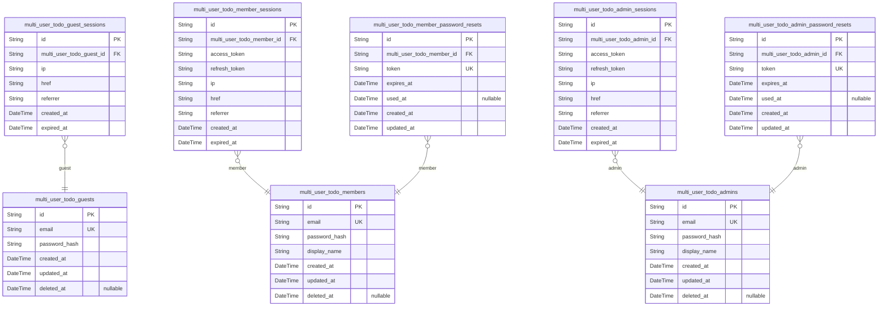
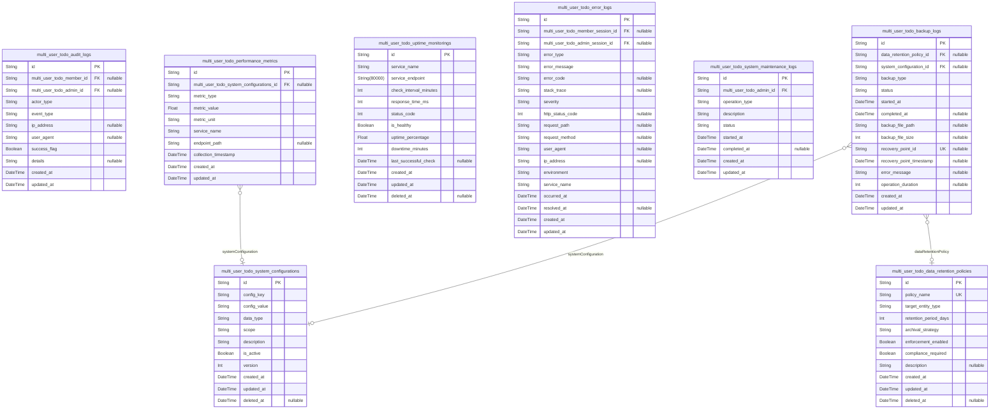
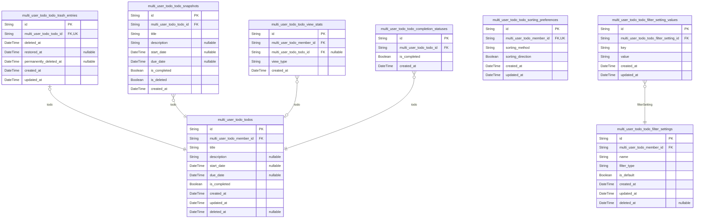
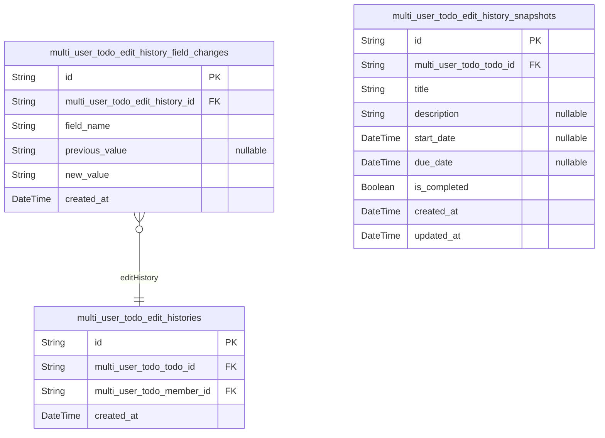

# Prisma Markdown

> Generated by [`prisma-markdown`](https://github.com/samchon/prisma-markdown)

- [Actors](#actors)
- [Systematic](#systematic)
- [Todo](#todo)
- [EditHistory](#edithistory)

## Actors

### `multi_user_todo_guests`

Temporary guest accounts for unauthenticated users during registration
and login flows.

This table stores guest user identities that are created during the
authentication process. Guest accounts serve as temporary placeholders
for users who are in the process of registering or logging in. Each guest
account has email authentication credentials and can establish sessions
for temporary access.

Guest accounts are typically short-lived and may be automatically cleaned
up after successful registration or login completion. They provide a way
to track unauthenticated user activity while maintaining proper
authentication flow separation.

Relationships:
- Has many [multi_user_todo_guest_sessions](#multi_user_todo_guest_sessions) for temporary access
- References [multi_user_todo_audit_logs](#multi_user_todo_audit_logs) for security tracking
- May be converted to [multi_user_todo_members](#multi_user_todo_members) upon successful
registration

Properties as follows:

- `id`: Primary Key.
- `email`: Unique email address for guest authentication and identification.
- `password_hash`: Hashed password for guest account security.
- `created_at`: Timestamp when the guest account was created.
- `updated_at`: Timestamp when the guest account was last updated.
- `deleted_at`: Timestamp when the guest account was soft-deleted, null if active.

### `multi_user_todo_guest_sessions`

Temporary session tokens for guest access during authentication workflows.

This table stores session information for guest users who are in the
process of registration or login. Each session contains connection
metadata for auditing purposes and has an expiration time to ensure
temporary access. Sessions are managed through authentication flows and
provide temporary access tokens for guest operations.

Guest sessions are distinct from member sessions as they have limited
privileges and shorter lifespans, typically used during the transition
from unauthenticated to authenticated state. {@link
multi_user_todo_guests.id}

Properties as follows:

- `id`: Primary Key.
- `multi_user_todo_guest_id`
  > Guest account associated with this session. {@link
  > multi_user_todo_guests.id}
- `ip`: IP address of the client connection for security auditing.
- `href`: Current page URL where the session was created for context tracking.
- `referrer`: Referrer URL indicating where the user came from for analytics.
- `created_at`: Timestamp when the session was created for audit purposes.
- `expired_at`: Timestamp when the session expires for security enforcement.

### `multi_user_todo_members`

Registered user accounts with email/password authentication credentials.

This table stores the core identity and authentication information for
registered users of the multi-user Todo application. Each member
represents a unique user who can create, manage, and organize their
private todo lists. The table includes authentication credentials (email
and password hash) along with user profile information.

Users can manage their account settings, including password changes and
account deletion. All operations performed by members are tracked through
session tables and audit logs. Members have complete privacy isolation -
they can only access their own todos and cannot view other users' data.

[multi_user_todo_member_sessions.id](#multi_user_todo_member_sessions) tracks authentication sessions
for this user.
[multi_user_todo_member_password_resets.id](#multi_user_todo_member_password_resets) handles password
recovery workflows.
[multi_user_todo_todos.id](#multi_user_todo_todos) contains all todos owned by this user.

Properties as follows:

- `id`: Primary Key.
- `email`: Unique email address used for authentication and account identification.
- `password_hash`
  > Hashed password for secure authentication using industry-standard hashing
  > algorithms.
- `display_name`: User's visible name displayed throughout the application interface.
- `created_at`: Timestamp when the user account was created.
- `updated_at`: Timestamp when the user account was last updated.
- `deleted_at`
  > Timestamp when the user account was soft-deleted, allowing for account
  > recovery within retention period.

### `multi_user_todo_member_sessions`

JWT session tokens for member authentication with access and refresh
support.

This table stores authentication sessions for registered members,
tracking their login events and session metadata. Each session contains
connection context including IP address, referrer information, and
timestamps for session lifecycle management. Sessions are managed through
authentication flows and provide the foundation for secure member access
to the todo application.

The table maintains an audit trail of member login activity and supports
JWT token management with proper expiration handling. Sessions are
append-only records that capture authentication events for security
monitoring and user activity tracking.

[multi_user_todo_members.id](#multi_user_todo_members)

Properties as follows:

- `id`: Primary Key.
- `multi_user_todo_member_id`: Belonged member's [multi_user_todo_members.id](#multi_user_todo_members).
- `access_token`: JWT access token for member authentication.
- `refresh_token`: JWT refresh token for session renewal.
- `ip`: IP address of the member's connection.
- `href`: Current URL where the session was created.
- `referrer`: Referrer URL that directed the member to the application.
- `created_at`: Timestamp when the session was created.
- `expired_at`: Timestamp when the session expires.

### `multi_user_todo_admins`

Administrator accounts with email/password authentication and elevated
privileges.

This table stores administrator identity information including
authentication credentials and profile data. Administrators have elevated
system access for management functions including user support, system
configuration, and audit oversight.

Each administrator account is associated with session records in {@link
multi_user_todo_admin_sessions} for authentication management and
password reset tokens in [multi_user_todo_admin_password_resets](#multi_user_todo_admin_password_resets)
for account recovery.

Properties as follows:

- `id`: Primary Key.
- `email`: Administrator's unique email address used for authentication.
- `password_hash`: Hashed password for administrator authentication.
- `display_name`: Administrator's display name for system identification.
- `created_at`: Timestamp when the administrator account was created.
- `updated_at`: Timestamp when the administrator account was last updated.
- `deleted_at`
  > Timestamp when the administrator account was soft-deleted, or null if
  > active.

### `multi_user_todo_admin_sessions`

JWT session tokens for administrator authentication with access and
refresh support.

This table manages administrator login sessions, storing authentication
tokens and connection context for secure access control. Each session is
tied to a specific administrator account and tracks login metadata
including IP address, user agent, and expiration timestamps. Sessions
support both access and refresh token functionality with proper
expiration handling.

The table follows the standard session pattern with foreign key
relationship to [multi_user_todo_admins](#multi_user_todo_admins) for administrator identity
verification. Sessions are managed through authentication flows and
provide audit trail capabilities for security monitoring.

Properties as follows:

- `id`: Primary Key.
- `multi_user_todo_admin_id`: Belonged administrator's [multi_user_todo_admins.id](#multi_user_todo_admins).
- `access_token`: JWT access token for authentication.
- `refresh_token`: JWT refresh token for token renewal.
- `ip`: IP address of the session connection.
- `href`: URL of the session initiation.
- `referrer`: HTTP referrer header value.
- `created_at`: Session creation timestamp.
- `expired_at`: Session expiration timestamp.

### `multi_user_todo_admin_password_resets`

Password reset tokens with expiration for administrator account recovery.

This table stores temporary password reset tokens that allow
administrators to securely reset their account passwords. Each token is
valid for a limited time period and can only be used once. The tokens are
generated during password reset requests and verified during the reset
process.

Tokens are associated with specific administrator accounts and include
security features like expiration tracking and usage status to prevent
unauthorized access. The table maintains a complete audit trail of
password reset attempts for security monitoring.

Related entities: [multi_user_todo_admins](#multi_user_todo_admins) for administrator
account reference, [multi_user_todo_admin_sessions](#multi_user_todo_admin_sessions) for
authentication context.

Properties as follows:

- `id`: Primary Key.
- `multi_user_todo_admin_id`
  > Reference to the administrator account requesting password reset. {@link
  > multi_user_todo_admins.id}
- `token`: Secure password reset token used for account recovery verification.
- `expires_at`: Timestamp when the reset token expires and becomes invalid.
- `used_at`
  > Timestamp when the reset token was successfully used, marking it as
  > consumed.
- `created_at`: Timestamp when the reset token was created.
- `updated_at`: Timestamp when the reset token record was last updated.

### `multi_user_todo_member_password_resets`

Password reset tokens with expiration for member account recovery.

This table stores temporary password reset tokens that allow members to
securely reset their passwords. Each token has a limited validity period
and can only be used once. The tokens are generated when members request
password resets and are invalidated after successful password changes or
expiration.

Tokens reference the member who requested the reset and include security
features like expiration timestamps to prevent unauthorized access. This
table supports the password recovery workflow described in the
authentication requirements.

Related to [multi_user_todo_members](#multi_user_todo_members) for member identity and
authentication context.

Properties as follows:

- `id`: Primary Key.
- `multi_user_todo_member_id`
  > Member who requested the password reset. {@link
  > multi_user_todo_members.id}.
- `token`: Unique reset token used for password recovery authentication.
- `expires_at`: Timestamp when the reset token expires and becomes invalid.
- `used_at`
  > Timestamp when the token was successfully used for password reset. Null
  > if unused.
- `created_at`: Timestamp when the reset token was created.
- `updated_at`: Timestamp when the reset token record was last updated.

## Systematic

### `multi_user_todo_audit_logs`

System-wide audit trail capturing all user operations and system events
for security monitoring and compliance.

This table serves as the central repository for audit data across the
entire application. It records every significant operation performed by
users (members, admins, guests) as well as system-generated events. Each
entry captures the actor who performed the action, the type of event,
timestamp, IP address, user agent, and detailed payload of the operation.

The audit trail supports security investigations, compliance reporting,
and operational monitoring. Records are append-only and should never be
modified once created to maintain audit integrity. {@link
multi_user_todo_members.id} and [multi_user_todo_admins.id](#multi_user_todo_admins) are
referenced when actions are performed by authenticated users.

Audit entries are categorized by event type (user_login, todo_created,
todo_updated, etc.) and tagged with success/failure status to help
identify security incidents and operational issues.

Properties as follows:

- `id`: Primary Key.
- `multi_user_todo_member_id`
  > Reference to the member who performed this action, if applicable. {@link
  > multi_user_todo_members.id}.
- `multi_user_todo_admin_id`
  > Reference to the admin who performed this action, if applicable. {@link
  > multi_user_todo_admins.id}.
- `actor_type`
  > Type of actor who performed the action: 'member', 'admin', 'guest', or
  > 'system'.
- `event_type`
  > Category of the audit event (e.g., 'user_login', 'todo_created',
  > 'todo_updated', 'system_event').
- `ip_address`: IP address from which the action was performed for security tracking.
- `user_agent`: User agent string of the client that performed the action.
- `success_flag`: Whether the operation completed successfully or encountered an error.
- `details`: JSON payload containing event-specific details and parameters.
- `created_at`: Timestamp when the audit entry was created.
- `updated_at`
  > Timestamp when the audit entry was last updated (typically matches
  > created_at for audit integrity).

### `multi_user_todo_system_configurations`

System-wide configuration settings and parameters that control
application behavior.

Stores key-value pairs for system configuration with support for
different scopes (global, component-specific, environment-specific). Each
configuration entry includes type information for validation and version
tracking for audit purposes. System administrators manage these
configurations to control application behavior, feature flags, and
operational parameters.

Configuration changes are tracked through temporal fields, allowing
rollback and audit trail capabilities. The table supports hierarchical
configuration with inheritance from global to specific scopes.

Properties as follows:

- `id`: Primary Key.
- `config_key`
  > Unique identifier for the configuration parameter. Used to reference the
  > setting in code.
- `config_value`
  > String representation of the configuration value. May contain JSON for
  > complex configurations.
- `data_type`
  > Data type of the configuration value for validation purposes. Examples:
  > 'string', 'number', 'boolean', 'json'.
- `scope`
  > Scope of the configuration (global, component, environment). Determines
  > applicability.
- `description`: Human-readable description of what this configuration controls.
- `is_active`
  > Whether this configuration is currently active and being used by the
  > system.
- `version`: Version number for configuration tracking and rollback capabilities.
- `created_at`: Timestamp when this configuration was first created.
- `updated_at`: Timestamp when this configuration was last modified.
- `deleted_at`: Timestamp when this configuration was soft-deleted (if applicable).

### `multi_user_todo_performance_metrics`

System performance monitoring data and metrics collection for the
multi-user todo application.

This table captures various performance indicators including response
times, throughput metrics, resource utilization, and system health
measurements. Each record represents a single performance measurement
event collected at a specific timestamp.

Performance metrics are used for system monitoring, capacity planning,
and identifying performance bottlenecks. The data supports operational
dashboards, alerting systems, and performance trend analysis.

Relationships:
- References system configurations for metric collection settings
- Supports uptime monitoring with performance context
- Provides data for audit trail correlation
- Enables error analysis with performance context

Properties as follows:

- `id`: Primary Key.
- `multi_user_todo_system_configurations_id`
  > Configuration settings that governed this metric collection. {@link
  > multi_user_todo_system_configurations.id}
- `metric_type`
  > Type of performance metric being measured (e.g., response_time,
  > throughput, cpu_usage, memory_usage, database_queries).
- `metric_value`: Numeric value of the performance measurement.
- `metric_unit`
  > Unit of measurement for the metric value (e.g., milliseconds,
  > requests_per_second, percentage, megabytes).
- `service_name`
  > Name of the service or component being measured (e.g., api_gateway,
  > todo_service, database, authentication).
- `endpoint_path`: Specific API endpoint or function being measured, if applicable.
- `collection_timestamp`: Exact timestamp when this performance metric was collected.
- `created_at`: Timestamp when this performance record was created in the database.
- `updated_at`: Timestamp when this performance record was last updated.

### `multi_user_todo_uptime_monitorings`

Service availability tracking and uptime statistics for system monitoring.

This table records periodic service health checks and availability
metrics for monitoring system reliability. It captures response times,
service status, and uptime calculations to provide comprehensive
visibility into system performance and availability.

Each record represents a single monitoring check performed at a specific
interval, allowing for historical trend analysis and SLA compliance
tracking. The data supports alerting systems and performance dashboards.

Properties as follows:

- `id`: Primary Key.
- `service_name`: Name of the monitored service or endpoint being checked.
- `service_endpoint`: Full endpoint URL or service identifier being monitored.
- `check_interval_minutes`: Monitoring interval in minutes between consecutive checks.
- `response_time_ms`: Response time in milliseconds measured during the health check.
- `status_code`: HTTP status code or service status indicator from the check.
- `is_healthy`: Boolean flag indicating whether the service passed the health check.
- `uptime_percentage`: Calculated uptime percentage over the monitoring period.
- `downtime_minutes`: Total downtime in minutes during the monitoring period.
- `last_successful_check`: Timestamp of the last successful health check.
- `created_at`: Timestamp when this monitoring record was created.
- `updated_at`: Timestamp when this monitoring record was last updated.
- `deleted_at`: Timestamp when this monitoring record was soft-deleted.

### `multi_user_todo_error_logs`

System-wide error logging and exception tracking for the multi-user Todo
application.

This table captures detailed error information including error type,
message, stack trace, severity level, and contextual metadata. It
supports error analysis, monitoring, and debugging workflows by providing
comprehensive error tracking capabilities.

Each error log entry records the error occurrence timestamp, error
details, and optional user/session context for error attribution. The
table supports classification by error type and severity for prioritized
error handling and analysis.

Key relationships:
- Optional reference to user sessions for error attribution
- Supports error categorization by type and severity
- Enables error trend analysis and monitoring

This infrastructure table is essential for maintaining system reliability
and providing diagnostic capabilities for production issues.

Properties as follows:

- `id`: Primary Key.
- `multi_user_todo_member_session_id`
  > Optional reference to the member session that triggered the error. {@link
  > multi_user_todo_member_sessions.id}
- `multi_user_todo_admin_session_id`
  > Optional reference to the admin session that triggered the error. {@link
  > multi_user_todo_admin_sessions.id}
- `error_type`
  > Classification of the error type (e.g., 'application_error',
  > 'validation_error', 'system_error', 'database_error',
  > 'authentication_error').
- `error_message`: Human-readable error message describing the error condition.
- `error_code`: Optional error code for programmatic error handling and categorization.
- `stack_trace`: Full stack trace or error details for debugging purposes.
- `severity`: Error severity level (e.g., 'low', 'medium', 'high', 'critical').
- `http_status_code`: HTTP status code associated with the error, if applicable.
- `request_path`: API endpoint or request path where the error occurred.
- `request_method`: HTTP method of the request that triggered the error.
- `user_agent`: User agent string from the client that triggered the error.
- `ip_address`: IP address of the client that triggered the error.
- `environment`
  > Deployment environment where the error occurred (e.g., 'development',
  > 'staging', 'production').
- `service_name`: Name of the service or module where the error originated.
- `occurred_at`: Timestamp when the error occurred.
- `resolved_at`: Timestamp when the error was resolved or acknowledged.
- `created_at`: Timestamp when the error log entry was created.
- `updated_at`: Timestamp when the error log entry was last updated.

### `multi_user_todo_system_maintenance_logs`

System maintenance log tracking all administrative operations and
maintenance activities.

This table serves as the central audit trail for system maintenance
operations performed by administrators. It captures details about
maintenance tasks such as database backups, system updates, configuration
changes, and other administrative activities. Each entry includes the
operation type, description, status, and timing information for
comprehensive system administration tracking.

The logs are used for auditing maintenance activities, troubleshooting
system issues, and ensuring compliance with operational procedures.
Maintenance operations are typically initiated by administrators through
system management interfaces and recorded here for historical reference.

Properties as follows:

- `id`: Primary Key.
- `multi_user_todo_admin_id`
  > Administrator who performed the maintenance operation. {@link
  > multi_user_todo_admins.id}.
- `operation_type`
  > Type of maintenance operation performed (e.g., backup, update,
  > configuration, cleanup).
- `description`: Detailed description of the maintenance operation performed.
- `status`
  > Current status of the maintenance operation (e.g., started, completed,
  > failed).
- `started_at`: Timestamp when the maintenance operation began.
- `completed_at`: Timestamp when the maintenance operation completed, if applicable.
- `created_at`: Timestamp when the maintenance log entry was created.
- `updated_at`: Timestamp when the maintenance log entry was last updated.

### `multi_user_todo_data_retention_policies`

Data retention rules and archival policies for system entities.

This table defines retention periods, archival strategies, and deletion
policies for different types of data within the multi-user todo
application. Each policy specifies how long data should be retained
before archival or deletion, and under what conditions retention rules
apply.

Policies can target specific entity types (todos, edit histories, audit
logs, etc.) and define different retention periods based on business
requirements and compliance needs. The system uses these policies to
automatically manage data lifecycle and ensure proper data governance.

Properties as follows:

- `id`: Primary Key.
- `policy_name`: Unique name identifier for the retention policy.
- `target_entity_type`
  > Type of entity this policy applies to (e.g., 'todo', 'edit_history',
  > 'audit_log').
- `retention_period_days`: Number of days data should be retained before archival or deletion.
- `archival_strategy`
  > Strategy for handling data after retention period (e.g., 'archive',
  > 'delete', 'anonymize').
- `enforcement_enabled`: Whether this retention policy is actively enforced by the system.
- `compliance_required`: Whether this policy is required for regulatory compliance.
- `description`: Detailed description of the policy purpose and requirements.
- `created_at`: Timestamp when the policy was created.
- `updated_at`: Timestamp when the policy was last updated.
- `deleted_at`: Timestamp when the policy was soft-deleted.

### `multi_user_todo_backup_logs`

Tracks backup operations and recovery point management for the multi-user
todo application.

This table maintains a complete audit trail of all backup operations
performed by the system, including scheduled backups, manual backups, and
recovery operations. Each entry records the backup type, status,
timestamps, file locations, and recovery point information for disaster
recovery purposes.

The backup logs are essential for system administrators to monitor backup
health, track recovery points, and ensure data protection compliance.
They provide visibility into backup success rates, operation durations,
and recovery point availability for business continuity planning.

Backup operations reference {@link
multi_user_todo_data_retention_policies} for retention rules and {@link
multi_user_todo_system_configurations} for backup configuration settings.
Recovery operations use these logs to identify available recovery points
and their corresponding backup files.

Properties as follows:

- `id`: Primary Key.
- `data_retention_policy_id`
  > Reference to the data retention policy governing this backup operation.
  > [multi_user_todo_data_retention_policies.id](#multi_user_todo_data_retention_policies)
- `system_configuration_id`
  > Reference to the system configuration used for this backup operation.
  > [multi_user_todo_system_configurations.id](#multi_user_todo_system_configurations)
- `backup_type`
  > Type of backup operation performed (full, incremental, differential,
  > manual, scheduled, recovery).
- `status`
  > Current status of the backup operation (pending, in_progress, completed,
  > failed, cancelled).
- `started_at`: Timestamp when the backup operation began.
- `completed_at`: Timestamp when the backup operation completed or failed.
- `backup_file_path`: File system path or storage location of the backup file.
- `backup_file_size`: Size of the backup file in bytes.
- `recovery_point_id`: Unique identifier for the recovery point created by this backup.
- `recovery_point_timestamp`: Point-in-time timestamp that this backup represents for recovery purposes.
- `error_message`: Error details if the backup operation failed.
- `operation_duration`: Duration of the backup operation in milliseconds.
- `created_at`: Timestamp when this backup log entry was created.
- `updated_at`: Timestamp when this backup log entry was last updated.

## Todo

### `multi_user_todo_todos`

Main table storing all active todo items with their core properties and
ownership information.

This table represents the central business entity of the todo
application, containing all active todo items that users create, view,
edit, and manage. Each todo belongs to exactly one member user and
maintains its current state including title, description, scheduling
dates, and completion status.

Todos support soft deletion through the deleted_at field, allowing users
to restore items from trash. The table tracks creation and modification
timestamps for audit purposes and supports various filtering and sorting
operations through appropriate indexing.

Key relationships:
- Each todo belongs to a member user ([multi_user_todo_members.id](#multi_user_todo_members))
- Completion status changes are tracked in a separate table ({@link
multi_user_todo_todo_completion_statuses})
- Deleted todos are moved to trash entries ({@link
multi_user_todo_todo_trash_entries})
- Edit history is maintained in the EditHistory component
- Snapshots provide point-in-time state capture ({@link
multi_user_todo_todo_snapshots})

Properties as follows:

- `id`: Primary Key.
- `multi_user_todo_member_id`: Owner member's [multi_user_todo_members.id](#multi_user_todo_members).
- `title`
  > The main title or name of the todo item. This is the primary identifier
  > that users see in todo lists.
- `description`
  > Optional detailed description providing additional context about the todo
  > item. Can be left empty if not needed.
- `start_date`
  > Optional scheduled start date for when work on the todo should begin.
  > Used for sorting and filtering operations.
- `due_date`
  > Optional deadline date for when the todo should be completed. Used for
  > sorting and filtering operations.
- `is_completed`
  > Indicates whether the todo has been marked as complete. Defaults to false
  > for new todos.
- `created_at`
  > Timestamp when the todo was originally created. Used for sorting and
  > audit purposes.
- `updated_at`
  > Timestamp when the todo was last modified. Updated on every edit
  > operation.
- `deleted_at`
  > Timestamp when the todo was soft-deleted. Null indicates the todo is
  > active.

### `multi_user_todo_todo_trash_entries`

Stores soft-deleted todos that can be restored or permanently deleted.
This table serves as the trash management system, allowing users to
recover accidentally deleted todos or permanently remove them from the
system.

Each entry represents a todo that has been soft-deleted from the active
todo list. The original todo data is preserved here until either restored
to active status or permanently deleted. This enables the trash
functionality where users can view their deleted todos, restore them, or
permanently remove them.

Relationships:
- References the original [multi_user_todo_todos](#multi_user_todo_todos) through foreign key
- Managed through parent todo operations rather than independent API
endpoints

Properties as follows:

- `id`: Primary Key.
- `multi_user_todo_todo_id`
  > Reference to the original todo that was soft-deleted. {@link
  > multi_user_todo_todos.id}.
- `deleted_at`
  > Timestamp when the todo was moved to trash. Used for sorting and
  > filtering trash entries.
- `restored_at`: Timestamp when the todo was restored from trash. Null if still in trash.
- `permanently_deleted_at`
  > Timestamp when the todo was permanently deleted from trash. Null if still
  > recoverable.
- `created_at`: Creation timestamp for audit trail.
- `updated_at`: Last update timestamp for audit trail.

### `multi_user_todo_todo_snapshots`

Point-in-time snapshots of todos for audit and recovery purposes.

This table captures the complete state of a todo at specific moments in
time,
providing a historical record for audit trails and recovery scenarios. Each
snapshot represents a frozen state of a todo, including all its properties
(title, description, start date, due date, completion status) as they
existed
at the time of capture. Snapshots are immutable records that support
rollback capabilities and change tracking.

Snapshots are typically created during significant todo lifecycle events
such
as edits, completions, or restorations from trash. They enable users to view
historical states of their todos and support system-level audit
requirements.

Relationships:
- Each snapshot belongs to exactly one todo ({@link
multi_user_todo_todos.id})
- Todos can have multiple snapshots over their lifecycle
- Snapshots reference the todo they capture at creation time

Properties as follows:

- `id`: Primary Key.
- `multi_user_todo_todo_id`: The todo that this snapshot captures. [multi_user_todo_todos.id](#multi_user_todo_todos).
- `title`: The title of the todo at the time of snapshot creation.
- `description`: The description of the todo at the time of snapshot creation, if present.
- `start_date`: The start date of the todo at the time of snapshot creation, if set.
- `due_date`: The due date of the todo at the time of snapshot creation, if set.
- `is_completed`: The completion status of the todo at the time of snapshot creation.
- `is_deleted`: Whether the todo was deleted at the time of snapshot creation.
- `created_at`: Timestamp when this snapshot was created.

### `multi_user_todo_todo_filter_settings`

Stores user-defined filter configurations for quick todo list filtering.

Each saved filter configuration allows users to quickly apply their
preferred filtering settings without manually selecting options each
time. Filters can be configured for completion status (all, complete,
incomplete) and other filtering criteria as the application evolves.

Users can create, update, and delete their own filter settings. Each
filter setting belongs to exactly one user {@link
multi_user_todo_members.id} and is managed through the user's profile
settings.

Properties as follows:

- `id`: Primary Key.
- `multi_user_todo_member_id`: Owner of this filter configuration. [multi_user_todo_members.id](#multi_user_todo_members).
- `name`: User-friendly name for this saved filter configuration.
- `filter_type`
  > Type of filter being saved (e.g., 'completion_status', 'date_range',
  > 'priority').
- `is_default`: Whether this filter should be applied by default when viewing todos.
- `created_at`: When this filter configuration was created.
- `updated_at`: When this filter configuration was last modified.
- `deleted_at`: When this filter configuration was soft-deleted.

### `multi_user_todo_todo_view_stats`

Tracks usage statistics and view counts for todo management analytics.

This table records each view event when users access their todo lists or
individual todo details. Each entry represents a single view operation,
capturing the user who performed the view, the todo being viewed (if
applicable), and the timestamp of the view. This data supports analytics
on user engagement patterns, popular todo management features, and usage
trends over time.

The statistics help identify which todo management features are most
frequently used and when users are most active with their todo lists.
This information can inform UI improvements, feature prioritization, and
performance optimization decisions.

Relationships:
- References [multi_user_todo_members.id](#multi_user_todo_members) for user context
- References [multi_user_todo_todos.id](#multi_user_todo_todos) for todo context (when
viewing individual todos)
- Part of the Todo component analytics subsystem

Properties as follows:

- `id`: Primary Key.
- `multi_user_todo_member_id`: User who performed the view operation. [multi_user_todo_members.id](#multi_user_todo_members).
- `multi_user_todo_todo_id`: Todo being viewed (null for list views). [multi_user_todo_todos.id](#multi_user_todo_todos).
- `view_type`
  > Type of view operation performed: 'list' for todo list views, 'detail'
  > for individual todo views.
- `created_at`: Timestamp when the view operation occurred.

### `multi_user_todo_todo_completion_statuses`

Tracks completion status changes for todos with timestamps for audit
purposes.

Each record represents a single status change event when a todo is marked
as complete or incomplete. This provides a complete audit trail of
completion status transitions over time, allowing users to see when their
todos were completed and potentially when they were marked incomplete
again.

The table maintains referential integrity with the main {@link
multi_user_todo_todos} table and ensures that every status change is
recorded with precise timing information for accountability and
historical tracking.

Properties as follows:

- `id`: Primary Key.
- `multi_user_todo_todo_id`
  > Reference to the todo whose completion status changed. {@link
  > multi_user_todo_todos.id}.
- `is_completed`
  > Whether the todo was marked as completed (true) or incomplete (false) in
  > this status change.
- `created_at`: Timestamp when the completion status change occurred.

### `multi_user_todo_todo_sorting_preferences`

Stores user preferences for default todo list sorting methods and
directions.

Each user can configure their preferred sorting method (creation date,
start date, or due date) and direction (ascending or descending) for
their todo list view. These preferences are applied by default when users
view their todo lists unless overridden by temporary sorting selections.

This table maintains a 1:1 relationship with {@link
multi_user_todo_members} through a unique constraint on the member
foreign key, ensuring each user has exactly one sorting preference
setting.

Properties as follows:

- `id`: Primary Key.
- `multi_user_todo_member_id`
  > Reference to the member who owns these sorting preferences. {@link
  > multi_user_todo_members.id}.
- `sorting_method`
  > Preferred sorting method for todo lists. Valid values: 'creation_date',
  > 'start_date', 'due_date'.
- `sorting_direction`: Sorting direction preference. True for ascending, false for descending.
- `created_at`: Timestamp when the sorting preference was created.
- `updated_at`: Timestamp when the sorting preference was last updated.

### `multi_user_todo_todo_filter_setting_values`

Stores individual filter configuration values as key-value pairs for
proper 1NF normalization.

Each record represents a single filter setting value associated with a
specific filter configuration. This table ensures atomic values and
eliminates repeating groups that would violate First Normal Form if
stored directly in the parent filter settings table.

The key-value structure allows flexible filter configuration while
maintaining data integrity through proper normalization. Values are
stored with appropriate data types based on the filter configuration
requirements.

This table supports the filter functionality by providing granular
control over individual filter parameters and their values. {@link
multi_user_todo_todo_filter_settings.id}

Properties as follows:

- `id`: Primary Key.
- `multi_user_todo_todo_filter_setting_id`
  > Parent filter setting configuration. {@link
  > multi_user_todo_todo_filter_settings.id}
- `key`: Filter parameter key identifying the specific filter setting type.
- `value`
  > Filter parameter value stored as string for flexibility across different
  > filter types.
- `created_at`: Timestamp when this filter setting value was created.
- `updated_at`: Timestamp when this filter setting value was last updated.

## EditHistory

### `multi_user_todo_edit_histories`

Main edit history entries recording each todo modification event.

Each entry represents a single edit operation performed on a todo,
capturing the timestamp and user who made the change. This table serves
as the central audit trail for tracking todo modifications over time.

Edit history entries are created whenever a user modifies a todo's title,
description, start date, or due date. The granular field-level changes
are tracked in [multi_user_todo_edit_history_field_changes](#multi_user_todo_edit_history_field_changes) for
detailed audit capabilities.

Relationships:
- References the [multi_user_todo_todos](#multi_user_todo_todos) table to identify which
todo was edited
- References the [multi_user_todo_members](#multi_user_todo_members) table to identify who
made the edit
- Has many field change records in {@link
multi_user_todo_edit_history_field_changes}
- Has snapshot records in [multi_user_todo_edit_history_snapshots](#multi_user_todo_edit_history_snapshots)
for point-in-time state capture

Properties as follows:

- `id`: Primary Key.
- `multi_user_todo_todo_id`: Reference to the todo that was edited. [multi_user_todo_todos.id](#multi_user_todo_todos).
- `multi_user_todo_member_id`
  > Reference to the user who made the edit. {@link
  > multi_user_todo_members.id}.
- `created_at`: Timestamp when the edit was performed.

### `multi_user_todo_edit_history_field_changes`

Tracks individual field changes within each edit history entry for
granular audit trail.

Each record represents a specific field modification made during a todo
edit operation. This table captures the field name, previous value, and
new value for each changed field, providing detailed audit information
for compliance and debugging purposes.

This table is subsidiary to [multi_user_todo_edit_histories](#multi_user_todo_edit_histories) and
provides the granular field-level tracking required by the edit history
functionality.

Properties as follows:

- `id`: Primary Key.
- `multi_user_todo_edit_history_id`
  > Parent edit history entry that contains this field change. {@link
  > multi_user_todo_edit_histories.id}.
- `field_name`
  > Name of the field that was modified (e.g., 'title', 'description',
  > 'start_date', 'due_date').
- `previous_value`
  > The value of the field before the edit operation. Stored as string for
  > flexibility across different field types.
- `new_value`
  > The value of the field after the edit operation. Stored as string for
  > flexibility across different field types.
- `created_at`: Timestamp when this field change was recorded.

### `multi_user_todo_edit_history_snapshots`

Point-in-time snapshots of todo state for audit trail completeness.

This table captures the complete state of a todo at specific moments in
time,
providing a historical record for audit purposes. Each snapshot represents
the exact state of a todo when a significant event occurred, such as before
and after major edits or at regular intervals for compliance tracking.

Snapshots are append-only and serve as immutable records of todo evolution
over time. They complement the granular edit history by providing complete
state captures rather than incremental changes.

Related entities: [multi_user_todo_todos](#multi_user_todo_todos) for the todo being
snapshotted,
[multi_user_todo_edit_histories](#multi_user_todo_edit_histories) for detailed change tracking.

Properties as follows:

- `id`: Primary Key.
- `multi_user_todo_todo_id`: Reference to the todo being snapshotted. [multi_user_todo_todos.id](#multi_user_todo_todos)
- `title`: The title of the todo at the time of snapshot.
- `description`: The description of the todo at the time of snapshot.
- `start_date`: The start date of the todo at the time of snapshot.
- `due_date`: The due date of the todo at the time of snapshot.
- `is_completed`: The completion status of the todo at the time of snapshot.
- `created_at`: Timestamp when this snapshot was created.
- `updated_at`
  > Timestamp when this snapshot was last updated. Required for temporal
  > tracking compliance.
