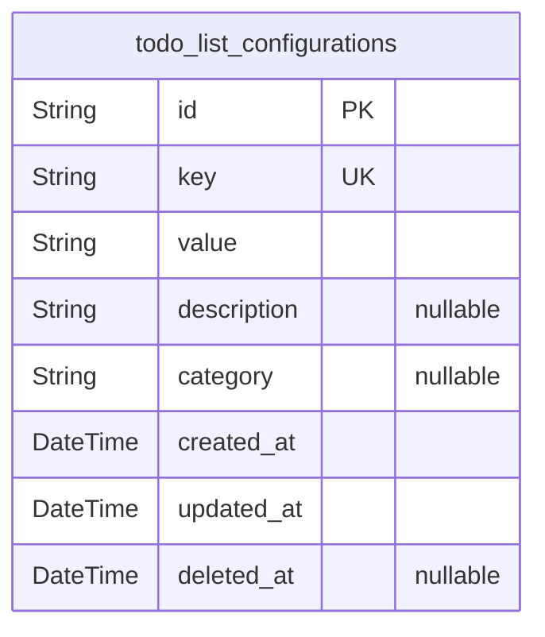
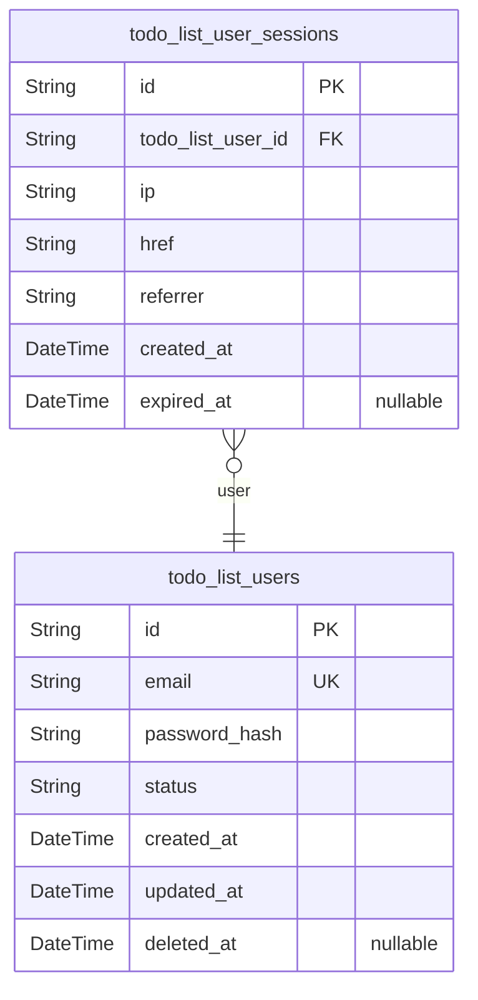
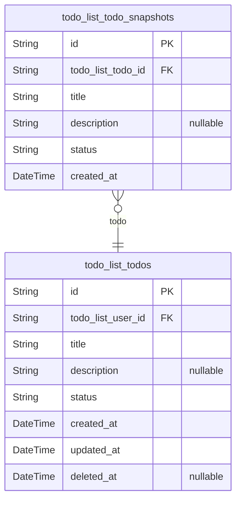

# Prisma Markdown

> Generated by [`prisma-markdown`](https://github.com/samchon/prisma-markdown)

- [Systematic](#systematic)
- [Actors](#actors)
- [Todos](#todos)

## Systematic

### `todo_list_configurations`

System-level configuration settings for the Todo List application.

Stores key-value pairs that control application behavior, feature flags,
and system parameters. These configurations are managed at the system
level and affect the entire application rather than individual users.

Each configuration entry represents a specific setting that can be
modified to adjust application behavior without code changes. The table
supports flexible key-value storage with proper data typing and
validation.

Configurations are version-controlled through the updated_at timestamp,
allowing tracking of when settings were modified. This provides audit
capability for system changes and configuration management.

Soft deletion is supported through the deleted_at field, allowing
configurations to be disabled without permanent removal. This maintains
historical records while preventing accidental data loss.

Properties as follows:

- `id`: Primary Key.
- `key`
  > Unique configuration key identifier. Used to reference specific settings
  > throughout the application. Must be unique across all configuration
  > entries.
- `value`
  > Configuration value stored as string. Can represent various data types
  > (boolean, number, text) that are parsed by the application logic.
- `description`
  > Human-readable description explaining the purpose and usage of this
  > configuration setting. Helps administrators understand what the setting
  > controls.
- `category`
  > Optional category grouping for organizing related configurations.
  > Examples: 'ui', 'performance', 'security', 'features'.
- `created_at`
  > Timestamp when this configuration was initially created. Tracks when
  > settings were first established in the system.
- `updated_at`
  > Timestamp when this configuration was last modified. Used for tracking
  > configuration changes and version control.
- `deleted_at`
  > Timestamp when this configuration was soft-deleted. Allows configurations
  > to be disabled without permanent removal, supporting audit trails and
  > recovery capabilities.

## Actors

### `todo_list_users`

User accounts for the todo list application with authentication
capabilities.

Stores user credentials and profile information for secure access to the
todo management system. Each user account enables creation, management,
and organization of personal todo items with complete data isolation from
other users.

The model includes authentication fields for secure login functionality
and supports account status tracking for active/inactive management. User
data is protected with proper encryption and follows privacy requirements
specified in the security documentation.

Properties as follows:

- `id`: Primary Key.
- `email`
  > User's email address used for authentication and communication. Must be
  > unique across all users.
- `password_hash`
  > Securely hashed password for user authentication. Uses industry-standard
  > bcrypt hashing with proper salt rounds.
- `status`
  > Current user account status. Valid values: active, inactive, suspended.
  > Controls login capability and system access.
- `created_at`: Timestamp when the user account was created.
- `updated_at`: Timestamp when the user account was last updated.
- `deleted_at`
  > Timestamp when the user account was soft deleted. Null indicates active
  > account.

### `todo_list_user_sessions`

User authentication sessions for tracking login activity and security
context.

Records user login sessions with connection details including IP address,
URL, and referrer information. Each session represents an authenticated
connection from a specific device and location.

Sessions are used for audit tracing of user actions and support
multi-device access with proper security monitoring. The model follows
the exact session table pattern with required fields for security
compliance.

Properties as follows:

- `id`: Primary Key.
- `todo_list_user_id`: Associated user account. [todo_list_users.id](#todo_list_users)
- `ip`: IP address of the connection where the session was created.
- `href`: URL of the connection where the session was established.
- `referrer`: Referrer URL that directed the user to the application.
- `created_at`: Timestamp when the session was created.
- `expired_at`: Timestamp when the session expires. Null indicates active session.

## Todos

### `todo_list_todos`

Core todo items that users create and manage.

Represents individual tasks that users track for completion. Each todo
has a title, optional description, and status tracking
(pending/completed). Todos are owned by authenticated users and support
full CRUD operations with soft deletion capability.

Todos maintain their own lifecycle independent of users, allowing for
proper task management workflows. The system tracks creation and
modification timestamps for audit purposes and supports status
transitions between pending and completed states.

**Business Rules:**
- Title must be between 1-255 characters
- Description can be up to 1000 characters
- Status must be either 'pending' or 'completed'
- Todos belong to authenticated users
- Soft deletion preserves audit trail

Properties as follows:

- `id`: Primary Key.
- `todo_list_user_id`: Owner user reference. [todo_list_users.id](#todo_list_users)
- `title`
  > Todo item title. Required field with 1-255 character limit as specified
  > in requirements.
- `description`
  > Optional detailed description of the todo item. Maximum 1000 characters
  > as specified.
- `status`
  > Current status of the todo item. Valid values: 'pending', 'completed'.
  > Defaults to 'pending'. Status transitions follow business workflow rules.
- `created_at`: Timestamp when the todo item was created.
- `updated_at`: Timestamp when the todo item was last modified.
- `deleted_at`: Timestamp when the todo item was soft deleted. Null indicates active item.

### `todo_list_todo_snapshots`

Historical snapshots of todo items for audit trail and version tracking.

Captures point-in-time states of todo items whenever significant changes
occur (title, description, or status changes). Each snapshot preserves
the complete state of a todo item at a specific moment, enabling
historical tracking and audit capabilities.

Snapshots are created automatically when todo items are modified and
provide an append-only record of changes for compliance and recovery
purposes.

Properties as follows:

- `id`: Primary Key.
- `todo_list_todo_id`: Reference to the original todo item. [todo_list_todos.id](#todo_list_todos)
- `title`: Todo title at the time of snapshot creation.
- `description`: Todo description at the time of snapshot creation.
- `status`: Todo status at the time of snapshot creation.
- `created_at`: Timestamp when this snapshot was created.
