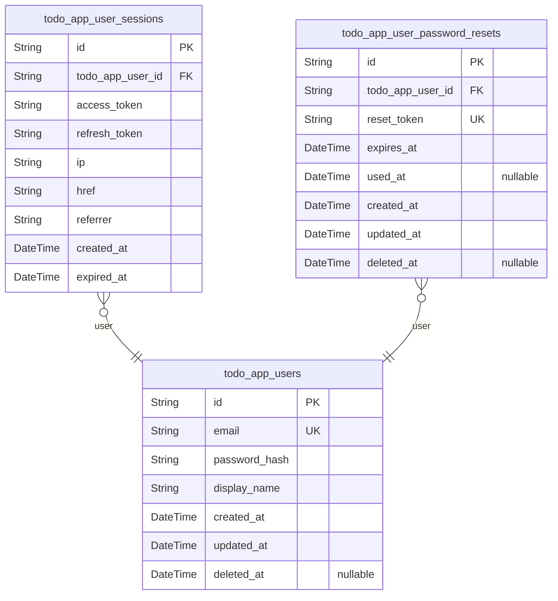
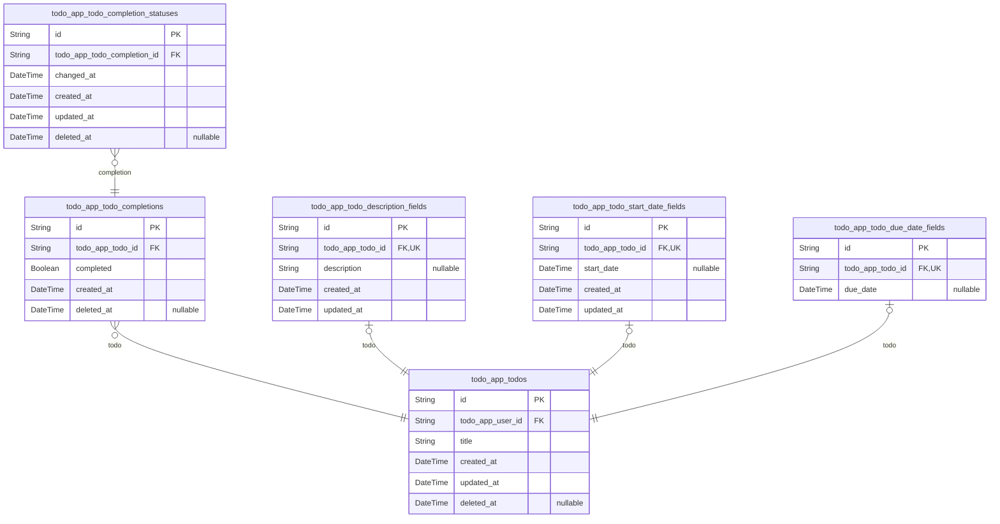
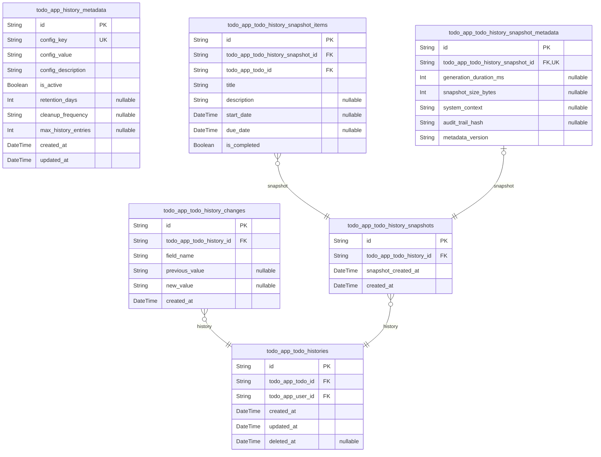
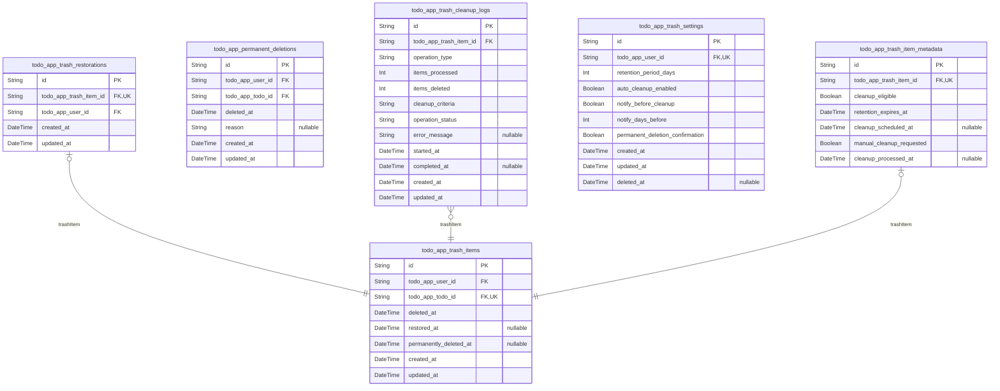

# Prisma Markdown

> Generated by [`prisma-markdown`](https://github.com/samchon/prisma-markdown)

- [Actors](#actors)
- [Systematic](#systematic)
- [Todos](#todos)
- [History](#history)
- [Trash](#trash)

## Actors

### `todo_app_users`

Registered user accounts with email/password authentication credentials
and profile information. This table serves as the primary actor entity
for authenticated users who manage their personal todo lists. Users can
create, edit, complete, and delete todos while maintaining complete
privacy and data isolation from other users. Each user has a profile with
display name and authentication credentials for secure login and account
management.

The table supports user registration, login, password changes, and
account deletion workflows. It maintains temporal tracking for creation,
updates, and soft deletion capabilities. All user data is completely
isolated, ensuring privacy guarantees as specified in the requirements.

Properties as follows:

- `id`: Primary Key.
- `email`
  > User's email address used for authentication and account identification.
  > Must be unique across all users.
- `password_hash`
  > Securely hashed password for user authentication. Stored using
  > industry-standard hashing algorithms.
- `display_name`
  > User's display name shown throughout the application for personalization
  > and identification.
- `created_at`: Timestamp when the user account was created.
- `updated_at`: Timestamp when the user account was last updated.
- `deleted_at`
  > Timestamp when the user account was soft deleted. Null indicates active
  > account.

### `todo_app_user_sessions`

JWT session tokens for user authentication with access and refresh token
support. Each session tracks the user's login context including IP
address, browser information, and connection metadata for security
auditing purposes.

Sessions are created during user login and managed through authentication
flows. They contain both access and refresh tokens to support secure
authentication with token rotation. The expiration tracking ensures
sessions are automatically invalidated after their designated lifetime
for security.

This table maintains a complete audit trail of user login activity,
supporting security monitoring and compliance requirements. Sessions are
automatically cleaned up based on expiration policies to maintain
database performance and security.

[todo_app_users.id](#todo_app_users)

Properties as follows:

- `id`: Primary Key.
- `todo_app_user_id`: Authenticated user's session reference. [todo_app_users.id](#todo_app_users)
- `access_token`
  > JWT access token for authenticated API requests. Contains user identity
  > and permissions encoded as a secure token.
- `refresh_token`
  > JWT refresh token for obtaining new access tokens without requiring
  > re-authentication. Used for session longevity.
- `ip`
  > IP address of the client connection where the session was created. Used
  > for security auditing and geographic tracking.
- `href`
  > Full URL of the page where the session was initiated. Provides context
  > for the login event.
- `referrer`
  > HTTP referrer header value indicating the source page that directed to
  > the login. Useful for traffic source analysis.
- `created_at`
  > Timestamp when the session was created during user login. Used for
  > session lifetime calculation and audit trail.
- `expired_at`
  > Timestamp when the session expires and becomes invalid. Ensures automatic
  > session cleanup for security.

### `todo_app_user_password_resets`

Stores password reset tokens with expiration timestamps for secure
password recovery workflow. Each reset request generates a unique token
that can be used once to reset a user's password within a limited time
window for security purposes. Users can have multiple reset requests over
time, but only active (unexpired, unused) tokens are valid for password
reset operations.

Properties as follows:

- `id`: Primary Key.
- `todo_app_user_id`: User who requested the password reset. [todo_app_users.id](#todo_app_users)
- `reset_token`
  > Unique cryptographic token for password reset verification. Must be
  > cryptographically secure and globally unique.
- `expires_at`
  > Timestamp when this reset token expires and becomes invalid for security
  > purposes.
- `used_at`
  > Timestamp when this reset token was successfully used to reset password.
  > Null indicates unused token.
- `created_at`: Timestamp when the password reset request was created.
- `updated_at`: Timestamp when the password reset record was last updated.
- `deleted_at`
  > Timestamp when the password reset record was soft deleted for audit
  > purposes.

## Systematic

```mermaid
erDiagram
"todo_app_system_configurations" {
  String id PK
  String system_metadata_id FK
  String config_key UK
  String value_type
  String description
  DateTime created_at
  DateTime updated_at
}
"todo_app_audit_logs" {
  String id PK
  String user_id FK "nullable"
  String event_type
  String event_subtype "nullable"
  String severity
  String description
  String ip_address "nullable"
  String user_agent "nullable"
  String resource_id "nullable"
  String resource_type "nullable"
  String metadata "nullable"
  DateTime created_at
  DateTime updated_at
}
"todo_app_system_metadata" {
  String id PK
  String operation_type
  String operation_version
  String status
  String description "nullable"
  DateTime started_at "nullable"
  DateTime completed_at "nullable"
  DateTime created_at
  DateTime updated_at
}
"todo_app_error_logs" {
  String id PK
  String user_id FK "nullable"
  String user_session_id FK "nullable"
  DateTime created_at
  String error_type
  String error_message
  String stack_trace "nullable"
  String severity
  String component
  String request_path "nullable"
  String request_method "nullable"
  String request_parameters "nullable"
  String user_agent "nullable"
  String ip_address "nullable"
  DateTime resolved_at "nullable"
}
"todo_app_feature_flags" {
  String id PK
  String name UK
  String description
  Boolean enabled
  Int rollout_percentage
  String target_scope
  String targeting_rules "nullable"
  DateTime created_at
  DateTime updated_at
  DateTime deleted_at "nullable"
}
"todo_app_api_rate_limits" {
  String id PK
  String rate_limit_name
  String rate_limit_type
  Int requests_limit
  Int time_window_seconds
  String scope_identifier "nullable"
  Int current_usage_count
  DateTime window_start_time
  Boolean is_enabled
  String description "nullable"
  DateTime created_at
  DateTime updated_at
}
"todo_app_system_health_checks" {
  String id PK
  String check_type
  String check_name
  String status
  Int response_time "nullable"
  String error_message "nullable"
  DateTime check_timestamp
  DateTime created_at
  DateTime updated_at
}
"todo_app_background_jobs" {
  String id PK
  String todo_app_user_id FK "nullable"
  String name
  String description "nullable"
  String status
  String parameters "nullable"
  DateTime scheduled_at
  DateTime started_at "nullable"
  DateTime completed_at "nullable"
  Int retry_count
  Int max_retries
  String error_message "nullable"
  String failure_reason "nullable"
  DateTime created_at
  DateTime updated_at
  DateTime deleted_at "nullable"
}
"todo_app_data_migrations" {
  String id PK
  String migration_name
  String version
  String status
  DateTime executed_at "nullable"
  Int execution_duration "nullable"
  Boolean rollback_available
  String error_details "nullable"
  String description "nullable"
  DateTime created_at
  DateTime updated_at
}
"todo_app_system_notifications" {
  String id PK
  String todo_app_user_id FK "nullable"
  String notification_type
  String priority
  String subject
  String message
  String delivery_status
  String delivery_method
  Int retry_count
  Int max_retries
  DateTime last_attempt_at "nullable"
  DateTime next_retry_at "nullable"
  DateTime sent_at "nullable"
  DateTime delivered_at "nullable"
  DateTime expires_at "nullable"
  String failure_reason "nullable"
  String metadata "nullable"
  DateTime created_at
  DateTime updated_at
}
"todo_app_cache_managements" {
  String id PK
  String cache_key_pattern UK
  String cache_strategy
  Int time_to_live_seconds "nullable"
  Int max_cache_size "nullable"
  Boolean enabled
  DateTime last_invalidation_at "nullable"
  Int hit_count
  Int miss_count
  Int average_response_time_ms "nullable"
  Int memory_usage_mb "nullable"
  DateTime created_at
  DateTime updated_at
  DateTime deleted_at "nullable"
}
"todo_app_maintenance_windows" {
  String id PK
  String title
  String description "nullable"
  DateTime scheduled_start_at
  DateTime scheduled_end_at
  DateTime actual_start_at "nullable"
  DateTime actual_end_at "nullable"
  String status
  String impact_level
  DateTime created_at
  DateTime updated_at
  DateTime deleted_at "nullable"
}
"todo_app_system_configuration_strings" {
  String id PK
  String todo_app_system_configuration_id FK
  String configuration_value
  String validation_pattern "nullable"
  Int max_length "nullable"
  Int min_length "nullable"
}
"todo_app_system_configuration_booleans" {
  String id PK
  String todo_app_system_configuration_id FK,UK
  Boolean value
}
"todo_app_system_configuration_numbers" {
  String id PK
  String todo_app_system_configuration_id FK,UK
  Float value
}
"todo_app_system_configuration_jsons" {
  String id PK
  String todo_app_system_configuration_id FK
  String configuration_key
  String json_value
  String json_schema "nullable"
  String version
  Boolean is_active
}
"todo_app_error_log_details" {
  String id PK
  String todo_app_error_log_id FK,UK
  String debugging_context "nullable"
  DateTime created_at
}
"todo_app_error_log_contexts" {
  String id PK
  String todo_app_error_log_id FK,UK
  String business_operation_type
  String entity_type "nullable"
  String entity_id "nullable"
  String workflow_state "nullable"
  String operation_parameters "nullable"
  String user_context "nullable"
  DateTime created_at
  DateTime updated_at
  DateTime deleted_at "nullable"
}
"todo_app_system_configuration_number_validations" {
  String id PK
  String todo_app_system_configuration_number_id FK,UK
  Float minimum_value "nullable"
  Float maximum_value "nullable"
  String validation_type
  String constraint_description "nullable"
  DateTime created_at
  DateTime updated_at
  DateTime deleted_at "nullable"
}
"todo_app_error_log_detail_request_contexts" {
  String id PK
  String todo_app_error_log_detail_id FK
  String http_method
  String request_url
  String request_headers "nullable"
  String query_parameters "nullable"
  String request_payload "nullable"
  String content_type "nullable"
  String user_agent "nullable"
  String ip_address "nullable"
  DateTime created_at
  DateTime updated_at
}
"todo_app_error_log_detail_response_contexts" {
  String id PK
  String todo_app_error_log_detail_id FK,UK
  String response_payload "nullable"
  Int response_status_code "nullable"
  String response_headers "nullable"
  Int response_timing_ms "nullable"
  Int response_size_bytes "nullable"
  String response_content_type "nullable"
  String response_encoding "nullable"
  DateTime created_at
  DateTime updated_at
}
"todo_app_error_log_detail_environment_contexts" {
  String id PK
  String todo_app_error_log_detail_id FK
  String environment_variables "nullable"
  String configuration_values "nullable"
  String system_context "nullable"
  String runtime_environment "nullable"
  DateTime created_at
}
"todo_app_error_log_detail_user_contexts" {
  String id PK
  String todo_app_error_log_detail_id FK
  String todo_app_user_id FK "nullable"
  String todo_app_user_session_id FK "nullable"
  String user_agent "nullable"
  String ip_address "nullable"
  String(80000) request_url "nullable"
  String(80000) referrer_url "nullable"
  String browser_language "nullable"
  String screen_resolution "nullable"
  String timezone "nullable"
  DateTime created_at
  DateTime updated_at
}
"todo_app_system_configurations" }o--|| "todo_app_system_metadata" : systemMetadata
"todo_app_system_configuration_strings" }o--|| "todo_app_system_configurations" : stringConfiguration
"todo_app_system_configuration_booleans" |o--|| "todo_app_system_configurations" : systemConfiguration
"todo_app_system_configuration_numbers" |o--|| "todo_app_system_configurations" : systemConfiguration
"todo_app_system_configuration_jsons" }o--|| "todo_app_system_configurations" : systemConfiguration
"todo_app_error_log_details" |o--|| "todo_app_error_logs" : errorLog
"todo_app_error_log_contexts" |o--|| "todo_app_error_logs" : errorLog
"todo_app_system_configuration_number_validations" |o--|| "todo_app_system_configuration_numbers" : configurationNumber
"todo_app_error_log_detail_request_contexts" }o--|| "todo_app_error_log_details" : errorLogDetail
"todo_app_error_log_detail_response_contexts" |o--|| "todo_app_error_log_details" : errorLogDetail
"todo_app_error_log_detail_environment_contexts" }o--|| "todo_app_error_log_details" : errorLogDetail
"todo_app_error_log_detail_user_contexts" }o--|| "todo_app_error_log_details" : errorLogDetail
```

### `todo_app_system_configurations`

System-wide configuration settings and parameters for application operation.

Stores key-value pairs that control various aspects of the application
behavior, including feature flags, system-wide settings, performance
parameters, and operational configurations. Each configuration entry has
a unique key and supports type-safe values through separate data type
tables.

Maintains audit trail capabilities through reference to {@link
todo_app_system_metadata.id} for logging configuration changes and system
administration purposes. System administrators can modify these settings
to control application behavior without requiring code changes.

This table serves as the primary configuration registry, with actual
values stored in type-specific subsidiary tables to ensure data integrity
and type safety.

Properties as follows:

- `id`: Primary Key.
- `system_metadata_id`
  > Associated system metadata entry for audit trail and change tracking.
  > Referenced system metadata's [todo_app_system_metadata.id](#todo_app_system_metadata).
- `config_key`
  > Unique configuration key identifier used to reference this setting
  > throughout the application.
- `value_type`
  > Data type of the configuration value: 'string', 'boolean', 'number',
  > 'json'. Defines which subsidiary table contains the actual value.
- `description`
  > Human-readable description explaining the purpose and usage of this
  > configuration setting.
- `created_at`: Timestamp when this configuration entry was created.
- `updated_at`: Timestamp when this configuration entry was last modified.

### `todo_app_audit_logs`

Comprehensive audit trail for security events and system operations.

Records system-wide audit events including user authentication attempts,
data modifications, system configuration changes, and security incidents.
Each entry includes timestamp, event type, user context (when
applicable), source IP address, and detailed event description. Supports
compliance requirements and forensic investigation capabilities.

Tracks both automated system events and user-initiated operations. Events
are categorized by severity and type to enable targeted monitoring and
alerting. Audit entries are append-only and cannot be modified or deleted
to maintain audit trail integrity.

Properties as follows:

- `id`: Primary Key.
- `user_id`
  > User who performed the audited action, if applicable. Null for
  > system-initiated or anonymous events. [todo_app_users.id](#todo_app_users)
- `event_type`
  > Category of the audit event (e.g., authentication, data_modification,
  > system_configuration, security_incident).
- `event_subtype`
  > Specific subcategory of the event for detailed classification (e.g.,
  > login_success, login_failure, create_todo, update_todo).
- `severity`
  > Severity level of the event (info, warning, error, critical) for
  > filtering and alerting purposes.
- `description`
  > Detailed description of the audit event including specific actions
  > performed and relevant context.
- `ip_address`: Source IP address from which the event originated.
- `user_agent`: HTTP user agent string from the client that initiated the event.
- `resource_id`
  > Identifier of the specific resource affected by the event (e.g., todo ID
  > for todo modifications).
- `resource_type`
  > Type of resource affected by the event (e.g., todo, user,
  > system_configuration).
- `metadata`
  > Additional JSON-formatted metadata providing context-specific details
  > about the event.
- `created_at`: Timestamp when the audit event was recorded by the system.
- `updated_at`
  > Timestamp when the audit entry was last updated (typically same as
  > created_at for audit trails).

### `todo_app_system_metadata`

Tracks metadata for system operations, maintenance activities, and
version control. This table serves as the central repository for system
operational metadata, recording information about maintenance windows,
system updates, configuration changes, and operational events. Each entry
captures the type of operation, associated version information, status
tracking, and audit trail data.

Key relationships include references to system configuration tables for
operational context and maintenance windows for scheduled operations. The
metadata supports audit trails, compliance requirements, and operational
monitoring across the application infrastructure.

This table is essential for maintaining system reliability, tracking
operational changes, and providing comprehensive audit capabilities for
system administrators.

Properties as follows:

- `id`: Primary Key.
- `operation_type`
  > Type of system operation being tracked (e.g., maintenance, update,
  > configuration_change, backup, migration).
- `operation_version`
  > Version identifier for the operation, typically following semantic
  > versioning or internal versioning schemes.
- `status`
  > Current status of the operation (e.g., pending, in_progress, completed,
  > failed, rolled_back).
- `description`
  > Detailed description of the operation, including purpose, scope, and any
  > relevant notes.
- `started_at`: Timestamp when the operation was initiated or scheduled to begin.
- `completed_at`: Timestamp when the operation was completed or finalized.
- `created_at`: Timestamp when the metadata record was created.
- `updated_at`: Timestamp when the metadata record was last updated.

### `todo_app_error_logs`

System error logging and tracking for debugging and monitoring purposes.

Captures application errors, exceptions, and warning events across all
system components. Provides comprehensive error context including stack
traces, request information, and affected user sessions. Essential for
debugging production issues, monitoring system health, and identifying
patterns in application failures.

Errors are categorized by severity and component to facilitate alerting
and prioritization. Each error includes detailed context for effective
troubleshooting including user sessions, request parameters, and
environmental state. [todo_app_users.id](#todo_app_users) {@link
todo_app_user_sessions.id}

Properties as follows:

- `id`: Primary Key.
- `user_id`: User session where the error occurred. [todo_app_users.id](#todo_app_users)
- `user_session_id`
  > Specific session instance where the error occurred. {@link
  > todo_app_user_sessions.id}
- `created_at`: Timestamp when the error occurred and was logged.
- `error_type`
  > Type of error or exception (e.g., ValidationError, DatabaseError,
  > AuthenticationError).
- `error_message`: Human-readable error message describing what went wrong.
- `stack_trace`: Full stack trace or detailed error context for debugging.
- `severity`: Error severity level (critical, error, warning, info).
- `component`
  > System component where the error originated (e.g., authentication, todos,
  > api).
- `request_path`: API endpoint or route where the error occurred.
- `request_method`: HTTP method (GET, POST, PUT, DELETE) of the failed request.
- `request_parameters`
  > Limited request parameters stored as string for debugging (main context
  > moved to detail table).
- `user_agent`: User agent string from the client that triggered the error.
- `ip_address`: IP address of the client that triggered the error.
- `resolved_at`: Timestamp when the error was marked as resolved or handled.

### `todo_app_feature_flags`

Manages feature flags for controlled feature deployments and A/B testing
capabilities.

Feature flags enable gradual rollout of new features, selective user
targeting, and controlled experimentation without requiring code
deployments. Each flag can be independently configured with targeting
rules, rollout percentages, and activation status to precisely control
feature availability.

This table supports A/B testing by tracking feature flag assignments and
ensuring consistent user experiences across sessions. Flags can be
configured for global enablement, user segmentation, percentage-based
rollout, or targeted activation based on specific criteria.

**Important**: Feature flags are managed independently of application
code, allowing operations teams to control feature availability in
real-time without developer intervention.

Properties as follows:

- `id`: Primary Key.
- `name`: Unique identifier for the feature flag used in application code.
- `description`
  > Human-readable description explaining the feature flag's purpose and
  > usage.
- `enabled`
  > Indicates whether the feature flag is currently active and should be
  > evaluated.
- `rollout_percentage`
  > Percentage of users (0-100) for whom the feature should be enabled during
  > gradual rollout.
- `target_scope`
  > Scope definition specifying targeting criteria (global, user-based,
  > percentage-based, etc.).
- `targeting_rules`
  > JSON configuration detailing specific targeting criteria and activation
  > conditions.
- `created_at`: Timestamp when the feature flag was initially created in the system.
- `updated_at`: Timestamp when the feature flag configuration was last modified.
- `deleted_at`
  > Timestamp when the feature flag was soft-deleted (for cleanup and audit
  > purposes).

### `todo_app_api_rate_limits`

API rate limiting configuration and enforcement tracking.

This table manages rate limiting policies for different API endpoints,
user types, and access scopes. It tracks both configuration settings and
real-time usage to enforce API rate limits effectively. Each entry
defines a specific rate limiting policy with its enforcement parameters
and tracks current usage within the defined time windows.

Rate limiting rules cascade from most specific to general: per-user
limits override global limits, endpoint-specific limits override general
API limits. The system uses this table to determine when to throttle
requests and track enforcement events for auditing purposes.

Properties as follows:

- `id`: Primary Key.
- `rate_limit_name`: Descriptive name for this rate limiting rule for administrative reference.
- `rate_limit_type`: Type of rate limit: global, user_level, endpoint_specific, or ip_based.
- `requests_limit`: Maximum number of requests allowed within the specified time window.
- `time_window_seconds`: Time window in seconds during which the requests limit applies.
- `scope_identifier`
  > Optional identifier for the scope (endpoint path, user_id, IP address, or
  > '*').
- `current_usage_count`: Current number of requests counted within the current time window.
- `window_start_time`: Timestamp when the current measurement window started.
- `is_enabled`: Whether this rate limiting rule is currently active and enforced.
- `description`: Detailed description of this rate limiting rule's purpose and usage.
- `created_at`: Timestamp when this rate limiting rule was created.
- `updated_at`: Timestamp when this rate limiting rule was last modified.

### `todo_app_system_health_checks`

System health monitoring and status tracking for availability monitoring.
Stores health check results from various system components including
database connectivity, API endpoints, external service dependencies, and
internal system metrics. Each health check record represents a
point-in-time assessment of system health with detailed status
information and diagnostic data.

Health checks are performed at regular intervals to monitor system
availability and performance. The table tracks check types, status
values, response times, error details, and metadata for comprehensive
monitoring and alerting. This data supports system reliability analysis,
performance monitoring, and proactive issue detection.

Related entities include [todo_app_system_configurations](#todo_app_system_configurations) for
health check configuration settings and [todo_app_error_logs](#todo_app_error_logs) for
correlating health check failures with system errors.

Properties as follows:

- `id`: Primary Key.
- `check_type`
  > Type of health check being performed (e.g., 'database', 'api',
  > 'external_service', 'internal_system').
- `check_name`
  > Specific name identifier for the health check (e.g.,
  > 'postgres_connection', 'api_health_endpoint', 'payment_gateway').
- `status`
  > Health check result status (e.g., 'healthy', 'degraded', 'unhealthy',
  > 'timeout', 'error').
- `response_time`
  > Response time in milliseconds for the health check operation. Null if
  > check failed or timed out.
- `error_message`
  > Detailed error message if the health check failed. Null for successful
  > checks.
- `check_timestamp`: Timestamp when the health check was performed.
- `created_at`: Timestamp when this health check record was created.
- `updated_at`: Timestamp when this health check record was last updated.

### `todo_app_background_jobs`

Background job scheduling and execution tracker for system operations.

This table manages all background job processing including scheduling,
execution status tracking, retry logic, and job lifecycle monitoring. It
supports both system-generated and user-initiated background tasks.

Each job tracks scheduling parameters, execution timing, status
transitions, and completion results. The system uses this table for job
prioritization, failure recovery, and performance monitoring.

Relationships:
- References [todo_app_users.id](#todo_app_users) for job ownership and auditing
- No other foreign key relationships required for this systematic component

Properties as follows:

- `id`: Primary Key.
- `todo_app_user_id`
  > Owner user who submitted or initiated this background job. {@link
  > todo_app_users.id}
- `name`: Descriptive name of the background job for identification and monitoring.
- `description`: Detailed description of the job's purpose and operations.
- `status`
  > Current execution status of the job: 'pending', 'running', 'completed',
  > 'failed', 'canceled'.
- `parameters`: JSON-encoded parameters and configuration for the job execution.
- `scheduled_at`: Timestamp when the job is scheduled to start execution.
- `started_at`: Timestamp when the job execution actually began.
- `completed_at`: Timestamp when the job execution completed or failed.
- `retry_count`: Number of retry attempts made for this job.
- `max_retries`: Maximum number of retry attempts allowed before permanent failure.
- `error_message`: Error message captured when job execution fails.
- `failure_reason`: Detailed reason for job failure, including stack traces if available.
- `created_at`: Timestamp when the job record was created.
- `updated_at`: Timestamp when the job record was last updated.
- `deleted_at`: Timestamp when the job was soft-deleted for cleanup.

### `todo_app_data_migrations`

Tracks data migration operations and schema changes for version control
and audit purposes.

This table provides comprehensive tracking of all database migration
operations executed on the system. It captures execution details, status
changes, and error information to ensure reliable schema evolution
management. Each migration is uniquely identified by name and version
combination for precise version control.

Maintains audit trail for compliance and debugging purposes, recording
execution timestamps, duration, and rollback capabilities. Supports
reliable deployment workflows by tracking migration states including
pending, running, completed, and failed statuses.

Properties as follows:

- `id`: Primary Key.
- `migration_name`: Unique name identifier for the migration operation.
- `version`: Version identifier for ordering and dependency management.
- `status`
  > Current execution status of the migration: pending, running, completed,
  > or failed.
- `executed_at`: Timestamp when the migration was executed, null if not yet executed.
- `execution_duration`: Duration of migration execution in milliseconds, null if not executed.
- `rollback_available`: Whether this migration can be rolled back if needed.
- `error_details`: Detailed error information if migration failed, null if successful.
- `description`: Human-readable description of the migration purpose and changes.
- `created_at`: Timestamp when the migration tracking record was created.
- `updated_at`: Timestamp when the migration tracking record was last updated.

### `todo_app_system_notifications`

System notification management and delivery tracking for application-wide
notifications.

This table handles the complete lifecycle of system notifications
including creation, delivery attempts, status tracking, and audit trails.
Notifications can target specific users or be system-wide broadcasts. The
system supports retry mechanisms for failed deliveries and maintains
comprehensive tracking of notification states.

Notifications are categorized by type (system alerts, user notifications,
maintenance announcements) and priority levels to ensure appropriate
delivery handling. Each notification records delivery attempts, failures,
and final status for audit purposes.

This infrastructure table supports application operations by providing
reliable notification delivery while maintaining system stability and
performance.

Properties as follows:

- `id`: Primary Key.
- `todo_app_user_id`
  > Target user for personalized notifications. Nullable for system-wide
  > broadcasts. [todo_app_users.id](#todo_app_users)
- `notification_type`
  > Category of notification (system_alert, user_notification, maintenance,
  > security, performance).
- `priority`: Delivery priority level (low, normal, high, critical).
- `subject`: Notification subject line or title.
- `message`: Full notification message content.
- `delivery_status`: Current delivery status (pending, sent, delivered, failed, expired).
- `delivery_method`: Delivery channel (email, in_app, push, sms, webhook).
- `retry_count`: Number of delivery attempts made.
- `max_retries`: Maximum allowed delivery attempts before marking as failed.
- `last_attempt_at`: Timestamp of the most recent delivery attempt.
- `next_retry_at`: Scheduled time for next delivery attempt if retries remain.
- `sent_at`: Timestamp when notification was successfully sent.
- `delivered_at`: Timestamp when notification was confirmed delivered.
- `expires_at`: Timestamp when notification expires and should not be delivered.
- `failure_reason`: Reason for delivery failure if applicable.
- `metadata`: Additional delivery metadata in JSON format.
- `created_at`: Timestamp when notification was created.
- `updated_at`: Timestamp when notification was last updated.

### `todo_app_cache_managements`

Cache management system table responsible for cache configuration,
invalidation tracking, and performance monitoring.

This table stores system-wide cache configurations including cache key
patterns, invalidation rules, TTL settings, and performance metrics. It
tracks cache hit/miss ratios, memory usage, and operational statistics to
support caching optimization and monitoring across the application.

The cache management system provides centralized control over caching
strategies, allowing configuration of distinct caching approaches for
different data domains or API endpoints. As a subsidiary table, it
supports the primary application functionality by optimizing performance
without direct user interaction.

Performance metrics enable proactive optimization and debugging of
caching behavior based on production usage patterns observed across the
todo application ecosystem.

Properties as follows:

- `id`: Primary Key.
- `cache_key_pattern`
  > Pattern template for cache keys used by this cache configuration.
  > Examples: 'user_profile:{userId}', 'todo_list:{userId}:{status}',
  > 'api_response:{endpoint}:{params}'. Must be unique across all
  > configurations.
- `cache_strategy`
  > Caching strategy applied (e.g., 'time_based', 'event_based', 'manual',
  > 'hybrid'). Determines invalidation behavior and cache lifecycle
  > management.
- `time_to_live_seconds`
  > Time-to-live setting in seconds for automatic cache expiration. Null
  > indicates manual invalidation strategy without automatic expiration.
- `max_cache_size`
  > Maximum cache size in megabytes for this configuration. Null indicates no
  > size limit for dynamic memory allocation.
- `enabled`
  > Whether this cache configuration is currently active and being applied
  > across the application.
- `last_invalidation_at`
  > Timestamp of the most recent cache invalidation event for this
  > configuration. Used for debugging and performance analysis.
- `hit_count`
  > Total number of cache hits recorded for this configuration. Incremented
  > on successful cache retrievals.
- `miss_count`
  > Total number of cache misses recorded for this configuration. Incremented
  > on cache misses requiring backend retrieval.
- `average_response_time_ms`
  > Average response time in milliseconds for cache operations under this
  > configuration. Calculated periodically from operational metrics.
- `memory_usage_mb`
  > Current memory usage in megabytes for this cache configuration. Monitored
  > for resource allocation and performance tuning.
- `created_at`
  > Timestamp when this cache configuration was initially created and
  > activated.
- `updated_at`
  > Timestamp when this cache configuration was last modified, including
  > performance metric updates or settings changes.
- `deleted_at`
  > Timestamp when this cache configuration was soft-deleted. Null indicates
  > active configuration.

### `todo_app_maintenance_windows`

Tracks scheduled maintenance windows and system downtime events for the
Todo application.

This table manages planned maintenance schedules and tracks actual
downtime events. Each record represents a maintenance window with defined
start and end times, status tracking, and impact assessment. Maintenance
windows can be scheduled in advance or created for emergency downtime
situations.

The table supports various maintenance window states including scheduled,
active, completed, and canceled. It also tracks the impact level of
maintenance events to help communicate system availability to users.

Maintenance windows are essential for system reliability and user
communication, providing clear visibility into planned downtime and
tracking actual system availability metrics.

Properties as follows:

- `id`: Primary Key.
- `title`
  > Descriptive title of the maintenance window for identification and
  > communication purposes.
- `description`
  > Detailed description of the maintenance work being performed and its
  > impact on users.
- `scheduled_start_at`
  > Planned start time of the maintenance window when system changes will
  > begin.
- `scheduled_end_at`
  > Planned end time of the maintenance window when normal operations should
  > resume.
- `actual_start_at`
  > Actual start time when maintenance activities began, recorded for
  > tracking purposes.
- `actual_end_at`
  > Actual end time when maintenance activities completed and system resumed
  > normal operations.
- `status`
  > Current status of the maintenance window: scheduled, active, completed,
  > or canceled.
- `impact_level`
  > Impact level indicating the severity of system disruption: low, medium,
  > high, or critical.
- `created_at`: Timestamp when the maintenance window was initially scheduled and created.
- `updated_at`: Timestamp when the maintenance window record was last updated.
- `deleted_at`: Timestamp when the maintenance window was soft-deleted, if applicable.

### `todo_app_system_configuration_strings`

Stores string-type configuration values with proper type safety and
validation.

This table represents individual string configuration values within the
system configuration management infrastructure. Each record stores a
specific string value with validation metadata, ensuring type safety and
data integrity for system configuration parameters.

Configuration values support various system operations including feature
flags, application settings, and runtime parameters. The table maintains
proper relationships with parent configuration entities while avoiding
field duplication.

[todo_app_system_configurations.id](#todo_app_system_configurations) provides the parent
configuration context for these string values.

Properties as follows:

- `id`: Primary Key.
- `todo_app_system_configuration_id`
  > Parent system configuration entity that owns this string value. {@link
  > todo_app_system_configurations.id}
- `configuration_value`: Actual string configuration value with proper validation and formatting.
- `validation_pattern`: Regular expression pattern for validating the configuration value format.
- `max_length`: Maximum allowed length for the configuration value.
- `min_length`: Minimum required length for the configuration value.

### `todo_app_system_configuration_booleans`

Stores boolean-type configuration values with proper type safety and
validation.

This table is part of the system configuration infrastructure and
provides type-safe storage for boolean configuration parameters. Each
record represents a specific boolean configuration value that can be used
throughout the application. The table ensures proper validation and
maintains referential integrity with the parent configuration registry.

Boolean configurations are typically used for feature flags, system
toggles, and operational switches that control application behavior. The
table supports the systematic component's configuration management system
by providing specialized storage for boolean values with appropriate
constraints.

Access temporal information and configuration metadata through the parent
table [todo_app_system_configurations.id](#todo_app_system_configurations)

Properties as follows:

- `id`: Primary Key.
- `todo_app_system_configuration_id`
  > Reference to the parent system configuration entry. {@link
  > todo_app_system_configurations.id}
- `value`
  > The actual boolean configuration value. This field stores the true/false
  > state that controls system behavior or feature flags.

### `todo_app_system_configuration_numbers`

Stores numeric configuration values with proper type safety and validation.

This table provides a dedicated storage mechanism for numeric system
configuration values, ensuring type safety and validation constraints.
Each record represents a specific numeric configuration setting that can
be referenced by the main system configuration table.

Numeric configurations are used for system parameters that require
mathematical operations, ranges, or specific numeric constraints.
Examples include timeout values, threshold limits, capacity settings, and
performance tuning parameters.

The table maintains referential integrity with the main system
configurations table while providing specialized storage for numeric
values with appropriate validation rules.

Properties as follows:

- `id`: Primary Key.
- `todo_app_system_configuration_id`
  > Reference to the parent system configuration entry. {@link
  > todo_app_system_configurations.id}
- `value`
  > The actual numeric configuration value. This field stores the numeric
  > setting that can be used for system parameters requiring mathematical
  > operations or specific numeric constraints.

### `todo_app_system_configuration_jsons`

Stores JSON configuration values with proper type safety and validation.
This table holds complex configuration data in JSON format that requires
structured validation and type safety enforcement. Each configuration
value is associated with a system configuration entry for proper grouping
and management.

JSON configuration values stored here can represent complex data
structures like feature flag configurations, API endpoint settings, or
system parameter groupings. The table includes validation metadata to
ensure JSON schema compliance and proper type handling throughout the
application.

This table works in conjunction with {@link
todo_app_system_configurations} to provide a comprehensive configuration
management system that supports both simple and complex configuration
needs.

Properties as follows:

- `id`: Primary Key.
- `todo_app_system_configuration_id`
  > Reference to the parent system configuration entry. {@link
  > todo_app_system_configurations.id}
- `configuration_key`
  > Unique identifier for this JSON configuration entry within the system
  > configuration group.
- `json_value`
  > The actual JSON configuration data stored as a string with proper JSON
  > schema validation.
- `json_schema`
  > JSON schema definition used to validate the json_value field for type
  > safety.
- `version`
  > Version identifier for the JSON configuration schema to support backward
  > compatibility.
- `is_active`
  > Indicates whether this JSON configuration is currently active and should
  > be used by the system.

### `todo_app_error_log_details`

Extended error context and detailed debugging information that doesn't
fit atomicity requirements of main error logs table.

This table serves as a container for comprehensive debugging data that
extends beyond the main error log entry. It provides developers with
additional context needed for troubleshooting complex error scenarios
without duplicating information already stored in the parent error log.

The data stored here is accessed during debugging sessions and provides
supplemental information to the main error log entry.

Properties as follows:

- `id`: Primary Key.
- `todo_app_error_log_id`: Reference to the parent error log entry. [todo_app_error_logs.id](#todo_app_error_logs)
- `debugging_context`
  > Additional debugging information and context not covered by specialized
  > debugging tables.
- `created_at`: Timestamp when this error detail record was created.

### `todo_app_error_log_contexts`

Stores business operation context and specific entity references for
errors that occurred during business workflows. This table provides
additional context for debugging and audit trail purposes, linking errors
to specific business operations and entities.

Each record represents a business context associated with an error logged
in [todo_app_error_logs](#todo_app_error_logs), capturing information about the operation
being performed, affected entities, and workflow state at the time of the
error. This context helps developers understand what business process was
interrupted and which entities were involved when troubleshooting errors.

The table maintains referential integrity with the main error logs table
and supports comprehensive error analysis by preserving the business
context in which errors occurred.

Properties as follows:

- `id`: Primary Key.
- `todo_app_error_log_id`: Reference to the parent error log entry. [todo_app_error_logs.id](#todo_app_error_logs)
- `business_operation_type`
  > Type of business operation being performed when the error occurred, such
  > as 'todo_creation', 'user_registration', or 'todo_completion'.
- `entity_type`
  > Type of entity involved in the operation, such as 'todo', 'user', or
  > 'session'.
- `entity_id`
  > Identifier of the specific entity involved in the operation, if
  > applicable.
- `workflow_state`
  > State of the business workflow at the time of the error, providing
  > context for where in the process the failure occurred.
- `operation_parameters`
  > JSON string containing parameters and context data for the operation
  > being performed.
- `user_context`
  > Additional user context information relevant to the error, such as user
  > actions or session state.
- `created_at`: Timestamp when the error context was recorded.
- `updated_at`: Timestamp when the error context was last updated.
- `deleted_at`: Timestamp when the error context was soft deleted, or null if active.

### `todo_app_system_configuration_number_validations`

Stores validation constraints for numeric configuration values, including
minimum and maximum value limits, validation rules, and constraint
metadata. This table ensures that numeric configuration values adhere to
specified constraints and provides comprehensive validation rules for
system configuration management.

Each validation record corresponds to exactly one numeric configuration
value in [todo_app_system_configuration_numbers](#todo_app_system_configuration_numbers), establishing a
1:1 relationship for constraint enforcement. The validation constraints
include minimum and maximum value limits, validation type categorization,
and constraint metadata that configuration values must satisfy.

This table supports the systematic component's configuration management
system by providing validation rules that maintain data integrity,
prevent invalid configuration values from being applied to the system,
and enable audit trail tracking through soft deletion capabilities.

Common validation types include: 'range' (minimum/maximum constraints),
'positive_only' (values > 0), 'non_negative' (values >= 0),
'integer_only' (whole numbers only), and custom constraint definitions.

Properties as follows:

- `id`: Primary Key.
- `todo_app_system_configuration_number_id`
  > References the numeric configuration value that this validation applies
  > to. [todo_app_system_configuration_numbers.id](#todo_app_system_configuration_numbers)
- `minimum_value`
  > The minimum allowed value for the numeric configuration. Configuration
  > values below this limit are considered invalid. Null indicates no minimum
  > constraint.
- `maximum_value`
  > The maximum allowed value for the numeric configuration. Configuration
  > values above this limit are considered invalid. Null indicates no maximum
  > constraint.
- `validation_type`
  > Type of validation constraint being applied, such as 'range',
  > 'positive_only', 'non_negative', 'integer_only', or custom constraint
  > definitions.
- `constraint_description`
  > Human-readable description of the validation constraint for
  > administrative purposes and audit trail.
- `created_at`: Timestamp when this validation constraint was created.
- `updated_at`: Timestamp when this validation constraint was last updated.
- `deleted_at`
  > Timestamp when this validation constraint was soft-deleted for audit
  > trail and data retention compliance. Null indicates active validation
  > constraint.

### `todo_app_error_log_detail_request_contexts`

Stores HTTP request-specific debugging information including payloads,
headers, and parameters for error analysis.

This table captures detailed HTTP request context that was active when an
error occurred, providing comprehensive debugging information for
developers. It stores request method, URL, headers, query parameters, and
request payloads to help reproduce and diagnose issues.

Each record is associated with a specific error log entry through {@link
todo_app_error_logs.id} and provides the complete request context that
led to the error condition.

Properties as follows:

- `id`: Primary Key.
- `todo_app_error_log_detail_id`
  > Reference to the error log detail record. {@link
  > todo_app_error_log_details.id}
- `http_method`: HTTP method of the request (GET, POST, PUT, DELETE, etc.).
- `request_url`: Full URL of the HTTP request including path and query parameters.
- `request_headers`: HTTP request headers in JSON format for debugging and analysis.
- `query_parameters`: URL query parameters in JSON format for request context analysis.
- `request_payload`: Request body payload for POST/PUT requests, stored as text for debugging.
- `content_type`: Content-Type header value indicating the format of the request payload.
- `user_agent`: User-Agent header value for client identification and debugging.
- `ip_address`: Client IP address for security auditing and request tracing.
- `created_at`: Timestamp when this request context record was created.
- `updated_at`: Timestamp when this request context record was last updated.

### `todo_app_error_log_detail_response_contexts`

Stores HTTP response-specific debugging information including payloads
and status details.

This table captures detailed response context information for error
logging purposes, including HTTP response payloads, status codes,
headers, and timing information. It serves as an extension to the main
error logs table, providing comprehensive debugging context for HTTP
response-related errors.

The table maintains a one-to-one relationship with error log details,
ensuring each response context is uniquely associated with a specific
error log detail entry. This allows for detailed analysis of HTTP
response behavior during error scenarios.

[todo_app_error_log_details.id](#todo_app_error_log_details)

Properties as follows:

- `id`: Primary Key.
- `todo_app_error_log_detail_id`
  > References the error log detail entry that this response context belongs
  > to. [todo_app_error_log_details.id](#todo_app_error_log_details)
- `response_payload`: Raw HTTP response payload captured during the error scenario.
- `response_status_code`: HTTP status code returned in the response.
- `response_headers`: HTTP response headers captured as JSON string.
- `response_timing_ms`: Response timing in milliseconds for performance analysis.
- `response_size_bytes`: Size of the response payload in bytes.
- `response_content_type`: Content-Type header value from the response.
- `response_encoding`: Content-Encoding header value from the response.
- `created_at`: Timestamp when this response context was recorded.
- `updated_at`: Timestamp when this response context was last updated.

### `todo_app_error_log_detail_environment_contexts`

Stores environment-specific debugging information including variables and
configuration values that provide context for error debugging.

This table captures the runtime environment state at the time an error
occurred, including environment variables, configuration settings, and
system context that can help developers reproduce and debug issues. Each
record is associated with a specific error log detail entry and provides
the environmental context that existed when the error was logged.

Records in this table are created automatically when errors are logged
and provide valuable debugging information that might not be captured in
the main error log details.

Properties as follows:

- `id`: Primary Key.
- `todo_app_error_log_detail_id`
  > Reference to the error log detail entry that this environment context
  > belongs to. [todo_app_error_log_details.id](#todo_app_error_log_details)
- `environment_variables`
  > JSON string containing the relevant environment variables and their
  > values at the time of the error.
- `configuration_values`
  > JSON string containing application configuration settings that were
  > active when the error occurred.
- `system_context`
  > JSON string containing system-level context information like memory
  > usage, process information, and system metrics.
- `runtime_environment`
  > Description of the runtime environment including Node.js version,
  > platform, architecture, and other runtime details.
- `created_at`: Timestamp when this environment context record was created.

### `todo_app_error_log_detail_user_contexts`

Stores user-specific debugging information including session data and
user context for error logs.

This table captures user-related context information when errors occur,
providing valuable debugging information such as user session details,
browser information, and user-specific state. It connects to error log
details to enrich error tracking with user context.

The table supports comprehensive debugging by linking errors to specific
user sessions and providing contextual information about the user's
environment and state at the time of the error.

Properties as follows:

- `id`: Primary Key.
- `todo_app_error_log_detail_id`
  > Reference to the error log detail record. {@link
  > todo_app_error_log_details.id}
- `todo_app_user_id`: Reference to the user who experienced the error. [todo_app_users.id](#todo_app_users)
- `todo_app_user_session_id`
  > Reference to the user session active during the error. {@link
  > todo_app_user_sessions.id}
- `user_agent`: Browser or client user agent string from the HTTP request.
- `ip_address`: IP address of the user's connection when the error occurred.
- `request_url`: URL that was being accessed when the error occurred.
- `referrer_url`: Referrer URL that led to the error page.
- `browser_language`: User's browser language preference from Accept-Language header.
- `screen_resolution`: User's screen resolution if available from client-side reporting.
- `timezone`: User's timezone information if available from client-side reporting.
- `created_at`: Timestamp when this user context record was created.
- `updated_at`: Timestamp when this user context record was last updated.

## Todos

### `todo_app_todos`

Main todo entity storing core information about user tasks.

This table represents the central Todo entity that users create, manage,
and track. Todos are owned by individual users and contain basic
identification information while delegating optional fields like
descriptions and dates to specialized child tables for better
normalization.

The [todo_app_todo_completions](#todo_app_todo_completions) child table tracks completion
status, [todo_app_todo_description_fields](#todo_app_todo_description_fields) handles optional
descriptions, and date fields are managed by {@link
todo_app_todo_start_date_fields} and {@link
todo_app_todo_due_date_fields} respectively. Edit history is maintained
through the [todo_app_todo_histories](#todo_app_todo_histories) table in the History
component, while soft deletion is handled through the Trash component
tables.

Todos support comprehensive lifecycle management including creation,
editing, completion tracking, and deletion with recovery capabilities.
Each operation is audited through the integrated history tracking system.

Properties as follows:

- `id`: Primary Key.
- `todo_app_user_id`
  > Owner of this todo. References the creator/user's {@link
  > todo_app_users.id}.
- `title`
  > Title or name of the todo task. Required field that provides the primary
  > identifier for the task.
- `created_at`
  > Timestamp when the todo was initially created. Used for chronological
  > ordering and audit trail.
- `updated_at`
  > Timestamp when the todo was last modified. Used for tracking recent
  > activity and synchronization.
- `deleted_at`
  > Timestamp when the todo was soft-deleted. Null indicates active todo,
  > non-null indicates moved to trash.

### `todo_app_todo_completions`

Tracks completion status changes for todos with timestamps for audit
trail and edit history integration.

Each record represents a specific completion state change event, allowing
the system to track when todos were marked as complete or incomplete.
This supports comprehensive edit history functionality and provides an
audit trail for completion status modifications.

Records reference the parent [todo_app_todos.id](#todo_app_todos) and capture the
exact timestamp of status changes to enable chronological analysis of
todo lifecycle events.

Properties as follows:

- `id`: Primary Key.
- `todo_app_todo_id`
  > Reference to the parent todo being tracked for completion status changes.
  > [todo_app_todos.id](#todo_app_todos)
- `completed`
  > Boolean flag indicating whether the todo was marked as completed (true)
  > or incomplete (false) in this status change event.
- `created_at`
  > Timestamp when this completion status change was recorded for audit trail
  > purposes.
- `deleted_at`
  > Timestamp when this completion record was soft deleted, supporting undo
  > functionality for completion tracking deletions.

### `todo_app_todo_completion_statuses`

Tracks individual completion status change events for todos with
timestamps and audit trail.

Each record represents a distinct status change event for a todo,
providing comprehensive auditing and tracking of completion state
transitions. This table enables detailed analysis of todo completion
patterns and supports recovery operations by maintaining a complete
history of completion status changes.

Records the timestamp of each status change event. {@link
todo_app_todo_completions.id} tracks which completion record this status
change belongs to.

Properties as follows:

- `id`: Primary Key.
- `todo_app_todo_completion_id`
  > Reference to the parent completion record's {@link
  > todo_app_todo_completions.id} for audit trail association.
- `changed_at`: Timestamp when this completion status change occurred.
- `created_at`: Timestamp when this status change record was created.
- `updated_at`: Timestamp when this status change record was last updated.
- `deleted_at`: Timestamp when this status change record was soft deleted, if applicable.

### `todo_app_todo_description_fields`

Stores optional description text for todos, allowing the main todo table
to avoid nullable description fields.

This table implements a common pattern for handling optional fields by
separating them into a dedicated table with a 1:1 relationship to the
parent entity. When a todo has a description, this table contains the
text; when no description is provided, no record exists in this table.

The description field supports rich text content and is indexed for
search capabilities. This design maintains data integrity while providing
flexibility for optional content storage.

Properties as follows:

- `id`: Primary Key.
- `todo_app_todo_id`: Reference to the parent todo. [todo_app_todos.id](#todo_app_todos)
- `description`
  > The optional description text for the todo. Supports rich content and can
  > be left empty if no description is provided.
- `created_at`: Timestamp when the description field was created.
- `updated_at`: Timestamp when the description field was last updated.

### `todo_app_todo_start_date_fields`

Stores optional start dates for todos with validation and formatting
support.

This table provides a normalized approach to handling optional start
dates by separating them from the main todo table. Each record represents
a start date associated with a specific todo, allowing for proper
validation and formatting while maintaining referential integrity.

The start date field supports date validation to ensure logical
consistency with other todo dates, particularly with due dates. This
separation allows for efficient querying of todos with specific date
ranges while keeping the main todo table focused on core attributes.

Records in this table are managed through their parent {@link
todo_app_todos} entity and inherit the lifecycle management of the
associated todo.

Properties as follows:

- `id`: Primary Key.
- `todo_app_todo_id`: Reference to the parent todo entity. [todo_app_todos.id](#todo_app_todos)
- `start_date`
  > The optional start date for the todo. Can be null if no start date is
  > specified.
- `created_at`: Timestamp when this start date record was created.
- `updated_at`: Timestamp when this start date record was last updated.

### `todo_app_todo_due_date_fields`

Stores optional due dates for todos with cross-validation capabilities
against start dates. This table maintains the due date information
separately from the main todo entity to handle optional fields properly.

Each due date entry is associated with exactly one todo and supports the
business requirement of optional deadline tracking. The due date is used
for sorting, filtering, and deadline management functionality. When both
start date and due date are provided, the system validates that the due
date is not before the start date.

This table works in conjunction with {@link
todo_app_todo_start_date_fields} to provide comprehensive date management
for todo scheduling and deadline tracking. All temporal tracking is
maintained through the parent [todo_app_todos](#todo_app_todos) entity.

Properties as follows:

- `id`: Primary Key.
- `todo_app_todo_id`: Reference to the parent todo. [todo_app_todos.id](#todo_app_todos)
- `due_date`
  > Optional due date for the todo. Used for deadline tracking and
  > scheduling. Supports cross-validation with start date when both are
  > provided.

## History

### `todo_app_todo_histories`

Main history table that records each edit operation performed on todos
with timestamp and user context. This table serves as the primary audit
trail for todo modifications, capturing when changes were made and by
whom. Each entry represents a distinct edit event that may involve
changes to title, description, start date, or due date fields. The
history entries are immutable once created and provide comprehensive
tracking for compliance and user transparency.

This table works in conjunction with child tables that track individual
field changes, ensuring proper normalization and granular audit
capabilities. Users can view complete edit histories for each todo,
including who made changes and when specific fields were modified.

Properties as follows:

- `id`: Primary Key.
- `todo_app_todo_id`: Reference to the todo being edited. [todo_app_todos.id](#todo_app_todos)
- `todo_app_user_id`: Reference to the user who performed the edit. [todo_app_users.id](#todo_app_users)
- `created_at`
  > Timestamp when the history entry was created. Records when the edit
  > operation occurred.
- `updated_at`
  > Timestamp when the history entry was last updated. Typically matches
  > created_at since history entries are immutable.
- `deleted_at`
  > Timestamp when the history entry was soft deleted. Used for audit trail
  > preservation while supporting cleanup operations.

### `todo_app_todo_history_changes`

Field-level change tracking that records specific field modifications
within each history entry.

This table captures individual field changes that occur during todo
edits, providing granular audit trail capabilities. Each record
represents a single field modification within a broader edit operation
recorded in [todo_app_todo_histories](#todo_app_todo_histories). The table supports tracking
changes to title, description, start date, and due date fields with both
previous and new values stored for complete change history.

The design ensures comprehensive audit capabilities while maintaining
data integrity through proper foreign key relationships and indexing
strategies.

Properties as follows:

- `id`: Primary Key.
- `todo_app_todo_history_id`: Parent history entry reference. [todo_app_todo_histories.id](#todo_app_todo_histories)
- `field_name`
  > Name of the field that was modified (title, description, start_date,
  > due_date).
- `previous_value`: Value of the field before the edit operation.
- `new_value`: Value of the field after the edit operation.
- `created_at`: Timestamp when this field change was recorded.

### `todo_app_todo_history_snapshots`

Tracks the creation of history snapshots for audit trail purposes. This
table records when snapshots are generated from todo history entries,
serving as metadata for the snapshot creation process rather than storing
the actual snapshot data.

Each entry represents a snapshot generation event, linking back to the
specific history entry that triggered the snapshot creation. This table
works in conjunction with [todo_app_todo_histories](#todo_app_todo_histories) to track
snapshot operations and with the actual snapshot storage tables for
complete audit trail functionality.

The primary purpose is to maintain an audit trail of when snapshots were
created, allowing the system to track snapshot generation patterns and
manage snapshot lifecycle operations.

Properties as follows:

- `id`: Primary Key.
- `todo_app_todo_history_id`
  > Reference to the history entry that triggered this snapshot creation.
  > [todo_app_todo_histories.id](#todo_app_todo_histories)
- `snapshot_created_at`
  > Timestamp when this snapshot event was recorded, representing when the
  > snapshot generation occurred.
- `created_at`: Timestamp when this snapshot event record was created in the database.

### `todo_app_history_metadata`

System metadata table for history tracking configuration and cleanup
management.

This table stores configuration settings, cleanup policies, retention
periods, and operational metadata for the history tracking system. It
supports the main history tables by providing system-level configuration
and management capabilities.

The metadata includes settings for automatic cleanup operations,
retention policies for historical data, and configuration parameters that
control how the history system operates. This ensures consistent behavior
across the history tracking functionality and provides audit trails for
system operations.

[todo_app_todo_histories](#todo_app_todo_histories) and other history tables reference these
configuration settings to determine retention periods and cleanup
behavior.

Properties as follows:

- `id`: Primary Key.
- `config_key`: Unique key identifier for the configuration setting.
- `config_value`: Value of the configuration setting.
- `config_description`: Description of what this configuration setting controls.
- `is_active`: Whether this configuration setting is currently active.
- `retention_days`: Number of days to retain history data before automatic cleanup.
- `cleanup_frequency`: Frequency of automatic cleanup operations (daily, weekly, monthly).
- `max_history_entries`: Maximum number of history entries to retain per todo item.
- `created_at`: Timestamp when this configuration was created.
- `updated_at`: Timestamp when this configuration was last updated.

### `todo_app_todo_history_snapshot_items`

Stores denormalized point-in-time snapshots of todo states for
comprehensive audit trail purposes.

This table captures the complete state of todos at specific edit moments,
including all fields (title, description, start date, due date,
completion status) in a denormalized format optimized for audit trail
queries. Each snapshot item represents the state of a todo at a specific
point in time, allowing for complete historical reconstruction and audit
trail functionality.

The denormalized structure ensures that audit trail queries can retrieve
complete todo states without requiring complex joins across multiple
tables, making historical analysis and recovery operations more
efficient. [todo_app_todo_history_snapshots](#todo_app_todo_history_snapshots) provides the parent
snapshot context for each set of snapshot items.

This table is essential for supporting edit history viewing, undo
operations, and compliance requirements where complete historical state
information is necessary.

Properties as follows:

- `id`: Primary Key.
- `todo_app_todo_history_snapshot_id`
  > Parent snapshot that this item belongs to. {@link
  > todo_app_todo_history_snapshots.id}
- `todo_app_todo_id`: The todo that this snapshot item represents. [todo_app_todos.id](#todo_app_todos)
- `title`: The title of the todo at the time of the snapshot.
- `description`
  > The description of the todo at the time of the snapshot. Can be empty if
  > no description was set.
- `start_date`
  > The start date of the todo at the time of the snapshot. Null if no start
  > date was set.
- `due_date`
  > The due date of the todo at the time of the snapshot. Null if no due date
  > was set.
- `is_completed`: Whether the todo was completed at the time of the snapshot.

### `todo_app_todo_history_snapshot_metadata`

Metadata table for tracking snapshot generation details and audit trail
information.

This table stores metadata specifically related to todo history snapshot
operations, including generation timing, system context, and audit trail
information. It provides supplemental data for the snapshot generation
process that doesn't belong in the main snapshot table.

Each metadata record is associated with a specific snapshot generation
event and contains technical details about the generation process that
support audit requirements and system monitoring. This metadata supports
compliance requirements and provides visibility into snapshot operations
without duplicating parent table attributes.

[todo_app_todo_history_snapshots](#todo_app_todo_history_snapshots) records reference this metadata
for comprehensive audit trail support.

Properties as follows:

- `id`: Primary Key.
- `todo_app_todo_history_snapshot_id`
  > Reference to the associated snapshot record. {@link
  > todo_app_todo_history_snapshots.id}
- `generation_duration_ms`: Duration of the snapshot generation process in milliseconds.
- `snapshot_size_bytes`: Size of the generated snapshot data in bytes.
- `system_context`: System context information at the time of snapshot generation.
- `audit_trail_hash`: Hash of the audit trail data for integrity verification.
- `metadata_version`: Version identifier for the metadata schema format.

## Trash

### `todo_app_trash_items`

Tracks soft-deleted todos and their trash metadata including deletion
timestamp and restoration status. Each entry represents a todo that has
been moved to trash but can potentially be restored. This table maintains
the connection between the deleted todo and its original owner while
tracking the deletion event.

When a user deletes a todo, a record is created here to track the
deletion. If the todo is restored, the restoration status is updated. If
permanently deleted, the record remains for audit purposes but the todo
reference is cleared.

This table supports the trash management workflow by providing the
necessary metadata for restoration operations and trash cleanup
processes.

Properties as follows:

- `id`: Primary Key.
- `todo_app_user_id`: User who owns this trash item. [todo_app_users.id](#todo_app_users)
- `todo_app_todo_id`: Soft-deleted todo reference. [todo_app_todos.id](#todo_app_todos)
- `deleted_at`: Timestamp when the todo was moved to trash.
- `restored_at`: Timestamp when the todo was restored from trash. Null if still in trash.
- `permanently_deleted_at`
  > Timestamp when the todo was permanently deleted from trash. Null if not
  > permanently deleted.
- `created_at`: Timestamp when this trash item record was created.
- `updated_at`: Timestamp when this trash item record was last updated.

### `todo_app_trash_restorations`

Records restoration events when users restore deleted todos from trash
back to active status.

Each restoration event captures when a user restores a previously deleted
todo back to active status, creating an audit trail for accidental
deletion recovery operations. The table maintains references to both the
user who performed the restoration and the specific trash item that was
restored.

This table supports the application's safety features by providing
complete visibility into restoration operations, enabling users to track
their recovery actions and providing data isolation guarantees that
ensure users can only access restoration events for their own todos.

Properties as follows:

- `id`: Primary Key.
- `todo_app_trash_item_id`
  > Reference to the trash item being restored. {@link
  > todo_app_trash_items.id}
- `todo_app_user_id`
  > Reference to the user who performed the restoration. {@link
  > todo_app_users.id}
- `created_at`: Timestamp when the restoration event was created and recorded.
- `updated_at`
  > Timestamp when the restoration record was last updated (typically matches
  > created_at for restoration events).

### `todo_app_permanent_deletions`

Tracks permanent deletion operations for audit purposes and compliance
requirements.

This table serves as an audit trail for when users permanently delete
todos from the trash system. Each record captures who deleted what todo
and when, providing comprehensive audit capabilities for compliance and
user accountability.

Records in this table are append-only and represent the final step in the
todo lifecycle when items are removed from the trash. The table
references [todo_app_users.id](#todo_app_users) for user accountability and {@link
todo_app_todos.id} for tracking which todo was permanently deleted.

Properties as follows:

- `id`: Primary Key.
- `todo_app_user_id`
  > Reference to the user who performed the permanent deletion. {@link
  > todo_app_users.id}
- `todo_app_todo_id`
  > Reference to the todo that was permanently deleted. {@link
  > todo_app_todos.id}
- `deleted_at`: Timestamp when the permanent deletion occurred.
- `reason`: Optional reason for permanent deletion, if provided by the user.
- `created_at`: Record creation timestamp for audit trail.
- `updated_at`: Record update timestamp for audit trail.

### `todo_app_trash_cleanup_logs`

Logs automated trash cleanup operations and system-initiated permanent
deletions for audit and monitoring purposes.

This table records all system-generated cleanup activities that
permanently remove expired items from the trash. Each entry tracks
operation details including processed item counts, success/failure
status, cleanup criteria, and performance metrics. These logs provide
audit trails for compliance requirements and system monitoring.

Relationship context: References [todo_app_trash_items](#todo_app_trash_items) to track
which items were processed in each cleanup operation. Connected to system
metadata through cleanup criteria references.

Properties as follows:

- `id`: Primary Key.
- `todo_app_trash_item_id`
  > References the specific trash item processed in this cleanup operation.
  > [todo_app_trash_items.id](#todo_app_trash_items)
- `operation_type`
  > Type of cleanup operation performed (e.g., 'automatic_cleanup',
  > 'manual_cleanup', 'expired_item_removal').
- `items_processed`: Number of trash items processed in this cleanup operation.
- `items_deleted`: Number of items permanently deleted during this cleanup.
- `cleanup_criteria`: Criteria used to select items for cleanup (e.g., 'older_than_30_days').
- `operation_status`
  > Status of the cleanup operation (e.g., 'completed', 'failed',
  > 'partial_success').
- `error_message`: Error details if the cleanup operation failed.
- `started_at`: Timestamp when the cleanup operation began.
- `completed_at`: Timestamp when the cleanup operation finished.
- `created_at`: Record creation timestamp.
- `updated_at`: Record last update timestamp.

### `todo_app_trash_settings`

Stores user preferences for trash retention periods and cleanup
automation settings.

Each user can configure personal preferences for how their deleted todos
are managed in the trash system. This includes automatic cleanup
timeframes, notification preferences, and retention policies that
determine when items are permanently deleted from the trash.

The settings support flexible trash management while ensuring user
control over data retention and cleanup automation. All settings default
to system-wide values but can be customized per user to accommodate
different workflow preferences.

Properties as follows:

- `id`: Primary Key.
- `todo_app_user_id`: Associated user's [todo_app_users.id](#todo_app_users) who owns these trash settings.
- `retention_period_days`
  > Number of days to keep items in trash before automatic cleanup. Default
  > system value is 30 days.
- `auto_cleanup_enabled`: Whether automatic cleanup of expired trash items is enabled for this user.
- `notify_before_cleanup`
  > Whether to send notifications before items are automatically cleaned up
  > from trash.
- `notify_days_before`
  > Number of days before cleanup to send notification. Only relevant if
  > notify_before_cleanup is true.
- `permanent_deletion_confirmation`
  > Whether to require confirmation before permanently deleting items from
  > trash.
- `created_at`: Timestamp when these trash settings were created.
- `updated_at`: Timestamp when these trash settings were last updated.
- `deleted_at`: Timestamp when these trash settings were soft deleted (if applicable).

### `todo_app_trash_item_metadata`

Tracks supplemental metadata for trash items to support automated cleanup
processes and retention management.

This table stores additional information needed for the trash management
system beyond basic deletion tracking. It enables features like automated
cleanup eligibility determination, retention period enforcement, and
cleanup status tracking. The metadata supports compliance requirements
and user configurable retention preferences.

Each record represents the cleanup and retention configuration for a
single trash item from [todo_app_trash_items](#todo_app_trash_items). The table maintains
critical timing information for automated cleanup decisions and provides
status tracking for retention policy enforcement.

Properties as follows:

- `id`: Primary Key.
- `todo_app_trash_item_id`: Reference to the trash item being tracked. [todo_app_trash_items.id](#todo_app_trash_items)
- `cleanup_eligible`
  > Indicates if this trash item is eligible for automated cleanup based on
  > retention policies.
- `retention_expires_at`
  > Calculated timestamp when retention period expires and automated cleanup
  > can occur.
- `cleanup_scheduled_at`: Timestamp when automated cleanup is scheduled to process this trash item.
- `manual_cleanup_requested`
  > Flag indicating if user explicitly requested cleanup bypassing retention
  > period.
- `cleanup_processed_at`: Timestamp when automated cleanup was successfully processed.
