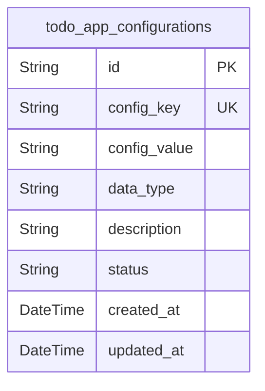
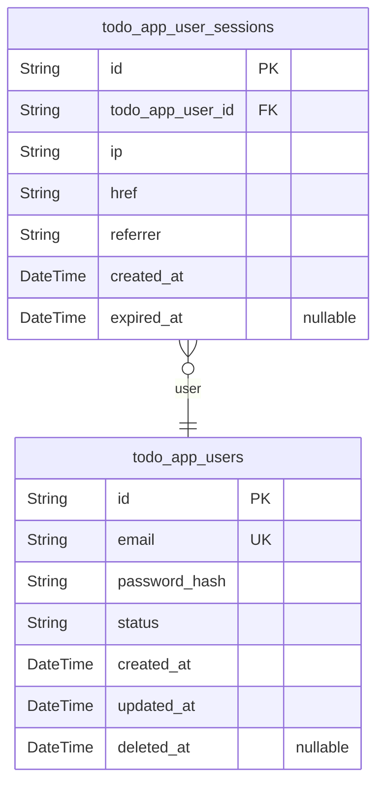
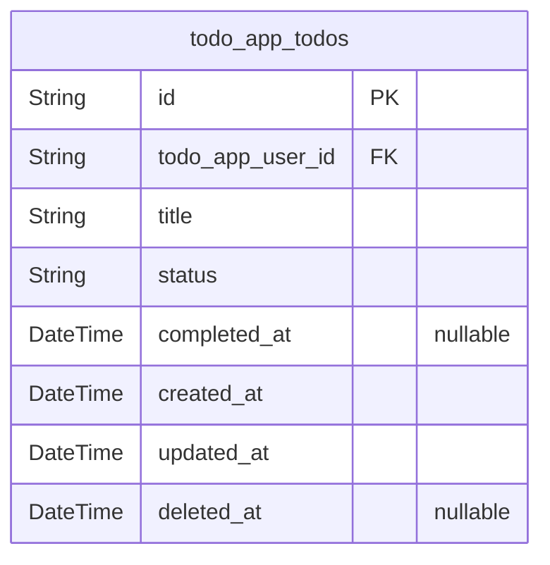

# Prisma Markdown

> Generated by [`prisma-markdown`](https://github.com/samchon/prisma-markdown)

- [Systematic](#systematic)
- [Actors](#actors)
- [Todos](#todos)

## Systematic

### `todo_app_configurations`

System-wide application configuration settings for the Todo application.
Stores key-value pairs for various application settings that can be
modified by system administrators. Configuration changes are tracked with
timestamps for audit purposes.

Properties as follows:

- `id`: Primary Key.
- `config_key`
  > Unique identifier for the configuration setting. Used to reference
  > specific configuration values throughout the application.
- `config_value`
  > The value associated with the configuration key. Stores configuration
  > data in string format that can be parsed based on the data_type field.
- `data_type`
  > The data type of the configuration value (e.g., 'string', 'boolean',
  > 'number', 'json'). Used for proper parsing and validation of
  > configuration values.
- `description`
  > Human-readable description of what this configuration setting controls
  > and how it affects application behavior.
- `status`
  > Current status of the configuration setting (e.g., 'active', 'disabled',
  > 'deprecated'). Controls whether the setting is currently in effect.
- `created_at`: Timestamp when the configuration setting was first created.
- `updated_at`: Timestamp when the configuration setting was last modified.

## Actors

### `todo_app_users`

User accounts for the Todo application. Each user represents an
individual who can create and manage their personal todo items. Users
authenticate with email and password to access their todo dashboard.
[todo_app_user_sessions.id](#todo_app_user_sessions)

Properties as follows:

- `id`: Primary Key.
- `email`
  > User's email address used for authentication and communication. Must be
  > unique across all users.
- `password_hash`
  > Securely hashed password for user authentication. Never stored in plain
  > text.
- `status`
  > Current status of the user account. Possible values: 'active',
  > 'inactive', 'suspended'.
- `created_at`: Timestamp when the user account was created.
- `updated_at`: Timestamp when the user account was last updated.
- `deleted_at`
  > Timestamp when the user account was soft deleted. Null if account is
  > active.

### `todo_app_user_sessions`

User session records for authentication tracking. Each session represents
an active login instance for a user. Used for audit tracing of user
actions and secure session management. [todo_app_users.id](#todo_app_users)

Properties as follows:

- `id`: Primary Key.
- `todo_app_user_id`: Belonged user's [todo_app_users.id](#todo_app_users).
- `ip`: IP address from which the session was established.
- `href`: Connection URL where the session was initiated.
- `referrer`: Referrer URL that directed the user to the application.
- `created_at`: Timestamp when the session was created.
- `expired_at`
  > Timestamp when the session expired or was terminated. Null if session is
  > still active.

## Todos

### `todo_app_todos`

Core todo items representing user tasks with status tracking and
lifecycle management. Each todo belongs to a specific user and supports
creation, completion, editing, and deletion workflows. Todos maintain
their creation order and support soft deletion for data recovery
capabilities.

Properties as follows:

- `id`: Primary Key.
- `todo_app_user_id`: Owner user's [todo_app_users.id](#todo_app_users).
- `title`
  > Todo item title/content. Validated for length (1-255 characters) and
  > content requirements.
- `status`
  > Current status of the todo item. Values: 'active' for pending tasks,
  > 'completed' for finished tasks.
- `completed_at`: Timestamp when the todo was marked as completed. Null for active todos.
- `created_at`: Timestamp when the todo was created.
- `updated_at`: Timestamp when the todo was last modified.
- `deleted_at`: Timestamp when the todo was soft deleted. Null for active todos.
