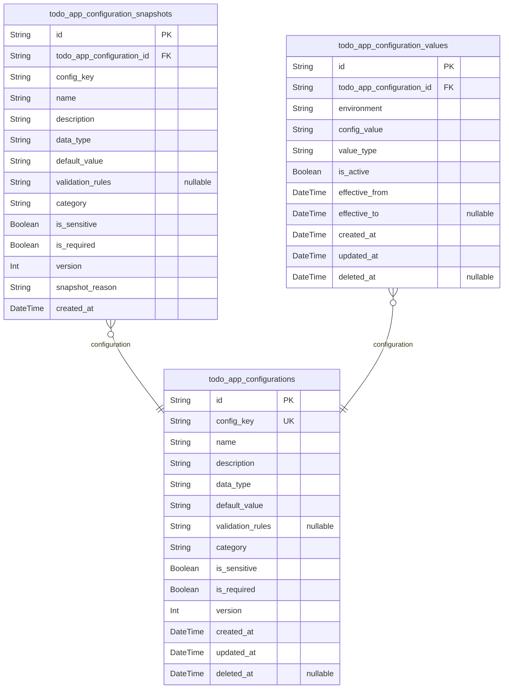
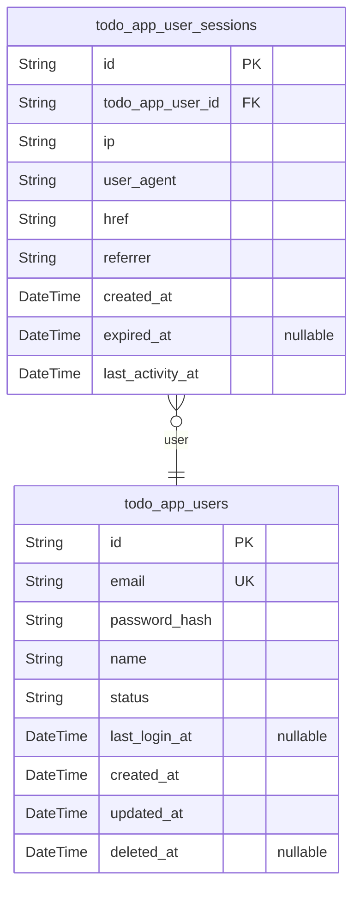
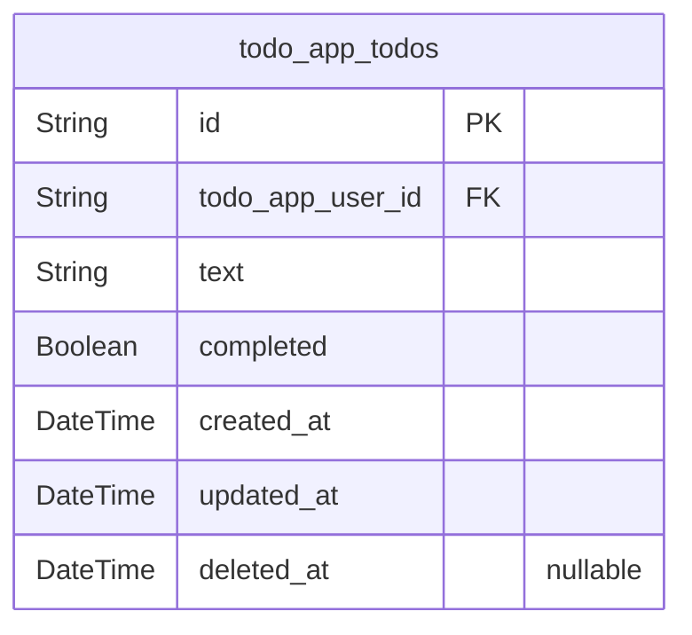
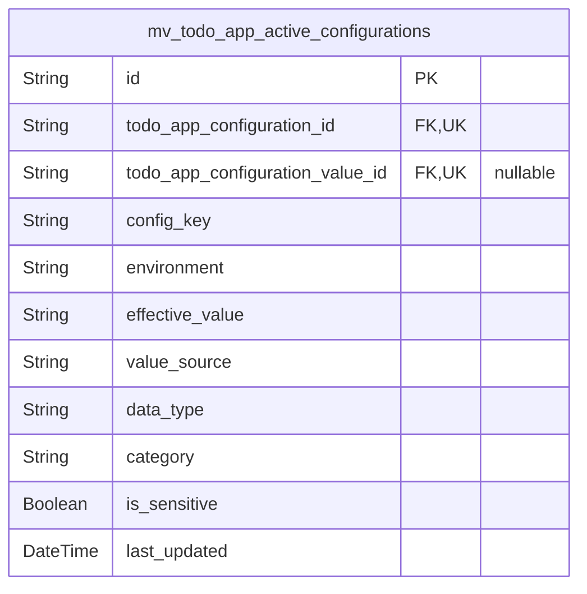

# Prisma Markdown

> Generated by [`prisma-markdown`](https://github.com/samchon/prisma-markdown)

- [Systematic](#systematic)
- [Actors](#actors)
- [Todos](#todos)
- [default](#default)

## Systematic

### `todo_app_configurations`

Core application configuration settings with version control and audit
trail support.

Stores the master configuration definitions including metadata,
validation rules, and default values. Each configuration entry represents
a configurable parameter that can be customized per environment while
maintaining a consistent definition structure.

Supports typed configuration values with proper validation, dependency
tracking, and hierarchical organization. Configuration changes are
tracked through snapshots to maintain audit trails and enable rollback
capabilities.

The table enforces data integrity through unique constraints and supports
flexible configuration management for multi-environment deployments.

Properties as follows:

- `id`: Primary Key.
- `config_key`
  > Unique configuration key identifier following naming convention:
  > 'category.subcategory.setting'. Must be lowercase with underscores.
- `name`: Human-readable display name for the configuration setting.
- `description`
  > Detailed description explaining the purpose, usage, and impact of this
  > configuration.
- `data_type`
  > Expected data type for configuration values: 'boolean', 'number',
  > 'string', 'json', 'array', 'object'.
- `default_value`
  > Default configuration value that applies when no environment-specific
  > value is set.
- `validation_rules`: JSON string containing validation constraints for the configuration value.
- `category`
  > Configuration category for organizational grouping (e.g., 'security',
  > 'performance', 'ui').
- `is_sensitive`
  > Indicates whether this configuration contains sensitive information that
  > requires encryption.
- `is_required`: Whether this configuration must have a value set in all environments.
- `version`: Configuration version number for tracking schema changes.
- `created_at`: Timestamp when this configuration definition was created.
- `updated_at`: Timestamp when this configuration definition was last modified.
- `deleted_at`: Timestamp when this configuration was soft-deleted, allowing for recovery.

### `todo_app_configuration_snapshots`

Historical snapshots of configuration changes for audit trails and
version control.

Captures point-in-time states of configuration definitions whenever
changes are made. Each snapshot represents a complete configuration
definition at a specific moment, enabling rollback capabilities and
change tracking.

Used for compliance auditing, troubleshooting configuration-related
issues, and understanding the evolution of application settings over
time. Snapshots are append-only and never modified after creation.

Maintains referential integrity with the main configuration table while
providing independent historical records for analysis and reporting.

Properties as follows:

- `id`: Primary Key.
- `todo_app_configuration_id`
  > Reference to the configuration definition being snapshotted. {@link
  > todo_app_configurations.id}
- `config_key`: Configuration key at the time of snapshot creation.
- `name`: Configuration display name at snapshot time.
- `description`: Configuration description at snapshot time.
- `data_type`: Data type definition at snapshot time.
- `default_value`: Default value at snapshot time.
- `validation_rules`: Validation rules at snapshot time.
- `category`: Configuration category at snapshot time.
- `is_sensitive`: Sensitivity flag at snapshot time.
- `is_required`: Required flag at snapshot time.
- `version`: Configuration version at snapshot time.
- `snapshot_reason`
  > Reason for creating this snapshot (e.g., 'version_update', 'bug_fix',
  > 'compliance').
- `created_at`: Timestamp when this snapshot was created.

### `todo_app_configuration_values`

Environment-specific configuration values that override default settings.

Stores actual configuration values for specific deployment environments
(development, staging, production). Each value entry links to a
configuration definition and provides the environment-specific
implementation of that setting.

Supports value versioning and audit trails for environment-specific
configurations. Values can be set, modified, or deleted independently per
environment while maintaining referential integrity with the master
configuration definitions.

Enables flexible configuration management across multiple deployment
environments with proper isolation and change tracking.

Properties as follows:

- `id`: Primary Key.
- `todo_app_configuration_id`
  > Reference to the configuration definition. {@link
  > todo_app_configurations.id}
- `environment`
  > Deployment environment for this configuration value (e.g., 'development',
  > 'staging', 'production').
- `config_value`: Environment-specific configuration value that overrides the default.
- `value_type`: Type of the stored value for validation purposes.
- `is_active`: Indicates whether this environment-specific value is currently active.
- `effective_from`: Timestamp when this configuration value becomes effective.
- `effective_to`: Timestamp when this configuration value expires (null for indefinite).
- `created_at`: Timestamp when this configuration value was created.
- `updated_at`: Timestamp when this configuration value was last modified.
- `deleted_at`: Timestamp when this configuration value was soft-deleted.

## Actors

### `todo_app_users`

User accounts for the Todo application.

Stores user authentication information, profile data, and account status
for individuals managing their personal todo lists. Each user has a
unique email address and secure password authentication, along with a
display name for personalization.

Users can create, read, update, and delete their own todo items while
maintaining complete data isolation from other users. The system supports
user verification workflows, account status management, and activity
tracking through last login timestamps.

User accounts support soft deletion for data recovery scenarios while
maintaining comprehensive audit trails of account lifecycle events and
authentication activities.

Properties as follows:

- `id`: Primary Key.
- `email`: User's unique email address used for authentication and communication.
- `password_hash`
  > Securely hashed password for user authentication using industry-standard
  > algorithms.
- `name`
  > User's display name for personalization and identification in the
  > application.
- `status`
  > Current user account status. Valid business values: active, suspended,
  > verified, pending_verification, locked.
- `last_login_at`
  > Timestamp of the user's most recent successful login for activity
  > tracking.
- `created_at`: Timestamp when the user account was created.
- `updated_at`: Timestamp when the user account was last updated.
- `deleted_at`: Timestamp when the user account was soft deleted, if applicable.

### `todo_app_user_sessions`

User session records for authentication tracking and security management.

Stores active user sessions for secure access to the Todo application.
Each session represents an authenticated connection from a user's device,
containing comprehensive connection context information for audit and
security purposes.

Sessions are automatically created during successful login and track
connection details including IP address, user agent, and referrer
information. The system maintains session state securely and validates
authentication tokens on each API request.

Sessions require independent management capabilities including search
across all users, expiration tracking, and security monitoring. Users and
administrators need to view and manage active sessions for security
compliance.

Properties as follows:

- `id`: Primary Key.
- `todo_app_user_id`: Belonged user's [todo_app_users.id](#todo_app_users).
- `ip`
  > IP address of the connection that created this session for security
  > tracking.
- `user_agent`
  > User agent string identifying the device and browser used for this
  > session.
- `href`: Connection URL where the session was established.
- `referrer`: Referrer URL that directed the user to the application.
- `created_at`: Timestamp when the session was created.
- `expired_at`: Timestamp when the session expired or was terminated.
- `last_activity_at`
  > Timestamp of the most recent activity in this session for timeout
  > tracking.

## Todos

### `todo_app_todos`

Core todo items created and managed by authenticated users.

Stores individual todo tasks with text descriptions and completion status
tracking.
Each todo belongs to exactly one user and maintains creation and
modification timestamps
for audit purposes. The design follows minimal principles with only
essential fields
required for basic todo functionality.

Todos support soft deletion through the deleted_at field while
maintaining data integrity
for historical tracking. The completion status allows users to track task
progress
without complex workflow management.

Properties as follows:

- `id`: Primary Key.
- `todo_app_user_id`: Owner user's identifier. [todo_app_users.id](#todo_app_users)
- `text`
  > Todo item description text. Must be between 1-500 characters as specified
  > in requirements.
- `completed`
  > Completion status indicating whether the todo item is finished. Defaults
  > to false (incomplete).
- `created_at`: Timestamp when the todo item was originally created.
- `updated_at`: Timestamp when the todo item was last modified.
- `deleted_at`: Timestamp when the todo item was soft deleted. Null indicates active item.

## default

### `mv_todo_app_active_configurations`

Materialized view showing currently active configuration values across
all environments.

Pre-computed view that combines configuration definitions with their
active environment-specific values. Provides fast access to the complete
configuration state without complex joins and filtering logic.

Used by application components that need to quickly access the current
configuration settings. The view is refreshed periodically to ensure
consistency with the underlying configuration tables.

Optimizes configuration lookup performance for high-frequency access
patterns in the application runtime.

Properties as follows:

- `id`: Primary Key.
- `todo_app_configuration_id`
  > Reference to the configuration definition. {@link
  > todo_app_configurations.id}
- `todo_app_configuration_value_id`
  > Reference to the active configuration value. {@link
  > todo_app_configuration_values.id}
- `config_key`: Configuration key identifier.
- `environment`: Deployment environment.
- `effective_value`: Currently active configuration value (environment-specific or default).
- `value_source`
  > Source of the value: 'environment' for specific values, 'default' for
  > fallback.
- `data_type`: Expected data type for validation.
- `category`: Configuration category for filtering.
- `is_sensitive`: Whether the value contains sensitive information.
- `last_updated`: Timestamp when this configuration was last updated.
