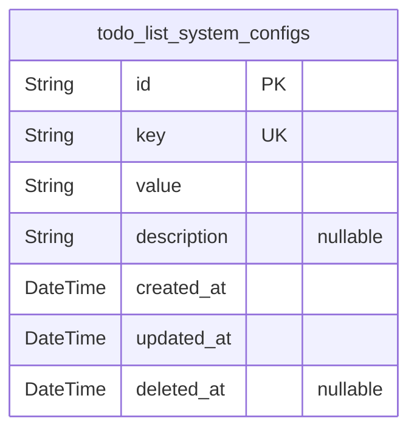
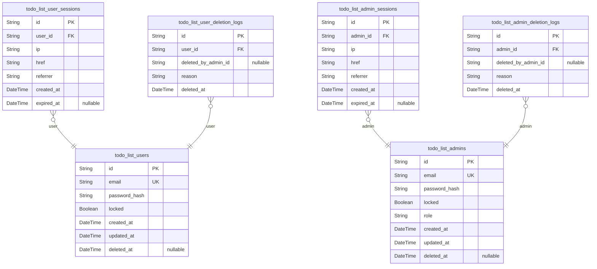
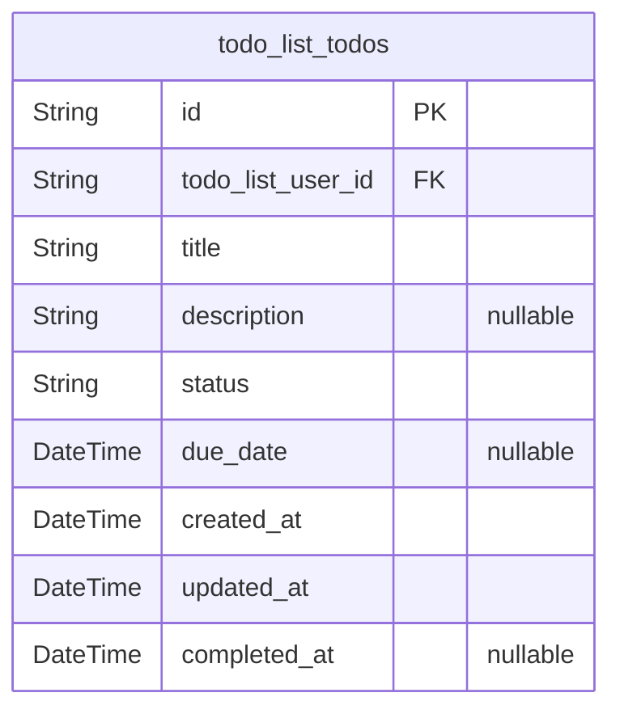
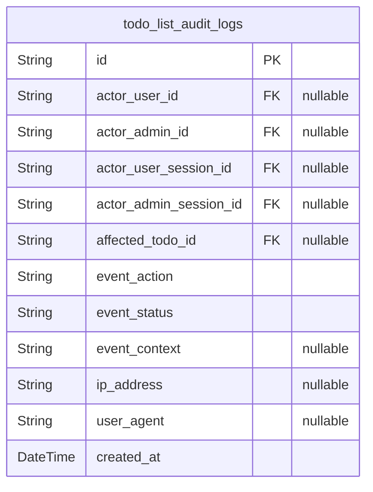

# Prisma Markdown

> Generated by [`prisma-markdown`](https://github.com/samchon/prisma-markdown)

- [Systematic](#systematic)
- [Actors](#actors)
- [Todos](#todos)
- [AuditLogs](#auditlogs)

## Systematic

### `todo_list_system_configs`

System-wide configuration and operational parameters for the Todo List
application.

This model stores key-value pairs representing global settings, feature
toggles, and core system options that govern application-level behavior.
Each configuration is uniquely identified by its key and may store
settings such as default timezone, maintenance flags, operational feature
gates, or reserved identifiers for system processes.

Configurations in this table are not user- or admin-specific—they apply
to the entire deployment and provide a foundation for evolving
operational requirements. All updates are tracked with timestamps, and
soft deletion is supported for historical audit and safe rotation of
system configuration elements.

Properties as follows:

- `id`: Primary Key for the system configuration record.
- `key`
  > Unique configuration key identifying the system setting. Examples include
  > 'default_timezone', 'feature_maintenance_mode', or other core options.
  > Must be unique within this table.
- `value`
  > Configuration value as a string. Can store serialized data for complex
  > options but typically represents a scalar system setting relevant to the
  > business or application.
- `description`
  > Optional detailed description of the purpose and business context for
  > this configuration entry. Useful for documenting intent and supporting
  > operational maintenance.
- `created_at`
  > Timestamp when the configuration entry was created. Used for audit
  > purposes and operational monitoring.
- `updated_at`
  > Timestamp of the last update to the configuration entry. Enables tracking
  > of modifications for audit and compliance.
- `deleted_at`
  > Timestamp indicating soft deletion of the configuration entry. Used for
  > operational safety and rollback capability.

## Actors

### `todo_list_users`

Represents registered, authenticated individual end users of the Todo
List service.

Each user can create, view, edit, complete, and delete only their own
todo items. Users are granted no visibility or control over any other
user's account or related data. This table also stores authentication
credentials, unique email address, locked status for moderation, and
timestamps for account lifecycle.

Audit requirements mandate that all status changes and deletion actions
are logged in subsidiary tables. Soft deletion is achieved through the
deleted_at column.

Properties as follows:

- `id`: Primary Key.
- `email`
  > Unique email address of the user. Used for login and system
  > notifications. Must be unique across all users.
- `password_hash`: Password hash for secure authentication. Never stores plaintext passwords.
- `locked`
  > Account lock status. True if the user is suspended or blocked by admin
  > for policy or security reasons.
- `created_at`: Timestamp when the user account was created.
- `updated_at`: Timestamp for the most recent update to the user profile or credentials.
- `deleted_at`: Timestamp when the user was soft-deleted. Null if active.

### `todo_list_user_sessions`

Tracks active and expired authentication sessions for regular users.

Each session records the user ID, connection details, session creation,
and expiration times. Enables audit trails of user activity, tracing
access for security, compliance, and privacy enforcement. Sessions are
subsidiary and always reference their user owner. No password/token
fields are stored here; sessions solely track connection context and
lifecycle.

Properties as follows:

- `id`: Primary Key.
- `user_id`: References the associated user. [todo_list_users.id](#todo_list_users).
- `ip`: IP address from which the session was established.
- `href`: Connection URL or client origin.
- `referrer`: Referrer URL, if any, for the client establishing the session.
- `created_at`: Session creation timestamp.
- `expired_at`: Timestamp when the session ended or was invalidated.

### `todo_list_user_deletion_logs`

Logs events when user accounts are deleted for audit, compliance, or
privacy purposes.

Captures the user deleted, time of action, reason (e.g., GDPR, user
request, admin action), and administrative actor if applicable. Used for
traceability, regulatory audits, and troubleshooting account lifecycle
events. Deletion logs are managed solely by system or admin workflows –
users do not interact with this table directly.

Properties as follows:

- `id`: Primary Key.
- `user_id`: User who was deleted. [todo_list_users.id](#todo_list_users).
- `deleted_by_admin_id`
  > ID of the admin who performed the account deletion. Null if self-deleted.
  > Used for audit when admin initiated.
- `reason`: Reason for deletion (GDPR, user request, admin suspension, etc).
- `deleted_at`: Timestamp when the deletion event occurred.

### `todo_list_admins`

Represents administrators with privileged access to system oversight,
user management, and moderation.

Admins can view and manage users and any todo in the system, and can
impose status/actions such as account locking or deletion for compliance
or support. Authentication credentials, unique email, role flags,
lifecycle timestamps, and soft deletion status are included. Only
privileged personnel are represented; regular users are never present in
this table.

Properties as follows:

- `id`: Primary Key.
- `email`
  > Unique email address of the admin for login and notification. Must not
  > overlap normal users.
- `password_hash`
  > Hashed password for secure admin authentication. Plain passwords are
  > never retained.
- `locked`
  > Admin account lock status. True if administrator is currently suspended
  > from system use.
- `role`
  > Administrative role or privilege class (e.g., superadmin, moderator).
  > Determines access boundaries within admin workflows.
- `created_at`: Account creation timestamp.
- `updated_at`: Time of last admin profile or credential update.
- `deleted_at`: Soft deletion timestamp for the admin account. Null if admin is active.

### `todo_list_admin_sessions`

Tracks each login session for administrators, providing traceability for
privileged access and sensitive actions.

Each record ties to an admin account and logs session metadata including
connection IP, access URL, referrer, and timestamps. Sessions support
compliance, intrusion detection, and accountability. This table never
stores authentication secrets, only session lifecycle information.

Properties as follows:

- `id`: Primary Key.
- `admin_id`: References the admin who owns this session. [todo_list_admins.id](#todo_list_admins).
- `ip`: IP address of the admin's session origin.
- `href`: Access URL or service endpoint for this session.
- `referrer`: Client's referrer for this session connection.
- `created_at`: Timestamp when the admin session began.
- `expired_at`: Time when the admin session was closed or expired.

### `todo_list_admin_deletion_logs`

Records administrative account deletions for audit fulfillment and policy
compliance.

Contains deletion event data: admin whose account was deleted, actor
executing the deletion (if different), reason code or explanation, and
timestamp. Supports forensic review, compliance, and user/account
lifecycle transparency. Entries are generated by system or superadmin
operations; never directly manipulated by standard admins.

Properties as follows:

- `id`: Primary Key.
- `admin_id`: Admin whose account was deleted. [todo_list_admins.id](#todo_list_admins).
- `deleted_by_admin_id`
  > ID of the higher privilege admin who performed this deletion, if any.
  > Null if self-deleted.
- `reason`: Narrative or code for the account deletion cause.
- `deleted_at`: Timestamp the account was deleted.

## Todos

### `todo_list_todos`

Business entity representing an individual todo item belonging to a
single end-user.

Each row records one actionable task with immutable ownership. Enforces
all business rules for title, description, and allowed state transitions
(pending, completed, archived). Tracks timestamps for creation, last
update, and optional completion. Title validation enforced at creation
and update. Foreign key to the user table ensures todos are always
associated with a valid owner, but remain private to that user unless
reviewed by an admin.

Supports efficient per-user queries and batch actions within the user's
scope. No group, tag, or collaborative features are present. Hard
deletion applies per requirements. State management compliant with audit
and admin access handled via external tables.

Properties as follows:

- `id`: Primary Key. Uniquely identifies each todo item.
- `todo_list_user_id`
  > Foreign Key. References the owning user. Must reference an existing user.
  > [todo_list_users.id](#todo_list_users).
- `title`
  > Todo title. Required for creation and update. 1–100 characters, validated
  > for non-whitespace content.
- `description`
  > Optional todo description. Maximum 1000 characters. Can be omitted or set
  > to null on creation/update.
- `status`
  > Todo status: permitted values are 'pending', 'completed', or 'archived'.
  > Enforces business lifecycle transitions.
- `due_date`
  > Optional due date in ISO 8601 format. Null if not set. Must not be in the
  > past for creation/update.
- `created_at`
  > Timestamp for when the todo item was created (stored as UTC). Required
  > for data lifecycle and ordering.
- `updated_at`
  > Timestamp for the last time this todo was updated. Maintains user and
  > admin accountability.
- `completed_at`
  > Optional timestamp for when the todo was marked as completed. Null unless
  > status is 'completed'.

## AuditLogs

### `todo_list_audit_logs`

Audit log of security-relevant, admin, and business actions across the
todo system.

This table records every important operation or event that impacts system
security, user privacy, admin oversight, or compliance requirements. Log
entries are immutably written for each actionable event: todo
create/edit/delete, user/admin login/logout, permission checks, admin
moderation, authentication failures, and any sensitive business action.

Each entry references the acting entity (user or admin), affected todo
(if applicable), session, and includes rich event and context metadata
for compliance, investigations, and business monitoring. The log supports
traceability, operational monitoring, security audits, and legal
reporting. Entries are never deleted or updated: append-only, supporting
strict historical query and forensics.

Properties as follows:

- `id`
  > Primary key for the audit log entry. Globally unique identifier assigned
  > at insertion, ensuring each record is immutable and traceable.
- `actor_user_id`
  > References the user who performed the action, if a user initiated this
  > event. Nullable; use actor_admin_id for admin actions. {@link
  > todo_list_users.id}.
- `actor_admin_id`
  > References the admin who performed the action, if admin initiated.
  > Nullable; use actor_user_id for user-initiated events. {@link
  > todo_list_admins.id}.
- `actor_user_session_id`
  > References the user session tied to the action, if event is linked to a
  > user session. Nullable. [todo_list_user_sessions.id](#todo_list_user_sessions).
- `actor_admin_session_id`
  > References the admin session if the action was performed during an admin
  > session. Nullable. [todo_list_admin_sessions.id](#todo_list_admin_sessions).
- `affected_todo_id`
  > References a specific todo if the action/event affects a todo. Nullable
  > for global/auth events not linked to a todo. [todo_list_todos.id](#todo_list_todos).
- `event_action`
  > Describes the action taken or event type (e.g., 'todo_create',
  > 'todo_edit', 'user_login', 'admin_lock_user', 'permission_denied').
  > Application-defined event type for robust filtering and analytics.
- `event_status`
  > Result status of the event ('success', 'failure', 'denied', etc). Enables
  > filtering audit logs by outcome and error/failure reporting in compliance
  > reviews.
- `event_context`
  > Free-form context data (JSON or string) capturing additional
  > details—affected columns, before/after state, request metadata, error
  > codes. Used for deep auditing, investigation, or legal review. Can be
  > null if event has no extra context.
- `ip_address`
  > IP address of the actor/session generating the event, if available.
  > Nullable.
- `user_agent`
  > User agent string (browser/app version) from HTTP request, if captured.
  > Nullable. Supports threat analysis and anomaly detection.
- `created_at`
  > Timestamp (UTC) when the audit event was logged. Immutable and required
  > for all records. Used for temporal queries, trending, and compliance
  > timelines.
