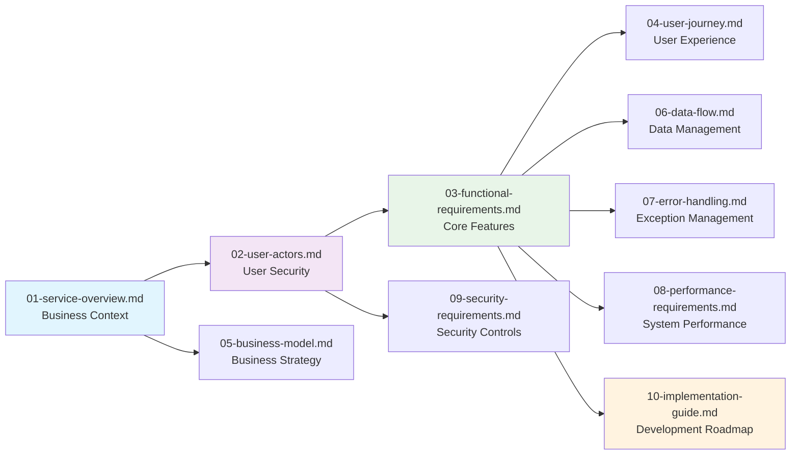

# Todo Application Documentation Suite

## Project Overview

The Todo Application is a minimal, user-friendly task management system designed to help individuals organize their daily activities efficiently. This documentation suite provides comprehensive guidance for developing a production-ready Todo application that meets modern user expectations while maintaining simplicity and ease of use.

## Documentation Structure

This documentation suite is organized into a logical sequence that guides stakeholders from high-level business requirements through detailed technical specifications. Each document serves a specific purpose in the development lifecycle.

### Document Navigation Guide

| Document | Purpose | Primary Audience | Key Focus Areas |
|----------|---------|-----------------|-----------------|
| [Service Overview](./01-service-overview.md) | Defines business purpose and value proposition | Business stakeholders | Business objectives, market positioning, success metrics |
| [User Actors and Authentication](./02-user-actors.md) | Specifies user roles and security requirements | Development team | Authentication flows, permission matrices, security controls |
| [Functional Requirements](./03-functional-requirements.md) | Details core application features and behavior | Development team | Business logic, user interactions, system behavior |
| [User Journey Flows](./04-user-journey.md) | Documents user interaction patterns | Product managers | Workflow diagrams, user scenarios, navigation patterns |
| [Business Model](./05-business-model.md) | Defines operational and financial strategy | Business stakeholders | Revenue model, cost structure, growth planning |
| [Data Flow Requirements](./06-data-flow.md) | Specifies data management patterns | Development team | Data lifecycle, storage requirements, access patterns |
| [Error Handling Specifications](./07-error-handling.md) | Documents exception management | Development team | Error scenarios, recovery flows, user messaging |
| [Performance Requirements](./08-performance-requirements.md) | Defines system performance expectations | Development team | Response times, scalability, availability targets |
| [Security Requirements](./09-security-requirements.md) | Specifies security and compliance needs | Development team | Data protection, access controls, audit requirements |
| [Implementation Guide](./10-implementation-guide.md) | Provides development roadmap | Development team | Development priorities, timeline, testing strategy |

## Document Relationships

The documents follow a logical progression from business requirements to technical implementation:

## Recommended Reading Order

For optimal understanding, stakeholders should follow this reading sequence:

1. **Business Stakeholders**: Start with [Service Overview](./01-service-overview.md) and [Business Model](./05-business-model.md) to understand the business context
2. **Product Managers**: Focus on [User Journey Flows](./04-user-journey.md) and [Functional Requirements](./03-functional-requirements.md) for feature planning
3. **Development Team**: Begin with [User Actors](./02-user-actors.md), then proceed to [Functional Requirements](./03-functional-requirements.md), followed by technical specifications
4. **Technical Leads**: Review all documents sequentially to understand the complete system architecture

## Document Access and Updates

All documents are maintained in the project repository and should be referenced using the relative paths provided. Documents are version-controlled and updated throughout the development lifecycle to reflect changes in requirements and implementation decisions.

## Document Maintenance

This table of contents will be updated as new documents are added or existing documents are modified. Stakeholders should refer to this document for the most current documentation structure and navigation guidance.

### Document Version Control

**WHEN** a document is updated, **THE** system **SHALL** maintain version history with change tracking.

**WHERE** document changes affect other documents, **THE** system **SHALL** update cross-references and maintain consistency.

**WHILE** documents are being developed, **THE** system **SHALL** provide clear status indicators for document completeness.

### Document Quality Assurance

**THE** documentation suite **SHALL** maintain consistent formatting and terminology across all documents.

**WHEN** inconsistencies are identified, **THE** system **SHALL** provide mechanisms for rapid correction and synchronization.

**IF** document quality falls below established standards, **THEN THE** system **SHALL** trigger review and enhancement processes.

## Stakeholder Responsibilities

### Business Stakeholders
- Review and approve business requirements documents
- Provide input on business model and success criteria
- Validate that documentation aligns with business objectives

### Product Managers
- Ensure user journey flows reflect actual user needs
- Validate functional requirements against user expectations
- Provide feedback on implementation priorities

### Development Team
- Review technical specifications for feasibility
- Provide input on implementation complexity
- Validate that requirements are technically achievable

### Quality Assurance Team
- Review documentation for testability
- Ensure requirements are measurable and verifiable
- Validate that error handling scenarios are comprehensive

## Documentation Standards

### Content Quality Requirements

**ALL** documents **SHALL** meet the following quality standards:
- Clear, concise language appropriate for the target audience
- Consistent terminology and definitions across the documentation suite
- Comprehensive coverage of required topics
- Proper formatting and structure for easy navigation

### Technical Documentation Requirements

**WHEN** creating technical documents, **THE** authors **SHALL**:
- Use EARS format for all requirements specifications
- Include appropriate diagrams and visualizations
- Provide clear examples and scenarios
- Maintain separation between business requirements and technical implementation

### Business Documentation Requirements

**WHEN** creating business documents, **THE** authors **SHALL**:
- Focus on business value and user benefits
- Avoid technical implementation details
- Provide measurable success criteria
- Include realistic business scenarios

## Documentation Review Process

### Review Cycles

**THE** documentation suite **SHALL** undergo regular review cycles to ensure accuracy and completeness.

**WHEN** significant changes occur in project requirements, **THE** system **SHALL** trigger documentation updates.

**WHERE** inconsistencies are identified during reviews, **THE** system **SHALL** prioritize correction based on impact.

### Change Management

**WHEN** documenting changes to the application, **THE** system **SHALL**:
- Update affected documents simultaneously
- Maintain change logs for audit purposes
- Notify stakeholders of significant changes
- Ensure backward compatibility where required

## Success Criteria for Documentation

### Documentation Completeness

**THE** documentation suite **SHALL** be considered complete when:
- All required documents are present and up-to-date
- Cross-references between documents are accurate
- Stakeholders can answer key questions from documentation
- Development team can proceed with implementation

### Documentation Quality Metrics

**THE** system **SHALL** measure documentation quality using:
- Stakeholder satisfaction scores
- Development team comprehension rates
- Reduction in clarification requests
- Implementation accuracy metrics

## Future Documentation Planning

### Scalability Considerations

**WHERE** the application evolves beyond minimal functionality, **THE** documentation suite **SHALL**:
- Accommodate new feature documentation
- Maintain consistency with existing documentation
- Provide clear migration paths for documentation updates

### Enhancement Roadmap

**THE** documentation **SHALL** support future enhancements including:
- Additional user roles and permissions
- Advanced todo management features
- Integration with external systems
- Mobile application development

> *Developer Note: This document defines **business requirements only**. All technical implementations (architecture, APIs, database design, etc.) are at the discretion of the development team.*