# Todo Application Requirements Analysis Report

## Executive Summary

This document provides comprehensive business requirements for a minimal Todo list application designed for individual task management. The application focuses on essential functionality while maintaining simplicity and user-friendliness.

### Project Overview
The Todo application enables authenticated users to create, organize, and track personal tasks through a streamlined interface. The system provides core task management capabilities without unnecessary complexity, aligning with the principle of "minimum viable functionality."

### Business Justification
This application addresses the fundamental human need for organized task management by providing a digital solution that replaces traditional paper-based systems. The value proposition lies in accessibility, persistence, and organization capabilities that physical systems cannot provide.

## Documentation Structure

### Quick Navigation Guide

**For Business Stakeholders:**
- Start with [Service Overview](./01-service-overview.md) for business context
- Review [User Journey Documentation](./04-user-journey.md) for user experience flows

**For Developers:**
- Begin with [Functional Requirements](./03-functional-requirements.md) for system behavior
- Reference [User Actors Specification](./02-user-actors.md) for authentication details
- Consult [Business Rules](./05-business-rules.md) for validation logic

**For Quality Assurance:**
- Use [Testing Strategy](./09-testing-strategy.md) for acceptance criteria
- Reference [Non-Functional Requirements](./06-non-functional-requirements.md) for performance standards

### Document Relationships

```mermaid
graph LR
    A["00-toc.md<br/>Table of Contents"] --> B["01-service-overview.md<br/>Business Context"]
    B --> C["02-user-actors.md<br/>Authentication"]
    C --> D["03-functional-requirements.md<br/>System Behavior"]
    D --> E["04-user-journey.md<br/>User Flows"]
    E --> F["05-business-rules.md<br/>Validation Logic"]
    F --> G["06-non-functional-requirements.md<br/>Performance"]
    G --> H["07-data-management.md<br/>Data Lifecycle"]
    H --> I["08-integration-requirements.md<br/>External Systems"]
    I --> J["09-testing-strategy.md<br/>Quality Assurance"]
    J --> K["10-implementation-guidelines.md<br/>Deployment"]
```

## Document Summaries

### [Service Overview](./01-service-overview.md)
Defines the business purpose, value proposition, and strategic goals of the Todo application. Establishes why the application exists and what problems it solves for users.

### [User Actors Specification](./02-user-actors.md)
Specifies all user types, their permissions, and the complete authentication system architecture using JWT tokens.

### [Functional Requirements](./03-functional-requirements.md)
Documents the complete functional requirements using natural language specifications and EARS format for clarity.

### [User Journey Documentation](./04-user-journey.md)
Describes how users interact with the system from registration through task management, including error scenarios.

### [Business Rules](./05-business-rules.md)
Defines the validation rules, constraints, and business logic that govern system behavior.

### [Non-Functional Requirements](./06-non-functional-requirements.md)
Specifies performance, security, scalability, and usability requirements for the application.

### [Data Management Specifications](./07-data-management.md)
Documents data types, lifecycle management, storage requirements, and privacy considerations.

### [Integration Requirements](./08-integration-requirements.md)
Defines external service interactions and data exchange patterns.

### [Testing Strategy](./09-testing-strategy.md)
Provides testing approach, acceptance criteria, and quality assurance standards.

### [Implementation Guidelines](./10-implementation-guidelines.md)
Offers implementation approach, deployment considerations, and operational requirements.

## Revision History

| Version | Date | Changes | Author |
|---------|------|---------|--------|
| 1.0 | 2025-10-31 | Initial requirements specification | AutoBE Analysis Agent |

## Key Principles

### Minimal Functionality Focus
The application adheres to the principle of providing only essential features required for effective task management:
- User authentication and session management
- Basic Todo CRUD operations (Create, Read, Update, Delete)
- Task status tracking (active/completed)
- Simple organization and filtering

### User-Centric Design
All requirements prioritize user experience through:
- Intuitive task management workflows
- Clear visual status indicators
- Immediate feedback for user actions
- Error prevention and recovery mechanisms

### Scalability Considerations
While focusing on minimal functionality, the architecture supports:
- Future feature enhancements
- User base growth
- Performance optimization opportunities

## Complete Document Structure Overview

### Core Business Documentation

**Service Overview Document**
- Business problem statement and market gap analysis
- Target user segments and value proposition
- Business objectives and success metrics
- Competitive differentiation strategy

**User Actors Specification**
- Complete authentication system design
- User permission matrices for all operations
- JWT token management and security protocols
- Session lifecycle management requirements

**Functional Requirements**
- Complete todo management workflows using EARS format
- User interface requirements from business perspective
- Data validation rules and business logic specifications
- Error handling scenarios and recovery processes

**User Journey Documentation**
- End-to-end user interaction flows
- Registration, todo creation, completion workflows
- Error recovery and alternative user paths
- Performance and usability expectations

### Technical Foundation Documentation

**Business Rules Document**
- Data validation constraints and business logic
- State transition rules and workflow restrictions
- Permission-based access control specifications
- Exception handling policies and error codes

**Non-Functional Requirements**
- Performance standards and response time expectations
- Security specifications and compliance requirements
- Scalability targets and infrastructure planning
- Reliability standards and maintenance procedures

**Data Management Specifications**
- Data lifecycle management and storage requirements
- Backup procedures and disaster recovery planning
- Privacy considerations and compliance requirements
- Data integrity and consistency rules

**Integration Requirements**
- External service interaction patterns
- API design principles and data exchange formats
- Error handling for integration failures
- Future enhancement roadmap

### Quality Assurance Documentation

**Testing Strategy**
- Comprehensive testing approach and methodology
- Acceptance criteria for all functional requirements
- Performance testing standards and load testing requirements
- Security testing protocols and quality assurance standards

**Implementation Guidelines**
- Development approach and deployment considerations
- Operational requirements and monitoring procedures
- Future enhancement roadmap and risk assessment
- Success criteria and performance metrics

## Navigation Best Practices

### For New Team Members
1. Start with the Service Overview to understand business context
2. Review User Actors Specification for authentication requirements
3. Study Functional Requirements for core system behavior
4. Reference Business Rules for validation logic
5. Consult Implementation Guidelines for technical approach

### For Specific Development Tasks
- **Authentication Development**: User Actors Specification + Business Rules
- **Todo Management Features**: Functional Requirements + User Journey
- **Performance Optimization**: Non-Functional Requirements + Testing Strategy
- **Data Management**: Data Management Specifications + Integration Requirements

### For Quality Assurance
- **Test Case Development**: Testing Strategy + Functional Requirements
- **Performance Testing**: Non-Functional Requirements + Implementation Guidelines
- **Security Testing**: User Actors Specification + Business Rules

## Document Maintenance Procedures

### Version Control
- All documents follow semantic versioning
- Changes tracked in revision history tables
- Cross-document references updated during modifications

### Update Workflow
1. Document changes proposed with business justification
2. Technical review by development team
3. Quality assurance validation
4. Stakeholder approval before implementation

### Change Management
- Breaking changes require major version increments
- Backward compatibility maintained where possible
- Deprecation notices provided for removed features

## Success Metrics Tracking

### Business Success Indicators
- User adoption rates and retention metrics
- Task completion rates and user engagement
- System performance against defined standards
- User satisfaction scores and feedback

### Technical Performance Metrics
- Application uptime and availability statistics
- Response time measurements for key operations
- Error rates and system reliability metrics
- Security incident tracking and resolution

### Quality Assurance Metrics
- Test coverage percentages and defect density
- Performance benchmark achievements
- Security vulnerability resolution rates
- User acceptance testing success rates

This comprehensive table of contents provides the complete navigation framework for the Todo application requirements specification. Each document serves a specific purpose in the development lifecycle, ensuring that all stakeholders have access to the information they need to successfully deliver and maintain the application.

> *Developer Note: This document defines the complete documentation structure for the Todo application project. All technical implementations should reference the appropriate documentation sections for guidance.*