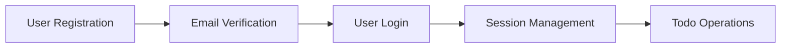
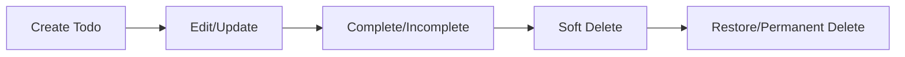

# Multi-User Todo Application Documentation

## Project Overview

This documentation provides comprehensive business requirements for a multi-user Todo application that enables individual users to manage their personal task lists with privacy, history tracking, and robust management capabilities.

### Documentation Purpose
The purpose of this documentation is to define the complete business requirements for backend developers to understand what needs to be built, why it's being built, and how it should function from a user perspective. This document focuses exclusively on business requirements and user workflows.

## Documentation Structure

The complete documentation is organized into the following logical sequence:

### 1. [Service Overview](./01-service-overview.md)
High-level business context including service vision, target user base, competitive landscape, and success metrics.

### 2. [User Actors and Authentication](./02-user-actors-authentication.md)
User actor definitions, authentication requirements, account management, and security considerations.

### 3. [Todo Creation and Management](./03-todo-creation-management.md)
Complete workflows for creating todos, required fields, validation rules, and basic viewing capabilities.

### 4. [Todo Completion and Editing](./04-todo-completion-editing.md)
Workflows for completing todos, editing capabilities, and comprehensive history tracking.

### 5. [Deletion and Trash Management](./05-deletion-trash-management.md)
Soft deletion processes, trash management, restoration workflows, and permanent deletion.

### 6. [Filtering and Sorting Capabilities](./06-filtering-sorting-capabilities.md)
Filtering options, sorting capabilities, and display logic for todo lists.

### 7. [Privacy and Data Isolation](./07-privacy-data-isolation.md)
Privacy guarantees, data isolation requirements, and access control mechanisms.

### 8. [Error Handling Scenarios](./08-error-handling-scenarios.md)
Error scenarios, validation failures, permission denials, and recovery processes.

### 9. [Performance Expectations](./09-performance-expectations.md)
Response time expectations, scalability requirements, and user experience standards.

### 10. [Business Rules and Validation](./10-business-rules-validation.md)
Field validation rules, business logic constraints, and data integrity requirements.

## User Actors Definition

The system supports a single authenticated user actor:

### Authenticated User
- **Description**: Individual users who manage their personal todo lists
- **Capabilities**: Full access to own todos, profile management, account operations
- **Limitations**: Cannot access other users' data or system administration functions

## Core System Requirements

### Authentication and Account Management
- User registration with email and password
- Secure login and session management
- Password change and account deletion capabilities

### Todo Management Features
- Create todos with title, description, start date, and due date
- View todo lists with pagination and detailed views
- Mark todos as complete/incomplete
- Edit todos with comprehensive history tracking

### Advanced Features
- Soft deletion with trash management
- Filtering by completion status
- Sorting by multiple criteria
- Edit history with detailed change tracking

## Business Logic Flow

The application follows these core workflows:

### User Registration and Authentication Flow

### Todo Lifecycle Management

### Data Privacy and Isolation
- Each user's data is completely isolated
- No sharing or viewing capabilities between users
- Private todo management with no public features

## Success Criteria

### User Experience Success Metrics
- Users can efficiently manage personal todo lists
- Todo creation and editing feels responsive and intuitive
- Privacy and data security are maintained
- Edit history provides valuable audit trail

### Business Success Metrics
- High user retention through reliable service
- Positive user feedback on privacy features
- Low error rates and system downtime
- Scalable architecture supporting growth

## Key Business Requirements

### Privacy-First Design
THE system SHALL ensure complete data isolation between users, with no capability for users to view or access other users' todos.

### Comprehensive History Tracking
WHEN a user edits any todo field, THE system SHALL record the complete change history including timestamp and specific field modifications.

### Flexible Todo Management
THE system SHALL support multiple filtering and sorting options to help users organize their todo lists effectively.

### Secure Account Management
THE system SHALL provide secure authentication and account management capabilities including password changes and account deletion.

> *Developer Note: This document defines **business requirements only**. All technical implementations (architecture, APIs, database design, etc.) are at the discretion of the development team.*