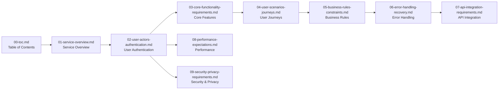

# Todo List Application Documentation

## Project Documentation Overview

This documentation suite provides complete business requirements and specifications for building a minimal Todo list application. The documentation follows a waterfall development approach, starting with high-level business objectives and progressing through detailed functional requirements, user scenarios, and operational constraints.

### Documentation Philosophy

This collection of documents represents a complete requirements analysis for a Todo list application with minimal functionality. The focus is exclusively on business requirements, user needs, and system behavior in natural language. All technical implementation decisions (architecture, APIs, database design, etc.) are left to the discretion of the development team.

## Document Structure

The documentation is organized into 10 sequential documents that build upon each other:

### Core Documentation Flow

## Complete Document List

### 1. [Service Overview Document](./01-service-overview.md)
- **Purpose**: High-level introduction to the Todo list application
- **Content**: Business justification, target audience, success metrics
- **Audience**: Business stakeholders and developers
- **Key Questions Answered**: Why this service exists, what problem it solves, who it's for

### 2. [User Actors and Authentication Requirements](./02-user-actors-authentication.md)
- **Purpose**: Define user roles, authentication, and permission structure
- **Content**: User actor definitions, authentication flows, permission matrix
- **Audience**: Development team
- **Key Questions Answered**: Who are the users, how do they authenticate, what permissions do they have

### 3. [Core Functionality Requirements](./03-core-functionality-requirements.md)
- **Purpose**: Define essential Todo list features for minimal viable product
- **Content**: Todo item management, list organization, status tracking, basic operations
- **Audience**: Development team
- **Key Questions Answered**: What are the core features, how should todos be managed

### 4. [User Scenarios and Journeys](./04-user-scenarios-journeys.md)
- **Purpose**: Describe typical user workflows and interaction patterns
- **Content**: User registration, todo creation workflow, management scenarios
- **Audience**: Product managers and developers
- **Key Questions Answered**: How users interact with the system, common workflows

### 5. [Business Rules and Constraints](./05-business-rules-constraints.md)
- **Purpose**: Define business logic, validation rules, and operational constraints
- **Content**: Data validation rules, business logic constraints, operational limits
- **Audience**: Development team
- **Key Questions Answered**: What rules govern todo operations, system constraints

### 6. [Error Handling and Recovery](./06-error-handling-recovery.md)
- **Purpose**: Specify error scenarios and user-friendly recovery processes
- **Content**: Authentication errors, data validation errors, user recovery flows
- **Audience**: Development team
- **Key Questions Answered**: What errors can occur, how should errors be communicated

### 7. [API Integration Requirements](./07-api-integration-requirements.md)
- **Purpose**: Define API interaction patterns and data exchange formats
- **Content**: API authentication flow, request/response patterns, integration scenarios
- **Audience**: Development team
- **Key Questions Answered**: How clients interact with the API, data formats used

### 8. [Performance Expectations](./08-performance-expectations.md)
- **Purpose**: Define performance requirements and user experience standards
- **Content**: Response time expectations, concurrent user support, availability requirements
- **Audience**: Development team and business stakeholders
- **Key Questions Answered**: How fast should the system respond, how many users should it support

### 9. [Security and Privacy Requirements](./09-security-privacy-requirements.md)
- **Purpose**: Define security measures and data protection requirements
- **Content**: Data protection requirements, authentication security, privacy considerations
- **Audience**: Development team
- **Key Questions Answered**: How user data is protected, what security measures are required

## Navigation Guide

### For Business Stakeholders
Start with the [Service Overview Document](./01-service-overview.md) to understand the business context, then proceed to [Performance Expectations](./08-performance-expectations.md) for operational requirements.

### For Product Managers
Begin with [User Scenarios and Journeys](./04-user-scenarios-journeys.md) to understand user workflows, then review [Core Functionality Requirements](./03-core-functionality-requirements.md) for feature specifications.

### For Development Teams
Start with [User Actors and Authentication](./02-user-actors-authentication.md) for technical foundation, then proceed sequentially through [Core Functionality Requirements](./03-core-functionality-requirements.md), [Business Rules](./05-business-rules-constraints.md), and [Error Handling](./06-error-handling-recovery.md).

### Documentation Reading Order
For comprehensive understanding, follow this reading sequence:

1. [Service Overview Document](./01-service-overview.md) - Business context
2. [User Actors and Authentication](./02-user-actors-authentication.md) - User foundation
3. [Core Functionality Requirements](./03-core-functionality-requirements.md) - Feature specifications
4. [User Scenarios and Journeys](./04-user-scenarios-journeys.md) - Usage patterns
5. [Business Rules and Constraints](./05-business-rules-constraints.md) - Operational logic
6. [Error Handling and Recovery](./06-error-handling-recovery.md) - Exception management
7. [API Integration Requirements](./07-api-integration-requirements.md) - Integration patterns
8. [Performance Expectations](./08-performance-expectations.md) - System performance
9. [Security and Privacy Requirements](./09-security-privacy-requirements.md) - Protection measures

## Document Relationships

### Sequential Dependencies
- Each document builds upon information from previous documents
- Authentication requirements inform core functionality design
- User scenarios validate business rules and constraints
- Performance expectations influence API integration patterns

### Cross-Reference Patterns
- Authentication requirements reference security considerations
- Core functionality informs both user scenarios and error handling
- Business rules impact both performance expectations and API design
- Error handling integrates with authentication and security requirements

### Integration Points
- User authentication flows connect with security requirements
- Core functionality specifications inform API design
- Business rules validate against user scenario expectations
- Performance requirements align with error handling capabilities

## Documentation Standards

All documents in this collection adhere to the following standards:

### Content Focus
- **Business Requirements Only**: Documents describe WHAT the system should do, not HOW to build it
- **Natural Language**: All requirements expressed in clear, unambiguous natural language
- **EARS Format**: Where applicable, requirements use Easy Approach to Requirements Syntax
- **User Perspective**: Focus on user needs and business value

### Technical Abstraction
- No API specifications or database schemas
- No frontend UI/UX requirements
- No technical architecture details
- Focus on business logic and user workflows

### Quality Standards
- Minimum 5,000 characters per technical document
- Comprehensive coverage of all business requirements
- Clear, actionable requirements for developers
- Professional formatting with proper Mermaid diagram syntax

## Document Maintenance

This documentation represents a complete requirements specification for the Todo list application. As the project evolves, documents should be updated to reflect:

- New business requirements
- Changed user scenarios
- Updated performance expectations
- Enhanced security considerations

All updates should maintain the business-focused, implementation-agnostic approach established in this documentation suite.

## Enhanced Business Requirements Summary

### Core User Needs Addressed
This Todo list application addresses fundamental user needs for simple, reliable task management:

**Primary User Benefits:**
- **Simplicity**: Clean, minimal interface without feature bloat
- **Reliability**: Consistent performance and data integrity
- **Accessibility**: Intuitive design requiring no training
- **Focus**: Distraction-free task management experience

**Business Value Proposition:**
The application fills a market gap for users who value minimalism over feature quantity, providing essential todo functionality without the complexity of comprehensive project management tools.

### Implementation Guidelines for Developers

**Authentication Implementation:**
- Implement JWT-based authentication with secure token management
- Ensure complete user data isolation and ownership validation
- Support multi-device session management with secure refresh tokens

**Core Functionality Requirements:**
- Provide complete CRUD operations for todo items
- Implement status tracking with pending/completed states
- Support basic filtering and search capabilities
- Ensure data persistence and synchronization across devices

**Performance Standards:**
- Maintain sub-second response times for core operations
- Support concurrent user access with scalable architecture
- Implement efficient data loading and pagination for large lists

**Security Considerations:**
- Encrypt sensitive data at rest and in transit
- Implement proper input validation and sanitization
- Follow security best practices for authentication and authorization

### Success Metrics

**User Engagement Targets:**
- Daily Active Users: 1,000+ users
- Monthly Retention Rate: 70%+ monthly retention
- Task Completion Rate: 60%+ of todos marked as completed

**System Performance Standards:**
- Availability: 99.5%+ uptime during business hours
- Response Time: < 500ms for core operations
- Scalability: Support for 1,000+ concurrent users

**Business Health Indicators:**
- User Satisfaction: 4.5+ star rating
- Support Volume: < 1 ticket per 100 users monthly
- Feature Adoption: 90%+ of users utilizing core features

## Future Evolution Considerations

While maintaining the core principle of minimalism, the application architecture should accommodate potential future enhancements:

**Possible Evolutionary Paths:**
- Enhanced collaboration features for team usage
- Cross-platform synchronization capabilities
- Intelligent todo suggestions based on usage patterns

**Growth Constraints:**
- Any new feature must solve a clear user pain point
- New features cannot compromise application simplicity
- Performance standards must be maintained with additions
- Significant user demand required for feature consideration

> *Developer Note: This document defines **business requirements only**. All technical implementations (architecture, APIs, database design, etc.) are at the discretion of the development team.*