**multiUserTodo — Actor definitions, permission matrix, authentication, session, account lifecycle**

Actor definitions, permission matrix, authentication, session, account lifecycle

# Actor Definitions

Define all user actor types with their roles and what they can do.

## guest Actor

Guest actors are unauthenticated users who can access public-facing features of the application. They can view the application's landing page and registration interface. Guests can initiate the account creation process by providing email and password information. They can access password recovery flows if they have forgotten their credentials. Guest actors cannot view any todo content or user profiles since these require authentication. Their capabilities are limited to account-related actions before authentication. Once authenticated, guests transition to member actors with full access to their private todo workspace.

### Unauthenticated Access and Public Features

### Public Feature Access

WHEN a guest actor accesses the application, THE system SHALL:
1. Provide access to the landing page without authentication
2. Display public information about the todo application
3. Allow navigation to registration and login interfaces
4. Present password recovery options for forgotten credentials

THE system SHALL NOT allow guest actors to:
1. View any user-specific todo content
2. Access user profiles or personal information
3. Perform any todo management operations
4. View or modify application settings

### Landing Page Access

WHEN a guest actor views the landing page, THE system SHALL:
1. Display application branding and purpose
2. Provide clear navigation to registration and login
3. Show password recovery options
4. Present application features and benefits

IF the guest actor attempts to access authenticated features, THE system SHALL redirect to the login interface.

### Registration Initiation and Account Creation Flow

### Registration Process Initiation

WHEN a guest actor initiates registration, THE system SHALL:
1. Present a registration form requiring email and password
2. Validate email format according to standard email conventions
3. Validate password meets security requirements
4. Provide clear feedback on validation errors

IF the guest actor provides invalid email format, THE system SHALL reject the registration attempt.
IF the guest actor provides weak password, THE system SHALL reject the registration attempt.

### Account Creation Flow

WHEN a guest actor submits valid registration information, THE system SHALL:
1. Create a new user account with the provided email and password
2. Set the user's display name to a default value (e.g., derived from email)
3. Transition the guest actor to authenticated member status
4. Redirect to the authenticated user dashboard

IF the email is already registered, THE system SHALL reject the registration attempt.
IF account creation fails due to system error, THE system SHALL notify the user and preserve form data.

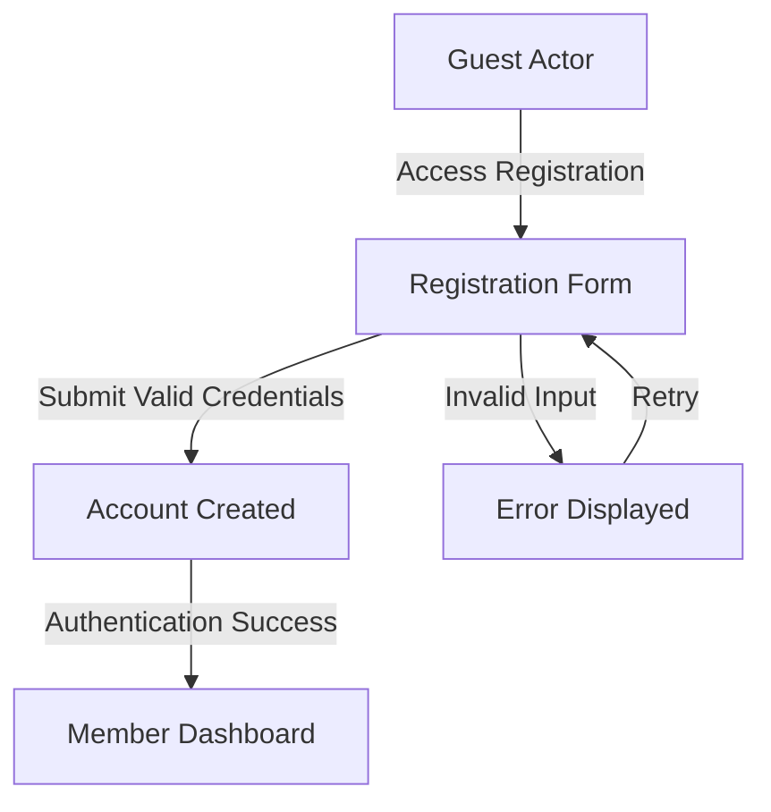

### Password Recovery and Pre-Authentication State

### Password Recovery Access

WHEN a guest actor accesses password recovery, THE system SHALL:
1. Provide a password reset request form
2. Require email address for account identification
3. Send password reset instructions to the provided email
4. Allow password reset completion via secure link

IF the provided email is not registered, THE system SHALL proceed without revealing account existence.
IF password reset link expires, THE system SHALL require new reset request.

### Pre-Authentication State Limitations

WHILE in pre-authentication state, THE system SHALL:
1. Restrict access to authenticated-only features
2. Maintain session state for registration flow continuity
3. Preserve form data during navigation between public pages
4. Clear all pre-authentication data upon successful login

THE system SHALL ensure that guest actors cannot:
1. Access any todo-related functionality
2. View other users' information
3. Perform actions requiring user identity
4. Bypass authentication through URL manipulation

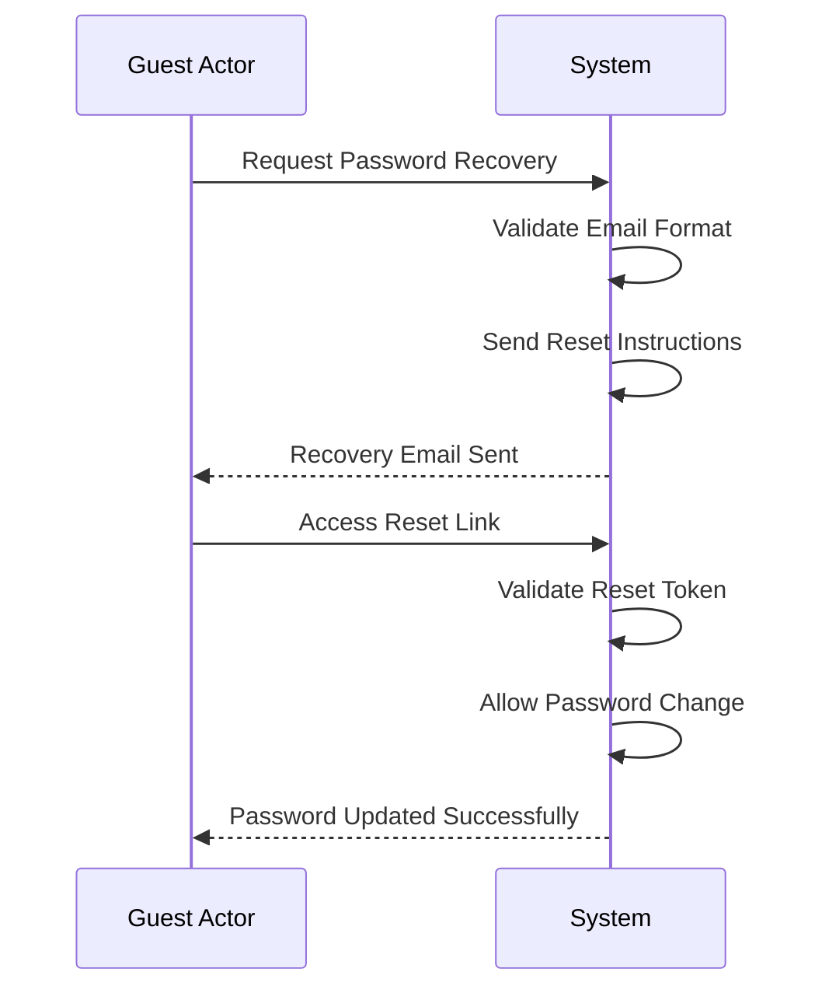

### Authentication Transition and State Management

### Authentication State Transition

WHEN a guest actor successfully authenticates, THE system SHALL:
1. Transition the actor from guest to member status
2. Grant access to all member-level features
3. Clear pre-authentication session data
4. Redirect to the authenticated user interface

WHEN a member actor logs out, THE system SHALL:
1. Transition the actor from member to guest status
2. Revoke access to member-level features
3. Clear all session data and authentication tokens
4. Redirect to the public landing page

### Pre-Authentication Data Persistence

WHILE a guest actor navigates public features, THE system SHALL:
1. Preserve registration form data during page navigation
2. Maintain password recovery state across interface transitions
3. Remember language and display preferences
4. Clear all persisted data upon authentication or session expiration

IF session expires during registration flow, THE system SHALL require restart of registration process.
IF browser navigation occurs, THE system SHALL attempt to preserve in-progress forms where possible.

## member Actor

Member actors are authenticated users who have full access to their private todo workspace. They can create new todos with required titles and optional descriptions, start dates, and due dates. Members can view, edit, and delete their own todos, with all edits recorded in the todo history. They can mark todos as complete or incomplete and filter their todo list by completion status. Members can sort their todos by creation date, start date, or due date in ascending or descending order. They have access to the trash system where they can restore deleted todos or permanently delete them. Members can manage their profile by updating their display name and changing their password. They can delete their account, which permanently removes all their todos and associated data.

### Member Authentication and Access

WHEN a user authenticates successfully, THE system SHALL grant member actor status.

THE system SHALL provide member actors with access to their private todo workspace.
WHILE authenticated as a member, THE system SHALL maintain session access to todo management features.
IF authentication expires or fails, THE system SHALL revoke member actor privileges.

THE system SHALL ensure that member actors can only access their own todos and profile data.
THE system SHALL prevent member actors from viewing or accessing other users' todos.

WHEN a member actor logs out, THE system SHALL terminate their session.
IF a member actor's account is deleted, THE system SHALL immediately revoke all access.

### Todo Management Operations

WHEN a member actor creates a todo, THE system SHALL:
1. Require a title for the todo
2. Allow optional description field
3. Allow optional start date field
4. Allow optional due date field
5. Set the todo as incomplete by default

WHEN a member actor views their todo list, THE system SHALL:
1. Display only their own todos
2. Show paginated results
3. Include title, completion status, start date (if set), due date (if set), and creation date for each todo

WHEN a member actor views a single todo, THE system SHALL display all details including the full description.

WHEN a member actor edits a todo, THE system SHALL:
1. Allow modification of title, description, start date, and due date
2. Create an edit history entry for each modification
3. Preserve the original values in the edit history

WHEN a member actor deletes a todo, THE system SHALL perform a soft delete operation.
THE system SHALL remove deleted todos from the normal todo list view.

IF a member actor attempts to access a non-existent todo, THE system SHALL reject the request.
IF a member actor attempts to edit another user's todo, THE system SHALL reject the request.

### Profile Management

WHEN a member actor edits their profile, THE system SHALL allow modification of their display name.

THE system SHALL prevent member actors from viewing other users' profiles.
THE system SHALL ensure profile data is private to each member actor.

WHEN a member actor changes their password, THE system SHALL:
1. Require current password verification
2. Validate new password meets security requirements
3. Update the authentication credentials
4. Maintain the current session without requiring re-authentication

IF a member actor attempts to access another user's profile, THE system SHALL reject the request.

### Account Lifecycle Management

WHEN a member actor deletes their account, THE system SHALL:
1. Require confirmation before proceeding
2. Permanently delete all their todos, including those in trash
3. Remove all associated edit history records
4. Delete the user profile and authentication data

THE system SHALL ensure account deletion is irreversible.
THE system SHALL prevent recovery of any data after account deletion.

IF a member actor cancels account deletion during confirmation, THE system SHALL preserve all data.

### Trash Management System

WHEN a member actor views their trash, THE system SHALL:
1. Display a paginated list of their deleted todos
2. Show only their own deleted todos
3. Include restoration options for each deleted todo

WHEN a member actor restores a todo from trash, THE system SHALL:
1. Return the todo to the normal todo list
2. Maintain all original todo data and edit history
3. Remove the todo from the trash view

WHEN a member actor permanently deletes a todo from trash, THE system SHALL:
1. Remove the todo permanently from the system
2. Delete all associated edit history records
3. Remove the todo from the trash view

THE system SHALL ensure permanent deletion from trash is irreversible.
IF a member actor attempts to access another user's trash, THE system SHALL reject the request.

### Filtering and Sorting Capabilities

WHEN a member actor filters their todo list, THE system SHALL provide options for:
1. All todos (default view)
2. Only complete todos
3. Only incomplete todos

WHEN a member actor sorts their todo list, THE system SHALL provide options for:
1. Creation date (newest first or oldest first)
2. Start date (earliest first or latest first)
3. Due date (earliest first or latest first)

THE system SHALL display todos without a start date at the end when sorting by start date.
THE system SHALL display todos without a due date at the end when sorting by due date.

WHEN applying filters and sorting together, THE system SHALL apply the filter first, then sort the results.
THE system SHALL maintain filter and sort preferences during the current session.

### Edit History Access

WHEN a member actor views a todo's edit history, THE system SHALL:
1. Display all history entries for that todo
2. Sort entries from most recent to oldest
3. Show timestamp of each edit
4. Display changes to title (if modified)
5. Display changes to description (if modified)
6. Display changes to start date (if modified)
7. Display changes to due date (if modified)

THE system SHALL create an edit history entry every time a todo is modified.
Each history entry SHALL record the previous values of modified fields.

THE system SHALL ensure edit history is only accessible to the todo owner.
IF a member actor attempts to view another user's todo history, THE system SHALL reject the request.

### Completion Status Management

WHEN a member actor marks a todo as complete, THE system SHALL update the completion status.
WHEN a member actor marks a todo as incomplete, THE system SHALL update the completion status.

THE system SHALL provide a simple toggle mechanism between complete and incomplete states.
THE system SHALL not create edit history entries for completion status changes.

WHEN a todo's completion status changes, THE system SHALL update the todo list display accordingly.
THE system SHALL reflect completion status changes immediately in filtered views.

## admin Actor

Admin actors are system administrators responsible for application maintenance and oversight. They can monitor system health and performance metrics across all user accounts. Admins can access system logs and audit trails for security and troubleshooting purposes. They manage application configuration settings and feature flags. Admin actors handle user support requests and can assist with account-related issues. They ensure data integrity and compliance with privacy policies. Admins maintain the application infrastructure and perform system updates. Their role focuses on operational stability rather than individual user todo management.

### System Administration

### System Administration

WHEN an admin actor accesses system administration functions, THE system SHALL:
1. Provide access to system-wide configuration settings
2. Allow modification of application feature flags
3. Enable management of user account policies
4. Support system backup and recovery operations

IF system configuration changes are made, THE system SHALL record the change in audit logs.
IF backup operations are initiated, THE system SHALL provide progress status updates.

WHILE performing administrative functions, THE system SHALL maintain strict access controls to prevent unauthorized modifications.

### Performance Monitoring

### Performance Monitoring

WHEN an admin actor monitors system performance, THE system SHALL:
1. Display real-time application performance metrics
2. Show user activity statistics and system load patterns
3. Provide historical performance trend analysis
4. Alert on performance threshold violations

IF performance metrics exceed defined thresholds, THE system SHALL trigger alert notifications.
IF system resources are critically low, THE system SHALL prioritize critical operations.

THE system SHALL maintain performance monitoring data for at least 30 days for trend analysis.

### Audit Trail Management

### Audit Trail Management

WHEN an admin actor reviews audit trails, THE system SHALL:
1. Provide comprehensive access to system event logs
2. Enable filtering of audit records by date, user, and event type
3. Display detailed audit entry information including timestamp and actor
4. Support export of audit data for external analysis

IF audit data is requested for a specific time period, THE system SHALL return all relevant records.
IF audit trail access is attempted by unauthorized actors, THE system SHALL reject the request.

THE system SHALL retain audit trail records for a minimum of 90 days for compliance purposes.

### Configuration Management

### Configuration Management

WHEN an admin actor manages application configuration, THE system SHALL:
1. Allow modification of system-wide settings and parameters
2. Support enabling/disabling of application features
3. Provide version control for configuration changes
4. Enable rollback to previous configuration states

IF configuration changes are applied, THE system SHALL validate the new settings.
IF invalid configuration values are provided, THE system SHALL reject the changes.

THE system SHALL maintain configuration change history with timestamp and actor information.

### User Support Functions

### User Support Functions

WHEN an admin actor provides user support, THE system SHALL:
1. Enable viewing of user account information for support purposes
2. Allow assistance with password recovery processes
3. Support investigation of user-reported issues
4. Provide tools for account troubleshooting

IF user account access is required for support, THE system SHALL maintain privacy safeguards.
IF sensitive user data is accessed, THE system SHALL log the access for audit purposes.

THE system SHALL ensure that support functions do not compromise user privacy or data security.

### Data Integrity Assurance

### Data Integrity Assurance

WHEN an admin actor ensures data integrity, THE system SHALL:
1. Provide data validation and consistency checking tools
2. Enable detection of data corruption or inconsistencies
3. Support data repair and recovery operations
4. Monitor data storage health and integrity

IF data integrity issues are detected, THE system SHALL alert administrators.
IF data repair operations are performed, THE system SHALL create backup copies.

THE system SHALL perform regular automated data integrity checks according to defined schedules.

### Infrastructure Maintenance

### Infrastructure Maintenance

WHEN an admin actor performs infrastructure maintenance, THE system SHALL:
1. Support system updates and patch management
2. Enable database maintenance operations
3. Provide server health monitoring and alerting
4. Allow capacity planning and resource allocation

IF maintenance operations affect system availability, THE system SHALL provide status notifications.
IF critical infrastructure issues are detected, THE system SHALL prioritize immediate response.

THE system SHALL maintain maintenance operation logs with detailed execution records.

### Compliance Oversight

### Compliance Oversight

WHEN an admin actor oversees compliance requirements, THE system SHALL:
1. Provide access to privacy policy enforcement tools
2. Enable monitoring of data retention policies
3. Support compliance reporting and documentation
4. Allow configuration of compliance-related settings

IF compliance violations are detected, THE system SHALL generate violation reports.
IF compliance settings are modified, THE system SHALL require justification documentation.

THE system SHALL maintain compliance audit records for regulatory requirements.

# Authentication Flows

Registration, login, session management, and token policies.

## Registration and Login

Define user registration and login flows including validation and error handling.

### User Registration Process

### User Registration Process

WHEN a guest initiates user registration, THE system SHALL:
1. Require a valid email address
2. Require a password that meets security requirements
3. Validate email format and uniqueness
4. Create a new user account upon successful validation
5. Associate the new account with the guest user

IF the email address is already registered, THE system SHALL reject the registration request.
IF the password does not meet security requirements, THE system SHALL reject the registration request.
IF the email format is invalid, THE system SHALL reject the registration request.

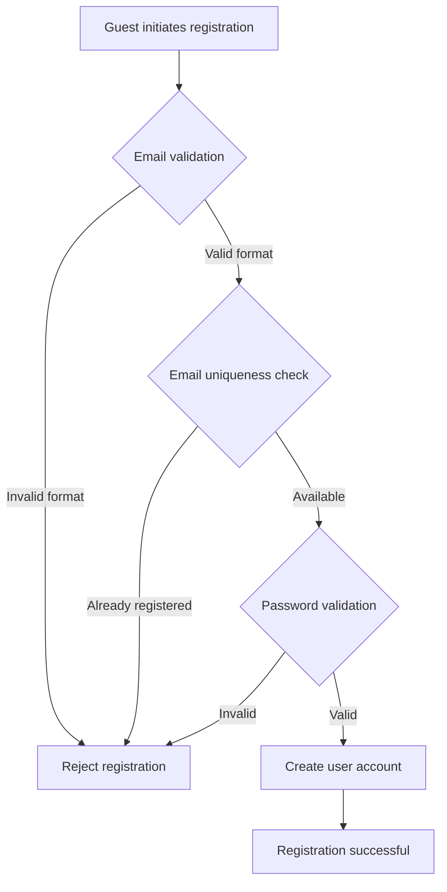

### User Login Authentication

### User Login Authentication

WHEN a user attempts to log in, THE system SHALL:
1. Require a registered email address
2. Require the correct password for the account
3. Verify email and password combination
4. Create an authenticated session upon successful verification
5. Associate the session with the user account

IF the email address is not registered, THE system SHALL reject the login request.
IF the password is incorrect, THE system SHALL reject the login request.
IF the account is suspended or deleted, THE system SHALL reject the login request.

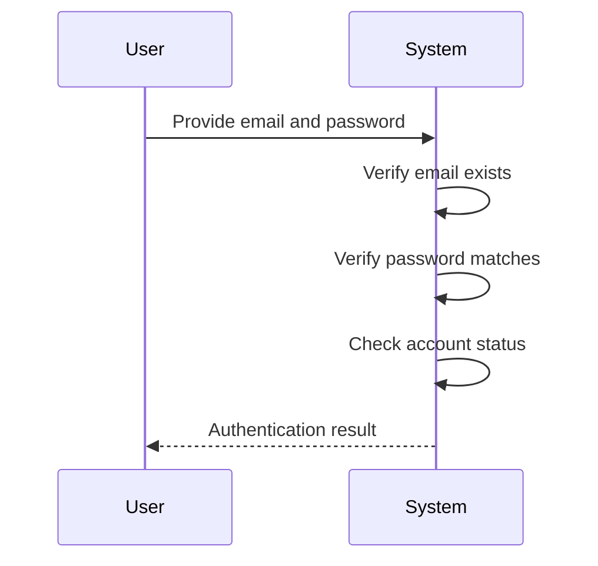

### Authentication State Management

### Authentication State Management

WHILE a user is authenticated, THE system SHALL:
1. Maintain the user's authenticated state
2. Allow access to member-only features
3. Associate all user actions with the authenticated account
4. Track session activity

WHEN a user logs out, THE system SHALL:
1. Terminate the authenticated session
2. Revoke access to member-only features
3. Clear session-related data

IF authentication expires due to inactivity, THE system SHALL require re-authentication.
IF the session is terminated by the system, THE system SHALL redirect to login.

THE system SHALL prevent access to member features while in guest state.
THE system SHALL prevent access to guest features while in authenticated state.

### Signup Validation Requirements

### Signup Validation Requirements

WHEN processing signup requests, THE system SHALL validate:
1. Email format conforms to RFC standards
2. Email address is not already registered
3. Password meets minimum security requirements
4. All required fields are provided

IF validation fails for any requirement, THE system SHALL:
1. Provide specific error messages
2. Preserve entered data where appropriate
3. Allow correction and resubmission

THE system SHALL ensure email uniqueness across all user accounts.
THE system SHALL prevent duplicate account creation with the same email.

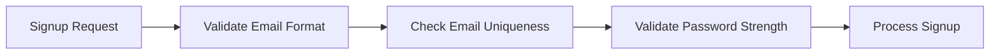

### Signin Security and Error Handling

### Signin Security and Error Handling

WHEN handling signin attempts, THE system SHALL:
1. Implement rate limiting to prevent brute force attacks
2. Provide generic error messages to avoid account enumeration
3. Track failed login attempts
4. Temporarily lock accounts after excessive failed attempts

IF multiple consecutive failed login attempts occur, THE system SHALL:
1. Implement progressive delays between attempts
2. Notify the user account owner if suspicious activity is detected
3. Require additional verification for account recovery

THE system SHALL never reveal whether an email address is registered.
THE system SHALL treat invalid email and invalid password errors identically.

WHEN a user successfully signs in, THE system SHALL:
1. Record the login timestamp
2. Update the user's last active timestamp
3. Provide access to the user's private todo data

## Session and Token Policy

Define session duration, token refresh, and expiration policies.

### Session Lifecycle Management

### Session Lifecycle Management

WHEN a user successfully authenticates, THE system SHALL create a new session.

WHILE a session is active, THE system SHALL maintain user authentication state.

WHEN a user logs out, THE system SHALL terminate the active session.

IF a session exceeds the maximum duration without activity, THE system SHALL automatically expire the session.

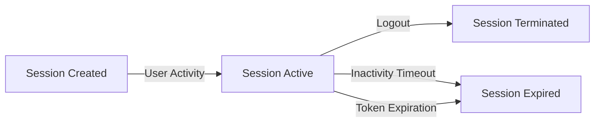

THE system SHALL track session creation time and last activity time.

THE system SHALL provide a mechanism for users to view their active sessions.

THE system SHALL allow users to terminate specific sessions remotely.

IF multiple simultaneous sessions are detected for the same user, THE system SHALL maintain isolation between sessions.

### Access Token Policy

### Access Token Policy

WHEN a session is created, THE system SHALL issue an access token.

THE access token SHALL contain the user's identity and permissions.

THE system SHALL validate the access token on each authenticated request.

IF the access token is invalid or tampered with, THE system SHALL reject the request.

IF the access token has expired, THE system SHALL reject the request.

THE system SHALL set access tokens to expire after a fixed duration from issuance.

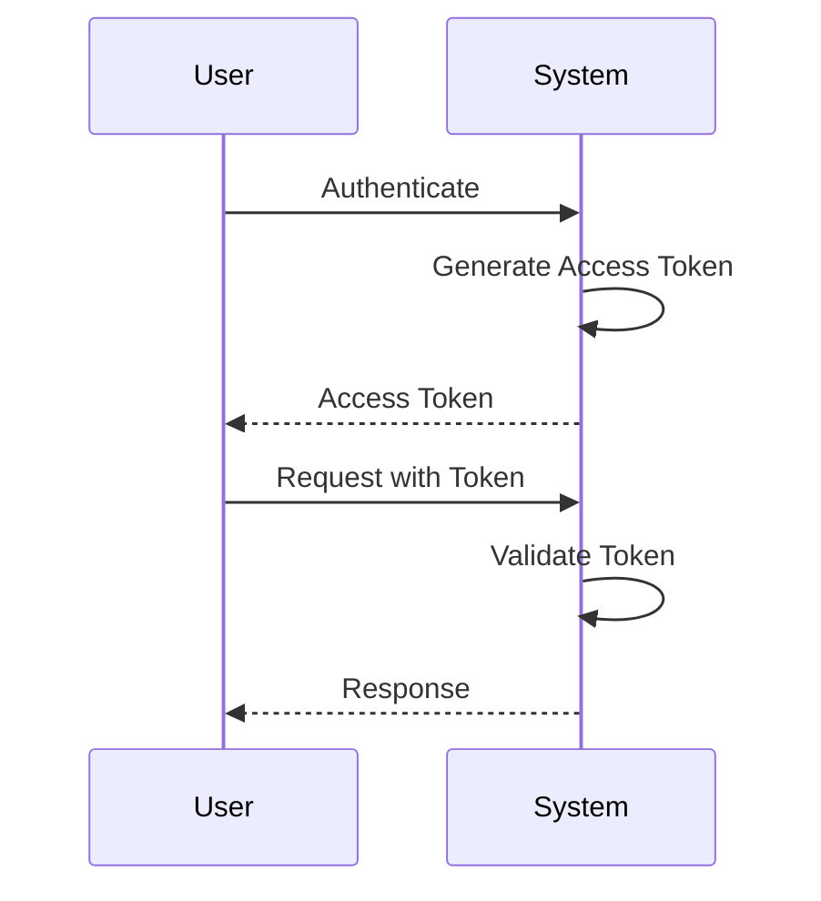

THE system SHALL not store access tokens in persistent storage after issuance.

THE system SHALL implement token revocation for security incidents.

### Token Refresh Mechanism

### Token Refresh Mechanism

WHEN an access token is nearing expiration, THE system SHALL allow token refresh.

THE system SHALL provide a refresh token mechanism to obtain new access tokens.

WHEN a refresh token is used, THE system SHALL issue a new access token.

IF the refresh token is invalid or expired, THE system SHALL reject the refresh request.

THE system SHALL set refresh tokens to expire after a longer duration than access tokens.

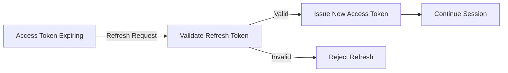

THE system SHALL limit the number of consecutive refresh attempts.

IF excessive refresh attempts are detected, THE system SHALL temporarily suspend refresh capability.

THE system SHALL invalidate all tokens when a user changes their password.

### Token Expiration Policies

### Token Expiration Policies

THE system SHALL set access tokens to expire after 15 minutes of inactivity.

THE system SHALL set refresh tokens to expire after 7 days of issuance.

WHEN a token expires, THE system SHALL require re-authentication.

THE system SHALL provide clear expiration warnings to users before token expiry.

IF a user is actively using the application, THE system SHALL automatically refresh tokens before expiration.

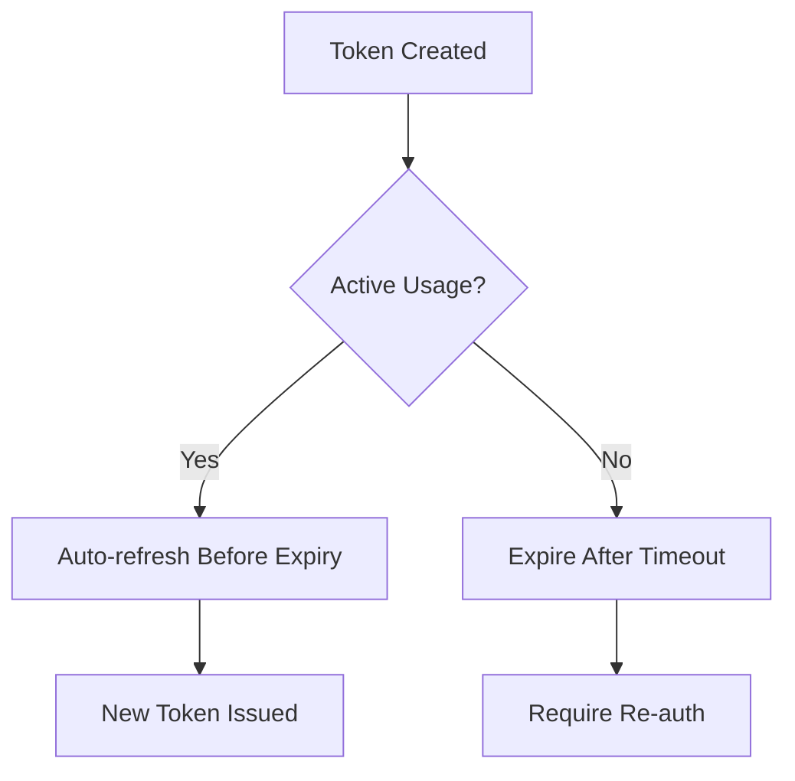

THE system SHALL log all token expiration events for security monitoring.

THE system SHALL allow administrators to adjust expiration policies based on security requirements.

THE system SHALL enforce minimum token expiration durations for security compliance.

### JWT Implementation Requirements

### JWT Implementation Requirements

THE system SHALL use JWT (JSON Web Token) format for access tokens.

THE JWT SHALL include standard claims: issuer, subject, expiration time, and issuance time.

THE JWT SHALL include custom claims for user roles and permissions.

THE system SHALL sign JWTs using a secure cryptographic algorithm.

IF JWT signature validation fails, THE system SHALL reject the token.

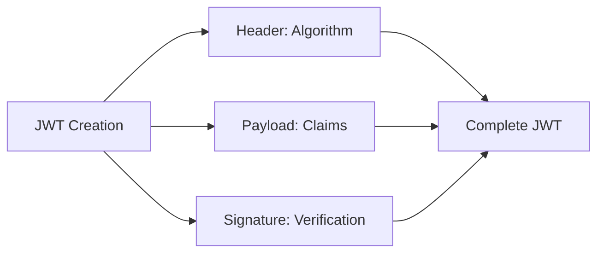

THE system SHALL validate JWT expiration claims on each request.

THE system SHALL protect JWT secret keys from unauthorized access.

THE system SHALL rotate JWT signing keys periodically for enhanced security.

THE system SHALL include token version information in JWT claims to support key rotation.

IF JWT tampering is detected, THE system SHALL log the security event and require re-authentication.

# Account Lifecycle

Account state transitions and lifecycle management.

## Account States and Transitions

Define account states (active, suspended, deleted) and valid transitions.

### Account State Definitions

THE system SHALL support the following account states for user accounts:

1. **Active** - The account is fully operational and can perform all member functions
2. **Suspended** - The account is temporarily disabled and cannot perform member functions
3. **Deleted** - The account is permanently removed and all associated data is deleted

WHEN a user registers successfully, THE system SHALL set the account state to "Active".
WHILE an account is in "Active" state, THE system SHALL allow the user to perform all member functions.
WHILE an account is in "Suspended" state, THE system SHALL prevent the user from performing member functions.
WHILE an account is in "Deleted" state, THE system SHALL permanently remove all user data including todos and edit history.

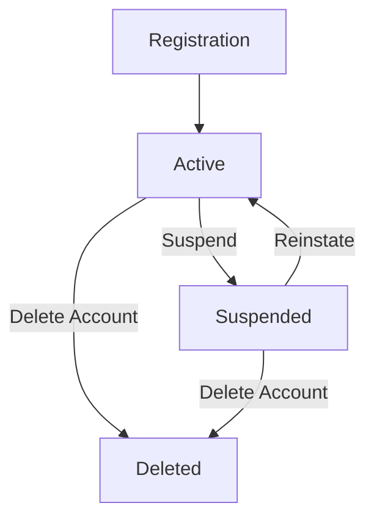

### Account Lifecycle Management

THE system SHALL manage account lifecycle transitions according to the following rules:

WHEN an account is created through registration, THE system SHALL transition it from non-existent to "Active" state.
WHEN an administrator suspends an account, THE system SHALL transition it from "Active" to "Suspended" state.
WHEN an administrator reinstates a suspended account, THE system SHALL transition it from "Suspended" to "Active" state.
WHEN a user deletes their own account, THE system SHALL transition it from "Active" to "Deleted" state.
WHEN an administrator deletes a suspended account, THE system SHALL transition it from "Suspended" to "Deleted" state.

IF an account is in "Deleted" state, THE system SHALL NOT allow any transitions to other states.
IF an account is in "Active" state, THE system SHALL allow transitions to "Suspended" or "Deleted" states.
IF an account is in "Suspended" state, THE system SHALL allow transitions to "Active" or "Deleted" states.

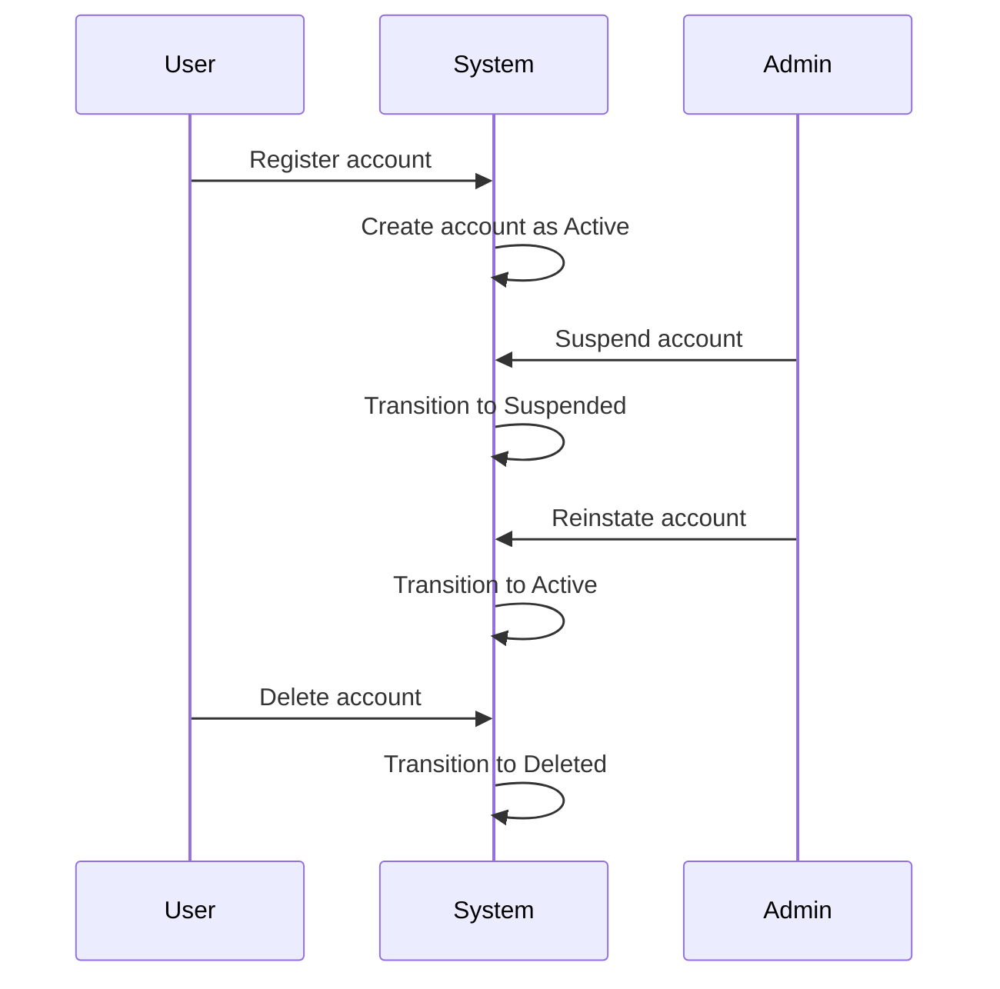

### Account Suspension

THE system SHALL support account suspension with the following requirements:

WHEN an administrator suspends an account, THE system SHALL:
1. Prevent the user from logging in
2. Maintain all user data including todos and edit history
3. Preserve the account's display name and profile information
4. Allow the account to be reinstated later

WHILE an account is suspended, THE system SHALL:
1. Reject all login attempts from the suspended account
2. Prevent access to todos and profile management functions
3. Maintain data integrity for future reinstatement

IF a suspended account attempts to log in, THE system SHALL reject the login attempt and inform the user that the account is suspended.
IF a suspended account is reinstated, THE system SHALL restore full member functionality immediately.

THE system SHALL record suspension events in the account history, including:
- When the suspension occurred
- Who performed the suspension
- Reason for suspension (if provided)

### Account Deletion

THE system SHALL support account deletion with the following requirements:

WHEN a user deletes their own account, THE system SHALL:
1. Permanently delete all user data including todos and edit history
2. Remove the user's profile information
3. Invalidate all active sessions for that account
4. Prevent any future access to the account

WHEN an administrator deletes an account, THE system SHALL:
1. Permanently delete all user data including todos and edit history
2. Remove the user's profile information
3. Invalidate all active sessions for that account
4. Record the deletion event in system logs

IF an account is deleted, THE system SHALL NOT allow any recovery of the account or its data.
IF an account deletion is requested, THE system SHALL require confirmation before proceeding.
IF an account has active sessions during deletion, THE system SHALL terminate all sessions immediately.

THE system SHALL ensure that account deletion is irreversible and complete, with no residual data remaining.

### Account Deactivation

THE system SHALL support account deactivation as an alternative to immediate deletion:

WHEN a user requests account deactivation, THE system SHALL:
1. Set the account to a "Deactivated" state (if supported)
2. Prevent login attempts
3. Maintain all user data for a configurable retention period
4. Allow reactivation within the retention period

WHILE an account is deactivated, THE system SHALL:
1. Reject all login attempts
2. Preserve todos and edit history
3. Prevent any modifications to the account data
4. Allow administrators to view the deactivated account

IF the retention period expires for a deactivated account, THE system SHALL automatically transition it to "Deleted" state.
IF a user reactivates their account within the retention period, THE system SHALL restore it to "Active" state.

Note: Based on the original requirements, account deactivation is not explicitly mentioned. This section defines it as an optional enhancement where accounts can be temporarily disabled before permanent deletion.