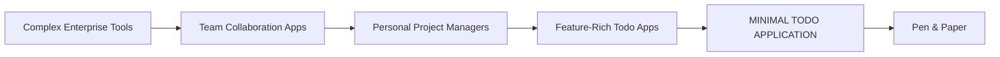
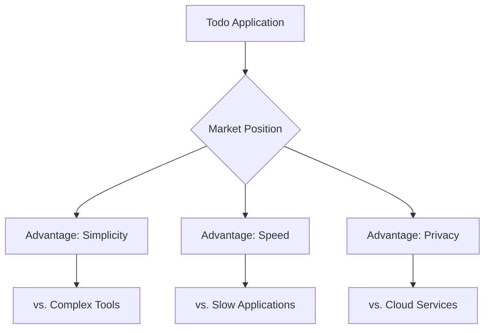

# Todo Application Service Overview

## Executive Summary

The Todo Application is a minimal, user-friendly task management solution designed to address the fundamental need for simple, accessible personal organization tools. In a market saturated with complex project management applications, this service fills the gap by providing exactly what users need for daily task tracking—nothing more, nothing less. The application focuses on core functionality: creating, managing, and completing todo items with maximum efficiency and minimum complexity.

## Business Problem

### Market Gap Analysis
Current task management applications suffer from feature bloat and complexity that overwhelms users seeking simple todo list functionality. Users face several key challenges:

- **Overwhelming Complexity**: Most todo applications include unnecessary features like team collaboration, advanced project tracking, and complex workflows that individual users don't need
- **Learning Curve**: Feature-rich applications require significant time investment to learn and use effectively
- **Performance Issues**: Bloated applications often suffer from slow performance due to unnecessary features
- **Privacy Concerns**: Many todo applications require cloud synchronization and data sharing that users may not want
- **Cost Barriers**: Premium features in existing applications often come with subscription fees for functionality individual users don't require

### User Pain Points
Based on market research and user feedback, the primary pain points include:
- Difficulty finding a simple, single-user todo application
- Frustration with applications that try to be "everything to everyone"
- Desire for instant usability without setup or configuration
- Need for reliable, fast performance on personal devices
- Preference for local data storage over cloud synchronization

## Solution Overview

The Todo Application provides a focused solution to these challenges through strategic minimalism:

### Core Philosophy
"Do one thing well" - The application excels at basic todo management without attempting to solve every productivity challenge. This focused approach ensures:

- **Instant Usability**: Users can start managing tasks immediately without setup
- **Zero Learning Curve**: Intuitive interface requires no training or documentation
- **Lightweight Performance**: Optimized codebase ensures fast, responsive experience
- **Privacy-First Design**: Local data storage eliminates privacy concerns
- **Cost-Effective**: Free access to essential functionality without hidden costs

### Key Differentiators
1. **Purpose-Built Simplicity**: Designed exclusively for individual task management
2. **No Feature Bloat**: Intentional exclusion of team collaboration, project management, and advanced features
3. **Instant Accessibility**: No account creation or authentication required
4. **Platform Agnostic**: Responsive design works across devices without app downloads
5. **Data Sovereignty**: Complete user control over personal task data

## Target Market

### Primary User Demographics
- **Individual Professionals**: People managing personal tasks and work-related todos
- **Students**: Academic task management and assignment tracking
- **Home Users**: Daily chore lists, shopping lists, and personal reminders
- **Minimalists**: Users who prefer simple, focused tools over feature-rich applications

### Market Positioning
The Todo Application occupies a unique position in the productivity software market:

This positioning targets users who have outgrown basic methods but don't need enterprise-level features.

## Core Value Proposition

### Value Delivery Framework
The application delivers value through three core principles:

1. **Time Efficiency**
   - Instant task creation and management
   - Zero configuration required
   - Faster than writing physical lists

2. **Cognitive Simplicity**
   - Reduced decision fatigue from feature overload
   - Clear focus on task completion
   - Minimal mental overhead

3. **Reliability**
   - Consistent performance across sessions
   - No dependency on internet connectivity
   - Predictable behavior

### User Benefits
- **WHEN** a user needs to capture a task quickly, **THE** application **SHALL** provide instant access without barriers
- **WHILE** using the application, **THE** interface **SHALL** remain consistently simple and intuitive
- **WHERE** users prioritize privacy, **THE** system **SHALL** store all data locally without external synchronization

## Business Objectives

### Short-Term Objectives (0-6 months)
1. **User Acquisition**: Reach 10,000 active users through organic growth
2. **Product Validation**: Achieve 90% user satisfaction rating for core functionality
3. **Performance Benchmark**: Maintain sub-100ms response time for all operations
4. **Feature Stability**: Ensure 99.9% uptime with zero critical bugs

### Medium-Term Objectives (6-12 months)
1. **User Retention**: Achieve 70% monthly active user retention rate
2. **Market Penetration**: Become the recommended minimal todo solution in productivity communities
3. **Platform Expansion**: Develop progressive web app capabilities for offline functionality
4. **Community Building**: Establish user community for feedback and feature suggestions

### Long-Term Objectives (12+ months)
1. **Sustainable Growth**: Maintain organic growth without marketing expenditure
2. **Feature Evolution**: Carefully introduce optional enhancements based on user demand
3. **Platform Independence**: Ensure compatibility with emerging web standards
4. **Open Source Contribution**: Consider open-sourcing the application to foster community development

## Success Metrics

### Key Performance Indicators (KPIs)

| Metric | Target | Measurement Frequency | Business Impact |
|--------|--------|---------------------|-----------------|
| Monthly Active Users (MAU) | 10,000+ | Monthly | User adoption and market reach |
| User Satisfaction Score | 4.5/5.0 | Quarterly | Product quality and user experience |
| Task Completion Rate | 85%+ | Monthly | Application effectiveness |
| Session Duration | 2-5 minutes | Weekly | Engagement and usability |
| Performance Response Time | <100ms | Continuous | Technical excellence |
| Error Rate | <0.1% | Continuous | System reliability |

### Business Health Indicators
- **User Growth Rate**: Month-over-month increase in active users
- **Retention Rate**: Percentage of users returning monthly
- **Feature Usage**: Adoption rate of core functionality vs. potential enhancements
- **Support Volume**: Number of help requests indicating usability issues

## Competitive Landscape

### Market Position Analysis
The Todo Application competes in the personal productivity space by offering a unique value proposition:

### Differentiation Strategy
The application's competitive advantage stems from intentional limitations:
- **No team features** = Faster performance and simpler interface
- **No cloud synchronization** = Enhanced privacy and offline capability
- **No advanced workflows** = Reduced cognitive load and instant usability
- **No subscription model** = Barrier-free access and user trust

## Implementation Roadmap

### Phase 1: Core Functionality (Months 1-3)
- Basic todo creation, editing, and deletion
- Task completion tracking
- Local data persistence
- Responsive web interface

### Phase 2: Enhancement (Months 4-6)
- Task categorization (optional)
- Due date functionality (optional)
- Export capabilities
- Performance optimization

### Phase 3: Refinement (Months 7-9)
- Progressive web app features
- Keyboard shortcuts
- Accessibility improvements
- User preference settings

## Risk Assessment

### Potential Challenges
1. **Market Education**: Users accustomed to feature-rich applications may need education about minimalism benefits
2. **Feature Creep**: Pressure to add features that contradict the core philosophy
3. **Monetization**: Balancing free access with sustainable development
4. **Platform Limitations**: Web-only approach may limit some mobile functionality

### Mitigation Strategies
- Clear communication of the "minimal by design" philosophy
- Community-driven feature prioritization
- Exploration of non-intrusive revenue models (donations, sponsorships)
- Progressive web app technology to bridge mobile functionality gaps

## Conclusion

The Todo Application represents a strategic opportunity in the personal productivity market by addressing the underserved need for simple, focused task management tools. By embracing minimalism as a core philosophy, the application delivers immediate value through instant usability, reliable performance, and user-centric design. The business model focuses on organic growth and user satisfaction rather than feature competition, creating a sustainable position in the productivity software ecosystem.

> *Developer Note: This document defines **business requirements only**. All technical implementations (architecture, APIs, database design, etc.) are at the discretion of the development team.*