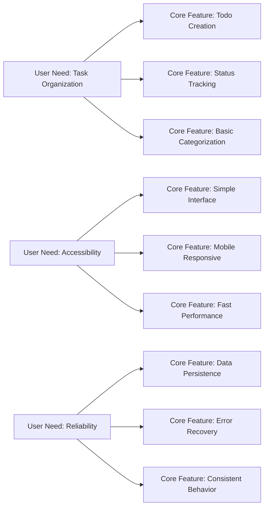

# Todo List Application Service Overview

## Service Vision and Mission

### Vision Statement
The Todo List Application aims to provide the simplest, most intuitive task management solution that enables users to organize their daily activities with minimal cognitive overhead.

### Mission Statement
To deliver a focused, distraction-free task management experience that prioritizes core functionality over feature complexity, enabling users to capture, organize, and complete their todos efficiently.

## Business Justification

### Market Need Analysis
The digital task management market is saturated with complex applications that overwhelm users with unnecessary features. There exists a significant gap for a minimal, focused todo application that serves users who:

- **Value Simplicity**: Prefer straightforward interfaces without learning curves
- **Have Basic Needs**: Require only core todo functionality without advanced features
- **Experience Feature Fatigue**: Are overwhelmed by complex project management tools
- **Seek Digital Minimalism**: Want to reduce digital clutter and cognitive load

### Problem Statement
Current todo applications often suffer from feature bloat, where users must navigate through complex interfaces to perform basic task management. This creates:

- **Cognitive Overload**: Too many options and features distract from core functionality
- **Learning Barriers**: Steep learning curves prevent immediate productivity
- **Performance Issues**: Feature-rich applications can be slow and resource-intensive
- **User Frustration**: Users spend more time managing the tool than managing their tasks

### Solution Approach
The Todo List Application addresses these challenges by implementing a minimal viable product (MVP) approach:

- **Core Functionality Only**: Focus exclusively on essential todo operations
- **Intuitive Interface**: Design for immediate usability without training
- **Performance Optimization**: Ensure fast response times and reliability
- **User-Centric Design**: Prioritize user experience over feature quantity

## Core Value Proposition

### Primary Benefits

#### 1. **Simplicity and Focus**
- **Minimal Interface**: Clean, uncluttered design that emphasizes task management
- **Zero Learning Curve**: Intuitive operations that users understand immediately
- **Reduced Decision Fatigue**: Limited options prevent analysis paralysis

#### 2. **Efficiency and Productivity**
- **Quick Task Capture**: Rapid todo creation with minimal input requirements
- **Instant Organization**: Straightforward categorization and prioritization
- **Effortless Completion**: Simple check-off mechanism for task closure

#### 3. **Reliability and Performance**
- **Consistent Performance**: Fast response times across all operations
- **Data Integrity**: Reliable storage and retrieval of todo items
- **Minimal Maintenance**: Simple architecture reduces potential failure points

### Unique Selling Points

#### **Differentiation from Competitors**
- **Feature Discipline**: Unlike competitors that continuously add features, this application maintains strict minimalism
- **User Experience Focus**: Prioritizes user satisfaction over feature quantity
- **Accessibility**: Designed for users of all technical skill levels

## Target Audience

### Primary User Personas

#### **Casual Task Managers**
- **Profile**: Individuals managing personal daily tasks
- **Needs**: Simple capture and tracking of todos
- **Behavior**: Prefer mobile-first, quick-access applications
- **Motivation**: Reduce mental clutter and improve task completion

#### **Digital Minimalists**
- **Profile**: Users seeking to reduce digital complexity
- **Needs**: Clean, distraction-free task management
- **Behavior**: Value simplicity and intentional technology use
- **Motivation**: Focus on productivity rather than tool management

#### **Small Business Users**
- **Profile**: Entrepreneurs and small teams needing basic task tracking
- **Needs**: Shared task visibility without complex project management
- **Behavior**: Prefer lightweight solutions over enterprise software
- **Motivation**: Quick task coordination without administrative overhead

### User Needs Analysis

## Key Differentiators

### Competitive Advantages

#### **1. Strategic Minimalism**
- **Feature Selection**: Carefully curated functionality that serves 90% of user needs
- **User Experience**: Every feature must justify its existence through user value
- **Development Focus**: Resources allocated to perfecting core features rather than expanding feature set

#### **2. Performance Excellence**
- **Speed Optimization**: Sub-second response times for all operations
- **Resource Efficiency**: Minimal memory and processing requirements
- **Scalability**: Architecture designed for consistent performance under load

#### **3. User-Centric Design**
- **Accessibility**: Designed for users of all technical backgrounds
- **Intuitive Operation**: Natural interaction patterns that require no training
- **Feedback Systems**: Clear confirmation and error messaging

### Comparison with Market Alternatives

| Feature | Todo List App | Complex Alternatives | Simple Competitors |
|---------|---------------|---------------------|-------------------|
| **Core Todo Management** | ✅ Excellent | ✅ Excellent | ✅ Good |
| **Simplicity** | ✅ Primary Focus | ❌ Complex | ✅ Good |
| **Performance** | ✅ Optimized | ❌ Variable | ✅ Good |
| **Learning Curve** | ✅ None | ❌ Steep | ✅ Minimal |
| **Feature Bloat** | ❌ None | ✅ Excessive | ❌ Minimal |
| **Customization** | ✅ Basic Only | ✅ Extensive | ❌ Limited |

## Success Metrics

### Key Performance Indicators (KPIs)

#### **User Engagement Metrics**
- **Daily Active Users (DAU)**: Target: 1,000+ active users
- **Monthly Active Users (MAU)**: Target: 5,000+ monthly users
- **User Retention Rate**: Target: 70%+ monthly retention
- **Session Duration**: Target: 5+ minutes average session time

#### **Product Performance Metrics**
- **Task Creation Rate**: Target: 10+ todos created per active user weekly
- **Completion Rate**: Target: 60%+ of todos marked as completed
- **System Uptime**: Target: 99.9%+ availability
- **Response Time**: Target: < 500ms for all operations

#### **Business Health Metrics**
- **User Satisfaction**: Target: 4.5+ star rating in app stores
- **Support Ticket Volume**: Target: < 1 ticket per 100 users monthly
- **Feature Adoption**: Target: 90%+ of users utilizing core features

### Success Criteria Definition

#### **Minimum Viable Success**
- **User Base**: 500+ active users consistently using the application
- **Reliability**: 99%+ uptime with no critical data loss incidents
- **Performance**: Sub-second response times for core operations
- **Satisfaction**: 4.0+ average user rating

#### **Optimal Success**
- **User Growth**: 10%+ monthly user growth rate
- **Engagement**: 80%+ of active users returning weekly
- **Performance**: < 200ms average response time
- **Market Position**: Recognized as leading minimal todo application

### Measurement Framework

#### **Quantitative Measurement**
- **Automated Analytics**: Real-time tracking of user behavior and system performance
- **Performance Monitoring**: Continuous measurement of response times and reliability
- **User Feedback**: Structured rating systems and usage patterns

#### **Qualitative Assessment**
- **User Interviews**: Regular feedback sessions with representative users
- **Usability Testing**: Controlled testing of new user experiences
- **Competitive Analysis**: Ongoing evaluation against market alternatives

## Business Model Considerations

### Revenue Strategy
While the primary focus is on delivering value through minimal functionality, potential revenue models include:

- **Freemium Model**: Basic features free, premium features for power users
- **Enterprise Licensing**: Business versions with enhanced collaboration features
- **API Monetization**: Paid access for third-party integrations

### Growth Strategy

#### **User Acquisition**
- **Word of Mouth**: Leverage user satisfaction for organic growth
- **Content Marketing**: Educational content about minimalist productivity
- **Partnerships**: Integration with complementary productivity tools

#### **Retention Focus**
- **Feature Stability**: Avoid disruptive changes that alienate existing users
- **Performance Consistency**: Maintain the speed and reliability users expect
- **Community Building**: Foster user communities around minimalist productivity

## Future Vision

### Strategic Roadmap
While maintaining the core principle of minimalism, potential evolutionary paths include:

- **Enhanced Collaboration**: Basic sharing capabilities for team usage
- **Cross-Platform Sync**: Seamless synchronization across devices
- **Intelligent Suggestions**: Context-aware todo recommendations

### Growth Constraints

#### **Feature Addition Principles**
- **User Value Test**: Any new feature must solve a clear user pain point
- **Simplicity Preservation**: New features cannot compromise application simplicity
- **Performance Impact**: Features must not degrade system performance
- **User Consensus**: Significant user demand required for feature consideration

## Conclusion

The Todo List Application represents a strategic approach to task management that prioritizes user experience over feature quantity. By focusing on core functionality and exceptional performance, the application addresses a clear market need for simple, reliable task management tools.

The success of this application will be measured not by the quantity of features, but by the quality of user experience and the effectiveness with which users can manage their daily tasks. This focused approach positions the application as the ideal solution for users who value simplicity, reliability, and intentional technology use.

> *Developer Note: This document defines **business requirements only**. All technical implementations (architecture, APIs, database design, etc.) are at the discretion of the development team.*